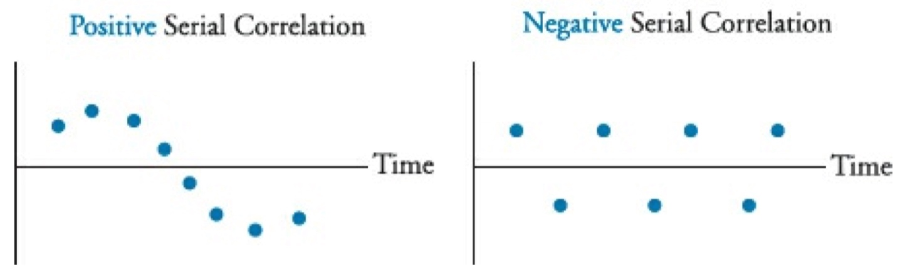
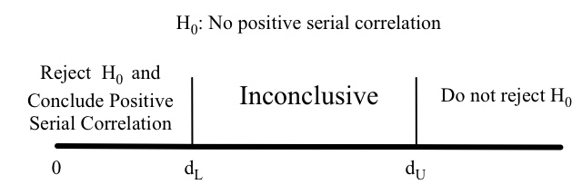

# (PART) 数量方法 {#quantitative .unnumbered}

# 内容简介 {#quantitative-intro .unnumbered}

数量方法是金融分析的重要基础，金融学是一门年轻的科学，尽管在金融学中存在着诸多的不确定性，以及诸多无法使用数学公式来进行表达或阐述的现象及规律，但是数学却是金融学的重要工具，其首要原因便是金融学是关于“钱”的学科，对“钱”必须要能够精确的对其价值进行计量，为了对货币的价值进行准确的衡量，需要深刻理解货币的时间价值，明白未来的财富与现在的财富之间的关系，以及由于这种关系的存在及其本身所蕴含的不确定性所带来的诸多问题，因此需要使用数学工具以及概率统计理论研究这些问题。此外，对于金融资产来说，其包含的价值体现在价格中，而价格会随时间的变化而不断发生变化，从而形成了价格的时间序列，对金融资产的价格时间序列进行分析能够发现很多现象及规律，并能够在一定程度上对金融资产在未来的价格进行预测，这就涉及到了时间序列分析以及股票投资者常用的技术分析法。

数量方法部分首先从金钱的时间价值（Time Value of Money）这个最重要的概念入手，揭示出未来的金钱与现在的金钱之间的关系，分析其中所存在的不确定性，以及由这些不确定性所引发的各种问题，然后介绍对不确定问题研究的工具--概率统计理论，包括概率论基础（Basic Probability Concepts）、概率分布与描述统计（Probaility Distributions and Descriptive Statistics）、采样与估计（Sampling and Estimation）、假设检验（Hypothesis Testing）以及仿真分析（Simulation Analysis）等内容；为了对金融资产的价格数据存在的规律，以及金融资产的价格与各种社会经济因子之间的关系进行分析，则需要使用相关性分析以及回归分析（Correlation Analysis and Regression）、时间序列分析（Time-Series Analysis）等工具；金融资产的价格取决于其本身的价值以及投资者对其未来表现的预期两方面的因素，有人认为金融资产的价格本身及其变化规律就能反映出其未来的价格走势，因此可以利用分析历史数据对未来进行预测，这就是技术分析（Technical Analysis）的基本出发点。技术分析包含很多分析方法和分析工具，现代金融理论认为在有效市场中无法通过技术分析实现获利，但是市场的有效性尚未得到证实，且大多数国家尤其是发展中国家的市场目前并不是有效的，因此技术分析依然具有一定的使用范围。


# 金钱的时间价值 {#TVM}

主要介绍金钱的时间价值 (Time Value of Money)，重点关注理解的概念有各种利率的含义，机会成本，风险溢价，各类年金，以及不均匀现金流的现值 (Present Value, PV) 与终值 (Future Value, FV) 的计算问题。

## 利率

可以从不同的角度来理解利率 (Interest Rates)，可以将其看作是投资所需要的回报率，称为必要折扣率 (Required Rates of Return)，也可以看作是将未来的资金换算到当前时刻所需要的折现率 (Discount Rates)，或者看作是放弃对资金的使用所隐含的机会成本 (Opportunity Costs)，此外还可以将利率分解为无风险利率加上由于承担资金损失风险所要求的风险溢价 (Risk-free Rate plus Premiums for Bearing Risk)。

经济学告诉我们利率是由市场上的供需关系决定，资金的供应者是投资人，资金的需求者则是借贷人，从投资者的角度看，对于由市场决定的利率来说，可以对其进行如下分解：

$$\begin{split}
r  = & \;Real~risk\text{-}free~interest~rate + Inflation~Premium\;+ \\
     & \;Default~Risk~Premium + Liquidity~Premium + Maturity~Premium
\end{split}$$

上式右侧分别是：实际无风险利率、通货膨胀溢价、违约风险溢价、流动性溢价、到期风险溢价，实际无风险利率与通货膨胀溢价之和为名义无风险利率。到期风险溢价 (Maturity Risk Premium) 是指一般债权人可能偏好短期的债务，因此对愈长期的债券所要求的补偿愈多，同一种类的债券的长期及短期利率之差，即为到期风险溢价。到期风险溢价主要是当未来利率上升时，长期债券价格会相应下降。所以到期期限越长，风险越大，到期风险溢价越高。

### 有效年利率

在实际应用中需要注意区分有效年利率[^EAR] (Effective Annual Rate,  简称 EAR) 与 名义年利率 (Stated Annual Interest Rate) 之间的区别，名义年利率表示不考虑年内复利计算的年利率，而有效年利率则是考虑了年内复利计算的年利率。

[^EAR]: 有效年利率 EAR 在美国一般称作年化收益率 (Annual Percentage Yield, 简称 APY)，在英国则一般称作有效年利率 (Equivalent Annual Rate, 也可简称为EAR)。

名义年利率有时也称作挂牌利率 (Quoted Interest Rate), 是一种比较通俗的说法，比如在美国，Annual Percentage Rate (APR) 指的是将每个结算周期的利率乘以每年的结算周期数得到的利率，一般可以认为 APR 与 名义年利率等价，但是值得注意的是，APR 这个称呼是具有法律含义的术语，在不同的国家或地区的具体含义可能不同。

如果每个结算周期的利率为$r_s$，每年有$m$个结算周期，那么有效年利率EAR的计算公式如下：

$$EAR = (1+r_s)^m - 1$$

如果是连续结算，则有：

$$EAR = e^{r_s} - 1$$

## 现值与终值

金钱有当前价值 (也就是现值 Present Value, 简称 PV) 和远期价值 (也就是终值 Future Value, 简称 FV) 之分，可以通过复利公式进行换算，这样做的意义是在于对于不同的投资手段，需要在同一时间点比较它们的价值。

现值与终值之间的基本关系式为：$\color{red}{FV_N = PV(1+r)^N}$，使用这个公式的时候需要注意 N 与 r 的一致性，如果 N 以年为单位，那么 r 为年利率，如果 N 以月为单位，那么 r 应为月利率。

现值与终值的计算问题可以使用金融计算器非常简单的解决，计算过程中需要注意的因素有：年金类型，付款期数，利率的表示方法，结算周期，付款的时间节点等问题，可以使用时间线的方法直观的进行呈现，然后使用计算器迅速得到准确的结果。

### 单一现金流的计算

记名义年利率为 $r_s$，每年的结算周期数为 $m$，年数为 $N$ (后续计算公式中的符号如无特别说明，均采用此处的符号定义)，则有:

$$FV_N = PV\left(1+{r_s \over m}\right) ^ {mN}$$

$$PV = FV_N \left( 1 + {r_s \over m} \right) ^ {-mN}$$

如果是连续结算，也就是一年内的结算周期数趋近于无穷，则有：

$$FV_N = PV \cdot e^{r_s N}$$

### 年金的计算

年金 (Annuity) 是指定期或不定期的时间内一系列的现金流入或现金流出，分为普通年金、即付年金以及永续年金三种：

- 普通年金 (Ordinary Annuity)，又称后付年金，是指每期期末有等额的收付款项的年金，这种年金形式是在现实经济生活中最为常见;
- 即付年金 (Annuity Due)，又称先付年金或预付年金，是指在一定时期内，以相同的时间间隔在各期期初收入或支出的等额的款项。即付年金与普通年金的区别仅在于付款时间的不同。利用后付年金系数表计算即付年金的终值和现值时，可在后付年金的基础上用终值和现值的计算公式进行调整。一个 n 期的即付年金相当于一个 (n-1) 期的普通年金与每期的现金流量的和;
- 永续年金 (Perpetuity, 也称作 Perpetual Annuity)，指的是无限期等额收付的特种年金，它是普通年金的特殊形式，即期限趋于无穷的普通年金。

年金计算的时候注意区分是普通年金还是即付年金，普通年金是期末付款，即付年金是期初付款。

**普通年金**

记普通年金每期的付款额为 $A$，付款期数为 $N$，每期的利率为 $r$，则终值的计算公式为：

$$FV = A\left[\frac{(1+r)^N - 1}{r}\right]$$

现值的计算公式为：

$$PV = A \left[ \frac{1-\frac{1}{(1+r)^N}}{r} \right]$$

**即付年金**

即付年金与普通年金的区别仅在于付款时间节点的不同，因此对于 N 期的即付年金来讲，其终值：

- 等价于 $N$ 期的普通年金的终值乘以 $(1+r)$；
- 或者等价于 $N+1$ 期的普通年金终值减去最末期的的付款额 $A$。

对于 N 期的即付年金来讲，其现值：

- 等价于 $N$ 期的普通年金的现值乘以 $(1+r)$；
- 或者等价于 $N-1$ 期的普通年金现值加上最初期的付款额 $A$。

**永续年金**

对于永续年金来讲，只需要计算其现值，计算公式为：

$$PV = {A \over r}$$

**不均匀现金流的计算**

对于每期付款额不等的现金流 (A Series of Unequal Cash Flows)，可以使用时间线方法对每一次的支付分别计算，然后再进行累加。

### 利率或增长率的计算

$$g = (\frac{FV_N}{PV})^{1/N} - 1$$

### 现金流期数的计算

$$N = \frac{ln(FV_N / PV)}{ln(1+r)}$$

### 每期付款金额的计算

普通年金现值的计算公式为：

$$PV = A \left[ \frac{1-\frac{1}{(1+r)^N}}{r} \right]$$

上式右边可以分为两部分，一部分为每期的付款额 $A$，另外一部分称作现值因子 (Present Value Annuity Factor)，因此 $A$ 的计算公式为：

$$A = \frac{PV}{Present~Value~Annuity~Factor}$$

## 折扣现金流

### 净现值

$$NPV = \sum_{t=0}^N \frac{CF_t}{(1+r)^t}$$

### 内部收益率 IRR

内部收益率 (Internal Rate of Return, 简称 IRR) 是使得 NPV 等于 0 的折扣率， 内部收益率准则 (IRR Rule) 指的是如果所投资项目的 IRR 大于所投入资本的机会成本，就接受该投资，否则拒绝该投资。

### 持有期收益率

持有期收益率 (Holding Period Return, 简称 HPR)是指投资者在投资期内的总收益，比如买入资产时其价格为$P_0$，卖出时价格为$P_1$，持有期间由于该投资收到的回报为$D_1$，则有:

$$HPR = \frac{P1 - P_0 + D_1}{P_0}$$

### 价值加权回报率

价值加权回报率 (**Money-Weighted Rate of Return**) 也就是内部收益率 IRR，称作这个名字是因为 IRR 的计算考虑了现金流入以及现金流出的时间节点和数额。

在 IRR 的计算中，NPV 等于 0 也就是说，所有流入资金的现值等于所有流出资金的现值。

基于该回报率评估投资管理绩效具有明显的缺点，原因在于资金的流入流出的时机和数额很大程度上取决于客户，这些因素会显著的影响 IRR，也就是价值加权回报率。

### 时间加权回报率

时间加权回报率 (**Time-Weighted Rate of Return**) 衡量的是单位的初始资金在持有期限内的增长率，由于其不受资金回撤与追加的影响，因此要优于价值加权回报率。

时间加权回报率的计算步骤为：

1. 按照资金的流入流出将整个投资期分成 n 个子时间段；
2. 计算每个子时间段的持有期收益率 (HPR)；
3. 根据所有子时间段的 HPR 计算时间加权回报率，如果投资期限大于一年，就计算投资期限内每年的年度回报率的几何平均值。

根据子时间段的 HPR 计算时间加权回报率的方法如下：

$$Time~Weighted~Return = {(1 + HPR_1)(1+HPR_2)\cdots (1+HPR_n)} - 1$$

如果资金的流入流出非常频繁，那么根据每次流入流出来分别进行计算会非常麻烦，此时可以使用近似的方法，一般来说，使用频繁且均匀的时间间隔来划分子时间段就能够得到合理的近似结果，特别是在资金的流入流出与市场走向不相关的情况下。

在计算的时候需要注意，时间加权回报率指的是年化收益率，因此在计算的时候**如果时间段是一年内的，需要根据复利计算，也就是将各个子时间段的 HPR 相乘后不开根号，如果是大于一年的期限，则需要通过几何平均值转化为年化收益率。**

### 货币市场常用的收益率

货币市场 (Money Market) 指的是短期债券市场，一般短期债券的成熟期在一年或一年以内，比如 US Treasury Bills (T-bill)，T-bill 一般被称作 **Pure Discount Instruments**，也就是说，T-bill 不额外支付利息，而是按照债券面值的折扣价发行，将发行价与债券面值之间的差额作为利息。

在货币市场中，不同类型的债券大多采用不同的惯例来表示其价格 (Price) 或者收益率 (Yields)，因此在实际应用中需要了解不同收益率的表示方法及含义，并能够对不同的价格表示方法或收益率表示方法进行相互转换。

货币市场中常用的收益率有以下几种：

- 银行贴现收益率 (Bank Discount Yield)
- 持有期收益率 (Holding Period Yield)
- 有效年化收益率 (Effective Annual Yield)
- 货币市场收益率 (Money Market Yield)
- 债券等价收益率 (Bond Equivalent Yield)

**银行贴现收益率**

银行贴现收益率也称作 Discount Yield，T-Bills 就是采用这种基于贴现收益率的报价方式，而不是采用基于价格的报价方式，银行贴现收益率是将一年作为 360 天进行简单年化的收益率，其计算公式为：

$$r_{BD} = {\frac{D}{F}}{\frac{360}{t}}$$

- D: 面值F与购买价格P之差值，也就是贴现值；
- F: 面值；
- t: 持有天数

**持有期收益率**

持有期收益率 (Holding Period Yield) 与之前介绍的 Holding Period Return 等价，计算公式为：

$$HPR = \frac{P1 - P_0 + D_1}{P_0}$$

**有效年化收益率**

有效年化收益率与之前介绍的有效年利率 (Effect Annual Rate) 含义一致，是指考虑了复利的年化收益率，一年按照 365 天计算，其与持有期收益率 HPY 之间的关系为：

$$EAY = (1 + HPY)^{(365/t)} - 1$$

**货币市场收益率**

货币市场收益率 (简称为 MMY) 也称作 CD Equivalent Yield，该收益率的作用是使纯折扣短期债券 (Pure Discount Instruments) 比如 T-bill 与含有利息的债券的收益率具有可比性，一般情况下货币市场收益率等于将 HPY 按照一年为 360 天进行简单年化，计算公式为：

$$r_{MM} = HPY\cdot \frac{360}{t}$$

值得注意的是，与银行贴现收益率相比，货币市场收益率是根据购买价格计算的，因为持有期收益率的计算公式中分母是期初价格 $P_0$，而银行贴现收益率的计算公式中的分母是面值 $F$，因此 $r_{MM}$ 与 $r_{BD}$ 具有如下关系：

$$r_{MM} = r_{BD} \cdot \frac{F}{P_0}$$

由于一般情况下，购买价格会小于面值，因此货币市场收益率一般会大于银行贴现收益率。

二者之间还存在下述关系式：

$$r_{MM} = \frac{360 \cdot r_{BD}}{360 - t \cdot r_{BD}}$$

**债券等价收益率**

在债券市场中，债券的 IRR 被称作到期收益率 (Yields to Maturity, 简称为 YTM)。对于分红周期不是一年的债券来说，一般需要对 YTM 进行年化，如果在年化的过程中考虑复利计算，年化后的收益率就是 EAR，如果不考虑复利，年化后的收益率就称作 Bond Equivalent Yield。

比如将半年期债券的到期收益率 (Semiannual YTM) 简单乘以 2 就得到了债券等价收益率。

债券等价收益率的计算中每年是按照 365 天进行计算的，这与 EAR 中的每年的天数是一致的。


# 相关性分析 {#correlation}

## 重点内容概要

- 协方差与相关系数的含义及计算方法；
- 相关系数的显著性检验；
- 理解相关性分析的局限性。

相关性分析指的是对两个随机变量之间的相关程度进行衡量，一般有三种方法可以使用：

1. 协方差（Covariance）
2. 相关系数（Correlation Coefficient）
3. 散点图（Scatter Plot）

## 协方差与相关系数

协方差是衡量两个随机变量之间变化一致性程度的统计量，能够对两个随机变量之间的线性关系进行度量。

协方差可以通过统计样本进行计算，样本协方差的计算公式为：

$$cov_{XY} = \sum_{i=1}^n {(X_i - \overline X)\cdot (Y_i - \overline Y) \over n-1}$$

协方差的问题在于其与随机变量的量级有关，其取值范围可以从负无穷到正无穷，因此难以解释其含义，为了解决此问题，可以对协方差进行标准化，标准化后的值称作相关系数：

$$r_{XY} = {cov_{XY} \over s_X\cdot s_Y}$$

相关系数常被用来衡量两个变量间的线性关系，这是一个无量纲的值，取值范围为-1到+1，此外还可以使用散点图来检验变量间的线性关系。


## 相关系数检验

相关系数能够表征两个随机变量之间的相关程度，但是无法说明该相关性在统计意义上是否具有显著性，为此，需要对相关系数进行假设检验。

事实上，对于任何的假设检验问题，都可以从以下五个方面进行考虑：

1. 该检验的目的是什么？
2. 如何构造原假设与替代假设？
3. 选取何种检验统计量？
4. 判定规则是什么？
5. 双边检验还是单边检验？

相关系数检验的目的是查看两个不同总体的随机变量之间的相关系数是否等于0，因此可以构造如下的原假设与替代假设：

$$H_0: \rho = 0 ~~versus~~ H_a: \rho \ne 0$$

如果假设这两个总体是服从正态分布的，那么可以使用t-检验，检验统计量为：

$$t = {r\sqrt{n-2} \over \sqrt{1-r^2}}$$

上式中，$r$为两个样本间的相关系数，$n$为样本数目，$n-2$为样本自由度。

根据检验统计量确定是否拒绝原假设的判定规则如下：

\begin{equation}
Reject~H_0: if ~ |t| > |t_{critical}|
\end{equation}

上式中，$t_{critical}$ 指的是给定置信水平及自由度下的t值。

由于该检验的目的是判断样本间的相关系数是否等于0，因此该检验为双边检验。

## 相关性分析的局限性

相关性分析的局限性主要表现在三个方面：

1. 异常值的影响（Impact of Outliers）;
2. 虚假相关性的存在（Potential for Spurious Correlation）;
3. 难以表达非线性关系（Nonlinear Relationship）.


# 线性回归分析 {#linear-regression}

## 重点内容概要

- 简单线性回归模型的假设及限制，并能够建立线性回归方程；
- 给定估计得到的模型参数，能够利用自变量的值预测因变量；
- 解释 ANOVA 方差分析表，能够对回归方程系数进行显著性检验，包括 t-检验与 F-检验[^F-test-and-t-test]；
- 理解异方差性、序列相关性以及多重共线性的含义及其对线性回归的影响，并能对其进行检验和处理；
- 能够识别出常见的模型错误并加以指正；
- 能够对回归方程的含义以及各种假设检验统计量进行正确的解释。

[^F-test-and-t-test]: 对于简单线性回归，也就是只有单一自变量的线性回归，F-检验与对方程斜率系数的t-检验是等价的。

## 简单线性回归

### 自变量与因变量

简单线性回归的目的是基于单一自变量的变化来解释预测变量的变化，在线性回归中：

- 因变量指的是要预测的变量，一般称为 Dependent Variable，有时候也称作 Explained Variable，Endogenous Variable， Predicted Variable；
- 自变量指的是用来解释因变量变化的变量，一般称为 Independent Variable，有时候也称作 Explanatory Variable, Exogenous Variable, Predicting Variable.

### 基本假定

线性回归需要满足六条基本假设，其中大部分的假定与模型残差项 $\epsilon$ 有关：

1. 自变量与因变量之间存在线性关系；
2. 自变量与残差项不相关；
3. 残差项的期望值等于0: $E(\epsilon) = 0$;
4. 残差项的方差对所有样本观测值恒定: $E(\epsilon_i^2) = \sigma_{\epsilon}^2$;
5. 残差项是独立同分布的，也就是不同样本观测值的残差项两两之间互不相关: $E(\epsilon_i\epsilon_j) = 0, i \ne j$;
6. 残差项服从正态分布。

### 简单线性回归方程

**基本形式**

简单线性回归方程的基本形式为：

$$\hat Y_i = \hat b_0 +  \hat b_1 X_i~,~i = 1, 2, \cdots, n$$

**回归系数估计方法**

简单线性回归方程的系数$\hat b_1$等于自变量与因变量之间的协方差除以自变量的方差：

$$\hat b_1 = {cov_{XY} \over \sigma_X^2}$$

截距项$\hat b_0$的计算方式为：

$$\hat b_0 = \overline Y - \hat b_1 \overline X$$

上式表明了回归方程线经过自变量及因变量平均值组成的点$(\overline X, \overline Y)$

### 回归系数的假设检验

可以使用t-test对回归方程的系数进行检验，用来判断回归系数的真值$b_1$是否等于特定的假设值，记$b_1$的点估计值为$\hat b_1$，统计检验量的计算方法为：

$$t_{b_1} = {\hat b_1 - b_1 \over s_{\hat b_1}}$$

判定规则是：

$$Reject~H_0~if~ t > +t_{critical},~or,~t < -t_{critical}$$

其中，$t_{critical}$指的是给定置信水平及自由度下的 t 值，此时自由度等于$n-2$。

拒绝原假设表明$b_1$的真值不等于给定的假设值。

为了检验自变量是否能够解释因变量包含的差异性，也就是自变量是否统计性显著，可以检验回归系数的真值$b_1$是否等于0，也就是：

$$H_0:b_1=0~versus~H_a:b_1 \ne 0$$

### 回归系数的置信区间

线性回归方程的系数必须进行假设检验，否则不能够表明自变量与因变量之间存在其所表示的关系，对方程系数的假设检验可以通过构造置信区间来实现。

一般来说，需要检验的是回归方程的系数是否显著不等于0，此时如果该系数的置信区间不包含0，就可以拒绝原假设，并认为该系数显著不等于0，回归系数$b_1$的置信区间计算方法是：

$$\hat b_1 \pm \left(t_c \times s_{\hat b_1}\right)$$

上式中，$t_c$是给定置信水平及自由度$n-2$下双边t检验的t值，$s_{\hat b_1}$指的是standard error of the regression coefficient，该值是SEE的函数，通常情况下会直接给出。

### 因变量预测值的置信区间

对因变量预测值的置信区间计算的方法与回归方程系数置信区间的计算方法类似：

$$\hat Y \pm \left(t_c \times s_f\right)$$

其中，$t_c$给定置信水平及自由度$n-2$下的双边t检验的t值，$s_f$指的是standard error of forecast，其计算方法是：

$$s_f^2 = SEE^2 \left[1+{1\over n}+{(X-\overline X)^2\over (n-1)s_X^2}\right]$$

通常情况下 $s_f$ 的值会直接给出，上式了解即可。

### 线性回归拟合程度评价指标

主要包括标准误差 SEE 以及判定系数 $R^2$ 两个指标。

**标准误差 SEE 的定义及含义**

标准误差 Standard Error of Estimate (SEE)：The standard error of estimate (SEE) measures the degree of variability of the actual Y-values relative to the estimated Y-values from a regression equation，也就是**指回归方程残差项的标准差**。

SEE 衡量了回归方程线的拟合程度，SEE 越小，说明回归方程线拟合的越好。

由于 SEE 指的是线性回归中残差项的 standard deviation，因此 SEE 也称作 standard error of the residual，或者 standard error of the regression。

**标准误差 SEE 的计算方法**

SEE一般通过ANOVA分析进行计算。

**标准误差 SEE 与相关性的关系**

当自变量与因变量之间的关系较强时，SEE 比较小，当自变量与因变量之间的关系较弱时，SEE 则会比较大。

**判定系数 Coefficient of Determination ($R^2$)**

The coefficient of determination ($R^2$) is defined as the percentage of the total variation in the dependent variable explained by the independent variable.

对于简单线性回归，也就是单一自变量的线性回归来说，$R^2$ 可以通过对自变量与因变量的相关系数 $r$ 进行平方计算得到，但是对于多元线性回归来说，该关系就不成立了，需要引起注意。

SEE 以及 $R^2$ 的计算方法在 ANOVA 方差分析部分会详细介绍。

### F-检验

在多元线性回归中，F-检验将所有自变量作为整体进行检验，在简单线性回归中，由于只有单一自变量，此时F-检验的假设与对回归系数显著性检验的t-检验相同：

$$H_0:b_1=0~versus~H_a:b_1 \ne 0$$

F-检验的统计量计算方法是：

$$F\text{-}statistic = {MSR \over MSE}~~ with~k~and~n-k-1~degrees~of~freedom$$

为了使用F-检验判断$b_1$是否具有统计显著性，需要将计算得到的F检验值与给定置信水平及自由度下的F分布的判定值$F_c$进行比较，此时相应的的自由度为：

\begin{align}
df_{numerator} &= k &= 1 \\
df_{denumerator} &= n-k-1 &= n-2
\end{align}

F-检验的判定规则为：

$$Decision~Rule: Reject~H_0~if~F > F_c$$

拒绝原假设表明在给定的置信水平下自变量显著不等于 0，也就是自变量能够显著的解释因变量的部分变异性，事实上，对具有单一自变量的简单线性回归来说，$F = t_{b_1}^2$。

 **注意：此处的 F-检验在任何情况下都是单边检验**

### 线性回归的局限性

线性回归分析有以下三点局限：

1. 变量间的线性关系会随着时间变化，也就是说基于特定时间段估计出的线性回归方程可能并不适用于需要对因变量进行预测的时间段，这称作参数不稳定性 (Parameter Instability)；
2. 即使回归模型准确的反映了两个变量之间的历史关系，该模型在投资分析中的有效性也会由于其他市场参与者同样发现并应用了该模型而受到限制；
3. 如果没有满足回归分析的基本假设，那么对回归模型的解释及假设检验可能是无效的，比如如果数据存在异方差性(Heteroskedastic, 指残差项的方差不恒定)，或者数据具有自相关性 (Autocorrelation, 指残差项互相不独立)，那么回归结果也可能无效。

## 多元线性回归

### 基本知识

多元线性回归模型的基本形式为：

$$Y_i = b_0 + b_1X_{1i} + b_2X_{2i} + \cdots + b_kX_{ki} + \epsilon_i$$

多元线性回归通过使 sum of the squared error terms，也就是$\sum_{i=1}^n \epsilon_i^2$最小来估计系数项及截距项的值，其中残差项$\hat \epsilon_i$指的是因变量的观测值与预测值之差：

$$\hat \epsilon_i = Y_i - \hat Y_i$$

### 模型基本假设

与简单线性回归类似，多元线性回归模型的大部分假设都与残差项$\epsilon$有关：

1. 因变量与自变量之间存在线性关系；
2. 自变量并不是随机的，并且任何两个或多个自变量之间不存在准确的线性关系；
3. 残差项的条件期望值 (Conditional on the Independent Variable) 等于0，$E(\epsilon~|~X_1,X_2,\cdots,X_k) = 0$;
4. 残差项的方差对所有的样本观测值是恒定的，$E(\epsilon_i^2) = \sigma_{\epsilon}^2$;
5. 不同样本观测值的残差项之间两两不相关，$E(\epsilon_i \epsilon_j) = 0, i \ne j$;
6. 残差项服从正态分布。

### 回归系数的假设检验

**单个系数的t-检验及置信区间**

可以使用t-检验对单个系数进行显著性检验，检验统计量的计算方法是：

$$t = {\hat b_j - b _j \over s_{\hat b_j}} = {estimated~regresion~coefficient~- ~hypothesized~value \over coefficient~standard~error~of~b_j}$$

上述t-检验的自由度为$n-k-1$.

对回归系数最常见的假设检验就是判断其估计值是否具有统计显著性，也就是检验其是否等于0:

$$testing~statistical~significance \rightarrow H_0:b_j=0~versus~H_a:b_j\ne 0$$

判断规则依然是：

$$Reject~H_0~if~ t > +t_{critical},~or,~t < -t_{critical}$$

**p 值**

p 值的定义为：*The p-value is the smallest level of significance for which the null hypothesis can be rejected.*  ，也就是说，*p 值是能够拒绝原假设的最小显著性水平*。

除了 t-检验以外，对回归系数进行假设检验的替代方法是使用 p 值与给定的置信水平进行比较，根据p 值的定义：

- 如果 p 值小于给定的置信水平，拒绝原假设；
- 如果 p 值大于给定的置信水平，不能拒绝原假设；

在实际应用中，除了能够对回归系数进行双边检验外，还应该能够对回归系数进行单边检验。

**单个回归系数置信区间的计算**

多元线性回归中的回归系数置信区间的计算方法与简单线性回归的计算方法相同：

$$\hat b_j \pm \left(t_c \times s_{\hat b_j}\right)$$

其中，$t_c$指的是双边t-检验中给定置信水平时自由度为$n-k-1$时的t值。

**多个回归系数的 F-检验**

F-检验用来衡量所有的自变量作为整体对因变量的解释程度，也就是说是否至少有一个自变量能够显著的解释因变量的部分变异性，比如，假设模型中有三个自变量，那么原假设及替代假设分别为：

$$H_0:b_1=b_2=b_3=0~versus~H_a:at~least~one~b_j \ne 0$$

F-检验的统计量计算方法为：

$$F = {MSR \over MSE} = {RSS \div k \over SSE \div (n-k-1)}$$

切记在回归分析中的F-检验在任何时候都是单边检验。

F-检验的自由度分别为：

\begin{align}
&df_{numerator} &= k &= 1 \\
&df_{denumerator} &= n-k-1 &= n-2
\end{align}

F-检验的判定规则为：

$$Decision~Rule: Reject~H_0~if~F > F_c$$

需要注意的是，对每个自变量分别进行t-检验以判断其显著性与将所有自变量作为整体同时进行F-检验并不等价，在考试当中，如果需要同时检验所有的回归系数，就使用F-检验。

**判定系数 $R^2$ **

除了F-检验之外，判定系数$R^2$可以用来检验所有自变量作为一个整体能够解释因变量的比例，其计算方法与简单线性回归一致：

$$R^2 = {SST - SSE \over SST} = {RSS \over SST} = {explained~variation\over total~variation}$$

大部分的统计软件在进行回归分析时都会输出$R$，也就是因变量的实际值与预测值之间的相关系数，该相关系数等于$R^2$的算术平方根，对于只有单一自变量的简单线性回归来说，自变量与因变量之间的相关系数也等于这个$R$，符号与回归方程的斜率保持一致，其原因是此时自变量与因变量预测值之间的相关系数正好等于1，因此自变量与因变量实际值之间的相关系数就等于因变量预测值与实际值之间的相关系数。

不幸的是，$R^2$本身并不能作为回归模型预测能力的可靠度量，这是由于随着自变量的增多，$R^2$几乎总是会变大，即使是在新加自变量的边际贡献不显著的情况下，因此，较高的$R^2$反映的可能只是较多的自变量个数，而不是自变量对因变量较高的解释程度。该问题一般被称作 *Overestimating the Regression*.

为了解决此问题，可以使用 $adjusted~R^2$ 对自变量的个数进行调整：

$$R_a^2 = 1 - \left[\left({n-1 \over n-k-1}\right) \times (1-R^2)\right]$$

从上面的式子可以看出，$R_a^2$ 总是小于等于 $R^2$，并且添加新变量虽然总是会增大$R^2$，但是$R_a^2$可能增大也可能减小，当新增变量对 $R^2$ 的影响较小时，$R_a^2$就可能减小，此外，如果$R^2$足够小，$R_a^2$有可能小于 0。

### 多元线性回归的复杂性

尽管多元线性回归分析的一般形式及系数求解都比较简单，但是在实际应用中却存在一定的复杂性，其原因在于多元线性回归分析需要满足特定的基本假设，当不满足所需要的基本假设时，回归模型的推论就会存在问题，实际应用中，违反基本假设的情况可以分为三类：

1. 异方差性 (Heteroskedasticity)
2. 序列相关性 (Serial Correlation, i.e., Autocorrelation)
3. 多重共线性 (Multicollinearity)

对上述三类情况，需要能够准确的回答以下问题：

1. What is it?
2. What is its effect on regression analysis?
3. How do we detect it?
4. How do we correct for it?

除此之外，还应该清楚这三类情况在什么时候比较容易发生，以及当这三类情况都可能存在时，检测并解决问题的方法步骤。

**异方差性**

异方差性指的是残差项的方差对所有样本观测值不恒定，也就是说存在着方差更大或更小的子样本集，异方差性分为无条件异方差性（Unconditional Heteroskedasticity）以及条件异方差性（Conditional Heteroskedasticity），其中前者指的是方差的大小与自变量无关，后者指的是方差的大小与自变量相关，尽管无条件异方差性违反了回归分析中关于残差项方差恒定的假设，但是不会引发较大的问题，而条件异方差性则会对回归分析中的统计推断造成显著的影响。

图\@ref(fig:heteroskedasticity)是条件异方差性的示意图：

```{r heteroskedasticity, fig.cap="条件异方差性示意图"}
set.seed(121)
tibble::tibble(x = c(seq(0, 2, length.out = 10), seq(2, 6, length.out = 10)),
               y = c(rnorm(10, 5, 1), rnorm(10, 10, 3))) %>%
  ggplot() + geom_point(aes(x, y)) +
    geom_smooth(aes(x, y), method = "lm", se = FALSE) +
    geom_point(aes(1, 6), shape = 1, size = 50) +
    geom_point(aes(4, 9), shape = 1, size = 100) +
    geom_text(aes(0.8, 7.2), label = "Low Residual Variance") +
    geom_text(aes(3.9, 6.9), label = "High Residual Variance") +
    theme_bw(base_family = "Times New Roman", base_size = 13) +
    theme(panel.grid = element_blank(),
          axis.ticks = element_blank(),
          axis.text = element_blank())
```

可以将异方差性对回归分析的影响分为四个方面：

- **对回归系数的影响**：不会影响回归系数的估计值 ($\hat b_j$)；
- **对标准误差的影响**：会造成标准误差的估计值不可信；
- **对t-检验的影响**：如果标准误差的估计值过小，由于回归系数的估计值不变，会使得t-检验的值过大，使得更频繁的拒绝原假设，反之如果标准误差的估计值过大，则会使得t-检验的值过小，使得拒绝原假设的机会变小；
- **对F-检验的影响**：F-检验的结果也会变得不可信。

对异方差性进行检验主要有两种方法：

1. 检测残差的散点图

  可以查看自变量在不同水平的时候残差项的分布情况，如果残差项在任何自变量水平下都在横轴附近分布均匀，说明不存在异方差性，如果残差项在横轴附近分布不均匀，但是其方差大小与自变量水平无明显关系，说明存在无条件异方差性，如果残差项在横轴附近分布不均匀且其方差大小与自变量水平之间具有明显的关系，说明存在条件异方差性。

2. *Breusch-Pagan Chi-Square ( $\chi^2$) test*

  需要掌握的内容包括：检验统计量、检验目的、双边 or 单边、判定规则。

  BP检测的统计量为：

  $$BP~chi\text{-}square~test = n \times R_{resid}^2~~with~k~degrees~of~freedom$$

  上式中的$R_{resid}^2$指的是 “the $R^2$ from a second regression of the squared residuals”，也就是说将回归方程残差项的平方与自变量进行再回归得到的 $R^2$，$n$ 指的是样本数目，$k$ 指的是自变量数目。

  注意，BP 检验是一个单边检验，其原因是只有当BP检验统计量过大时才会存在异方差性。

最常用的处理异方差性问题的方法是计算 *Robust Standard Errors*，也称作 *White-corrected Standard Errors* 或者 *Heteroskedasticity-Consistent Standard Errors*，然后利用 *Robust Standard Errors*重新计算原始回归模型系数的 t-检验统计量。

在实际应用中，如果情况表明存在异方差性问题问题，就切记要使用 Robust Standard Errors 来进行 t-检验。

处理异方差性的第二种方法是使用 *Generalized Least Squares* 方法，该方法通过对回归方程的原始形式进行修改试图达到消除异方差性的目的。

**序列相关性**

序列相关性 (Serial Correlation)，也称作 Autocorrelation，指的是残差项之间存在相关性的情况，序列相关性在时间序列数据中是一个相当普遍的问题。

序列相关性可以分为正序列相关性 (*Positive Serial Correlation*) 和负序列相关性 (*Negative Serial Correlation*)，其中：

- 正序列相关性指的是某一时间段的残差为正会增加下一时间段的残差为正的概率；
- 负序列相关性指的是某一时间段的残差为正会增加下一时间段的残差为负的概率。

在经济数据和金融数据中，正序列相关性的现象更加普遍，因此主要聚焦于正序列相关性带来的影响。此外，序列相关性在时间序列回归分析中也会造成参数估计值的不一致现象，这会在后面的时间序列分析部分进一步讨论。

可以将序列相关性的影响分为四个方面：

1. 对回归系数的影响：回归系数的估计值不受影响；
2. 对标准误差的影响：当存在正序列相关性时，由于样本观测值具有聚集的趋势， 通常会使得回归系数的标准误差过小。这就会造成t-检验中计算出的t统计量的值过大，从而引发更多的Type-I Errors，也就是错误的拒绝了正确的原假设；
3. 对假设检验的影响：1. 对 t-检验的影响：由于存在正序列相关性时会使得回归系数的标准误差过小，这就会造成t-检验中计算出的t统计量的值过大，从而引发更多的Type-I Errors，也就是错误的拒绝了正确的原假设；2. 对 F-检验的影响：F-检验的结果也会由于 MSE 被低估而变的不可信，并进一步引发更多的Type-I Errors；
4. 对时间序列建模的影响：序列相关性在时间序列回归分析中也会造成参数估计值的不一致现象。

对序列相关性进行检测的常用方法有两种：

1. 残差图（Residual Plots）

    残差图方法如下图所示，其横轴是时间，纵轴是模型残差，分别展示了正序列相关性和负序列相关性这两种情况下残差项的变化规律：

  


2. *Durbin-Watson Statistic*

  Durbin-Watson Statistic (DW Test) 是更加常用的检测序列相关性的方法，DW 统计量的计算方法为：

  $$DW = {\sum\limits_{t=2}^T (\hat \epsilon_t - \hat \epsilon_{t-1})^2 \over \sum\limits_{t=1}^T \hat \epsilon^2_t}$$

  上式中，$\hat \epsilon_t$指的是时间段 t 所对应的模型残差。

  如果样本数目很大，那么 DW 统计量近似等于 $2\cdot (1-r)$，其中 $r$ 指的是当前时间段与前一时间段的模型残差之间的相关系数 (*correlation coefficient between residuals from one period and those from the previous period*)。

  从 DW 统计量的近似计算公式可以看出，当残差项是 *Homoskedastic* 的，也就是不存在异方差性(Heteroskedasticity) 的时候：

  1. 如果不存在序列相关性，那么 $r=0$，因此有 $DW=2$；
  2. 如果存在负序列相关性，那么有 $DW > 2$；
  3. 如果存在正序列相关性，那么有 $DW < 2$。

  *But how much below the magic number 2 is statistically significant enough to reject the null hypothesis of no positive serial correlation?*

  可以通过查表法来进行DW检验，DW 统计量的表格给出了不同样本大小，不同置信水平，不同自由度下的下界值$d_l$ 与上界值 $d_u$，相应地判断规则如下：

  


对序列相关性进行修正的方法有两种：

1. 使用 Hansen 方法对回归系数的标准误差进行调整，这也是 CFA 教材中推荐的做法，Hansen 方法同时也修正了条件异方差性，调整后的标准误差有时候也称作 *Serial Correlation Consistent Standard Errors* 或者 *Hansen-White Standard Errors*，然后可以使用调整后的标准误差对回归系数进行 t-检验；
2. 对回归模型的结构进行改进，最好的办法是明确的将时间数据序列本身的特征纳入到模型中，比如添加季节项等。

**需要注意的是，只有在序列相关性存在的时候才使用 Hansen 方法，如果仅存在异方差现象，那么 White-Corrected Standard Errors 是更合适的方法，如果异方差性和序列相关性同时存在，使用 Hansen 方法**

**多重共线性**

多重共线性的定义为：the condition when two or more of the independent variables, or linear combinations of the independent variables, in a multiple regression are highly correlated with each other.

多重共线性会歪曲估计值的标准误差 (SEE, standard error of estimate) 以及回归系数的标准误差 (the coefficient standard errors)，从而使对回归系数的 t-检验 出现问题。

多重共线性在大多数的经济学模型中都会不同程度的出现，需要关注的问题是多重共线性是否对回归模型的结果有显著的影响：

- 对回归系数的影响：尽管多重共线性不会影响斜率系数的一致性，但是会使这些系数本身变得不可信；
- 对标准误差的影响：斜率系数的标准误差也会被人为的放大；
- 对假设检验的影响：会增加出现统计学二类错误的可能性 (Type-II Error: incorrectly conclude that a variable is not statistically significant)，也就是错误的接受了原假设的可能性。

最常用的检测多重共线性的方法是通过比较 t-检验和 F-检验的结果，如果 t-检验表明没有任何一个单独自变量的系数显著不等于 0，但是 F-检验的结果显著并且$R^2$较高，这种情况就说明自变量作为整体解释了因变量的大部分差异性，但是每个单独的自变量却不显著，**出现这种情况的唯一可能就是自变量之间存在较高的相关性**，此时自变量之间的 *common source of variation* 对因变量的差异性进行了解释，并且自变量之间较高的相关性 washes out 了单个自变量的效应。

自变量之间的高相关性可以作为多重共线性存在的标志，实证研究表明：当任何两个自变量之间的相关性绝对值大于**0.7**的时候，多重共线性就是一个潜在可能存在的问题。

然而，**通过判断自变量之间的相关性大小只在自变量个数等于 2 的情况下适用**，当存在两个以上更多的自变量的时候，尽管有时候任何两个自变量之间的相关系数都不是很大，但是自变量之间的线性组合也可能会导致多重共线性，**也就是说，自变量之间的高相关性表明了多重共线性有存在的可能，但是自变量之间的相关性较低<u>并不能</u>表明多重共线性一定不存在**。

最常用的修正多重共线性的方法是剔除单个或者多个相关的自变量，但是不幸的是，准确的识别出引起多重共线性问题的自变量并不总是件容易的事情，为此，可以通过特定的统计方法对自变量进行诊断，比如逐步回归 (Stepwise Regression)，该方法通过有条理的从回归模型中移除自变量来最小化多重共线性问题所带来的影响。

### 模型形式错误

模型形式错误 (Model Misspecification) 主要可以分为三大类：

1. 回归方程形式的错误指定，包括 1）遗漏重要变量；2）需要对变量进行转换；3）Data is improperly pooled；
2. 时间序列模型中自变量与误差项之间存在相关性，包括 1）将因变量的延迟项作为自变量；2）将因变量的函数作为自变量 (forecasting the past)，称作“预测过去” 3）自变量的测量存在误差 (一般是由于使用代理变量引发的问题);
3. 其他时间序列问题相关的模型错误。

模型形式错误的主要影响是使回归系数存在偏差 和/或 产生不一致性，由此会造成对回归系数的假设检验结果不可信，并导致预测结果不准确。

### 质性回归模型

**啞变量**

啞变量 (Dummy Variables) 指的是只有两种取值的变量，比如只能取值为0和1，在进行包含有哑变量的多元线性回归中，需要注意的是如果要区分的类别数目为 *n*，那么需要使用 **n-1** 个 Dummy Variables，否则，回归分析中 *no exact linear relationship between independent variables* 的基本假定就会不成立。

因变量为哑变量的模型称为质性模型，比如预测债券发行人是否会违约的模型，此时普通的回归模型就不适用了，合适的模型有以下两种：

1. Probit and Logit Models：Probit Model是基于正态分布的，而Logit Model是基于Logistic分布的，这两类模型能够给出事件发生的概率，比如违约的概率，估计Probit Model以及Logit Model的模型系数的方法是最大似然方法（Maximum Likelihood Methodology）；
2. 判别分析（Discriminant Models）：判别分析模型与Probit模型以及Logit模型类似，但是对自变量进行了不同的假设，判别分析能够得到与普通回归类似的线性函数关系式，给出样本观测值的总体分数或排名，然后利用得到的分数或排名对样本进行排序或者分类。判别分析常用于使用财务指标作为自变量对质性变量进行预测，比如预测企业是否会破产。

### 多元线性回归的流程

```{r multi-regression-procedure, fig.cap = "多元线性回归建模流程示意图"}

```

## ANOVA方差分析

ANOVA方差分析（Analysis of Variance）是评估回归方程解释能力的一种统计手段，多元线性回归中的ANOVA方差分析与简单线性回归分析基本一致，需要注意的是自由度的确定方式。

在ANOVA方差分析中重要的指标是因变量的总方差（SST）、因变量中可被自变量解释的方差（RSS）、以及因变量中无法被自变量解释的方差（SSE），其含义分别为：

- **Total Sum of Squares (SST)**

    指的是因变量$Y$的总方差，计算公式为：$$SST = \sum_{i=1}^n (Y_i - \overline Y)^2$$ 注意SST并不是因变量Y的方差，因变量Y的方差等于$VAR_{Y} = SST~/~(n-1)$

- **Regression Sum of Squares (RSS)**

    指的是因变量$Y$的总方差$SST$中能够被自变量$X$解释的部分，计算公式为：$$RSS = \sum_{i=1}^n (\hat{Y_i} - \overline Y)^2$$ 其中，$\hat{Y_i}$指的是根据自变量$X$预测得到的估计值

- **Sum of Squared Errors (SSE)**

    指的是因变量$Y$的总方差$SST$中未被自变量$X$解释的部分，计算公式为：$$SSE = \sum_{i=1}^n (Y_i - \hat{Y_i})^2$$ 也就是说，SST等于因变量的实际值$Y_i$与其均值$\overline Y$之差的平方和，RSS等于因变量的预测值$\hat{Y_i}$与其均值$\overline Y$之差的平方和，SSE等于因变量的实际值$Y_i$与其预测值$\hat{Y_i}$之差的平方和，三者之间具有如下关系：$$SST = RSS + SSE$$ 由此，可以对**R Squared, 也就是$R^2$**进行计算：$$R^2 = {RSS \over SST} = {SST - SSE \over SST}$$ 此外，根据SSE可以计算单变量线性回归中的**SEE (the Standard Error of the Estimate)**，计算公式为：$$SEE = \sqrt{SSE \over n-2}$$

在ANOVA方差分析中，一般是将因变量的差异 *SST* 分为两部分，能够由回归方程解释的部分 *RSS*，以及不能由回归方程解释的部分，也就是残差部分 *SSE*，其中 *RSS* 的自由度为自变量的数目 *k*，*SSE* 的自由度为 *n-k-1* ，其中 *n* 是样本观测的数目，一般使用方差分析表来汇总表示上述信息。

Table: (\#tab:anova-table) ANOVA 方差分析表

|         方差的来源          | 自由度 <br/> (df) | Sum of Squares <br/> (SS) | Mean Sum of Squares <br/> (= **$SS/df$**) |
| :--------------------: | :------------: | :-----------------------: | :--------------------------------------: |
| Regression (explained) |       k        |            RSS            |         $$MSR = {RSS \over k}$$          |
|  Error (unexplained)   |     n-k-1      |            SSE            |       $$MSE = {SSE \over n-k-1}$$        |
|         Total          |      n-1       |            SST            |                                          |

基于ANOVA方差分析表可以计算出$R^2, F\text{-}statistic$ 以及 SEE(Standard Error of Estimate):

$$\begin{split}
& R^2 = {RSS~(explained~variation) \over SST~(total~variation)} = {SST - SSE \over SST} \\ \\
& SEE = \sqrt{MSE} = \sqrt{SSE \over n-k-1} \\ \\
& F\text{-}statistic = {MSR \over MSE}~~ with~k~and~n-k-1~degrees~of~freedom
\end{split}$$

根据$R^2,n,k$可以计算出$Adjusted~R^2$：

$$R_a^2 = 1 - {n-1 \over n-k-1}(1-R^2)$$

**注意区分开the sum of squared errors (SSE) 和 the standard error of estimate (SEE). 其中SSE is the sum of the squared residuals, 而 SEE is the standard deviation of the residuals.**

**此外，需要牢记此处的F-检验在任何情况下都是单边检验。**


# 时间序列分析 {#time-series}

## 重点内容概要

时间序列指的是在一定的时间段内按时间均匀分布的观测值集合，如果能够从时间序列图中发现一致性的模式或规律，就称该时间序列具有趋势性，主要包括线性趋势 (Linear Trend) 以及对数线性趋势 (Log-Linear Trend)。

主要掌握以下内容：

- 掌握时间序列分析中的异方差性（Heteroskedasticity），非平稳型（Nonstationarity）, 以及序列相关性（Serial Correlation）等重要概念，并能够根据给定的时间序列模型计算预测值；
- 能够判断适合使用 Log-Linear 回归的场景及其原因，并理解季节性（Seasonality）的含义及其判定和处理方法，并理解均方根误差（Root Mean Squared Error, RMSE）的含义。

## 趋势模型

趋势模型（Tread Model）主要包括两种：

1. 线性趋势模型（Linear Trend Model）；
2. 对数线性趋势模型（Log-Linear Trend Model）

### 线性趋势模型

> A linear trend is a time series pattern that can be graphed using a straight line. A downward sloping line indicates a negative trend, while an upward-sloping line indicates a positive trend.

线性趋势时间序列模型可以表示为：

$$y_t = b_0 + b_1(t) + \epsilon_t$$

使用普通最小二乘回归（Ordinary Least Squares, OLS）可以估计趋势线的系数，得到如下的方程：

$$\hat y_t = \hat b_0 + \hat b_1(t)$$

其实，上述方程就是将时间 t 作为自变量，将相应时刻的观测值作为因变量的线性回归方程。

残差的计算方法为实际值减去预测值：

$$Residual~(error) = Actual~value - Predicted~value$$

### 对数线性趋势模型

时间序列数据，尤其是金融时间序列数据，经常表现出指数增长的趋势（Growth with Continuous Compounding），正的指数增长表明随机变量随时间按照恒定的增长率不断变大，如果绘制出时间序列图，会得到凸曲线，负的指数增长表明随机变量随时间按照恒定的衰减率不断减小，如果绘制出时间序列图，会得到凹曲线。

指数增长模型可以表示为：

$$y_t = e^{b_0+b_1(t)}$$

因此：

$$\ln(y_t) = ln\left(e^{b_0+b_1(t)}\right) \Rightarrow \ln(y_t) = b_0+b_1(t)$$

### 线性趋势模型 vs. 对数趋势模型

**判定方法**

判断采用线性趋势模型还是对数趋势模型最简单的方法就是绘制时间序列图，如果数据点大致均匀分布在回归线的上方和下方，那么采用线性趋势模型较为合适。通货膨胀率数据一般可以采用线性趋势模型进行建模。

反之，如果时间序列图是弧形的，那么当使用线性趋势模型进行建模的时候，模型残差会在一定时间段内持续为正或者持续为负，也就是说，此时线性趋势模型的残差是 Serially Correlated 的，因此使用Log-linear Trend Model更为合适。金融数据(比图股票指数和股票价格)以及企业销售数据一般可以使用Log-linear趋势模型很好的进行建模。

下图是适合对数趋势线性模型的时间序列在分别采用线性趋势模型和对数线性趋势模型两种情况下的对比示意图：


**选取准则**

选取合适模型的准则是：当变量随时间按照固定的比例变化时，使用对数线性趋势模型最为合适；当变量随时间按照固定的量变化时，使用线性趋势模型最为合适。

### 趋势模型的限制

趋势模型中的自变量是时间t，其主要限制就是当残差存在序列相关性时模型不可用。

趋势模型的缺点在于其本质上是线性模型，因此需要满足残差项互不相关的假设，当时间序列存在自相关现象的时候，模型残差项会在特定时间段持续为正或者为负，也就是存在序列相关性现象，此时如果时间序列数据是指数增长的，那么可以使用对数线性趋势模型对其建模，但是对于某些其他的序列相关性情况，即使使用对数线性趋势模型也是不合适的，因此这是趋势模型的显著限制。

对自相关性的检测可以使用 Durbin Waston Statistic（DW 检测），如果时间序列不存在序列相关性，那么DW统计量应近似等于2，如果DW统计量显著不等于2，那么就表明残差项之间是存在相关性的。

当趋势模型不合适的时候，可以使用自回归（Autoregressive）模型。

## 自回归模型

### 模型定义

当引入因变量的单个或多个延迟项作为回归模型的自变量时，该模型称为自回归模型（AutoRegressive Model, AR），模型的一般形式如下：

$$x_t = b_0 + b_1x_{t-1} + \epsilon_t$$

在自回归时间序列中，过去的值可以用来预测变量的当前值，进而可以预测未来的值。

基于普通最小二乘方法对 AR 时间序列模型进行统计推断可能是无效的，除非建模的时间序列是协方差恒定的（Covariance Stationary）。

### 协方差恒定

**协方差恒定的重要性**

如前所示，基于普通最小二乘方法对AR时间序列模型进行统计推断可能是无效的，除非建模的时间序列是协方差恒定的。

**满足协方差恒定的条件**

时间序列的协方差恒定需要满足以下三个条件：

1. 期望值有限且为恒定值，也就是时间序列的期望值在不同时刻是恒定的，该值称作均值回复水平（Mean-Reverting Level）；
2. 方差有限且为恒定值，也就是时间序列在其均值两侧的波动性随时间是恒定的；
3. 变量与其任意延迟项之间的协方差有限且恒定。

### p 阶自回归模型

p 阶自回归模型（*AR Model of Order p*）的形式为：

$$x_t = b_0 + b_1x_{t-1} + b_2x_{t-2} + \cdots + b_px_{t-p} + \epsilon_t$$

其中，p 代表的是 AR 模型引入的延迟变量的数目。

需要能够使用预测的链式规则（Chain Rule of Forecasting）对 AR(1) 模型和 AR(2) 模型进行预测：

$$\begin{split}
& \hat x_{t+1} = \hat b_0 + \hat b_1x_t \\
& \hat x_{t+2} = \hat b_0 + \hat b_1\hat x_{t+1}
\end{split}$$

上面的链式计算方法表明了多个时间段后的预测会具有更大的不确定性，因为预测的不确定性会累加并放大。

### 自回归模型的评价

**模型可用性检验**

当指定的自回归模型能够正确反映待拟合的时间序列数据时，残差项之间不会存在序列相关性，因此可以使用自回归模型残差项之间的序列相关性来检测模型是否很好的拟合了时间序列数据。当残差项之间存在序列相关性时，标准误差的计算结果以及回归系数的检验结果都会变的不可信。

当残差项存在显著的自相关性的时候，表明此时的自回归模型并不能很好的表示所分析的时间序列数据，对自回归模型的检验和评价包括以下三个步骤：

1. 使用线性回归估计AR Model：从一阶AR模型开始，$x_t = b_0 + b_1x_{t-1}+\epsilon_t$；<br>
2. 计算模型残差项的自相关性：也就是相邻时刻的残差项之间的相关性水平；<br>
3. 检验残差项的自相关性是否显著不等于0：如果模型结构是正确的，那么不会有显著的自相关性，可以使用t-检验对残差项的自相关性进行假设检验，使用的t-统计量是估计得到的自相关系数$\rho_{\epsilon_t,\epsilon_{t-k}}$除以标准误差$1/\sqrt T$，其中$T$是观测值的数目，$k$表示延迟的阶数，t-检验的自由度等于$T-2$。

*注意：趋势模型中使用的 Durbin-Waston 检验并不适合于残差项序列相关性的检验，切记此时应该使用t-检验。*

**模型精度评估**

注意样本内预测（in-sample forecast）与样本外预测（out-of-sample forecast）的区别，样本内预测是评估所得到的模型对于建模所用样本数据的拟合程度，样本外预测则是评估所得到模型对未知样本的预测能力，可以表示模型在实际应用中的效果，可以理解为模型的泛化能力。需要注意的是，在大多是发表的研究文献中都仅报告了样本内预测的结果。

一般使用样本外数据的均方根误差RMSE作为评价自回归模型预测效果的指标，比如对于给定的时间序列数据建立了AR(1)和AR(2)两个自回归模型，为了判断哪个模型具有更好的预测能力，可以通过计算样本外数据的RMSE（对残差项平方的均值求算术平方根）来进行评价，具有较小RMSE的模型的预测能力要更好一些，*注意样本内数据的 RMSE 最小的模型并不能保证应用于样本外数据也能得到最小的 RMSE。*

**系数的不稳定性检验**

除了对模型的RMSE进行检验之外，还需要检验模型回归系数的不稳定性，这是由于金融时间序列数据以及经济时间序列数据具有内在的不稳定性（instability or nonstationarity），其原因在于金融环境以及经济环境是处于不断的动态变化当中的，因此利用某个时间段的数据拟合得到的模型可能与利用其他时间段的数据拟合得到的模型会存在不一致的情况。

**利用较短的时间段的数据拟合的模型一般来说要比利用长时间段的数据拟合的模型更加稳定，这是由于长的时间段更可能包含底层经济状况发生了改变的数据，由于使用的时间段越长，模型的统计可靠性越强，但是模型的稳定性越差，因此需要对此进行权衡。**

选取时间段首要考虑的问题就是其隐含的经济过程，需要考虑如下类型的问题：

- 该时间段内监管政策有没有发生变化？
- 该时间段内的经济环境有没有发生突变？

**如果上述类型的问题的回答是肯定的，那么利用此时间段的历史数据得到的模型就是不可信的。仅仅对回归系数残差的自相关性进行显著性检验并不能表明模型是否有效，还必须对数据的协方差稳定性进行检验。**

### 均值回复

**均值回复的含义**

如果某个时间序列具有向其均值移动的趋势，那么就称该时间序列表现出了均值回复（Mean Reversion）现象，也就是说，如果时间序列的当前值大于均值，那么就会有下降的趋势，如果当前值小于均值，则会有上升的趋势。如果时间序列处于其均值回复（Mean-Reverting）水平，那么可以使用当前值作为对其next value的预测值（$\hat x_t = x_{t-1}$)。

**均值回复水平**

对于一阶自回归AR(1)模型$x_t = b_0 + b_1x_{t-1}$，如果令$x_t = b_0 + b_1x_t$，那么可以得到其均值回复水平:

$$x_t = {b_0\over 1 - b_1}$$

因此，如果 $x_t > {b_0 \over 1-b_1}$，那么AR(1)模型预测的 $x_{t+1}$ 会小于 $x_t$，而如果$x_t < {b_0 \over 1-b_1}$，那么AR(1)模型预测的$x_{t+1}$会大于$x_t$。

**均值回复与协方差恒定**

1. 只要给定的时间序列满足协方差恒定，那么该时间序列就存在有限的均值回复水平；
2. 对于一阶自回归的时间序列AR(1)，当延迟项的系数$b_1$的绝对值小于1的时候，该时间序列存在有限的均值回复水平。

### 随机游走

如果时间序列服从随机游走过程，那么变量的预测值就等于其前一时刻的变量值加上一个随机误差项，如下所示：

$$x_t = x_{t-1} + \epsilon_t$$

对于上式所表示的简单随机游走模型，对$x_t$的最好预测值就是$x_{t-1}$，其随机误差项满足以下三个条件：

1. $E(\epsilon_t) = 0$，误差项的期望值为0;
2. $E(\epsilon_t^2) = \sigma^2$ 误差项的方差恒定;
3. $E(\epsilon_i, \epsilon_j) = 0,~if~i \ne j$ 误差项之间不存在序列相关性serial correlation.

也就是说，随机游走模型的误差项是独立同分布的均值为0，方差为$\sigma^2$的随机变量。

**Random Walk with a Drift**

如果时间序列服从a random walk with a drift，那么除了随机误差项之外，该时间序列每个时间间隔都会增加或减少固定的量，因此 a random walk with a drift可以表示如下：

$$x_t = b_0 + b_1x_{t-1} + \epsilon_t$$

在上式中，$b_0$ 表示 the constant drift, $b_1 = 1$.

**Unit Root 的含义**

*Neither a random walk nor a random walk with a drift exhibits covariance stationarity.*

将随机游走模型看作是一阶AR模型，由于其延迟项的系数等于1，因此不存在有效的均值回复水平，也就不具有协方差稳定性，延迟项系数等于 1 的特性被称作 **unit root**。

**随机游走时间序列不具有协方差稳定性**

为了证明该结论，可以将随机游走模型用下式表示：

$$x_t = b_0 + b_1x_{t-1} + \epsilon_t$$

在上式中：

$$\begin{split}
& b_0 = 0~(for~a~random~walk~without~a~drift) \\
& b_0 \ne 0~(for~a~random~walk~with~a~drift) \\
& b_1 = 1~(for~a~random~walk~with~or~without~a~drift)
\end{split}$$

对于每一种情况 (with or without a drift)，随机游走模型的均值回复水平都等于${b_0 \over 1-b_1} = {b_0 \over 0}$，因此其均值回复水平是不存在的，而具有协方差稳定性的时间序列必须存在有限的均值回复水平，因此，随机游走模型(with or without a drift)不具有协方差稳定性，而是表现出了被称作 **unit root** $(b_1=1)$ 的特性。

*对于不具有协方差稳定性的时间序列，如果不对数据进行变换，直接使用最小二乘回归得到的模型将会无效，因此对于具有**unit root**特性的随机游走时间序列，需要在建模前对原始数据进行变换。*

**Unit Root 的检验**

为了检验时间序列是否具有协方差稳定性，可以采用两种方法：

1. 建立AR模型并检验自相关性；
2. 使用Dickey Fuller检验

对于第一种方法，建立AR模型后需要对多个延迟阶数的自相关性进行统计显著性检验，具有协方差稳定性的时间序列通常对于所有的lags都**不显著不等于0**，或者随着延迟阶数的增加，残差项的自相关性逐渐衰减为0。

对于Unit Root最权威的检验则是**Dickey Fuller**检验，<u><font color="red">由于统计学的原因，不能够直接检验AR模型中自变量的系数是否等于1</font></u>，因此，**Dickey and Fuller**创造了一种精巧的方法对 unit root 进行检验：

1. 首先考虑一阶自回归模型AR(1)的基本形式: $$x_t = b_0 + b_1x_{t-1} + \epsilon$$
2. 从上式两边同时减去$x_{t-1}$: $x_t-x_{t-1} = b_0 + b_1x_{t-1} - x_{t-1}+\epsilon \Rightarrow \\x_t - x_{t-1} = b_0 + (b_1-1)x_{t-1}+\epsilon$

因此，可以通过一个修改后的t-检验对转变后的系数$b_1-1$是否显著不等于0进行检验，从而来间接的对$b_1$是否显著不等于1进行检验，如果$b_1-1$不显著不等于0，就可以认为$b_1$等于1，也就是说，所检验的时间序列存在Unit Root.

**Unit Root 的处理**

如果确定时间序列数据服从随机游走过程或者具有Unit Root特性，可以使用**一阶差分（First Differencing）**的方法将其转换为具有协方差稳定性的时间序列数据，也就是将时间序列变量减去其前一时刻的值得到新的一阶差分序列，然后对新的差分时间序列进行建模，实际上也就是对原始时间序列数据的相邻时刻的变化值进行建模。

假设原始时间序列满足：

$$x_t = x_{t-1} + \epsilon_t$$

那么：

$$y_t = x_t - x_{t-1} \Rightarrow y_t = \epsilon_t$$

使用一阶自回归模型的形式表示$y$:

$$y_t = b_0 + b_1y_{t-1} + \epsilon_t,~b_0=b_1=0$$

因此，转化后的差分时间序列$y_t$存在有限的均值回复水平${0\over 1-0} = 0$，因此$y_t$具有协方差稳定性。

### 季节性

当时间序列数据存在季节性（Seasonality）的时候，除非在自回归模型中纳入季节性效应，否则会得到错误指定的模型。

**季节性效应检测**

可以通过对残差项的自相关性进行t-检验判断是否存在季节性效应，对于季度数据，重点关注延迟阶数等于4时自相关性是否显著不等于0，对于月度数据，重点关注延迟阶数等于12时自相关性是否显著不等于0，如果检验发现残差项的自相关性显著不等于0，说明存在季节性效应。

**季节性效应修正**

对季节性效应进行修正的方法是将相应的延迟项作为新的季节性变量纳入模型中进行重新建模，然后通过检验新的模型残差的自相关性来判断季节性效应是否得到了修正。

### 自回归条件异方差模型

自回归条件异方差模型（*Autoregressive Conditional Heteroskedasticity, ARCH*）解决了传统的计量经济学对时间序列变量的第二个假设（方差恒定）所引起的问题，这个模型是获得2003年诺贝尔经济学奖的计量经济学成果之一。

传统的计量经济学对时间序列变量的第二个假设是: 假定时间序列变量的波动幅度（方差）是固定的，这种假设是不符合实际的。比如，人们很早就发现股票收益的波动幅度是随时间而变化的，并非常数，这就使得传统的时间序列分析对实际问题并不有效。

罗伯特·恩格尔Engle在1982年发表在《计量经济学》杂志（Econometrica）上的一篇论文中提出了利用ARCH模型解决时间序列的波动性(volatility)问题，当时的研究对象是是英国通货膨胀率的波动性。

**ARCH的含义**

对于单一的时间序列来说，如果时刻 t 所对应残差项的方差依赖于时刻t-1所对应残差项的方差，就存在自回归条件异方差性，当这种情况出现时，AR模型中系数的标准误差及其假设检验的结果就变得无效了。

**ARCH 的检测**

ARCH模型可以用来对自回归条件异方差性进行检测，在ARCH模型框架下，ARCH(1)指的是该时间序列在时刻t所对应残差的方差是时刻t-1所对应残差的方差的函数，为了检验给定的时间序列是否是ARCH(1)，可以对时间序列模型的残差的平方$\hat \epsilon_t^2$及其一阶延迟$\hat\epsilon_{t-1}^2$进行回归，ARCH(1)回归模型可以表示如下：

$$\hat\epsilon_t^2 = a_0 + a_1\hat\epsilon_{t-1}^2 + \mu_t$$

上式中，$a_0$为常数，$\mu_t$为误差项。

如果上述回归方程的系数$a_1$显著不等于0，则说明该时间序列是ARCH(1)。

**ARCH 的修正**

如果给定的时间序列模型确定存在 ARCH 误差，那么必须对异方差性在回归过程中进行修正，比如使用广义最小二乘法*Generalized Least Squares*得到可用的预测模型，否则，所得到的模型系数的标准误差是错误的，从而导致无效的结论。

**使用 ARCH 预测时间序列的方差**

如果时间序列存在自回归条件异方差性，可以使用ARCH模型对未来时间段残差的方差进行预测，比如，如果时间序列数据表现出了ARCH(1)特性，就可以使用ARCH(1)模型基于时间段t的残差的平方对时间段 t+1 的残差的方差进行预测：

$$\hat\sigma_{t+1}^2 = \hat a_0 + \hat a_1\hat\epsilon_t^2$$

注意，如果上式中的系数$a_1$等于0，那么不同时间段的方差则是恒定的，如果系数$a_1$大于（小于）0，那么方差随时间而增加（减小），此时，残差项就表现出了异方差性。

## 两个时间序列的分析

有时候需要对两个时间序列（Two Time Series）进行回归分析，比如对股票市场的回报数据$x_t$和特定股票的回报数据$y_t$进行回归分析：

$$y_t = b_0 + b_1x_t + e_t$$

### 线性回归的可行性

注意，对于含有两个时间序列$x_t,y_t$的模型，二者中的任何一个或者全部都有可能存在非平稳性问题。

为了检验这两个时间序列是否存在Unit Roots现象，需要首先分别进行DF检验，这可能会得到五种结果：

1. 两个时间序列都是协方差稳定的Covariance Stationary；
2. 只有因变量$y_t$是协方差稳定的；
3. 只有自变量$x_t$是协方差稳定的；
4. 两个时间序列都不是协方差稳定的，并且二者之间不存在cointegration(共整合性，也称作协整性)；
5. 两个时间序列都是非平稳的，并且二者之间存在协整性。

对于第一种情况，可以使用线性回归，并且得到的回归系数的检验结果是可信的；
对于第二种情况和第三种情况来说，回归结果是不可信的；
对于第四种情况和第五种情况，能否使用线性回归取决于两个时间序列之间是否存在协整性。

### 协整性

**协整性含义**

协整性（Cointegration）表示两个时间序列之间存在经济学联系(与相同的宏观变量相关)，或者是服从相同的趋势并且该关系会继续保持。

如果两个时间序列具有协整性，那么将一个作为自变量另一个作为因变量的回归模型的残差项是平稳的，并且t-检验的结果是可信的，如果两个时间序列之间不存在协整性，那么回归模型则是不可信的。

**协整性检验**

为了检验两个时间序列是否具有协整性，可以使用如下的回归模型：

$$y_t = b_0 + b_1x_t + \epsilon$$

然后对上述回归模型的残差项进行 Dickey Fuller 检验 (使用Engle and Granger计算的Critical t-values，the DF-EG test)，**如果检验结果拒绝了原假设 (null hypothesis of a unit root)，就可以认为回归模型的残差项是平稳的，并且两个时间序列是协整的**。如果两个时间序列是协整的，就可以使用回归分析对二者之间的关系进行建模。

注意，需要记住 Dickey Fuller 检验中使用的critical t-value并不是检验单个回归系数显著性时使用的标准的t值，而是使用Engle and Granger计算出的调整后的critical t-values，也就是使用DF-EG test来检验Cointegration。在考试中，只需要记住如果拒绝了原假设，那么就可以说明残差序列是平稳的，并且两个时间序列是协整的。

可以通过下表判断两个时间序列是否可以进行回归分析：

|              | 自变量序列平稳 |           自变量序列非平稳            |
| ------------ | :-----: | :---------------------------: |
| **因变量序列平稳**  |   Yes   |              No               |
| **因变量序列非平稳** |   No    | Yes, if they are cointegrated |

## 时间序列分析步骤

为了确定适合于给定时间序列的模型，可以遵循下面的步骤：

### 确定建模目标

- 是否要对两个变量之间的关系进行建模？(e.g. cointegrated time series, cross-sectional multiple regression)
- 是否要对变量随时间的变化进行建模？(e.g. trend model)

### 时间序列特性检验

- 如果是对单独的时间序列进行建模，首先绘制变量的时间序列图，并观察该时间序列是否具有非平稳性，比如异方差性，非稳定均值，季节性，或者存在结构性变化等问题。如果时间序列数据存在结构性变化，那么使用全部数据进行建模是不合理的。结构性变化指的是在时间序列图中数据被明显的分为了两部分或更多的部分，如下图所示：

    

- 如果不存在季节性或者结构性变化，使用趋势模型，如果时间序列图近似一条向上或者向下的直线，使用线性趋势模型；如果时间序列图是一条曲线，使用对数趋势模型。

- 进行趋势分析，计算模型残差值，并使用 Durbin Waston 方法检验是否存在序列相关性: 如果不存在序列相关性，那么模型可以使用；如果存在序列相关性，那么必须使用其他模型(e.g. AR Model)。

- 如果数据存在序列相关性，在进行AR模型建模之前重新检查数据的平稳性，如果数据不具有平稳性，执行以下步骤：1）如果数据具有线性趋势，对其进行一阶差分；2）如果数据具有指数趋势，对其自然对数进行一阶差分；3）如果数据存在结构性变化，对不同阶段分别按照之前的流程进行建模；4）如果数据存在季节性成分，将季节性延迟项作为自变量纳入AR模型中。

- 如果进行一阶差分之后的数据满足平稳性要求（协方差恒定），使用AR(1)模型对其建模，并对序列相关性以及季节性进行检验: 如果没有剩余的序列相关性存在，说明模型可以使用；如果仍然存在序列相关性，添加延迟项作为自变量(比如季节性变量)纳入到AR模型中，直到所有的序列相关性被移除掉。

- 执行 ARCH 检验。将残差项的平方与其延迟项的平方进行回归，并检验回归系数是否显著不等于0: 如果回归系数**不显著不等于0**，说明模型可以使用；如果回归系数显著不等于0，说明ARCH现象存在，使用广义最小二乘方法对其进行修正。

### 时间序列模型评估

如果开发了多个统计可信的模型，可以使用样本外数据的RMSE评估模型的预测能力。


# 统计基础知识 {#statistics}

## 统计基本概念与市场回报

### 基本统计概念

**描述统计与推断统计**

描述统计 (Descriptive Statistics) 指的是

推断统计 (Inferential Statistics) 指的是

#### 总体与样本

Population and Sample

#### 统计参数

Parameter

#### 样本统计量

Sample Statistic

#### 频率分布

Frequency Distribution

#### 相对频率与累积相对频率

Relative Frequencies and Cumulative Relative Frequencies

#### 频率直方图

Histogram or Frequency Polygon

### 集中趋势的度量

Measures of Central Tendency

#### 总体均值与样本均值

Population Mean & Sample Mean

#### 算术平均与几何平均

Arithmetic Mean & Geometric Mean

Geometric Mean指几何平均数，计算公式如下：

$$G = \sqrt[n] {X_1X_2X_3\cdots X_n}$$

如果对等式两边取对数并化简可得：

$$ln G = \frac{\sum\limits_{i=1}^n ln X_i}{n}$$

该式子更利于进行计算。

#### 加权平均数

Weighted Mean

#### 调和平均数

调和平均数（Harmonic Mean）是加权平均数的一种，其计算公式为：

$$\overline X_{H} = \frac{n}{\sum\limits_{i=1}^n {1 \over X_i}}$$

调和级数的一个应用是计算平均投资成本，也就是Cost Averaging，比如某个投资者连续两个月分别对某股票投资了1000美元，股票价格依次为10美元和15美元，那么该投资者持有股票的平均成本可以按照下面的式子计算：

$$\frac{1000+1000}{{1000 \over 10} + {1000 \over 15}} = 12$$

上式等价于：

$$\frac{2}{{1 \over 10} + {1 \over 15}}$$

而这个式子正是调和平均数的计算公式，因此可以使用调和平均数来计算平均投资成本（比如基金定投等），值得注意的是，当每期的投资额不等的时候，就不能使用调和平均数来计算平均投资成本了，此时可以使用调和平均数的一般形式加权平均数来计算平均成本。

从数学角度上来讲，对于一组观测值，只要所有的值不完全相同，就有：

$$Harmonic~Mean < Geometric~Mean < Arithmetic~Mean$$

#### 中位数与众数

Median & Mode

#### 均值、中位数与众数的关系

无论是左偏还是右偏，中值Median都是在中间，对于左偏来说，顶峰在右侧，因此顶峰对应的众数Mode最大，而长尾在左侧，使得均值Mean最小，对于右偏来说，情况正好相反：

- For Positively Skewed Unimodal Distribution:

  $$Mode < Median < Mean$$

- For Negatively Skewed Unimodal Distribution:

  $$Mean < Median < Mode$$

### 分位数

分位数Quantiles有：四分位数Quartiles，五分位数Quintiles，十分位数Deciles，以及百分位数Percentiles。

在计算分位数的时候，四分位数，五分位数以及十分位数都可以先转化为相应的百分位数，然后按照百分位数的计算公式进行计算：

$$L_y = (n+1){y \over 100}$$

上式中，$y$指要计算的百分点，$L_y$指对应的百分位数的位置，$n$指观测值的数目。

如果$L_y$的值不是整数，那么就根据$L_y$的值及其左右两侧的观测值进行线性插值。

### 离散度

Dispersion is the variability around the central tendency. If mean return address reward, dispersion address risk.

#### 绝对离散度指标

Absolute Dispersion

##### 幅度

幅度（Range）就是指数据集中的最大值减去最小值.

##### 平均绝对离差

Mean Absolute Deviation

$$MAD = \frac{\sum_{i=1}^n |X_i - \overline X|}{n}$$

其中，$\overline X$是样本观测值的算术平均值，$n$是样本观测值的数目。

##### 方差

方差（Variance）可以分为总体方差（Population Variance）与样本方差（Sample Population）：

1. 总体方差：$$\sigma^2 = \frac{\sum_{i=1}^N (X_i - \mu)^2}{N}$$ 其中$\mu$为总体均值，$N$为总体数目；
2. 样本方差：利用有限样本估算总体方差的计算公式为 $$s^2 = \frac{\sum_{i=1}^n (X_i - \overline X)^2}{n-1}$$ 其中$\overline X$为样本均值，$n$为样本数目。

##### 标准差

标准差（Standard Deviation）为方差的正平方根，同样可以分为总体标准差与样本标准差，计算方法就是对相应的方差开平方即可。

##### 半方差与半离差

在投资领域，投资者重点关注的是下行风险，也就是收益率低于预期收益率的风险，为了对下行风险进行衡量，可以使用半方差以及半离差（Semivariance & Semideviation），半方差的计算公式为：

$$\sum_{for~all~X_i \le \overline X} \frac{(X_i - \overline X)^2}{n-1}$$

上式表明，半方差的计算是首先挑选出小于等于样本均值的观测值，然后计算它们与样本均值之差的平方和，再除以自由度 $n-1$，半离差等于半方差的正平方根。

由于投资者需要关注的风险主要是下行风险，因此使用半方差以及半离差更为合适，由于样本半离差小于样本标准差，因此**标准差高估了投资风险**。

##### 目标半方差与目标半离差

在投资实践中，经常会提前设定一个目标收益率，为了衡量收益率低于目标收益率的风险，可以使用Target Semivariance 以及 Target Semideviation，其计算方法是将半方差或半离差的计算公式中的样本均值$\overline X$换成目标收益率$B$：

$$\sum_{for~all~X_i \le B} \frac{(X_i - B)^2}{n-1}$$

#### 相对离散度指标

Relative Dispersion

##### 变异系数

变异系数（Coefficient of Variation）计算公式为：

$$CV = {s \over \overline X}$$

其中$s$为样本标准差，$\overline X$为样本均值。

CV称为变异系数，在投资领域中可以理解为单位预期回报所承担的风险。

##### 夏普比率

如果将变异系数CV中的分子分母调换位置，并将样本均值替换为平均收益率与无风险利率之差，那么就可以衡量承担单位风险所带来的风险增益，这就是投资领域常用来评估投资组合性能的夏普比率（Sharpe Ratio）：

$$S_h = \frac{\overline R_p - \overline R_F}{s_p}$$

其中$\overline R_p$为投资组合的平均历史收益，$\overline R_F$为对应时期内的平均无风险收益，$s_p$为该投资组合历史收益的标准差。

**夏普比率的使用非常广泛，实际应用中需要注意该指标的内在缺陷：**

1. 夏普比率可能会出现负值，**对于负的夏普比率来说，其数值并不是越高越好，因此当$\overline R_p - \overline R_F$为负值的时候，投资组合的标准差越大（也就是风险越大），夏普比率的值也就越大；然而，需要特别注意的是，如果两个投资组合收益的$\overline R_p - \overline R_F$都是负值，但是其标准差相等，那么此时夏普比率的值越大(越接近0)的投资组合要相对更好一些**。因此，当夏普比率为负值的时候，需要特别注意其内在含义。
2. 夏普比率使用了标准差来衡量投资组合的风险，其潜在假设是投资组合的收益率服从近似的对称分布，然后在实际情况中，并不是所有的投资组合的收益率都是近视对称分布的，**比如含有期权的投资组合，其收益率就是非对称分布的，此时使用夏普比率就不太合适了。**

### 切比雪夫不等式

切比雪夫不等式（Chebyshev’s Inequality）的含义为：**对于任何具有有限方差的分布来说，落在其算术平均值两侧$k$个标准差范围内的观测值的比例至少为：**  $$1 - {1 \over k^2},~for~all~k > 1$$

### 偏度与峰度

Skewness and Kurtosis

#### 偏度

样本偏度的计算公式为：

$$S_K = \left[ \frac{n}{(n-1)(n-2)} \right] \frac{\sum_{i=1}^n (X_i - \overline X)^3}{s^3}$$

左偏&右偏，以及正偏&负偏 都是相对于长尾Long Tail而言的，其位置与顶峰正好相反：

- Positively Skewed: 也叫Skewed to the Right，在视觉上顶峰在左侧，右侧有长尾Long Tail;
- Negatively Skewed: 也叫Skewed to the Left，在视觉上顶峰在右侧，左侧有肥尾Fat Tail。

如下图所示：

![-c390][1]

#### 峰度

样本峰度的计算公式为：

$$K = \frac{n(n+1)}{(n-1)(n-2)(n-3)} \frac{\sum_{i=1}^n (X_i - \overline X)^4}{s^4}$$

一般情况下，由于正态分布的峰度值为3，大多数统计软件会将峰度的计算结果减3，其结果称为额外峰度Excess Kurtosis，样本的额外峰度Sample Excess Kurtosis的计算公式为：

$$K_E = K - \frac{3(n-1)^2}{(n-2)(n-3)}$$

当$n$比较大的时候，上式右侧的第二部分近似等于3。

峰度大于3的分布称为**Leptokurtic**，大多数股票收益的分布都属于这种类型。

## 概率论

Probability

### 概率基本概念

#### 基本定义

1. 随机变量Random Variable：A quantity whose future outcomes are uncertain.
2. Outcome：A possible value of a random variable.
3. Event：An event is a specified set of outcomes.
4. Mutually Exclusive Events：表示互斥事件
5. Exhaustive Events：Exhaustive means that events cover all possible outcomes.
6. Two Defining Properties of Probability：
    - 任何事件E的概率介于0和1之间：$0 \le P(E) \le 1$ ;
    - Mutually exclusive and exhaustive events的概率和等于1。

#### 概率与赔率

Probability 指概率，包括主观概率与客观概率：

- Subjective Probabilities 是指主观推断的概率；
- 由于 Priori Probabilities 与 Empirical Probabilities 是通过客观实验或者逻辑推理得到的，不受人的主观意识影响，因此一般统称为客观概率。如果是通过逻辑推理得到的概率，就称为先验概率 Priori Probabilities，而 Empirical Probabilities 指通过实验事件发生的频率得到的概率估计值。

Odds 表示赔率，在现实中用途广泛，是概率的一种表现形式，经常使用“the odds for E”或者“odds against E”等术语表示.

假设事件E的概率用$P(E)$表示：

- Odds for E: $$Odds~~for~~E = \frac{P(E)}{1-P(E)}$$ 因此，如果给定“Odds for E”等于“a to b”， 那么隐含的事件E的概率为$a/(a+b)$

- Odds against E: $$Odds~against~E = \frac{1 - P(E)}{P(E)}$$ 因此，如果给定“Odds against E”等于“a to b”， 那么隐含的事件E的概率为$b/(a+b)$

#### 绝对概率与条件概率

Unconditional Probability经常被称作Marginal Probability.

Conditional Probability指条件概率，比如$P(A|B)$表示事件B发生情况下事件A发生的概率，读作“the probability of A given B”。

$$P(A|B) = {P(AB) \over P(B)}, ~ P(B) \ne 0$$

#### 联合概率

Joint Probability指的是事件同时发生的概率:

- Joint Probability of Two Events: 使用$P(AB)$表示，读作“the probability of A and B”
- **Definition of Independent Events**: Two Events A and B are independent if and only if $P(A|B) = P(A)$ or, equivalent, $P(B|A) = P(B)$, 因此，对于独立事件A和B: $$P(AB) = P(A)P(B)$$
- A Joint Probability of any number of independent events, 对于任何数目的相互独立事件，其联合概率都等于各个事件概率的乘积: $$P(A_1A_2\cdots A_n) = P(A_1)P(A_2)\cdots P(A_n)$$
- Multiplication Probability Rules: $$P(AB) = P(A|B) P(B)$$
- Addition Probability Rules: $$P(A~or~B) = P(A) + P(B) - P(AB)$$ 其中$P(A\ or\ B)$指的是The Probability that at least one of two will occur.
- Total Probability Rules: 

    $$\begin{split}
    P(A) = &P(AS_1) + P(AS_2) + \cdots + P(AS_n) \\ 
    = &P(A|S_1)P(S_1) + P(A|S_2)P(S_2)  + \cdots + P(A|S_n)P(S_n)
    \end{split}$$

    where *S1, S2, …, Sn* are mutually exclusive and exhaustive scenarios or events.

#### 投资决策的树模型方法

This is a diagram with branches emanating from nodes representing either mutually exclusive chance events or mutually exclusive decisions.

#### 协方差与相关性

协方差（Covariance）一般记作: $\sigma(Ri, Rj)$, $\sigma_{ij}$：

$$Cov(R_i, R_j) = E[(R_i - E(R_i)) (R_j - E(R_j))]$$

相关性（Correlation）可以用相关系数表示：

$$\rho (R_i, R_j) = \frac{Cov(R_i, R_j)}{\sigma(R_i) \sigma(R_j)}$$

相关系数一般记作: $Corr(R_i, R_j)$, $\rho_{ij}$。

如果给定了两个随机变量$R_A, R_B$的联合概率分布$P(R_A, R_B)$，就能够计算协方差：

$$Cov(R_A, R_B) = \sum_i \sum_j P(R_{A,i}, R_{B,j}) (R_{A,i} - ER_A) (R_{B,j} - ER_B)$$

#### 期望值、方差与标准差

Expected Value & Variance & Standard Deviation

对于投资组合P来说，其投资回报的方差表达式如下：

$$\sigma^2(R_p) = \sum_{i=1}^n \sum_{j=1}^n w_i w_j Cov(R_i, Rj)$$

#### 贝叶斯定理

贝叶斯定理（Bayes’ Formula）能够用来利用新消息来更新特定事件的概率，从这个角度来看，可以使用如下公式表示：

$$P(Event~|~Information) = \frac{P(Information~|~Event)}{P(Information)}~P(Event)$$

对上面的式子可以这样理解，假定现有的事件Event发生的先验概率为$P(Event)$，此时我们听到了新的消息（也是一个随机事件），如果该新消息代表的事件独自发生的概率$P(Information)$小于在事件Event发生前提下发生的概率$P(Information|Event)$，我们就上调事件Event发生的概率，上调的比例因子为：

$$\frac{P(Information~|~Event)}{P(Information)}$$

更一般的贝叶斯公式如下：

$$P(A|B) = \frac{P(AB)}{P(B)} = \frac{P(B|A)P(A)}{P(B)}$$

#### 阶乘、排列与组合

**阶乘（Factorial）**

$$n! = n(n-1)(n-2)\cdots 1,~~0! = 1$$

**组合（Combination）**

$$_nC_r = \left({n \atop r} \right) = \frac{n!}{(n-r)!r!}$$

**排列（Permutations）**

$$_nP_r = {n \choose r}\cdot r! = \frac{n!}{(n-r)!}$$

### 概率分布与描述统计

概率分布（Probability Distributions） 与 描述统计（Descriptive Statistics）

#### 离散与连续的概念

能够区分离散随机变量和连续随机变量，以及离散概率分布以及连续概率分布。

#### 概率密度函数与累积密度函数

能够区分概率密度分布函数（Probability Distribution Function）以及累积概率分布函数（Cumulative Distribution Function）。

#### 离散均匀分布

掌握离散均匀分布（Discrete Uniform Random Variable）的定义、性质及特点。

#### 二项随机分布

掌握二项随机分布（Binomial Random Variable）的定义、性质及特点。

**Bernoulli Random Variable**: 伯努利试验是二项分布的基础，其定义为: A random variable having the outcomes 0 and 1.

*A binomial random variable is defined as the number of successes in n Bernoulli trials for which the probability of success is constant for all trials and the trials are independent, it is the sum of Bernoulli random variables.*

如果随机变量X服从二项分布，记作：

$$X \sim B(n, p) $$

服从二项分布的随机变量X的取值为x的概率为：

$$p(x) = P(X=x) = {n \choose x}p^x(1-p)^{n-x}$$

#### 股价变化的二叉树方法

Binomial Tree for Stock Price Movement

能够使用二叉树方法对股价走势进行模拟计算。

#### Tracking Error

Tracking Error是指投资组合的总收益减去基准指数的总收益，有些从业者也使用Tracking Error来表示The standard deviation of the differences between a portfolio’s returns and its benchmark’s returns，此时Tracking Error也称作Tracking Risk或者Active Risk。

#### 正态分布

正态分布（Normal Distribution）是应用最广泛的随机分布，在现代资产理论与风险管理方法中发挥着重要作用，因此投资领域的专业人士必须深刻理解正态分布。

在统计推断与回归分析中，由于中心极限定理的提出，大大扩展了正态分布的使用范围。**中心极限定理表明，大量独立随机变量的和(以及均值)服从正态分布。**

正态分布的概率密度函数为：

$$f(x) = \frac{1}{\sigma\sqrt{2\pi}}\exp\left(\frac{-(x-\mu)^2}{2\sigma^2}\right)~for~ -\infty < x < +\infty$$

*If we have a sample of size $n$ from a normal distribution, we may want to know the possible variation in sample skewness and kurtosis. For a normal random variable, the standard deviation of sample skewness is $6/n$ and the standard deviation of sample kurtosis is $24/n$.*

正态分布在不同比例的标准差范围内的概率表：

| 概率   | 区间                   |
| ---- | -------------------- |
| 50%  | $\mu\pm (2/3)\sigma$ |
| 68%  | $\mu\pm\sigma$       |
| 95%  | $\mu\pm 2\sigma$     |
| 99%  | $\mu\pm 3\sigma$     |

正态化（Standard Normal Distribution）

对随机变量进行标准化的方法如下：

$$Z = {(X - \mu) \over \sigma}$$

#### 多元正态分布

多元正态分布（Multivariate Normal Distribution）是用来描述一组随机变量的概率分布，假设我们有一组证券资产，如果将其看成是一个整体，并认为其回报服从多元正态分布，可以使用以下参数对其进行描述：

- 单个证券回报的均值列表($n$个)
- 单个证券回报的方差列表($n$个)
- 不同证券回报两两之间的相关系数($n(n-1)/2$个)

在现代资产组合理论中(Modern Portfolio Theory, MPT)中，正态分布的用途非常广泛。

#### 下行风险

下行风险（Shortfall Risk）指的是 The risk that portfolio value will fall below some minimum acceptable level over some time horizon.

#### Roy’s Safety-first Criterion

Roy’s safety-first criterion states that the optimal portfolio minimizes the probability that portfolio return, $R_P$, falls below the threshold level, $R_L$.

Therefore, if returns are normally distributed, the safety-first optimal portfolio *maximizes* the safety-first ratio (SFRatio).

**Safety-First Ratio的计算公式为：**

$$SFRatio = {{E(R_P) - R_L} \over \sigma_P}$$

#### 对数正态分布

如果随机变量$Y$的自然对数$\ln Y$服从正态分布，那么随机变量$Y$服从对数正态分布。

避免混淆的诀窍是将对数正态分布的名字*lognormal*记作*the log is normal*，也就是如果说随机变量服从对数正态分布，就表明该随机变量的对数是服从正态分布的。

服从对数正态分布的随机变量L的均值和方差为：

$$\mu_L = \exp(\mu + 0.5\sigma^2)$$

$$\sigma_L^2 = \exp(2\mu+\sigma^2) \cdot [exp(\sigma^2) - 1]$$

其中，$\mu$和$\sigma$分别为$\ln L$的均值与标准差。

使用Lognormal Distribution对资产价格建模的原因主要包括以下两点：

1. 对数正态分布变量可能取值的下界是0，并且对数正态分布是右偏的；
2. 对于给定的持有期限来说，将持有期收益率加1然后取自然对数就得到了连续结算下的收益率。

*If continuously compounded returns are normally distributed, asset prices are lognormally distributed.* This relationship is used to move back and forth between the distributions for return and price. *Because of the central limit theorem, continuously compounded returns need not be normally distributed for asset prices to be reasonably well described by a lognormal distribution.*

#### 蒙特卡罗模拟与历史模拟法

Monte Carlo vs. Historical Simulation

*Compared with Monte Carlo simulation, historical simulation does not lend itself to “what if” analyses.*

## 抽样与估计

Sampling and Estimation

### 简单随机抽样

Simple Random Sampling，简单随机样本A simple random sample指的是a subset of a larger population created in such a way that each element of the population has an equal probability of being selected to the subset.

### 系统抽样

Systematic Sampling

Sometimes we cannot code (or even identify) all the members of a population. We often use **systematic sampling** in such cases. With systematic sampling, we select every *kth* member until we have a sample of the desired size. The sample that results from this procedure should be approximately random.

### 分层随机抽样

理解简单随机抽样与分层随机抽样（stratified random sampling）的区别，以及各自的适用场景和优缺点。

In stratified random sampling, the population is divided into subpopulations (strata) based on one or more classification criteria. Simple random samples are then drawn from each stratum in sizes proportional to the relative size of each stratum in the population. These samples are then pooled to form a stratified random sample.

In contrast to simple random sampling, stratified random sampling guarantees that population subdivisions of interest are represented in the sample. Another advantage is that estimates of parameters produced from stratified sampling have greater precision—that is, smaller variance or dispersion—than estimates obtained from simple random sampling.

**Bond indexing is one area in which stratified sampling is frequently applied.**

### 采样误差

采样误差Sampling Error指的是the difference between the observed value of a statistic and the quantity it is intended to estimate.

### 抽样分布

抽样分布（Sampling Distribution of a Statistic）the sampling distribution of a statistic is the distribution of all the distinct possible values that the statistic can assume when computed from samples of the same size randomly drawn from the same population.

### 时间序列数据与截面数据

能够区分时间序列数据（Time-Series Data）以及截面数据（Cross-Sectional Data）。

### 中心极限定理

中心极限定理（Center Limit Theorem）指的是对于均值为$\mu$并具有有限方差$\sigma^2$的任意概率分布，当样本数目*n*足够大时，样本均值$\overline X$近似服从均值为$\mu$，方差为$\sigma^2 / n$的正态分布。

### 样本均值的标准误差

样本均值的标准误差（Standard Error of the Sample Mean）

**The standard deviation of a sample statistic is known as the standard error of the statistic.** The standard error of the sample mean is an important quantity in applying the central limit theorem in practice.

$$\sigma_{\overline X} = {\sigma \over \sqrt n}$$

If $\sigma$ is unknown, use sample standard deviation, $s$:

$$\sigma_{\overline X} = {s \over \sqrt n}$$

*要注意Standard Error与Sampling Error的区别。*

### 估计量的期望性质

估计量的期望性质（Desirable Properties of an Estimator）

- **unbiasedness (lack of bias)**: 无偏估计量指的是该估计量的期望值等于待估计的参数；
- **efficiency**: 有效性指的是在待估计参数的所有无偏估计量中具有最小的方差；
- **consistency**: 一致性指的是当样本数量增大时，估计量接近待估计参数的概率也会变大；

### 点估计与区间估计

点估计（Point Estimate） 区间估计（Confidence Interval Estimate）

$$\overline X \pm z_{\alpha/2}{\sigma \over \sqrt n}$$

- 90%置信区间：$z_{0.05} = 1.65$
- 95%置信区间：$z_{0.025} = 1.96$
- 99%置信区间：$z_{0.005} = 2.58$

### 学生 t - 分布

Student’s t-Distribution

The *t*-distribution is a symmetrical probability distribution defined by a single parameter known as **degrees of freedom (df)**

**The Degrees of freedom is** The number of independent observations used.

t分布为对称分布，其峰度小于正态分布，大小受自由度影响，自由度参数越大，t分布越接近于正态分布。

### 正态分布总体均值的区间估计

Confidence Interval for Population Mean of Normal Distribution

1. 如果总体服从正态分布：
    - 若总体方差已知：小样本与大样本都使用$z$统计量；
    - 若总体方差未知：小样本与大样本都使用$t$统计量，大样本也可以使用$z$统计量；

2. 如果总体不服从正态分布：
    - 若总体方差已知：小样本无法估计，大样本使用$z$统计量；
    - 若总体方法未知：小样本无法估计，大样本使用$t$统计量，也可使用$z$统计量。

总结一下就是：**一般情况下，如果总体方差已知，使用$z$统计量，如果总体方差未知，使用$t$统计量；如果是小样本，那么在总体不服从正态分布时无法估计，如果是大样本，那么在任何情况下都可以使用$z$统计量，但是在总体方差未知的时候$t$统计量比较合适。**

### 需要考虑的问题

#### 如何选取合适的样本大小？

需要考虑三方面的因素：

1. 估计量的精度所需要的样本数目的最小值，计算公式为：$n = \left[ \frac{t_{\alpha/2}\cdot s}{E} \right]^2$, 其中$1-\alpha$为置信度，$E$为Reliability factor与Standard error的乘积，$s$为样本标准差。Reliability factor指的是在区间估计中给定置信度所对应的标准误差差Standard error前面的系数；
2. 样本数目过大时要注意样本可能来自于不同总体的风险；
3. 大样本所对应的时间与金钱成本。

#### Biases的识别与处理

包括以下几种偏差：

- Data Mining Bias
- Sample Selection Bias
- Survivorship Bias
- Look-ahead Bias
- Time-Period Bias

能够对不同偏差的含意进行解释，并在实际应用中尽量避免。

## 假设检验

Hypothesis Testing

### 如何定义假设？

### 假设检验的步骤

### 原假设与替代假设

Null Alternative Hypotheses

### 单边检验与双边检验

### 检验统计量

检验统计量（Test Statistic）的定义为：A test statistic is a quantity, calculated based on a sample, whose value is the basis for deciding whether or not to reject the null hypothesis.

$$Test~Statistic = \frac{Sample~statistic - Value~of~the~population~parameter~under~H_0}{Standard~error~of~the~sample~statistic}$$

### 统计学 I 类与 II 类错误

**统计学 I 类错误（Type I Error）**是指：The error of rejecting a true null hypothesis.

**统计学 II 类错误（Type II Error）**是指：The error of not rejecting a false null hypothesis.

置信度水平（Significance Level）就是指出现统计学I类错误的概率，Beta则是指出现统计学II类错误的概率。The Power of Test指的是correctly rejecting the null的概率，也就是1减去Beta。

**The only way to reduce the probabilities of both types of errors simultaneously is to increase the sample size, *n*.**

置信度水平（Significance Level）

The probability of a Type I error in testing a hypothesis, 一般使用希腊字母$\alpha$表示, 比如: a level of significance of 0.05 for a test means that there is a 5 percent probability of rejecting a true null hypothesis. The probability of a Type II error is denoted by the Greek letter beta, $\beta$.

### 判定规则

Decision Rule

### 检验效能

检验效能（The Power of a Test）The probability of correctly rejecting the null—that is, rejecting the null hypothesis when it is false.

**The power of a test is, in fact, 1 minus the probability of a Type II error.**

### 置信区间与假设检验的关系

### 统计结果与经济意义

Statistical Result vs. Economically Meaningful Result

### 假设检验的 P 值

P-Value of Hypothesis Testing

**The *p*-value is the smallest level of significance at which the null hypothesis can be rejected.**

### 均值检验

#### 单个总体均值的假设检验

- 总体方差已知时使用z检验：$$z = \frac{\overline X - \mu_0}{\sigma / \sqrt n}$$

- 总体方差未知时使用t检验：$$t_{n-1} = \frac{\overline X - \mu_0}{s/\sqrt n}$$

总体方差未知时如果是大样本，也可以使用z-test.

#### 两个不同总体均值是否相等的假设检验

使用 t 检验，分为两种情况:

1. 当两个总体的方差相等时，检验统计量为：$$t = \frac{(\overline X_1 - \overline X_2) - (\mu_1 - \mu_2)}{\left({s_p^2 \over n_1} + {s_p^2 \over n_2}\right)^{1\over 2}}$$ 其中: $$s_p^2 = \frac{(n_1-1)s_1^2 + (n_2-1)s_2^2}{n1+n2-2}$$
2. 当两个总体的方差不等时，检验统计量为：$$t = \frac{(\overline X_1 - \overline X_2) - (\mu_1 - \mu_2)}{\left({s_1^2 \over n_1} + {s_2^2 \over n_2}\right)^{1\over 2}}$$ where we use tables of the *t*-distribution using “modified” degrees of freedom computed with the formula: $$df = \frac{\left({s_1^2 \over n_1} + {s_2^2 \over n_2} \right)^2}{{(s_1^2 / n_1)^2 \over n_1}  + {(s_2^2/n_2)^2 \over n_2}}$$

#### 两个正态分布总体均值的差值的假设检验

使用 t 检验，检验统计量为：$$t = \frac{\overline d - \mu_{d0}}{s_{\overline d}}$$

### 方差检验

#### 单个正态分布总体的方差检验

使用卡方检验，检验统计量为：$$\chi^2 = \frac{(n-1)s^2}{\sigma_0^2}$$

#### 两个正态分布总体的方差是否相等的假设检验

使用F检验，检验统计量为: $$F = \frac{s_1^2}{s_2^2}$$

### 参数检验与非参数检验

能够区分参数检验与非参数检验（Parametric vs. Nonparametric Tests），并理解各自不同的使用场景。

非参数检验的定义为：A **nonparametric test** is a test that is not concerned with a parameter, or a test that makes minimal assumptions about the population from which the sample comes.

**适合使用Nonparametric Tests的场景**

In some cases, we are concerned about quantities other than parameters of distributions. In other cases, we may believe that the assumptions of parametric tests do not hold for the particular data we have. In such cases, a nonparametric test or procedure can be useful.

主要有以下三种场景适合进行非参数检验：

- when the data we use do not meet distributional assumptions
- when the data are given in ranks
- when the hypothesis we are addressing does not concern a parameter.


# 仿真分析 {#simulation}

仿真分析（Simulation Analysis）指的是通过概率的手段对未来可能的结果进行评估，从而能够对各种可能的情况提前做好防范与准备。

## 仿真分析的步骤

1. 确定引入的随机变量；
2. 对随机变量定义概率分布：
    - 基于变量的历史数据判断其合适的概率分布；
    - 在变量的历史数据不可获得的情况下，可以使用Cross-Sectional数据判断变量的概率分布；
    - 当可以使用历史数据或者Cross-Sectional数据的情况下，不仅可以判断出随机变量服从的概率分布，同时能够计算出其概率分布的参数；当没有充足数据可用的情况下，可以主观的指定变量所服从的概率分布以及相应的参数；
3. 使用历史数据检验变量之间的相关性：
    - 如果变量之间存在强相关性，那么可以 1）仅允许变量中的一个作为随机变量，将其他变量使用该变量的表达式计算出来；或者 2）将相关性的规则纳入到Simulation中，这种方法比较复杂。如果使用第一种方法，那么选取的随机变量应该是对仿真变量影响最大的因子；
4. 执行仿真过程，为了得到比较好的输出，可能需要执行很多次仿真运算，得到好的仿真结果所需要的仿真次数取决于以下三点因素：
    - 随机变量的数目，不确定性变量数目越多，需要的仿真次数就越多；
    - 概率分布的类型，引入的概率分布的类型越多，需要的仿真次数就越多，如果所有的随机变量都服从同一个概率分布，那么所需的仿真次数就会比较少；
    - 输出结果的范围，不确定性变量的输出结果的可能范围越大，需要的仿真次数就越多。

## 仿真分析的优势

精心设计的仿真具有以下两点优势：

1. Better input quality. 对关键的输入变量指定合适的概率分布比直接给定确定的值要更好一些，并且选取的概率分布可以同历史数据或者截面数据进行验证；
2. Provides a distribution of expected value rather than a point estimate. 投资回报期望值的概率分布能够表现出其存在的风险，但是需要注意的是，Simulation并不能提供更好的期望值估计结果，Simulation估计得到的期望值应该与点估计中得到的结果很相近。

需要注意的是，Simulations不应该被假定能够得到更好的结果，尽管Simulation能够提供更加完整的Picture，但是实际应用中这种对风险的刻画在做决策时可能会被错误的使用。比如，某个资本预算项目的NPV的分布刻画了该项目的风险，但是，实际上折现率required rate已经隐含了该项目所存在的风险，因此通过NPVs的分布刻画出的风险不应该被用来对资本预算项目进行对比评估。在选取competing mutually exclusive的项目时，可以仅依靠NPV的均值来进行选取，因为风险已经通过折现率反映在了NPV的计算之中。换句话说，需要避免对风险的重复考虑。

## 仿真分析输入条件限制

在进行Simulation时，需要考虑某些变量所存在的限制，比如法律法规的相关规定，公司制定的相关政策，或者公司在发行债券时所签署的条款，公司必须尽力避免违反这些规定或者条款，因此经常会使用代价很高的对冲工具来保证满足这些条款的限定，为了做出是否使用对冲工具以及如何使用对冲工具管理风险的决策，需要评估对冲工具的代价以及其在避免条款违约方面的有效性。

条款限制可以分为三类：

1. Book Value Constrains
    - Regulatory Capital Requirements
    - Negative Equity
2. Earnings and Cash Flow Constraints
3. Market Value Constrains

## 仿真分析作为风险评估工具的不足

1. Input Quality 输入数据的质量
2. Inappropriate Statistical Distributions 不合适的统计分布
3. Non-Stationary Distributions 变量的分布随时间变化
4. Dynamic Correlations 动态相关性，也就是变量间的相关性会随时间变化

## 风险调整值

风险调整值（Risk-Adjusted Value）**An important point to remember is that cash flows from simulations are not risk-adjusted and should not be discounted at risk-free rate.**

比如对于如下所示的两支股票，投资者应该认为二者是没有好坏之分的，不能够因为股票X的标准差小就认为X比Y要好，原因是二者的风险已经通过Discount Rate考虑过了：

```{r, echo=FALSE}
tibble::tribble(
  ~"股票", ~"价格", ~"折现率", ~"预期价格", ~"预期价格标准差",
  "X", "100", "10%", "110", "12%",
  "Y", "100", "12%", "110", "15%"
) %>% knitr::kable(booktabs = TRUE)
```

## 仿真分析、场景分析与决策树分析

Simulations vs.Scenario Analysis vs. Decision Trees

**存在的差异**

从以下几点进行对比：

- 连续 or 离散？
- 概率和是否为1？
- 自变量之间的相关性
- Sequential？

Simulations, Scenario Analysis 以及 Decision Trees都是在投资中用来衡量风险的工具，Simulations是用来衡量连续风险的，而Scenario Analysis 以及 Decision Trees是用来衡量离散风险的。

Scenario Analysis通过计算特定投资在有限的场景下的表现对风险进行衡量(e.g. best case, worst case, and most likely case)，由于Scenario Analysis不能体现所有的可能情况，因此不同场景加起来的概率一般认为是小于1的。

Decision Trees在风险是离散且序列化时的合适工具，与Simulations类似，Decision Trees可以考虑结果的所有可能性，因此概率和等于1.

如果影响投资结果的不同随机变量之间存在相关性，那么可以在simulations中明确的纳入这种相关性，在scenario analysis中也可以纳入这种相关性(尽管是主观臆断的)，但是在Decision Trees中一般不太可能对这种相关性进行建模。

**适用场景**

Simulations, Scenario Analysis 以及 Decision Trees的适用场景如下图所示：

```{r, echo=FALSE}
tibble::tribble(
  ~" ", ~"风险类型", ~"是否有序", ~"是否能容纳变量之间的相关性",
  "场景分析", "离散型", "否", "是",
  "决策树分析", "离散型", "是", "否",
  "仿真分析", "连续型", "均可", "是"
) %>% knitr::kable(booktabs = TRUE)
```

**注意事项**

Decision trees and simulations can be used **as complements to risk-adjusted valuation or as substitutes** for such valuation. Scenario analysis, because it does not include the full spectrum of outcomes, can only be used as a **complement** to risk-adjusted valuation. <font color="red">*If used as a substitute, the cash flows in an investment are discounted at risk-free rate and then the expected value obtained is evaluated in conjunction with the variability obtained from the analysis. Alternatively, we can discount the cash flows using risk-adjusted discount rate and then ignore the variability of values.*</font>

**Regardless of the tool used, care should be taken to not double count risk.**


# 技术分析 {#technical-analysis}

## 技术分析的原则、应用及基本假设

**技术分析的原则（Principles of Technical Analysis）**

**技术分析的应用（Applications of Technical Analysis）**

**技术分析的基本假定（Underlying Assumptions of Technical Analysis）**

包括以下三个方面：

1. Supply and demand determine prices.
2. Changes in supply and demand cause changes in prices.
3. Prices can be projected with charts and other technical tools.

## 技术分析中的图表类型

要掌握不同的技术分析图表类型（Technical Analysis Charts），包括：

- 折线图（Line Charts）
- 柱状图（Bar Charts）
- 蜡烛图（Candlestick Charts）
- 点线图（Point and Figure Charts）

### 折线图

### 柱状图

### 蜡烛图

#### 趋势线

- 上升趋势线：To draw an uptrend line, a technician draws a line connecting the lows of the price chart.
- 下降趋势线：To draw a downtrend line, a technician draws a line connecting the highs of the price chart.

#### 支撑线、抵抗线与极性反转

**Support** is defined as a low price range in which buying activity is sufficient to stop the decline in price. It is the opposite of **resistance**, which is a price range in which selling is sufficient to stop the rise in price. The psychology behind the concepts of support and resistance is that investors have come to a collective consensus about the price of a security. Support and resistance levels can be sloped lines, as in trendlines, or horizontal lines.

A key tenet of support and resistance as a part of technical analysis is the **change in polarity principle**, which states that once a support level is breached, it becomes a resistance level.

#### 常见图表模式

要掌握不同的图表模式及其隐含的信息，包括反转模式与持续模式两大类，掌握其中不同模型的典型图表的识别并能够计算股价的目标价位，同时能够深刻的理解其内在含义及其局限性。

##### 反转模式

Reversal Patterns主要包括Head and Shoulders、Double Tops and Bottoms、Triple Tops and Bottoms三种：

- Head and Shoulders：In technical analysis, a reversal pattern that is formed in three parts: a left shoulder, head, and right shoulder; used to predict a change from an uptrend to a downtrend.  在技术分析中，Head and Shoulders是用来预测股价从上升趋势到下降趋势的转变，对于Head and Shoulders来说，the prior trend must be an uptrend，其目标价的计算方法是：<p>$$Price~Target = Neckline - (Head - Neckline)$$</p>
- Double Tops and Bottoms：
- Triple Tops and Bottoms：

##### 持续模式

Continuation Patterns 主要包括 Triangles、Rectangle Pattern 以及 Flags and Pennants:

- Triangles: In technical analysis, a continuation chart pattern that forms as the range between high and low prices narrows, visually forming a triangle.
- Rectangle Pattern: A rectangle pattern is a continuation pattern formed by two parallel trendlines, one formed by connecting the high prices during the pattern, and the other formed by the lows.
- Flags and Pennants: **Flags** and **pennants** are considered minor continuation patterns because they form over short periods of time-on a daily price chart, typically over a week.

### 点线图

## 常用技术分析指标

常用的技术分析指标 Common Technical Analysis Indicators包括基于价格的指标 Price-based Indicators、动量震荡指标 Momentum Oscillators、情绪指标 Sentiment Indicators、资金流指标 Flow of Funds Indicators。

### 基于价格的指标

常用的Price-based Indicators包括移动平均线Moving Average、布林带Bollinger Bands.

#### Moving Average

注意黄金交叉与死亡十字的识别及含义。

When a short-term moving average crosses from underneath a longer-term average, this movement is considered bullish and is termed a **golden cross**. Conversely, when a short-term moving average crosses from above a longer-term moving average, this movement is considered bearish and is called a **dead cross**.

#### Bollinger Bands

注意布林带的计算方式及其解释。

A price-based technical analysis indicator consisting of a moving average plus a higher line representing the moving average plus a set number of standard deviations from average price (for the same number of periods as used to calculate the moving average) and a lower line that is a moving average minus the same number of standard deviations.

### 动量震荡指标

动量震荡指标Momentum Oscillators指的是使用价格数据计算出来的一些反映市场状况的指标，包括Rate of Change Oscillator、Relative Strength Index (RSI)、Stochastic Oscillator、以及**Moving Average Convergence/Divergence Oscillator - MACD**等。

#### Rate of Change Oscillator

计算方式为：$M = (V – V_x) \times 100$，其中$V$是指最近的收盘价, $V_x$这是指$x$天前的收盘价，一般是十天，还有一种计算方法是：$M = {V \over V_x} \times 100$

#### Relative Strength Index - RSI

计算方式为：$$RSI = 100 - {100 \over 1 + RS}$$，其中RS的计算方法是将计算周期内股价上升金额的总和除以股价下降金额的总和，当RSI大于70的时候，表明计算周期内上升的金额要比下降的金额的两倍还要大，表示价格上涨过快，因此处于超买Overbought状态，当RSI小于30的时候，表明计算周期内上升的金额不足下降金额的一半，表示价格下降过快，因此处于超卖Oversold的状态，注意RSI只是一个相对指标，一般来说，在上升期RSI大致在40至80之间，而在下降期RSI大致在20至60之间。

#### Stochastic Oscillator

#### Moving Average Convergence/Divergence Oscillator - MACD

### 市场情绪指标

市场情绪指标Sentiment Indicators主要包括Opinion Polls以及一些反映市场投资者情绪的统计量指标Calculated Statistical Indices。

#### Opinion Polls

#### Calculated Statistical Indices

##### put/call ratio

##### CBOE Volatility Index - VIX

A measure of near-term market volatility as conveyed by S&P 500 stock index option prices.

##### Margin Debt

##### Short Interest

### 资金流指标

资金流指标Flow of Funds Indicators主要包括**Arms Index**、Margin Debt、Mutual Fund Cash Position、New Equity Issuance、Secondary Offerings等指标。

#### Arms Index

Arms Index指的是A common flow of funds indicator is the **Arms Index**, also called the **TRIN**(for “short-term trading index”)，

计算公式为：

$$Arms = {{Number~of~Advancing~Issues \div Number~of~Declining~Issues} \over {Volumn~of~Advancing~Issues \div Volumn~of~Declining~Issues}}$$

当Arms指数等于1的时候，说明市场处于均衡状态，流入上升股票的资金与流入下降股票的资金相当，当Arms指数大于1的时候，说明流入下降股票的资金相对大于流入上升股票的资金，当Arms指数小于1的时候，说明流入上升股票的资金相对大于流入下降股票的资金。当Arms指标变小时，说明更多的资金流入了上升的股票，预示市场比较乐观，有可能处于牛市的进程之中。

#### Margin Debt

#### Mutual Fund Cash Position

#### New Equity Issuance

#### Secondary Offerings

## 价格循环周期

Use of Cycles

### Kondratieff  Wave

The longest of the widely recognized cycles was identified by Nikolai Kondratieff in the 1920s. Kondratieff was an economist in the Soviet Union who suggested that Western economies had a 54-year cycle, *the long 54-year economic cycle is known as the Kondratieff Wave or K Wave.*

### 18-Year Cycle

*The 18-year cycle is interesting because three 18-year cycles make up the longer 54-year Kondratieff Wave. The 18-year cycle is most often mentioned in connection with real estate prices, but it can also be found in equities and other markets.*

### Decennial Pattern

Decennial pattern指的是市场在尾数为0的年份的表现最差，在尾数为5的年份的表现最好。

### Presidential Cycle

Presidential Cycle指的是在美国每四年一轮的总统大选中，the third year也就是pre-election year股票市场的表现最好，在选举年市场回报也是正的，而在Post-election years and the so-called midterm year表现最差。

## 艾略特波浪理论

Elliott Wave Theory

### Key Tenets of Elliott Wave Theory

Elliott described how the market moved in a pattern of five waves moving up in a bull market in the following pattern: 1 = up, 2 = down, 3 = up, 4 = down and 5 = up. He called this wave the “impulse wave.” The impulse wave was followed by a corrective wave with three components: a = down, b = up and c = down.

如下图所示：


### Fibonacci Numbers

The ratio of a Fibonacci sequence number to its preceding number
is converge around 1.618. In mathematics, 1.618 is called the “golden ratio,” and it can be found throughout nature—in astronomy, biology, botany, and many other fields. It is also widely used in art and architecture. The ancient Egyptians built the pyramids on the basis of this ratio, and the ancient Greeks used it widely.

## 市场间分析

市场间分析（Intermarket analysis） is based on the principle that all markets are interrelated and influence each other. This approach involves the use of relative strength analysis for different groups of securities (e.g., *stocks versus bonds, sectors in an economy, and securities from different countries*) to make allocation decisions.


