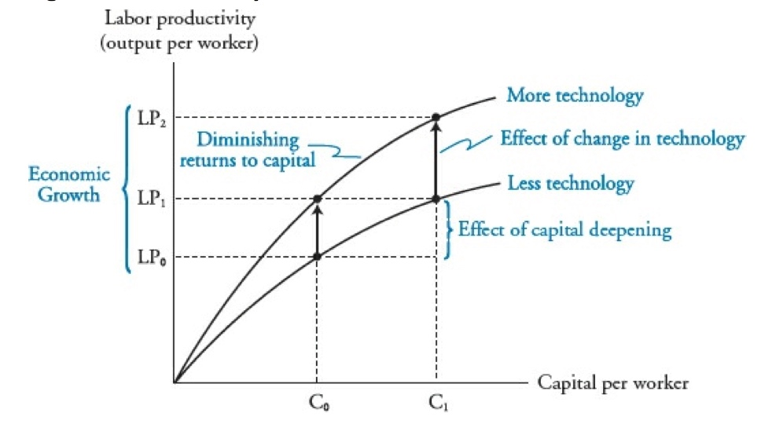
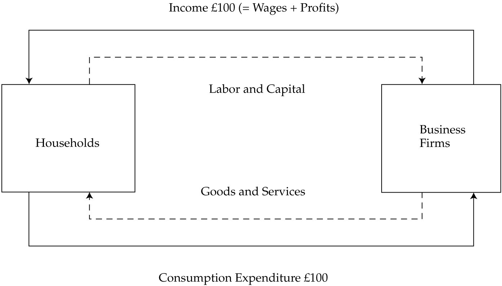
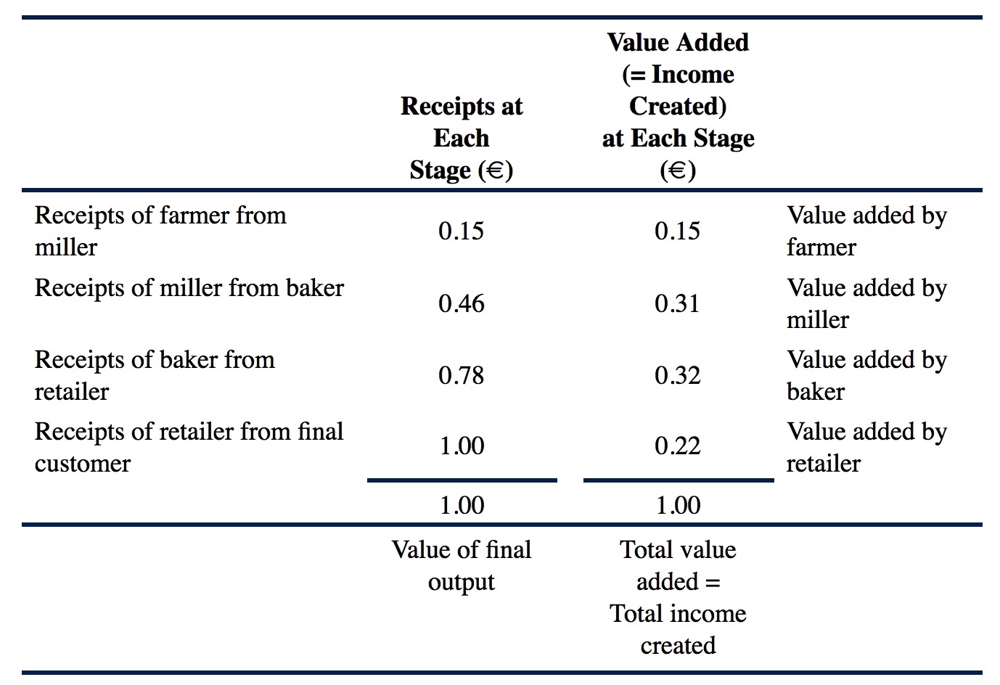
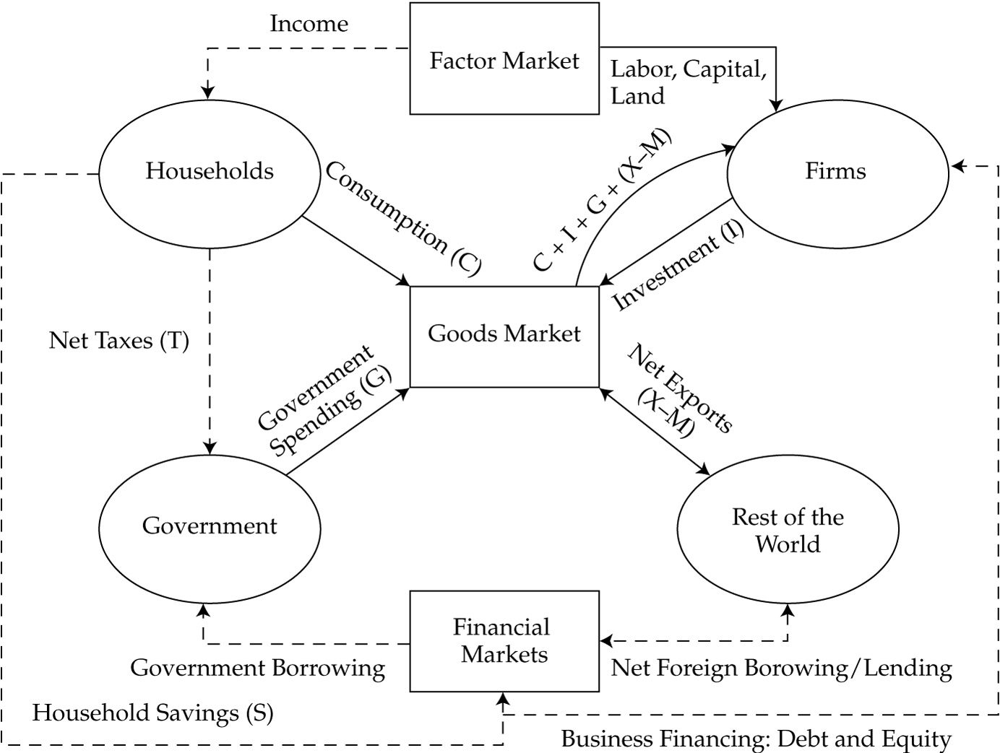
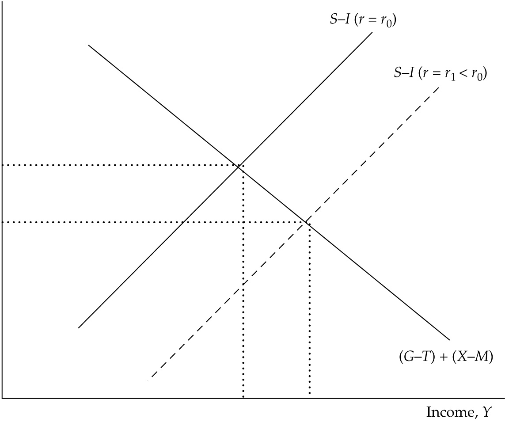
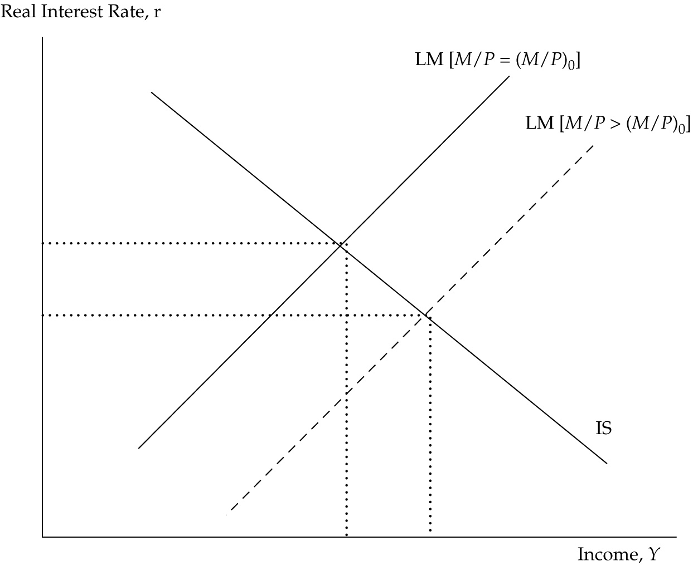
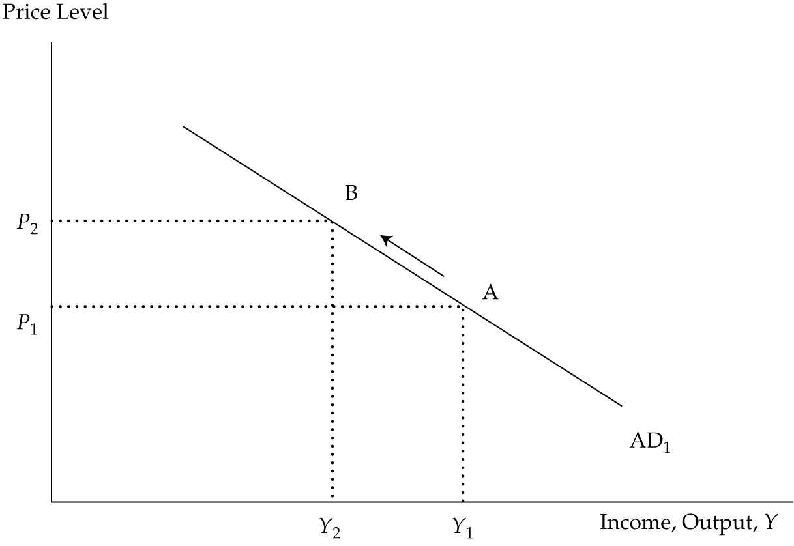
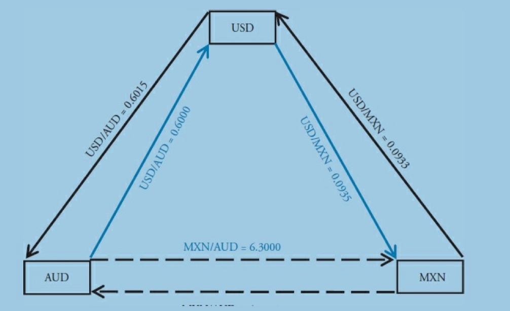
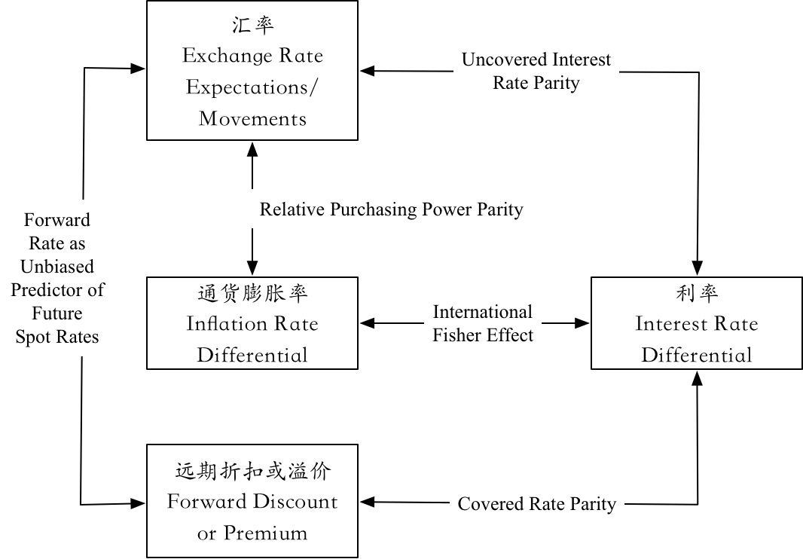

# (PART) 经济学 {#economics .unnumbered}

# 内容简介 {#economics-intro .unnumbered}

经济学分为宏观经济学，微观经济学。

# 市场供需理论 {#supply-and-demand}

Market Forces of Supply and Demand

## Demand and Supply Analysis

# 经济增长与发展 {#economics-growth}

## 重点内容概要

经济学使用 GDP 衡量一国的经济产出，并使用人均GDP（GDP per capita）来衡量一国的生活水平，而投资者不仅需要关注经济产出的水平，更需要关注的是经济产出的增长率，这是由于经济增长率的预测对投资决策具有重要的影响。

历史上，不同国家之间的人均GDP以及GDP增长率都存在很大的差异，由此导致了不同的国家存在着不同的投资机会。

- 为了对经济增长率进行预测，需要理解经济增长的先决条件，并理解经济增长率增长的途径和方法，以及经济增长的驱动因素；
- 理解经济增长理论，并能够利用增长公式（Growth Accounting Equations）来预测经济体的潜在增长率。

## 经济增长的先决条件

1. 储蓄和投资 Savings and Investment：储蓄和投资与经济发展是正相关的，为了实现经济增长，一国的私有部门储蓄与公共部门储蓄必须足以提供劳动力所需的平均资本，如果一国的国内储蓄不足，就必须吸引国外投资以实现增长；
2. 金融市场与金融中介 Financial Markets and Intermediaries：金融市场与金融中介可以通过多种形式对资源进行有效的分配从而促进经济增长。首先，金融市场能够决定哪些潜在的资金使用者能够提供最好的风险调整后的回报；其次，金融中介所创造的金融工具能够为投资者提供流动性以及减小风险的机会；最后，通过将众多投资者拥有的少量储蓄聚集到一起，金融中介能够为大规模项目提供资金支持，**需要注意的是，金融机构中介可能会降低信用标准和/或增加金融杠杆，从而增加金融风险而非经济增长**；
3. 政治稳定性，法律环境以及财产权 Political Stability, Rule of Law, and Property Rights：一国的整体环境会影响该国的经济增长，如果一个国家尚没有建立起完善的保护财产权利(实物财产和知识产权)的系统，那么就很难吸引资本流入。类似的，由于战争，贪污腐败，以及其他扰乱所带来的经济不确定性会给很多投资者带来不可接受的风险，从而影响经济增长的潜能；
4. 人力资本投资 Investment in Human Capital：对于劳动者的技能和身心健康的投资与实物资本的增长是相辅相成的，因此，对教育和医疗投资较多的国家一般具有更高的经济增长率。发达国家从高等教育支出中获益最多，因为高等教育促进了科技和社会创新，不太发达的国家从初等教育和中学教育中获益最多，因为初等和中学教育使劳动力学会了应用科学技术的能力。
5. 税收及监管系统 Tax and Regulatory Systems：税收及监管系统需要有利于经济的发展，当其他因素相同的时候，税收及监管负担越低，经济增长率越高。宽松的监管环境会促进大量的创业活动，而创业已经被证实与整体的社会生产力之间具有正的相关性。
6. 自由贸易与自由资本流动 Free Trade and Unrestricted Capital Flows：自由贸易与自由资本流动与经济增长之间也是正相关的，自由贸易通过对国内企业提供竞争而促进增长，从而提供了整体的效率并减少了损失，此外，自由贸易为国内的生产者打开了新市场。自由的资本流动可以在国内储蓄不足时引入国外资本，从而缓解国内储蓄不足带来的问题，国外资本流入可以是直接投资(房产、物理厂房及设备)，也可以是间接投资(金融资产入股票和债券等)。

## 股市长期增值率 & 经济可持续增长率

股票价格与盈利的增长是正相关的，从整个经济体来看，如果GDP增长或者GDP中企业盈利的份额增长，那么总的企业盈利就会增长，因此，一国的潜在GDP(经济实际增长的上限)是预测股票市场总回报的重要因子。

为了便于理解，将股票市场的总回报看作是GDP增长、企业盈利相对于GDP的增长，以及P/E指标增长的函数：

$$\Delta P = \Delta GDP + \Delta(E/GDP) + \Delta(P/E)$$

从长期来看，我们必须承认企业盈利相对于GDP的增长会是0，因为劳动力部分不会愿意接受在GDP中占比的下降，类似的，P/E指标的增长从长期来看也是0，投资者不会愿意对同样的盈利水平支付更多的价格(也就是说，P/E指标不可能无限增长)，**因此，如果从长期考虑，GDP的潜在增长率就等于股票市场总价值的增长率。**

## 潜在 GDP 及其增长率

需要了解潜在GDP及其增长率对股市投资与债市投资的影响。

如前所述，潜在GDP的增长代表了股票市场总价值的主要驱动力。

此外，潜在GDP会影响实际利率。如果潜在GDP的增长率为正，就表明未来的收入会增加，当消费者认为未来收入会增加的情况下，就会增加当前消费而减少储蓄，为了鼓励消费者储蓄，投资收益的实际回报率就必须增加，因此，高的潜在GDP增长预示着实际利率的升高以及实际资产回报率的升高。

在短期内，实际GDP与潜在GDP之间的关系可以为股票投资者和债券投资者提供关于经济状况的洞察力，比如，**当实际GDP由于价格上升而超过潜在GDP的时候**，二者之间的差异可以用来预测通货膨胀的压力。此外，中央银行可能会采取与 the gap between potential output and actual output 相一致的货币政策。当实际GDP增长率比潜在GDP增长率高（低）的时候，需要关注通货膨胀率升高（降低）的问题，以及中央银行可能会采取保守性（扩张性）货币政策。

除了预测货币政策以外，实际GDP与潜在GDP之间的关系在分析财政政策的时候也很有用，当实际GDP增长率比潜在GDP增长率低的时候，政府更可能执行财政赤字。

最后，对于固定收益的投资者，GDP的增长可以被用来评估企业债券和政府债券的信用风险，高的潜在GDP增长率会减小预期的信用风险，并会增加所有所发行债务的信用质量。

## 要素输入与经济增长

## Cobb-Douglas Production Function

Cobb-Douglas Production Function反映的是资本投资和劳动力生产率对经济增长的影响，如下所示：

$$Y = TK^{\alpha}L^{(1-\alpha)}$$

上式中，$\alpha$以及$1-\alpha$表示GDP中资本与劳动力所占的份额，也分别称作capital's and labor's share of total factor cost，其中$\alpha < 1$，$T$指的是表示科技水平的因子，一般称之为总要素生产力Total Factor Productivity(TFP)。

Cobb-Douglas Production Function表明GDP是劳动力、资本，及其生产效率的函数，It exhibits **constant returns to scale**; increasing all inputs by a fixed percentage leads to the same percentage increase in output.

将Cobb-Douglas Production Function等式两边都除以$L$，可以得到output per worker，也就是labor productility:

$$output~per~worker = {Y \over L} = T\left({K\over L}\right)^{\alpha}$$

劳动力生产率labor productility与人均GDP类似，都衡量了一国的生活水平。

从上面的式子可以看出，假定劳动力数量以及其份额$\alpha$保持恒定，那么GDP的增长可以通过增加单位劳动力的资本capital per worker(capital deepening)或者改进科技(increasing TFP)来实现。

但是，由于$\alpha < 1$，因此额外增加的资本对生产力的提高会被削弱，并且$\alpha$的值越低，资本投入(capital deepening)的回报也就越低。

*注意区分"marginal product of capital"以及"marginal productivity of capital"这两个不同的概念，潜在指的是资本的边际产出，也就是增加单位资本投入所增加的产出，后者指的是资本的边际生产率，也就是增加单位的劳动力人均资本所增加的人均产出(增加资本的同时保持劳动力数目不变)，Cobb-Douglas Production Function反映的是<b>constant</b> marginal product of capital以及<b>diminishing</b> marginal productivity of capital.*

在稳定状态下，资本的边际产出($MPK = \alpha Y/K$)以及资本的边际成本是相等的，也就是：

$$\alpha Y/K = r \Rightarrow \alpha = rK/Y$$

在上式中，$r$指的是投资回报率，$K$指的是资本的数目，$rK$也就代表了资本提供者所得到的回报，因此$rK$除以产出$Y$就衡量了总产出中分配给资本提供者的部分，这正好是$\alpha$的定义。

下图表示的是劳动力生产率与劳动力人均资本之间的关系Productivity Curves，Capital Deepening指的是沿着生产力曲线的移动，曲线的弯曲来源于资本边际生产率的递减效应，只要投资资本的MPK大于资本要求的回报率r，资本的增加就会使经济增长，当MPK等于r的时候，capital deepening就会停止，此时劳动力生产率也不再发生变化。

但是，随着科技的不断进步，资本及劳动力都能够实现更高的产出，因此由于投资带动的科技进步会提高现有劳动力和资本的生产率，尽管存在资本边际生产率的递减效应，科技进步也可以使GDP实现持续增长，在图中表现为曲线的上移，并使得所有人均资本水平的生产率都得到了提升。

对于发达国家来说，劳动力的人均资本比例已经相当高了（上图中的$C_1$），因此发达国家从capital deepening中只能得到很小的回报，从而必须依赖于科技进步对生产效率的提高来推动经济的发展；相反，发展中国家的劳动力人均资本比例相对较低(上图中的$C_0$)，因此capital deepening能够至少带来短期的生产率提高。

## Forecast Potential GDP based on Growth Accounting Relations

基于Cobb-Douglas Production Function，潜在GDP的增长可以使用下述增长会计关系式**growth accounting relation**表示：

$$\Delta Y~/~Y = \Delta A~/~A + \alpha \times (\Delta K~/~K) + (1-\alpha)\times (\Delta L ~/~L)$$

上式中，Y表示总产出GDP，A表示科技，K表示资本，L表示劳动力，$\alpha$表示elasticity of output with respect to capital = share of income paid to capital，$1-\alpha$表示elasticity of output with respect to labor = share of income paid to labor，也就是说：

**潜在GDP的增长率 = 科技的长期增长率 + $\alpha\cdot$资本的长期增长率 + $(1-\alpha)\cdot$劳动力的长期增长率**

在实际应用中，可以通过资本与劳动力的长期趋势对其进行预测，二者的份额可以使用国民收入账户national income accounts进行估算，科技的变化TFP一般难以直接进行衡量，因此，TFP必须作为残差项进行估算：*将GDP的实际变化减去劳动力和资本的实际变化*。

预测潜在GDP的另一种方法是*labor productivity growth accounting equation*，该方法聚焦于劳动力的变化，如下所示：

**潜在GDP的增长率 = 劳动力的长期增长率 + 劳动力生产率的长期增长率**

上式中的*劳动力生产率的长期增长率*反应了资本capital deepening以及科技technological progress的共同影响。

## 自然资源对经济增长的影响

How Natural Resources affect Economic Growth

自然资源包括可再生资源(比如木材)，以及不可再生资源(比如石油天然气等)，自然资源在经济增长中扮演着复杂的角色，在某些情况下，拥有大量充足自然资源的国家发展非常迅速(比如巴西)，但是某些拥有丰富自然资源的国家却发展缓慢(比如非洲某些资源丰富的国家)，相反，某些资源贫乏的国家却实现了很大的发展。

有限的自然资源不一定会限制经济增长的一个原因是：对自然资源的获取并不要求一定要拥有自然资源*access to natural resources does not require ownership of resources*，自然资源贫乏的国家可以通过贸易来获取自然资源。

另外一些理论认为对资源的占有可能在实际上会妨碍经济增长，其原因是拥有丰富自然资源的国家会将经济重心放在开采资源上，而不是去发展其他工业，更进一步，拥有宝贵资源的国家的货币会随着世界对这些自然资源需求增加而实现升值，这称作"Dutch Disease"，在这个现象下，当某国自然资源的全球需求量增加时，其货币会被推动升值，从而使得该国的出口成本增加，从而削弱该国其他产业在全球市场上的竞争力。

## 人口结构、移民以及劳动力参与度对经济增长率及其可持续性的影响

How Demographics, Immigration, and Labor Force Participation affect the Rate and Sustainability of Economic Growth

劳动数量Quantity of labor的定义是劳动力数量size of the labor force乘以平均工作小时数average hours worked，劳动力 labor force 的定义是位于工作年龄段（ages 16-64）内的适合工作的人口数，包括就业的以及未就业的。

### 劳动力供应因素

Labor Supply Factors

劳动力供应量受以下几点因素影响：

- 人口结构 Demographics
- 劳动力比例 Labor force participation，定义为劳动力labor force占适龄人群working age population的比例：$$labor~force~participation={labor~force\over working~age~population}$$，Labor force participation会随着更多女性参加工作而升高
- 移民 Immigration
- 平均工作时长 Average hours worked，在大多数国家，平均工作时长具有下降的趋势，其可能的原因是法律对工作时间进行了限制，财富效应（人们用更多时间进行休闲，劳动力收入的高税率），以及兼职工作者和临时工作者的增加。

## 实物资本投资、人力资本投资以及科技研发投资对经济增长的影响

How investment in physical capital, human capital, and technological development affects economic growth

### 人力资本

**Human capital is knowledge and skills individuals possess. Unlike quantitative labor metrics, such as hours worked, human capital is a qualitative measure of the labor force.**

人力资本是对劳动力质量的衡量，由于教育和工作经验不断提升的人力资本会提高生产效率进行促进经济增长，此外，人力资本还会产生外部效用，比如知识渊博的工作者会通过创新促进整个社会的效率提升。

### 实物资本

实物资本Physical Capital一般分为 ICT 资本 (包括基础设施infrastructure，计算机computers，通信网络telecommunications capital) 以及 non-ICT 资本 (包括机器、交通运输系统，以及商业建筑等)，实证研究表明，实物资本投资investment in physical capital与GDP增长率之间具有强的正相关性。

### 科技研发

Investment in technology includes investment in both physical and human capital.

研究者使用R&D费用或者专利数目作为科技投资的代理变量，并发现发达国家的研发费用投入最多，因为发达国家的人均资本较高且人口增加缓慢，因此需要依赖于科技进步实现经济增长，发展中国家的R&D费用在GDP中所占的比例一般较小，并且经常直接参考使用发达国家的研发成果。

### 公共基础设施

对公共基础设施（Public Infrastructure）的投资比如公共道路，桥，以及市政设施等的建设，会对私有投资提供额外的好处，比如州际高速公路网络可以对私有企业的贸易起到促进作用，从而增强经济体的总生产效率。

## 三大经济增长理论

Compare classical growth theory, neoclassical growth theory, and endogenous growth theory.

经济增长理论分为三大类：

- 古典理论 Classical Growth Theory
- 新古典理论 Neoclassical Growth Theory
- 内生增长理论 Endogenous Growth Theory

三种经济增长理论的区别在于对一个经济体的潜在稳定增长率的不同看法。

### 古典增长理论

古典增长理论认为实际人均GDP的增长是不可持续的，因为当实际人均GDP超过其可持续水平时，人口爆发的情况就会出现，人口的增长会导致降低劳动力的边际回报，进而降低生产效率，从而迫使人均实际GDP回到可持续水平。此机制会阻止人均收入的长期增长，**古典增长理论没有被实证研究证实**。

### 新古典增长理论

新古典增长理论主要关注对经济体长期稳定增长率long-term steady state growth rate(sustainable growth rate or equilibrium growth rate)的估算，当output-to-capital ratio恒定时，经济体处于均衡状态，此时labor-to-capital ratio and output per capita也会以均衡增长率$g^*$进行增长。

**Professor’s Note: Steady state growth rate for the purpose of neoclassical growth theory does not assume a constant level of technology and hence differs from the definition of steady state discussed earlier.**

基于Cobb-Douglas函数，新古典增长理论认为：

- 人均GDP的可持续增长率(或者output per worker) $g^*$ 等于科技的增长率($\theta$) 除以劳动力在GDP中所占的份额($1-\alpha$)：$$g^* = {\theta \over (1-\alpha)}$$
- GDP的可持续增长率 $G^*$ 等于人均GDP的可持续增长率加上劳动力的增长率$\Delta L$：$$G^* = {\theta \over (1-\alpha)} + \Delta L$$

**注意，在上面的两个公式中，增长率并不受资本(K)的影响，因此，可以认为一旦稳定状态达到了once steady state is achieved，capital deepening is occurring but it does not affect growth rate。**

新古典主义理论认为：

- 从长期来看，Capital Deepening会影响GDP水平，但是不会影响GDP的增长率，Capital Deepening可能会暂时的提高GDP增长率，但是如果没有科技的进步出现，增长率会回到其可持续水平；
- 经济体的增长率会不断接近其稳定状态，而与initial capital to labor ratio或者level of technology无关；
- 在稳定状态时，生产效率的增长率仅是科技增长率$\theta$以及劳动力在GDP中所占份额$1-\alpha$的函数；
- 在稳定状态时，资本的边际产出MPK = $\alpha Y~/~K$是恒定的，但是边际生产效率在降低；
- 储蓄的增加只会暂时的促进经济增长，但是，具有高储蓄率的国家会拥有高的资本劳动力比率 higher capital to labor ratio，因此具有较高的生产效率；
- 发展中国家受资本边际生产效率递减的影响较小，因此与发达国家相比具有更高的经济增长率，最终各个国家的人均收入会趋于相同。

### 内生增长理论

与新古典主义理论相比，内生增长理论认为科技进步的出现是对实物资本及人力资本投资的结果(hence the name endogenous which means coming from within)，与新古典主义理论不同，内生增长理论认为不存在稳定的增长率，因此增加投资能够持续的提高经济增长率。

内生增长理论背后的驱动力是特定投资会增加TFP(促进科技进步)的假设，通过增加研发费用方面的投资，不仅会对进行投资的公司有利，还会有利于其他公司，这些益处会提升整个经济体的增长率水平。

内生增长理论从理论上说明了资本回报是恒定的returns to capital are constant，如果资本回报是恒定的，那么增加储蓄就会持续的提高经济增长率，这点与新古典理论不同。

新古典理论与内生增长理论之间的不同在于总要素生产效率，新古典理论假定资本投资capital investment会随着科技的进步而扩张（i.e., growth comes from increases in TFP not related to the investment in capital within the model），内生增长理论则假定资本投资capital investment（R&D expenditures）实际上可能会提高总要素生产效率total factor productivity.

## 经济趋同假设

Explain and evaluate convergence hypotheses.

实证研究表明，不同国家的生产效率productivity (output per capita)之间存在很大的差异，由此引发的经济学问题就是：各个国家之间的生产效率以及生活水平会随着时间的推移趋于一致吗？

Absolute convergence hypothesis认为欠发达国家会随着时间的推移实现同样的生活水平，新古典主义理论假设所有国家都能获得相同的科学技术，这就导致所有国家会具有相同的增长率，但是not the same per capita income。

Conditional convergence hypothesis认为生活水平的趋同只会在具有相同储蓄里、人口增长率以及production functions的国家中出现，在Conditional convergence的假设下，欠发达国家的增长率可以会比发达国家要高，直到欠发达国家追赶上来。基于新古典主义理论，一旦发展中的生活水平达到了发达国家的生活水平，其增长率就会稳定在与发达国家一致的稳定增长率水平上。

还有一种假设是club convergence，在这种假设下，国家可能会属于某一个俱乐部的国家(比如具有相似储蓄率、金融市场、财产权、医疗及教育服务的国家)，比较贫穷的国家可能会属于发展速度的俱乐部，直到追赶上其richer peers，这些不属于这个俱乐部的国家可能永远都达不到更高的生活水平。

实证研究表明，发展中国家经常（并不总是）会达到相对更发达国家的生活水平，在过去的半个世纪里，大多三分之二的比美国生活水平低的经济体实现了比美国更快的发展，他们的快速增长为convergence hypothesis提供了部分的支持，club convergence theory可能会用来解释为什么某些没有实施合适经济及政治改革的国家仍然处于落后状态。

## 私有部分的研发投资

Private investment in technology and knowledge

内生增长理论认为，企业的R&D投资会有益于整个社会，当不考虑研发投资的external benefits to the economy (the social returns)的时候，很多可能的研发项目的回报将不足以补偿其存在的风险，这会导致从整个社会的角度来看，由此产生的研发投资会低于最有水平sub-optimal或者过低too low，因此政府可用通过有效的补贴或资助来鼓励研发方面投资，以促使私有企业的研发投资达到最优水平。

## 移除贸易壁垒对资本投资和收益、就业和工资、以及经济增长的影响

Describe the expected impact of removing trade barriers on capital investment and profits, employment and wages, and growth in the economies involved.

古典主义理论、新古典主义理论以及内生增长理论都没有考虑潜在国家之间的贸易以及资金流动对经济增长的影响，移除贸易壁垒并允许资本自由流动具有以下好处：

- 增加来自于外国储蓄的投资；
- 专注于本国具有相对优势的行业；
- 扩大国内商品的市场，实现规模效益；
- 增加科技的共享，以及更高的总要素生产率的增长；
- 加剧竞争从而使效率低下的企业退出市场，并将其资产分配到效率更高的地方去利用

新古典主义理论模型认为开放经济体（没有贸易壁垒以及资本管制）会趋同于发达国家，因此由于发展中国家尚没有达到资本回报率显著降低的临界点，因此可以吸引大量的国外资本对其进行投资，从而实现生产效率的提高。最终，这些经济体会变得发达，其增长也会变得缓慢，从而达到于发达国家一致的稳定增长状态。

内生增长理论也认为自由贸易以及资本的高流动性会促进增长，因为自由市场会促进创新，当外国公司进入使得竞争加剧时，效率高并具有创新性的公司才会存活下来，这些公司能够持续的增加世界经济的发展，此外，规模经济也会促进经济增长。

从趋同的角度来看，移除贸易壁垒及资本管制会加快发展中国家于发达国家生活水平趋同的速度，研究表明as long as countries follow outward-oriented policies of integrating their industries with the world economy and increasing exports, their standard of living tends to converge to that of more developed countries. Countries following inward-oriented policies and protecting domestic industries, can expect slower GDP growth and convergence may not occur.

> 开放促进增长，闭关导致落后。

# 国民收入与增长 {#national-income-and-growth}

Measuring National Income and Growth

1. 从开支与收入两个角度计算并解释GDP；
2. 对比计算GDP的两种方法：价值增加累计以及最终输出价值；
3. 对比名义GDP与实际GDP，计算并解释GDP平减因子；
4. 对比GDP，国民收入，居民收入，以及居民可支配收入；
5. 解释储蓄，投资，财政余额以及贸易余额之间的基本关系；
6. 解释IS曲线与LM粗线，以及如何结合IS曲线与LM曲线生成总需求曲线；
7. 从短期和长期两个时间尺度解释总供给曲线；
8. 解释引起总需求曲线和总供给曲线移动和偏移的原因；
9. 描述总需求以及总供给的波动如何引起短期经济和商业周期的变化；
10. 区分以下几种宏观经济均衡：长期充分就业，短期经济衰退缺口，短期通货膨胀缺口，以及短期滞胀；
11. 解释为什么在没有充分就业的情况下会出现短期的宏观经济均衡；
12. 分析总供给与总需求的变化对经济的影响；
13. 描述经济增长的来源，衡量方法以及可持续性；
14. 描述用于分析经济增长来源的生产函数法；
15. 区分经济增长的两个组成部分：生产要素输入的增长，以及总生产效率的提高。

在经济学领域，微观经济学是研究经济个体的行为，比如家庭，企业，或者特定的商品以及服务的市场，而宏观经济学则是将家庭，企业以及市场的行为作为一个整体来进行研究，因此宏观经济学主要聚焦于国家层面的研究，比如总投资，总消费，总价格指数的变化以及总利率水平的变化等。

宏观经济分析主要关注一个国家的总产生与总收入，该国的竞争力与比较优势，劳动力的生产效率，价格水平与通货膨胀率，以及该国政府与中央银行的行为。

对于一个国家来说，总产出与总收入之间存在下面的关系：

**总产出 Aggregate Output = 总收入 Aggregate Income**

## Aggregate Output, Prices and Economic Growth

• GDP的三种核算方式；

• IS-LM和AD-AS模型的概念，以及传导机制；

• AD-AS模型下的四种均衡，及其特征和政府相应的政策措施；

• 经济可持续增长的要素。

## Gross Domestic Product (GDP)

直观上来讲，GDP衡量一个经济体在给定时期内的产出与收入流，因此GDP可以从两方面进行计算：

1. 所有家庭与企业的总收入；
2. 所有在国内生产的商品与服务上的总支出。

大多发达国家都采用OECD(Organisation for Economic Co-Operation and Development)发布的官方手册中描述的标准流程来计算GDP。

GDP的计算需要符合以下三个通用的标准：

1. 所有参与计算GDP的商品与服务必须生产自要衡量的时间段内，此外，政府对个人发放的失业补助，福利等不能包括在内，个人的财产升值也不能包括在内；
2. 所有参与计算GDP的商品与服务的价值必须能够以其市场价格衡量；
3. GDP只包括最终产出的商品与服务的市场价值，中间产出不能重复参与计算，因此可以使用最终产出的价值与生产过程中的价值增加值两种方法来计算GPD，二者的结果是等价的，如下图所示：

**Goods and Services Included at Imputed Values**

一般来说，GDP只包括可以在市场上出售的商品的服务，但是对于自有房屋，以及政府服务来说，尽管没有在市场上出售，但是依然要参与GDP的计算，其中自有房屋可以看做是居住者为了得到住所把租金付给了自己，因此可以按照市场的租房价格对其价值进行估算，然后参与GDP的计算，而政府服务的价值则根据政府服务的支出来进行衡量。

此外，为了GDP计算的简单性与世界通用性，非市场行为产生的价值不被包括在内，比如家庭烹饪、打扫卫生以及自我房屋修葺等活动，另外地下经济也不参与GDP的计算，但是值得注意的是，地下经济在某些国家会占据相当一部分的比重。

## Nominal & Real GDP & GDP Deflator

GDP包括名义GDP与实际GDP两种：

- Nominal GDP，称为名义GDP，是指使用当前市场价格计算的GDP；
- Real GDP，称为实际GDP，是指使用基准年市场价格计算的GDP，用来反映在价格不变的情况下当前时间段内生产的商品和服务总量，Per capita real GDP是将real GDP除以人口数目，经常用来衡量一国的平均生活水平。

## The Components of GDP

GDP的主要组成可以理解为经济体内主要参与者之间的商品与服务流动，一个经济体包括四个主要组成部分：**家庭、企业、政府、国外或外部经济体**。

从GDP等于总支出的角度来看，有以下式子成立：

**$GDP = C + I + G + (X - M)$**

**上述式子一定要牢记！！！**

其中：

- $C$: 消费者在最终商品和服务上的总消费；
- $I$: 总国内私有投资，包括企业在资本商品(比如厂房或设备等)上的投资，以及存货的变化(Inventory Investment)；
- $G$: 政府在最终商品和服务上的支出；
- $X$: 总出口；
- $M$: 总进口；

产出、收入以及开支之间的关系如下图所示：

### The Household and Business Sectors

家庭与企业之间通过生产要素市场、商品市场以及金融市场相互联系：

1. 在生产要素市场中，家庭提供劳动力服务、土地以及资本等给企业，企业创造价值后返还一部分给家庭，这部分就是家庭的收入；
2. 在商品市场中，家庭将收入的一部分用于消费支付给了企业；
3. 在金融市场中，家庭将消费后剩余的部分作为储蓄投入到了金童市场，这部分钱中的一部分以企业债券以及股票的形式回流到了企业，用于企业投资于存货、资产、厂房以及设备等资产商品，企业的这部分投资通过商品市场又返还到了企业，这是因为企业需要这些投资来提高自身的生产效率，扩大自身的资本规模。

在大多数发达国家中，比如意大利和美国，资产商品方面的开支在GDP中占有相当一部分的比例，在一些发展中国家，尤其是中国和印度，投资所占的比例也相当大，比如中国和印度在2010年投资所占比例分别为40.0%和33.8%。

**投资对于一个经济体的长期增长率具有重要的决定性作用，与此同时，投资也是经济体中变化性最强的部分，并且资本商品上的投入，尤其是存货，是引起短期经济波动的重要因素。**

### The Government Sector

政府从家庭和企业征取税收，并通过商品市场从企业购买商品与服务，此外政府开支还包括军队、警察以及政府服务等方面的支出，由于政府在公共事业方面提供的服务，在大多数国家，政府都是主要的雇主。

政府还会向家庭转移财富，比如低保，医疗保障，失业救济等，这部分开支从税收中减到之后，成为净税收net taxes (T)。

**值得注意的是，政府向家庭转移的这部分支付并不包括在政府开支(G)中，因为这部分支付相当于政府将从征取的税收退还了一部分，而退还的这部分则会被受益者消费掉，此外，这部分转移并不总是通过支付的形式进行，有时候是通过直接提供商品或服务来进行的，比如医疗保障。**

如果政府开支G超过了净税收T，那么就会产生财政赤字，其差额部分必须在金融市场借贷，因此政府可能需要在金融市场中与企业竞争以获得资金(通常来自于家庭储蓄)，除此之外，唯一的潜在资金来源就是世界上其他国家的资本。

### The External Sector

净出口(X-M)反映了**卖给国外的商品和服务(exports, X)**与**从国外购买的商品与服务(imports, M)**之间的差值。

国际贸易赤字是指国内经济体在国外商品和服务上的消费大于国外经济体对本国商品和服务的消费，出现国际贸易赤字同时表明该国的消费大于生产，因为国内的储蓄不足以覆盖掉国内的投资加上政府的财政赤字。

## National Income & Personal Income & Personal Disposable Income

从支出的角度看，可以通过下式计算GDP:

**$GDP$ = 家庭消费 + 商业投资(包括存货变化) + 政府开支 + 出口 - 进口 + 统计误差**

需要注意的是，存货的变化必须被加到总支出中，否则已生产但还未销售的商品就不会被统计在GDP内了。

从收入的角度看，GDP可以通过下式计算:

**$GDP$ = 国民收入 + 资本消耗补偿(折旧) + 统计差异**

其中国民收入National Income是最终商品的生产过程中所有生产要素获得的收入，包括以下部分：

**国民收入 = 员工收入 + 私有企业与国有企业的税前收入 + 利息收入 + 经营者净收入(非法人组织的商业活动) + 租金 + 间接商业税减去补贴**

资本消耗补偿capital consumption allowance（CCA）是衡量资本存货在生产商品和服务过程中的损耗。

**个体收入Personal Income**用来衡量家庭收入及其购买力，因此是决定总消费的重要因素之一，个体收入包含家庭的所有收入，可以使用下式进行计算：

**个体收入 = 国民收入 - 间接商业税 - 企业所得税 - 未分配企业利润 + 政府转移支付**

**个体可支配收入Personal Disposable Income(PDI)等于个体收入减去个人所得说**，因此PDI衡量了家庭能够用于消费或储蓄的数额，PDI也是与家庭消费及储蓄决策相关性最强的因素。

家庭储蓄等于PDI减去三部分：

1. 消费支出；
2. 消费者付给企业的利息；
3. 个体向国外的转移支付

相应的，企业的储蓄部分包括：

1. 未分配企业利润；
2. 资本消耗补偿

## Aggregate Demand & Supply Curves

Aggregate Demand（AD）是指家庭，企业，政府，海外顾客在任意给定价格水平上愿意购买的商品和服务的数量；Aggregate Supply（AS）是指生产者在任意给定价格水平上愿意提供的商品和服务的数量，也反映了家庭在给定的工资水平(资本回报)下愿意提供的劳动力(资本)数量。

一国的总需求与总供给的交互作用决定了GDP的水平以及价格水平，商业周期反映了总需求的变化以及短期总供给的变化。长期的可持续增长率取决于供给、生产要素的增加，以及科技的进步。从投资的角度看， 宏观经济非常重要，因为商业利润、资产估值、利率、通货膨胀率都会受到宏观经济的影响，此外理解财政政策及货币政策也非常重要。

1. GDP指的是一国在一段时间内的商品或服务的总产出；可以通过总产出以及总收入两种方法来核算，GDP只记录当前时间段内的新生产商品或服务的最终购买，**转移支付以及资本增益不记录在内，除了家庭居住的房屋以及政府服务以外，GDP只包含在市场上出售的商品价值；**
2. Nominal GDP指的是利用当前年度的价格计算的GPD，实际GDP指的是利用基准年的价格计算的GDP，名义GDP除以实际GDP就得到了GDP Deflator；
3. 国际贸易包括出口和进口，二者之差称为净出口Net Exports，如果净出口为正，说明该国的spends小于earns，如果净出口为负，说明该国的spends大于earns；
4. 资本市场提供了saving和investment之间的纽带；
5. **从支出的角度看，GDP等于个人消费C，国内总私有投资I，政府开支G，以及净出口X-M之和；**
6. National Income是指生产过程中所有生产要素得到的收入，等于GPD减去资产折旧，以及统计学差异的调整项；
7. Personal Income指的是家庭得到的税前收入，等于National Income加上政府transfers给家庭的部分，再减去企业未分发的利润，以及企业所得税及简介商业税；
8. Personal Disposable Income指的是家庭可支配收入，等于Personal Income减去个人所得税；
9. 私有储蓄必须等于投资加上财政及贸易赤字，也就是$S = I + (G - T) + (X - M)$;
10. 消费支出是家庭可支配收入的函数，边际消费习性marginal propensity to consume表示的是额外的单位可支配收入中用于消费的比例；
11. 投资开支取决于平均利率水平以及总收入水平。政府购买以及税收政策一般作为宏观经济学模型中的外生变量exogenous variable进行考虑。实际的是手取决于收入income，因此作为endogenous内生变量，在模型内进行考虑。
12. IS曲线反映的是GDP与实际利率real interest rate的结合，使得总收入/产出aggregate income/output等于计划的开支planned expenditures；LM曲线反映的也是GDP与实际利率real interest rate的结合，使得实际货币的需求和供给达到平衡；
13. 将IS曲线与LM曲线结合就得到了总需求曲线Aggregate Demand Curve，其决定了实际GDP水平以及价格水平；
14. 总需求曲线Aggregate Demand Curve是实际GPD的需求量与价格水平之间的关系，总需求曲线上的移动反映了价格对需求的影响；
15. 总需求曲线是向下的，这说明价格水平上升会降低社会财富，提高实际利率，并提供国内产品相对于国外产品的价格，总需求曲线假设货币供给是恒定的；
16. 当除了价格Price以外的因素发生变化时，总需求曲线会shift，这些因素包括居民财富，消费者及商业预期，资本使用效率，货币政策，财政政策，汇率以及外国的GDP；
17. 总供给曲线指的是实际的GPD供应数量与价格水平之间的关系，总供给曲线上的移动反映了价格对总供给的影响；
18. 短期的总供给曲线是向上的，因为更高的价格会产生更高的利润从而引诱企业生产更多，并且劳动力也会工作更长，短期内有些价格是sticky的，表明有些价格不受需求变化的影响；
19. 从长期来看，所有的价格都是可以变化的，长期的总供给曲线是垂直的，其原因是生产要素的成本会随着价格水平而进行调整，从而使得最优的产出水平维持不变，这个位置取决于经济体的GPD潜力水平；
20. GPD的潜在产生，也称作full employment or natural level of output，是难以观测和精确衡量的；
21. 长期的总供给曲线会由于劳动力的供给、实物及人力资本的供给以及生产效率和科技的影响而发生shift；
22. 短期的总供给曲线会由于potential GDP，nominal wages，input prices，expectations about future prices，business taxes and subsides，以及exchange rate的影响而发生shift；
23. 商业周期以及GDP的短期波动是由总需求及总供给的shift引起的；
24. 当一国的GDP水平位于potential GDP之下时，这种衰退的状况会迫使总价格水平下降；
25. 当一国的GDP水平位于potential GDP之上时，这种过热的状况会迫使总价格水平上升；
26. **Stagflation，称为滞涨，表示的是高通货膨胀以及低迷的经济增长，是由于短期的总供给下降引起的；**
27. 经济体的可持续增长率是根据生产效率提升的增长率或者potential GDP的增长率衡量的；
28. 实际GPD的增长率衡量的是经济体扩张的速度，Per Capita GDP，也就是实际GDP除以人口，衡量的是一国的生活水平，实际GDP增长率以及人均GDP在不同国家的差别很大；
29. 经济增长的来源包括劳动力的供给，实物及人力资本的供给，原材料以及科技的发展；
30. Total factor productivity(TFP)是一个scale factor，反映的是产出的增长中与资本输入以及劳动力输入无关的部分，主要反映了科技的变化对产出的影响；
31. 根据two-factor production function，Potential GDP Growth等于Growth in TFP, 加上$W_L$(Growth in labor),再加上$W_C$(Growth in Capital),其中$W_L,W_C(=1-W_L)$反映的是劳动力与资本在GDP中所占的比例；
32. Diminishing Marginal Productivity表明：增加单一要素的供给会降低回报，并不能提供可持续增长，特别的，长期的经济增长不能依靠资本优化；由于发展中国家资本的相对稀缺，使得资本的生产率较高，因此发展中国家的经济增长率要高于发达国家；
33. 劳动力供给受人口增长、labor force participation rate以及净移民的影响，投资的增加能够提高capital stock，长期的经济增长与投资率之间的相关性很大；
34. 除了劳动力、资本、技术、人力资本（本质上是劳动力的质量）之外，自然资源natural resources也是经济产出和增长的决定因素；
35. 科技的进步能够使用同样的资源和输入得到更多的产出，在发达国家，科技的进步是推动经济增长的主要因素；
36. 经济体的持续增长率的决定因素是劳动力供给以及劳动力生产效率的提高速度；

### Aggregate Demand Curve

在微观经济学的需求曲线中，随着价格水平的下降，需求的数量会上升，其含义可以理解为在给定的收入水平下，更低的价格允许消费者买入更多的商品，但是这种理解方法在此处并不合适，因此收入水平不是固定的，而是与价格水平相关的，因此需要使用不同的方法来解释价格水平与总需求之间的关系。

总需求曲线由两部分组合而成：IS曲线，以及LM曲线。

#### 总收入与总开支的平衡：IS 曲线

由于在国内总产出上的开支包括四个方面：家庭消费C，投资I，政府开支G，以及净出口X-M，因此：

$$GDP(Y) = Expenditure = C + I + G + (X - M)$$

居民可支配收入可以从两方面理解：

1. 等于GDP(Y)加上政府转移支付(F)，减去企业盈余(business saving, $S_B$)，再减去直接和间接税(R);
2. 居民可支配收入等于居民在商品和服务上的消费(C)加上居民储蓄($S_H$)

因此有：

$$Y + F - S_B - R = C + S_H$$

化简后得到：

$$Y = C + S + T$$，其中$T = R - F$表示净税收，$S = S_B + S_H$表示总私有储蓄。

由于总支出必须等译总收入，因此：

$$C + S + T = C + I + G + (X - M)$$,

对上式化简后可以得到如下的基本关系：

$$S = I + (G - T) + (X - M)$$

也就是国内总私有储蓄等于投资，政府赤字，净出口之和。**该式子一定要牢记，并且能够对其进行各种变换，从不同的角度对其进行理解。**

重新调整上述式子，可以得到：

$$G - T = (S - I) - (X - M)$$

上式可以看出，政府出现财政赤字就说明要么私有储蓄大于投资，要么该国的出口要小于进口，也就是要出现贸易逆差。

由于总收入与总开支必须相等，因此可以推出$S = I + (G - T) + (X - M)$成立，从另一个角度，该式子也可以看做是家庭，企业，政府与海外等市场参与者共同决策作用的结果，如果从这个角度出现，需要思考产生这些决策的根本原因是什么，以及其平衡点在哪里。

**消费**

经济学家发现决定消费的主导性因素是居民可支配收入，因此可以将消费表示成居民可支配收入的函数$C(\cdot)$:

$$C = C(Y - S_B - T)$$

如果将企业盈余忽略掉(该部分在实际中比例较小)，上式可以简化为：

$$C = C(Y - T)$$

当家庭获得额外收入的时候，部分会被用于消费，剩下的部分则会进行储蓄，因此此处引出两个概念：边际消费倾向(marginal propensity to consume, MPC)，以及边际储蓄倾向(marginal propensity to save, MPS):

- MPC是指对于额外的单位可支配收入用于消费的比例；
- MPS是指对于额外的单位可支配收入用于储蓄的比例。

二者之间的关系为：$MPS = 1 - MPC$

从消费函数$C = C(Y - T)$可以看出，实际收入的增长或者税收的减少都会增加总消费，一些更加复杂的模型表明消费不仅取决于当前的可支配收入，也取决于所拥有的财富。除了特别富有的人群以外，个体倾向于在财富增加的情况下将当前收入中更高的比例用于消费，这是由于财富越多，就越不需要将当前收入进行储蓄以用于未来的消费。

Average Propensity to Consume (APC)是指平均消费倾向，等于消费与GDP的比例：$C~/~Y$。

**投资**

投资的只要来源是企业，主要取决于两个方面：利率水平，以及总产出/总收入。其中利率水平反映了投资的成本，总产出/总收入则反映了新投资的预期收益，因此投资可以表示为实际利率 r(real interest rate，等于名义利率减去预期通货膨胀率)与总产出/总收入 Y 的函数：

$$I = I(r, Y)$$

**政府开支**

大多数政府开支都与当前的经济活动水平、利率水平、汇率以及其他经济因子密切相关，因此经济学家经常将政府开支G作为宏观经济模型中的外生变量，从本质上来说，这表明了总花费，总收入，总产出之间的平衡主要取决于家庭和企业。

*税收政策*

税收政策也可以看做是一种外生变量，用于作为一种调节手段影响经济活动，但是净税收的数额一般取决于经济活动水平，因此政府的财政赤字$G - T$可以表示为：

$$G - T = \overline G - t(Y)$$

其中$\overline G$代表政府开支的外部水平。

从上式可以看出，政府的财政赤字$G - T$会随着总收入Y的增加而减小，随着总收入的减少而增加，这个效应被称作automatic stabilizer，因为它会缓和总产出的变化带来的影响。

**净出口**

净出口(X-M)是国内收入与国外收入，以及国内商品与国外商品之间相对价格的函数，当国内收入增加时，会对进口产品产生额外的需求，导致净出口减少；当国外收入增加时，会对国内的产品产生额外的需求，因此会导致净出口增加；当国内的商品或服务相对价格下降的时候(比如汇率下跌)，对国内商品或服务的需求会增加，因此会导致净出口的增长。

**总开支与总收入的平衡**

由于总开支与总收入必须相等，可以有$S = I + (G - T) + (X - M)$，简单调整后得到：

$$S - I = (G - T) + (X - M)$$

根据之前的讨论，当收入增加时，政府赤字G-T以及净出口X-M都会减少，因此在下图中$(G-T)+(X-M)$与收入之间的关系表现为为下降的斜线，如果假设收入增加对于储蓄的影响大于对投资的影响，那么$S-I$会随着收入的增加而增加，在下图中表现为向上的斜线，上斜线与下斜线的交点表示总支出与总收入的平衡，当收入大于平衡点表示的收入时，储蓄与投资的差额超过了政府财政赤字与净出口的之和，这表示多余储蓄（excess saving）或不足消费(insufficient expenditure)，反之则表明计划的支出超过了产出(总收入)。

图中的虚线表示当实际利率下降时候的情况，S-I曲线下移是由于低利率会促进投资，为了保持S-I不变，需要更高的收入，因此当利率水平下降的时候，收入与支出的均衡点会右移，因此均衡收入与利率水平之间具有反比例关系。

经济学家这种均衡收入与利率水平之间的关系称为IS曲线，其原因是投资Investment(I)与Saving(S)是调整并维持总开支与总收入平衡的主要因素。

#### 货币市场的均衡：LM 曲线

IS曲线给出了真实利率水平与收入水平之间的关系，但是不能确定合适的利率水平，也没有给出收入水平与价格之间的关系，为了确定合适的利率水平，并建立总产出与价格水平之间的联系，必须考虑金融市场中的供给与需求。为了是模型尽可能的简单，将金融产品都归为一类：money，其他所有的股票证券等，都可以看做是钱的一种表现形式。

货币的数量理论提供了如下的关系式：

$$MV = PY$$

其中，$M$是名义货币供应量，$V$是货币流通速率，$P$是价格水平，$Y$是实际收入/支出。

对上式重新整理，可以得到：

$$M/P = (M/P)_D = kY$$

其中，$k=1~/~V$表示对于每单位货币的真实收入，人们愿意持有的货币数量，$(M/P)_D$代表对真实货币的需求，由于当利率上升的时候，投资者倾向于将银行存款转移到高收益的证券市场中，因此对实际货币的需求量$(M/P)_D$会减少，并且上式表明随着收入的增加，对货币的需求量也会增加，因此对实际货币的需求量是实际收入的增函数，同时也是利率水平r的减函数：

$$M/P = M(r, Y)$$

保持实际货币供应量$M/P$不变，上式表明实际收入Y与利率水平之间具有正比例关系，其原因是当实际收入增加时，实际货币需求量也会增加，对于给定的实际货币供应量，为了保证实际货币需求量与实际货币供应量的平衡，需要通过提高利率水平来降低实际货币需求量，使其维持平衡状态。

实际利率r与收入水平Y之间的关系成为LM曲线，如下图所示：

上图中IS曲线与LM曲线的交点决定了同时满足收支平衡条件(IS曲线)与货币平衡条件(LM曲线)的实际收入与实际利率水平，虚线反映的是，对于更高的实际货币供应量，均衡点的收入水平要增加，同时实际利率水平要下降。

#### Causes of Movements along the Curve

#### Causes of Shifts in the Curve

#### 总需求曲线

如果名义货币供应量保持不变，那么实际货币供应量$M/P$则受价格水平的影响，当价格水平下降时，实际货币供应量增加，当价格水平上升时，实际货币供应量减少。**并且，为了满足收支平衡，当实际利率下降时，会伴随着实际收入的增加**。相反的，价格水平的上升会导致实际收入的下降以及实际利率的上升，这种价格水平与实际收入之间的反比关系成为总需求曲线(aggregate demand curve, AD curve)：

**It should be clear that many interesting and important aspects of the economy are subsumed into the AD curve: saving, investment, trade and capital flows, interest rates, asset prices, fiscal and monetary policy, and more. All of these disappear behind a deceptively simple relationship between price and output/income.**

在考虑总供给之前，需要仔细的理解利率水平与收入水平之间的交互作用如何沿AD曲线移动，为了简单期间，假设政府财政赤字以及贸易不变，因此为了维持收支平衡需要保证投资的变化与私有储蓄的变化相等。此时，当价格水平上升时，实际货币供应量减少，为了使得货币供需平衡，需要使实际货币需求量减少，因此新的均衡点的实际利率水平会升高，实际收入会下降，更高的利率会减少企业投资，更低的收入会减少居民储蓄。

因此，总需求曲线AD的斜率取决于投资、储蓄以及特定收入及利率水平下的货币需求量之间的相对敏感度，下面几种情况会是AD曲线更加平缓：

- 投资支出对利率水平非常敏感；
- 储蓄对收入不敏感；
- 货币需求量对利率水平不敏感；
- 货币需求量对收入不敏感。

**The first two conditions directly imply that income will have to move more to induce a large enough change in saving to match the change in investment spending. All else equal, each of the last two conditions implies that a larger change in the interest rate is required to bring money demand in line with money supply. This, in turn, implies a larger change in investment spending and a correspondingly larger change in saving and income.**

### Aggregate Supply Curve

#### Short-run

#### Long-run

#### Causes of Movements along the Curve

#### Causes of Shifts in the Curve

### Fluctuations in Aggregate Demand and Supply Curves

### How Fluctuations Cause Short-run Changes in Economy and Business Cycle

### Macroeconomic Equilibria

#### Long-run Full Employment

#### Short-run Recessionary Gap

#### Short-run Inflationary Gap

#### Short-run Stagflation

#### How a Short-run Macroeconomic Equilibrium may Occur

1. at a Level above Full Employment

2. at a Level below Full Employment

### Effect of Combined Changes on the Economy

#### Economic Growth

- Sources
    - Production Function Approach to Analyzing Sources of Economic Growth
    - Measurements
    - Sustainability

- Components of Economic Growth
    - Input Growth
    - Growth of Total Factor Productivity

# 货币系统 {#monetary-system}

## 通货膨胀 {#inflation}

### Indices used to Measure Inflation

explain the construction of indicies

### Inflation Measures

including their uses and limitations

### Cost-push Inflation

### Demand-pull Inflation

### Hyperinflation

### Disinflation

### Deflation

# 政府监管 {#regulation}

## 货币与财政政策 {#monetary-and-fiscal-policy}

Monetary and Fiscal Policy

The concept of money neutrality implies that an increase in the money supply will leave real variables like output and employment unaffected. The real rate of interest will be unaffected by money supply changes but inflation and inflation expectations will be affected.

• Money multiplier（货币乘数）计算；

• Monetary policy（货币政策）的工具、传导机制、判定和局限性；

• Fiscal policy（财政政策）的工具、传导机制、判定和局限性；

• 两政策叠加效果和影响

重要知识点

1. 货币政策Monetary Policy指的是中央银行直接影响经济体内的货币量的手段，财政政策Fiscal Policy则是指政府关于税收及政府开支的决策，二者共同对经济体产生影响；
2. 持有货币的三个基本动机：交易transactions-related，储备precautionary，以及投机speculative；
3. 货币乘数Money Multipler的定义是储备率reserve requirement的倒数，指的是银行额外的储备金对市场货币供应量的增加；
4. 名义利率由三部分组成：实际利率，通货膨胀率，以及对未来不确定性的风险增益；
5. 中央银行在经济体中有多种角色，大多是中央银行的靶向目标是维持价格水平的稳定；
6. 为了能够客观的事实货币政策，中央银行应保持与政府之间的独立性，并保持可信度以及目标的透明度；
7. 由于央行难以控制居民实际的存款以及银行贷款的意愿，因此央行并不一定总是能够控制货币的供给，也就是说，货币政策具有确定的局限性；
8. 货币中性Money Neutrality的概念指的是从长期来看货币不能对实际的经济产生影响，但是，通过使用货币政策，央行可以通过影响市场利率，资产价格，汇率以及经济预期对从而实际的经济产生影响；
9. Inflation targeting是最常用的货币政策，尽管exchange rate targeting在发展中国家也经常使用。量化宽松指的是试图通过大幅度增加货币供给刺激总需求；
10. 财政政策Fiscal Policy包括对政府收入(税收)及政府支出的控制影响经济的多个方面：总需求水平以及经济活动程度、收入及财富及资源的分配；
11. 财政政策的工具包括与税收相关的工具以及与支出相关的工具，税收包括各种直接税与间接税，支出可以是消费现有的产品或服务，也可以是资本开支，比如基础建设；
12. 当经济增长变缓时，或者经济衰退时，政府可以实施扩张性财政政策，也就是在不增加税收的情况下增加开支，相反，减少开支并维持税收称为保守性财政政策，可能会降低经济的热度，因此，财政政策在维持经济稳定中发挥着重要作用；
13. 尽管财政政策与货币政策可以改变总需求，二者的作用机制不同，因此两种政策是不能互换的，并且可以想象的是，二者的作用会相互抵制，除非政府与中央银行协调好共同目标。

### Monetary vs. Fiscal Policy

### Functions & Definitions of Money

### Money Creation Process

### Demand and Supply of Money

理论基础是什么。

### Fisher Effect

### Central Banks

### Costs of Expected & Unexpected Inflation

### Tools to Implement Monetary Policy

### Monetary Transmission Mechanism

### Qualities of Effective Central Banks

### Relationships between Monetary Policy and Economic Growth, Inflation, Interest, and Exchange Rates

### The Use of Targeting by Central Banks

#### Inflation

#### Interest Rate

#### Exchange Rate

### Expansionary vs. Contractionary Monetary Policy

### Limitations of Monetary Policy

### Fiscal Policy

#### Roles

#### Objectives

#### Tools

including their advantages and disadvantages

#### Implementation of Fiscal Policy

The Difficulties of Implementation

#### Expansionary vs. Contractionary Fiscal Policy

### Size of a National Debt relative to GDP

- Whether it matters?

### Interaction of Monetary and Fiscal Policy

# 汇率 {#currency}

## 重点内容概要

外汇市场是全球最大的金融市场，外汇市场对其他金融市场的价格及资金流具有重大的影响，此外，汇率的预测在估值中具有重要的应用，相应的，汇率变动的理论基础及其影响因子也非常重要，在实际中要能够识别出可能出现货币危机的警告信号，需要掌握的重要内容有：

- Quotes、Currency Cross Rates、Triangular Arbitrage、Parity Conditions等概念的含义及其相互之间的联系
- 汇率变化的理论基础及其影响因子
- 汇率的预测手段及方法
- 货币危机的危险信号

## 汇率基础知识

### 汇率的报价方法

汇率的报价（Currency Quote）就是使用一种货币对另一种货币的价格进行表示的方法，分为直接表示法和间接表示法两种：

- 直接表示法（Direct Currency Quote）指的是将本币（Domestic Currency）作为计价货币（Price Currency），将外币（Foreign Currency）作为基准货币（Base Currency），形如$S_{d/f}$；
- 间接表示法（Indirect Currency Quote）指的是将本币作为基准货币，而将外币作为计价货币，形如$S_{f/d}$，间接表示法与直接表示法的汇率值互为倒数。

注意，无论是直接表示法，还是间接表示法，都是计价货币在前，基准货币在后，表示单位的基准货币的价值使用计价货币进行衡量时的价格，比如 *a quote of 1.4126 USD/EUR* 表示 1 欧元相当于 1.4126 美元，在这种形式中，EUR 表示基准货币，USD 表示计价货币。

外汇市场上对汇率的报价分为买价和卖价：

- Bid Price 称为买价，也就是购买者愿意付出的买入价格；
- Ask Price 称为要价，也就是售卖者愿意接受的卖出价格，也称作 Offer Price；

相应的，买卖价差（Bid-Ask Spread or Bid-Offer Spread）指的就是卖价与买价之间的差异，价差的大小在一定程度上可以反映流动性的强弱。

外汇经销商一般会同时给出买入汇率以及卖出汇率，比如，对欧元的报价可能是$1.4124-1.4128，前面的数字 1.4124 代表买入欧元的汇率，也就是经销商买入单位欧元愿意付出的美元数目，后面的数字 1.4128 代表卖出欧元的汇率，也就是经销商卖出单位欧元所要求卖家支付的美元数目。因此，需要记住外汇经销商报价中的买价或卖价是针对经销商自身而言的。

外汇经销商所给报价的买卖价差一般表示为 pips，当报价为四个小数位时，*one pip* 指的就是万分之一 0.0001，比如报价`$1.4124-1.4128`的价差就是 4 pips，该价差代表了经销商的利润。

经销商一般通过银行间市场（Interbank Market）管理外汇存货，可以把该市场类比于将货币作为商品的批发市场，在银行间外汇市场买卖货币的价差一般很小。

经销商报价的价差大小取决于以下三点因素：

1. 该货币对在银行间外汇市场中报价的价差大小；
2. 交易的头寸大小，**一般来说，交易头寸越大，价差也就越大**；
3. 经销商与客户之间的关系，有时候经销商会为与自己有其他商业利益关系的客户提供更好的价格。

银行间外汇市场的价差则取决于以下三点因素：

1. 交易的货币对，与股票类似，大规模的货币对(e.g. USD/EUR, USD/JPY, and USD/GBP) 相对于小规模的货币对 (e.g. AUD/CAD)一般具有较小的价差；
2. 交易发生的日内时间（Time of Day），在交易日内，当纽约外汇市场与伦敦外汇市场同时开放的时候，外汇交易市场的流动性被认为是最强的，此时间段内的价差比其他时间段要小；
3. 市场波动性（Market Volatility），价差的大小直接受所交易货币对汇率的不稳定性影响，其不稳定性越高，为了补偿持有相应货币的市场交易者所面临的风险，价差就越大，随着时间变化，不稳定性可能会发生变化，价差也会相应的发生变化。

除了以上的因素以外，远期汇率报价的价差还会与成熟期的大小成正比（*increase with maturity*），其原因是对于成熟期越长的远期合约，其流动性也就越弱，信用风险（Counterparty Credit Risk）也就越大，并且利率风险（Interest Rate Risk）也越大。

如果给定了买价及卖价，需要牢记以下规则：

- buy the base currency at ask and sell the base currency at bid
- buy the price currency at bid and sell the price currency at ask

上面的规则是针对投资者（也就是买家）而言的，其含义就是：

- 对于基准货币，按照要价（ask price）买入，按照买价（bid price）卖出；
- 对于计价货币，按照买价（bid price）买入，按照要价（ask price）卖出。

为了便于记忆，可以遵循下述法则：

- *down-the-ask-and-divide*
- *up-the-bid-and-multiply*

比如，假定给出了USD/AUD的报价，如果希望将USD转换为AUD (going down the quote)，需要使用报价中的 ask price，相反，如果希望将AUD转换为USD (going up the quote)，需要使用报价中的 bid price。

其实，上面的规则容易把人搞晕，如果认识到在实际应用中，汇率无非就是将货币作为商品时价格的一种表示形式，而由于商品交易中存在买家与卖家，因此价格又分为买入价格与卖出价格，那么对于汇率问题，只需要牢记以下三点：

1. 经销商给出的报价中前面的货币是计价货币，后面的货币是基准货币，报价表示的是单位的基准货币相当于多少的计价货币；
2. 买卖价格是相对于经销商买入或卖出基准货币而言的，也就是买价或出价（bid price）是经销商买入基准货币愿意付出的价格(使用计价货币表示)，而卖价（offer price）或要价（ask price）则是经销商卖出基准货币所收取的价格(使用计价货币表示)；
3. 买卖价差的存在会使经销商获得利润，而是投资者承受相应的损失。

这部分的内容其实很简单，只是要注意不要被各种表达方法迷惑住，主要将货币看作是一种商品，按照商品交易的方式来理解，一切困难就迎刃而解了。

### 名义汇率与实际汇率

外汇交易使用名义汇率进行，实际汇率（Real Exchange Rate）则等于名义汇率乘以价格水平，衡量的是相对购买力，实际汇率 $R_{d/f}$ 的增加表明国内货币相对购买力的下降，两个货币之间的实际汇率是对即期汇率根据基准年以来两国通胀率的差异进行调整后得到的汇率：

$$real~exchange~rate = S_t\cdot \left[{CPI_B\over CPI_A}\right]$$

上式中的 CPI 指的是时刻 t 的消费者价格指数（Consumer Price Index），$S_t$指的是时刻 t 的即期汇率 A/B。**注意上式中$CPI_A, CPI_B$在分子分母中所处的位置。**

名义汇率与实际汇率之间的关系如下：

- 实际汇率等于名义汇率乘以外国的物价指数，再除以本国的物价指数；
- 名义汇率等于实际汇率乘以本国的物价指数，再除以外国的物价指数；

**如果 Relative PPP 关系存在，那么实际汇率将会是稳定的，此时称之为均衡实际利率（Equilibrium Real Exchange Rate）。然而，由于 Relative PPP 关系在短期内几乎不会存在，因此实际汇率会在此均衡值的上下波动。**

### 即期汇率与远期汇率

即期汇率（Spot Exchange Rate）指的是即刻交付的即期汇率，通常是指在交易的两天后进行交付，远期汇率（Forward Exchange Rate）指的是在未来某时刻进行交付的远期汇率，远期汇率会按照交易日距离现在的日期进行报价，比如30日远期汇率，60日远期汇率，90日远期汇率，或者一年远期汇率等。

#### 远期折扣与远期溢价

- *A currency is quoted at a forward premium relative to a second currency if the forward price (in units of the second currency) is greater than the spot price.*
- *A currency is quoted at a forward discount relative to a second currency if the forward price (in units of the second currency) is less than the spot price.*

远期溢价 (Forward Premium) 以及远期折扣 (Forward Discount) 是针对基准货币而言的，比如，如果即期汇率是`1.20$/€`，而远期汇率是`1.25$/€`，就可以说 *Euro is trading at a forward premium*。

$$Forward~Premium~(Discount) = F - S_0$$

给定货币对 A/B 的报价，如果上面的式子的值为正，就说明基准货币 B 在远期市场上 *is trading at a premium*，在实际的外汇市场 FX Market 上，远期汇率通常使用相对于即期汇率的溢价或者折扣来表示。

#### 远期合约的市场价值

在远期合约设立之初，该远期合约的市场价值（Mark-to-Market Value of a Forward Contract）对于合约双方一般都等于0，随着时间的推移，合约的价值也会相应的发生变化。

远期合约在成熟期 T 时刻的市场价值（**value of a forward contract at maturity**，指的是相对于购买基准货币的一方的价值）为：

$$V_T = (FP_T - FP)\times (contract~size)$$

上式中，$T$表示远期合约的成熟期，$FP$表示合约设定之初锁定的**购买**基准货币的远期价格，$FP_T$表示的是时刻T**卖出**基准货币的价格，*contract size*表示合约中拟定的成交量。

**Mark-to-Market Value** 指的是远期合约在到期之前的市场价值，也就是*Value Prior to Expiration*，计算方法为：

$$V_t = {(FP_t - FP)\times (contract~size) \over \left[1+R\left({days\over360}\right)\right]}$$

上式中，$V_t$表示合约在到期前的时刻t($t<T$)对于购买基准货币一方的价值（使用计价货币表示的价值），$FP$表示的是合约中拟定的购买基准货币的远期价格，$FP_t$指的是在时刻t的外汇市场中，成熟期为时刻T的远期合约中卖出基准货币的远期价格，*R* 表示计价货币的利率，*days*指的是时刻t合约距离成熟期的天数 (T-t)，分母项表示需要对合约的价值进行折现。

**切记分母中的利率 R 指的是计价货币的利率。**

### 交叉汇率

#### 简单交叉汇率

交叉汇率（Cross Rate）指的是使用常用的第三方货币间接的表示两种货币之间的汇率，当需要交易的货币对之间没有活跃的外汇市场（FX Market）的时候，交叉汇率的使用就非常必要了，交叉汇率中使用的第三方货币一般是美元 USD 或者欧元 EUR。

比如给定 USD/AUD=0.6，MXN/USD=10.7，为了得到澳元 AUD 与西班牙比索 MXN 之间的交叉汇率 MXN/AUD，可以使用如下的方法计算：

$${MXN\over AUD} = {USD\over AUD} \times {MXN\over USD} = 0.6\times 10.7=6.42$$

从上面的过程可以看出，就是简单的初级代数运算，但是需要注意进行汇率换算时的一些基础知识。

#### 考虑买卖价差的交叉汇率

买卖价差的存在增加了交叉汇率计算的复杂性，比如给定三个货币A，B，C 的三对报价(i.e. A/B, A/C, and B/C)，为了计算A/C，可以使用如下的公式：

\begin{align}
& \left({A\over C}\right)_{bid} = \left({A\over B}\right)_{bid} \times \left({B\over C}\right)_{bid} \\
& \left({A\over C}\right)_{offer} = \left({A\over B}\right)_{offer} \times \left({B\over C}\right)_{offer}
\end{align}

但是，如果给出的是A/B以及C/B的报价，为了计算A/C，必须将C/B转换为B/C，转换过程为：

\begin{align}
& \left( {B\over C} \right)_{bid} = {1 \over {\left({C\over B}\right)_{offer}}} \\
& \left( {B\over C} \right)_{offer} = {1 \over {\left({C\over B}\right)_{bid}}}
\end{align}

**注意上面转换过程中，ask price 与 bid price 的倒置。**

也就是说，当计算包含买卖价差的交叉汇率时，如果能够直接根据已有的汇率对推出要求解的汇率，那么就可以根据已有汇率对的买价计算交叉汇率的买价，根据已有汇率对的卖价计算交叉汇率的卖价，但是如果需要对给出的汇率对进行倒数变换，则需要注意变换时买价与卖价之间的变换。

#### 三角套利

在现实世界中的外汇市场中，无论投资者选择交易何种货币，经销商都会通过 bid/ask 报价中存在的价差保证其能够在交易中获得一定的利润，如果这个条件得不到满足，投机者就可以通过三角套利（Triangular Arbitrage）手段从外汇交易中获取利润。

在三角套利中，涉及到三对货币，每个货币对的报价都有买价和卖价，为了寻找三角套利的机会，将三个货币作为顶点，相应的汇率作为边构造汇率三角形，然后从某一个货币开始，首先按顺时针方法沿三角形进行交易，之后转换回该货币本身(可以使用up-the-bid-and-multiply, down-the-ask-and-divide法则，也可以按照交易的常理判断使用哪个价格合适)，如果顺时针交易能够带来利润，说明存在套利机会，如果顺时针交易会带来亏损，说明逆时针交易会带来利润，如果发现即没有利润也没有亏损，说明不存在套利机会。

注意，不可能同时从顺时针方向和逆时针方向都发现套利机会。

## 汇率政策

理想的currency regime是不可能存在的；

Exchange Rates Regimes

## 汇率的作用

### 汇率对国际贸易的影响

Trade Surplus以及trade deficit一定会产生相应的Capital deficit以及capital surplus，任何影响trade balance的因素都会对capital balance有相反的影响；

trade surplus反映的是国内储蓄(包括政府财政余额)大于国际投资的开支，trade deficit指的是投资大于国内储蓄因此必须从国外借债融资或者出售本国的资产；

International Trade

### 汇率对国际资本流动的影响

Capital Flows

## 国际平价关系

国际平价关系（**International Parity Relations**）包括利率平价理论、费雪效应理论、以及购买力平价理论，其中：

- 利率平价理论描述的是汇率与利率之间的关系；
- 费雪效应描述的是预期通货膨胀率与名义利率之间的关系；
- 购买力平价理论描述的则是名义汇率与通货膨胀率之间的关系；

也就是说，利率平价理论、费雪效应理论、以及购买力平价理论三者结合起来可以对汇率、利率以及通货膨胀率三者之间的关系进行描述。

### 利率平价理论

利率平价理论（Interest Rate Parity）包括抛补利率平价（Covered Interest Rate Parity, CIRP）以及无抛补利率平价（Uncovered Interest Rate Parity, UIRP）两种形式。

#### 抛补利率平价

抛补利率平价（Covered Interest Rate Parity）中的“Covered”指的是“Bound by Arbitrage”.

抛补利率平价存在的条件是任何的远期溢价或远期折扣都刚好抵消了所交易货币之间的利率差异，因此投资者无论投资于哪一种货币，都会得到相同的回报。

比如，假设欧元与美元之间存在抛补利率平价，那么如果欧元的利率高于美元的利率，那么欧元会相对于美元贬值，从而恰好抵消掉欧元高利率所带来的收益。

给定货币 A 和 B 之间的汇率报价 A/B，抛补利率平价要求：

$$F = {\left[1+R_A\left({days\over360}\right)\right] \over \left[1+R_B\left({days\over360}\right)\right]} \cdot S_0$$

上式中：

- $F$表示汇率A/B的远期报价；
- $S_0$表示汇率A/B的即期报价；
- *days*表示远期合约的天数；
- $R_A$表示货币A的利率；
- $R_B$表示货币B的利率。

*Professor's Note: 对于所有的等价性parity关系，遵循分子-分母numerator-denominator法则，也就是如果给出了USD/EUR的报价，USD的利率应该在分子numerator上，EUR的利率应该在分母denominator上。*

如果需要计算Forward Premium或者Forward Discount，可以利用上式计算出远期汇率$F$之后，减去即期汇率$S_0$即可，也就是$F-S_0$。

The currency with the higher(lower) interest rate will trade at a forward discount(premium);

#### 无抛补利率平价

当Covered Interest Rate Parity存在时，套利法则会促使远期合约中的汇率水平与两个货币的名义利率之间存在的差异相一致，如果两种货币之间不存在远期合约交易，或者两国之间的资本流动受到管制，那么Covered Interest Rate Parity就不一定会存在，此时这种情况称为Uncovered Interest Rate Parity，其中的'uncovered'指的是*not bound by arbitrage*.

假设货币A的利率为4%，货币B的利率为9%，在Uncovered Interest Rate Parity的假设下，货币B预期会相对于货币A每年贬值5%，因此投资者对两种货币进行投资的回报是相同的。

给定货币A和货币B的报价A/B，以及二者的利率$R_A,R_B$，如果$R_A > R_B$，那么基准货币B相对于计价货币A会升值约$R_A-R_B$，如果$R_A < R_B$，那么基准货币B相对于计价货币A会贬值约$R_A-R_B$，也就是：

$$E(\%\Delta S)_{A/B} = R_A - R_B$$

Uncovered Interest Rate Parity可以用来根据两种货币的名义利率来预测二者之间的汇率。

对比Covered Interest Rate Parity以及Uncovered Interest Rate Parity，可以发现前者是通过无套利原则推导出来的，而后者是通过未来汇率的期望值推导出来的。因此说，*Covered interest parity is assumed by arbitrage, but this is not the case for uncovered interest rate parity*.

在Uncovered Interest Rate Parity满足的条件下，如果外国货币的利率比本国货币高2%，那么外国货币相对本国货币预期会贬值2%，因此投资者会认为投资于哪一种货币是没有差别的，也就是说，选择投资于外国货币的投资者没有因为承担了更多的风险（投资外币会引入额外的风险）要求额外的回报，因此，Uncovered Interest Rate Parity假定投资者是风险中性的risk-neutral。

如果远期汇率forward rate等于未来的即期汇率的期望值expected future spot rate，那么可以说远期汇率forward rate是expected future spot rate的无偏预测值unbiased predictor，也就是说$F = E(S_1)$，在这种特殊的情况下，如果covered interest parity存在，那么uncovered interest parity也会存在，反过来也成立。换句话说，如果uncovered interest rate parity存在，那么远期利率forward rate就是expected future spot rate的无偏预测值unbiased predictor。

Uncovered interest rate parity在短期内并不一定会存在，并且实际上一般都不会存在，但是从长期来看，有证据表明Uncovered interest rate parity确实会存在，因此根据Uncovered interest rate parity得到的long-term expected future spot rate可以用来作为未来汇率的预测值。

### 费雪效应

费雪效应（**International Fisher Effect**）是由著名的经济学家 Irving Fisher（欧文·费雪）首次揭示的**通货膨胀率预期**与**名义利率**之间关系的一个发现，它指出当通货膨胀率预期上升时，利率也将上升。

Fisher 教授提出了名义利率约等于实际利率与预期通货膨胀率之和，这称为 Fisher Relation，如下式所示：

$$R_{nominal} = R_{real} + E(inflation)$$

在实际利率平价理论（Real Interest Rate Parity）的假设下，实际利率在不同的市场间应该趋同，可由此对两个货币的 Fisher Relation 进行整理，可得：

$$R_{nominal~A} - R_{nominal~B} = E(inflation_A) - E(inflation_B)$$

上式称为费雪效应，也就是说，两种货币的名义利率之差应该等于两国的预期通货膨胀率之差。

不同国家之间的实际利率应该相等的观点来源于资本自由流动的想法，如果资本能够在不同的国家自由流动，那么资本会流向具有较高实际利率的国家，直到所有所有国家的实际利率相等。

### 购买力平价理论

购买力平价理论（Purchasing Power Parity）是关于汇率决定的一种理论，最初由英国经济学家桑顿在1802年提出，其后成为李嘉图的古典经济理论的一个组成部分，最后由瑞典经济学家K.G.卡瑟尔(1866—1945年）加以发展和充实 ，并在其1922年出版的《1914年以后的货币与外汇》一书中作了详细论述。

购买力平价理论的要点是：人们所以愿意买进外币，是由于这种货币在该国对商品和劳务拥有购买力，而本国货币则对本国的商品和劳务具有购买力，因此，两国货币的汇率取决于两种货币在这两国的购买力之比。

当两种货币都发生通货膨胀时，名义汇率将等于原先的汇率乘以两国通货膨胀率之商。虽然可能出现背离这个新的名义汇率的情况，但汇率的变动趋势始终是两国货币购买力之比。因此，必须把用上述方式计算出来的汇率，看作是两种货币之间新的平价，这一平价即购买力平价。

购买力平价理论认识到了纸币的购买力同纸币所代表的价值之间存在着一定联系，并进而认为通货膨胀的变化影响了汇率的变化。但其理论基础是货币数量论，忽视了物价和汇率之间可相互影响、互为因果的关系。

购买力平价理论在经济学上能够便于对各国的国内生产总值进行合理比较，但是这种理论汇率与实际汇率可能有很大的差距。购买力平价理论指出，在对外贸易平衡的情况下，两国之间的汇率将会趋向于靠拢购买力平价。一般来讲，这个指标要根据相对于经济的重要性考察许多货物价格才能得出。

单一价格定理 *Law of One Price*指出，同样的商品在不同的地方应该具有相同的价格（对汇率进行调整之后的价格），该定理的依据是套利可能性，如果同样的商品在不同的地方具有不一样的价格，就会有企业家从价格低的地方买入该商品，并在价格高的地方卖出该商品，从而实现套利，直到二者之间的差价消失。但是，事实上，单一价格定理在现实生活中并不存在，低买高卖正是商业贸易活动的商业模式，并且价差并不会消失，而是由于竞争最终趋于一个合理的利润水平，以补偿企业家投资的人力与资本，以及贸易中存在的关税、运输费用等成本。

#### 绝对购买力平价

如果不考虑单一的商品，而是考虑绝对购买力（Absolute Purchasing Power），也就是对比不同国家具有代表性的一篮子消费品的平均价格，这称之为绝对购买力平价（Absolute Purchasing Power Parity, Absolute PPP）。

绝对购买力平价仅要求单一价格定律对一篮子消费品的平均价格成立，也就是：

$$S(A/B) = {CPI(A) \over CPI(B)}$$

在实际中，即使单一价格定律对两个国家的所有商品都适用，绝对购买力平价也不一定存在，因为两国的消费模式可能不同，因此不同商品所占的比重有所不同，使得计算出的一篮子消费品的平均价格不同。

#### 相对购买力平价

相对购买力平价（Relative Purchasing Power Parity）简称为 Relative PPP，其含义是汇率的变化应该恰好抵消两个国家通货膨胀率差异对价格的影响，简单的说，如果 A 国的通胀率为6%，B 国的通胀率为 4%，那么A国的货币相对于 B 国应该贬值 2%(考虑的时间段为1年)。

相对购买力平价的公式为：

$$\%\Delta S(A/B) = Inflation_{(A)} - Inflation_{(B)}$$

其中$\%\Delta S(A/B)$表示*Change in Spot Price (A/B)*.

相对购买力平价的依据是即使绝对购买力平价不存在，但是两国货币之间汇率的变化与两国通胀率差异之间依然可能存在某种特定的关系。

#### 预期购买力平价 Ex-Ante Version of PPP

预期购买力平价（Ex-Ante Version of Purchasing Power Parity）与相对购买力平价类似，其唯一的区别在于预期购买力平价使用的是预期通胀率，而相对购买力平价使用的是实际通胀率。

**Because there is no true arbitrage available to force relative PPP to hold, violations of relative PPP in the short run are common.**

但是，有证据表明，相对购买力平价在长期情况下是近似存在的，因此相对购买力平价理论或者预期购买力平价理论依然是估算汇率与通胀率之间关系的有效方法。

### 国际平价关系总结

下图给出了汇率等价性关系图，尽管并不是所有的关系都是准确存在的，但是将所有的等价性作为整体进行考虑，可以给出非常有效的对汇率进行分析的框架。

从上面的框架图可以看出: *If the ex-ante version of relative PPP as well as the international Fisher relation both hold, uncovered interest rate parity will also hold*.

可以使用ex-ante PPP, uncovered interest rate parity, or forward rates对future spot rates进行预测，但是如前所述，**由于uncovered interest rate parity and PPP are not bound by arbitrage，并且在短期和中期的情况下几乎不存在，因此，the forward rate is not an unbiased predictor of future spot rate.** 然而，PPP对于相对长的时间段来说则是存在的。

## Balance of Payments (BOP)

*Balance-of-payments (BOP) accounting is a method used to keep track of transactions between a country and its international trading partners.*

BOP包括政府交易government transactions, 消费者交易consumer transactions, 以及商业交易business transactions，BOP账户反应了all payments and liabilities to foreigners以及all payments and obligations received from foreigners。

BOP等式为：

$$current~account + financial~account+official~reserve~account = 0$$

上式中，current account衡量的是商品、服务、投资收入等方面的交换（exchange of goods, the exchange of services, the exchange of investment income），以及单方转移(unilateral transfers，比如国与国之间赠送礼物等)，current account汇总了卖给外国的商品与服务是多于从国外购买的商品和服务（经常项目盈余，a current account surplus），还是少于从国外购买的商品和服务（经常项目赤字，a current account deficit）

Financial Account（也称作capital account）指的是债券投资及股票投资等引起的资本流入和流出，Official Reserve Account交易指的是国家的官方货币储备方面的交易，一般来说，官方储备账户余额不会发生明显的变化，因此，经济学家主要关注BOP等式的前两个部分，如果一国发生了经常项目赤字current account deficit，那么就必须从资本账户capital account实现盈余(否则就会发生本国货币贬值)。

**Capital Flows是短期内影响汇率的主导因素，因此资金的流动相对于商品和服务来讲，速度快且规模大。**

### BOP对汇率的影响

#### Current Account Influences

Current Account Deficits会导致国内货币的贬值，其影响机制包括三个方面：

1. Flow Mechanism: 经常项目赤字会增加该国货币在市场上的供应量，其原因是对该国出口商品和服务的外国供应商会将其营收转换为他们自己国家的货币，**The decrease in the value of the currency may restore the current account deficit to a balance— depending on the following factors**:
    - The initial deficit. 初始的经常项目赤字越大，为了达到贸易平衡，国内货币所需的贬值就越大；
    - The influence of exchange rates on domestic import and export prices. 随着经常项目赤字国货币的贬值，其进口商品的成本就会增高。但是，增加的成本中的一部分可能没有转移给消费者。
    - Price elasticity of demand of the traded goods. 如果最重要的进口商品是relatively price inelastic的，那么进口的数量将不会发生变化

2. Portfolio Composition Mechanism：经常项目盈余国的资本账户一般存在赤字，其来源一般是由于对经常项目赤字国的投资，由于这种资本流动的影响，投资国可能会发现其投资组合会被少数的被投资国家的货币所支配，因此当投资国决定对其投资组合进行rebalance时，就会对被投资国的货币产生显著的不利影响；
3. Debt Sustainability Mechanism：经常项目赤字国可能会通过从国外借债实现资本账户盈余，当债务水平相对于GDP过高时，投资者可能会对经常项目赤字国维持过高债务水平的可持续性提出质疑，从而导致其货币迅速贬值。

#### Capital Account Influences

**Capital account flows are one of the major determinants of exchange rates.**

当资本流入某个国家时，该国的货币需求会上涨，从而促使货币升值。资本流入可以被用来解决由于国内储蓄不足以为经济增长所需的投资需求提供资金时所出现的问题，但是，如果资本流入的规模超过了国内经济发展所需要的投资资金，也会引发严重的问题，尤其是对于新兴市场emerging markets。

过量的资本流入对新兴市场的影响包括：

- 国内货币的过分升值；
- 金融资产泡沫 和/或 房地产泡沫；
- 企业或者政府的外债增加；
- 国内市场使用信贷的消费过多；

此外，如果国外流入的资本被大量撤回，还会造成严重的货币危机。

新兴市场国家的政府通常借助于实施资本管制或者直接在外汇市场进行干预来抵制过量的资本流入。

如前所示，在短期内，实际的汇率会在长期的均衡实际汇率附近波动，可以使用下式表示：

\begin{align}
Real~exchange~rate~(A/B) = &~equilibrium~real~exchange~rate~(A/B)\\+ &~(real~interest~rate_B - real~interest~rate_A)\\-&~(risk~premium_B - risk~premium_A)
\end{align}

*Professor's Note: One of the common mistakes candidates make is to mix up A and B in the previous formula.*

需要记住的是，一般当讨论汇率的时候，大多数情况下是针对基准货币而言的，比如当USD/EUR从1.30变为1.20时。我们称欧元euro(基准货币)在贬值(相对于美元)，类似的，对于forward premium/discount的计算也是相对于基准货币而言的。因此，对于上面的式子，如果real exchange rate的值增加了，说明基准货币升值了，但是这个式子并不精确，因此不能用来计算实际汇率，而只需要关注实际汇率的变化方向：

- 在短期内，货币的实际汇率会在其长期的均衡价值附近波动；
- 货币的实际汇率与其实际利率正相关，而与投资者投资于本国货币所要求的风险溢价负相关。

## Taylor Rule

中央银行一般会通过制定并实施利率政策实现以下两点目标：

1. 维持价格稳定(inflation target)；
2. 实现就业率的最大可持续水平

Taylor Rule将中央银行的政策利率与经济状况(就业率和通货膨胀)联系了起来，表示如下：

$$R = r_n + \pi + \alpha(~\pi - \pi^*) + \beta~(~y-y^*)$$

上式中：

- $R$: Taylor Rule银行的中央银行政策利率；
- $r_n$: 中性实际政策利率 Neutral real policy interest rate；
- $\pi$: 当前的通胀率；
- $\pi^*$: 中央银行的目标通胀率；
- $y$: log of current level of output；
- $y^*$: log of central bank’s target (sustainable) output；
- $\alpha,\beta$: policy response coefficients (>0, Taylor suggested a value of 0.5 for both).

将Taylor Rule的等式两边都减去通胀率，可以得到：

$$Real~Interest~Rate = r = R - \pi = r_n + \alpha(~\pi - \pi^*) + \beta~(~y-y^*)$$

如果将上式与之前得到的下面的式子相结合：

\begin{align}
Real~exchange~rate~(A/B) = &~equilibrium~real~exchange~rate~(A/B)\\+ &~(real~interest~rate_B - real~interest~rate_A)\\-&~(risk~premium_B - risk~premium_A)
\end{align}

可以得到：

\begin{align}
Real~exchange~rate~(A/B) = &~equilibrium~real~exchange~rate~(A/B)\\
+ &~difference~in~neutral~real~policy~interest~rate~(B-A)\\
+ &~\alpha~[difference~in~inflation~gap~(B-A)]\\
+ &~\beta[difference~in~output~gap~(B-A)]\\
- &~(risk~premium_B - risk~premium_A)
\end{align}

上式中：

- *Inflation gap = Current inflation - target inflation*
- *Output gap = current output - target output*

因此，货币的实际价值与其中性实际利率、inflation gap以及output gap正相关，而与投资者对投资于该货币所要求的风险溢价负相关。

## Long-run Fair Value of an Exchange Rate

如前所述，如果ex-ante version of relative PPP存在，那么实际汇率会处于其均衡水平处，具有高通胀率的国家的货币会相对于较低通胀率国家的货币发生贬值，然而，在短期内，PPP不一定存在，因此实际汇率也不是稳定的。由于PPP从长期来看是存在的，因此通胀率差异是促使实际汇率在长期内回到其均衡水平的一个影响因子。

国际货币基金组织IMF通过三种相互补充的手段评估长期的实际均衡汇率：

1. 宏观经济平衡手段 Macroeconomic Balance Approach：估算为了使预期经常项目余额与该国的可持续经常项目余额相等所需要的汇率；
2. 外部可持续性手段 External Sustainability Approach：估算迫使外部负债或者外部资产相对于GDP的水平趋于可持续水平所需要的汇率；
3. 计量经济学手段 Reduced-form econometric model approach：基于若干关键宏观经济学变量（如trade balance, net foreign asset/liability, and relative productivity）的模式估算汇率变化的均衡路线。

对于资本过量流入的国家，可能会选择在外汇市场直接进行干预以阻止本国货币的过度升值，并避免由于资本流动的改变使得货币迅速贬值带来的危机。可选的管理机制是联合评估本国的经常项目盈余/赤字与其currency's PPP的暗示值implied value。比如，假设某国处于经常项目赤字的状态，并且其货币相对于PPP处于高估的状态，那么该国的政府可能会通过干涉使该国货币贬值，从而使其更接近于均衡价值。

## FX Carry Trade

Uncovered interest rate parity表明具有高利率的货币相对于低利率货币会贬值，因此投资者无论投资于何种货币都会得到相同的回报。

然而，Uncovered interest rate parity is not bound by arbitrage，因此如果高利率的货币贬值幅度较小，或者甚至相对于低利率货币升值，那么借入低利率货币然后投资于高利率货币的投资者将会获得额外的超额收益，这种交易模式称为FX Carry Trade，借入的低利率货币称为融资货币funding currency。

*FX Carry Trade的利润 = 利率差（Earned Interest - Funding Cost） - 即期汇率的变化值*

FX Carry Trade试图通过发现不同货币的利率差并打赌uncovered interest rate parity不存在来实现获利，FX Carry Trade一般在low-volatility的时期会有比较好的表现。

### Risks of the Carry Trade

Carry Trade能够获利的条件是uncovered interest rate parity不存在，其主要风险是融资货币Funding Currency可能会相对于投资货币有明显的升值，从而减少Carry Trade的利润设置带来损失。

此外，Carry Trade的回报并不是正态分布的，而是具有负的偏度和超额峰度(i.e. fat tails)，这就意味着发生较大损失的概率要比利用正态分布计算得到的值大一些，这种发生较大损失的高概率称为*crash risk of the carry trade*.

Crash Risk的根源在于Carry Trade中内在的杠杆特性：借入低利率货币并投资于高利率货币。

随着越来越多的投资者采用相同的策略，对高利率货币的需求量会推高其价值，然而，由于从众心态herding behavior的存在，当风险来临时，所有的投资者都会试图同时退出交易，尤其是在大量的投资者在Carry Trade中使用stop-loss orders进行止损的情况下。在失控的情况下，由于大量投资者同时退出了交易头寸(卖出高利率货币)，高利率货币会经历迅速的贬值，从而使追逐FX Carry Trade的投资者损失惨重。

### Risk Management in Carry Trades

对Carry Trades进行风险管理的方法有两种：

1. Volatility filter: 不管任何时候，只要不稳定性(implied by the market prices of options on currencies or equities)超过了特定的阈值，就退出交易头寸；
2. Valuation filter: 对每一种货币根据PPP或者其他模型进行估值，建立估值区间，如果某个货币的价值落在了估值区间之上(之下)，就增加(减少)相应货币在投资组合中所占的比例。

## Exchange Rate Determination

Exchange Rate Determination有三种方法：

1. Mundell-Fleming Model；
2. The Monetary Approach；
3. The Asset Market (portfilio balance) Approach

### Mundell-Fleming Model

Mundell-Fleming Model起源于1960s，主要是用于评估货币政策及财政政策对利率的影响，进而对汇率的影响。

**由于货币政策及财政政策引起的通胀率变化在Mundell-Fleming model并没有明确的进行体现。**

#### Flexible Exchange Rate Regimes

Flexible(floating) Exchange Rate Regimes指的是浮动汇率系统，汇率由外汇市场上的供求关系所决定。

**High Capital Mobility**

High Capital Mobility指的是国际资本的流动相对自由的情况，此时扩张性货币政策与扩张性财政政策对汇率的影响具有相反的作用：

- 扩张性货币政策会降低利率，进而会减少资本的流入，从而使对本国货币的需求减小，最终导致本国货币贬值，保守性货币政策具有相反的效果（增加利率并使本国货币升值）；
- 扩张性财政政策（低税收或者高额政府开支引起的赤字增加 an increased deficit from lower taxes or higher government spending）会增加政府债务，并因此增加实际利率，实际利率的增加会吸引国外投资，从而提升资本账户，并由此增加对本国货币的需求，使得本国货币升值。

**Low Capital Mobility**

对于发达国家来说，跨国资本流动一般是相对自由的，但是对于新兴市场国家来说，跨国资本流出一般是受到管制的，此时贸易（trade imbalance）对汇率的影响（goods flow effect）要高于利率对汇率的影响（financial flows effect）。

在这种情况下，扩张性的财政政策或货币政策会使净进口增加，从而导致本国货币贬值，类似的，保守性货币政策或财政政策会导致本国货币升值。

下面的表格对财政政策和货币政策对汇率的影响进行了总结：

| 货币政策 ／ 财政政策 | 资本流动性高 | 资本流动性低 |
| :-: | :-: | :-: |
| 扩张性 ／ 扩张性 | Uncertain | 货币贬值 |
| 扩张性 ／ 保守性 | 货币贬值 | Uncertain |
| 保守性 ／ 扩张性 | 货币升值 | Uncertain |
| 保守性 ／ 保守性 | Uncertain | 货币升值 |

#### Fixed Exchange Rate Regimes

在固定汇率系统的情况下，政府会选择一种主流货币保持本国货币与主流货币之间汇率的稳定，在这种情况下：

- 由于扩张性货币政策会导致本国货币贬值，保守性货币政策会导致本国货币升值，因此政府需要在执行扩张性货币政策的同时买入本国货币，在执行保守性货币政策的同时卖出本国货币，从而维持本国货币汇率的稳定-—*This action essentially reverses the expansionary (restrictive) stance*；
- 由于扩张性财政政策会导致本国货币升值，保守性财政政策会导致本国货币贬值，因此政府需要在执行扩张性财政政策的同时卖出本国货币，在执行保守性财政政策的同时买入本国货币，从而维持本国货币汇率的稳定-—*reinforcing the impact of its fiscal policy on aggregate demand*

这也解释了在资本可以自由流动的当今世界，政府为何无法即实现对汇率的管理，又同时保持独立的货币政策。如果一国政府想要保持独立的货币政策，就必须要么让汇率自由化，或者对资本流动进行管制。

### Monetary Approach to Exchange Rate Determination

在使用Mundell-Fleming模型的时候，假设通胀率(价格水平)在Exchange Rate Determination中没有发挥作用，在Monetary Model中，假设output is fixed，因此货币政策会主要的影响通货膨胀，进而影响汇率。

Monetary Model有两种主要的模型：

1. Pure Monetary Model：该模型假设PPP在任何时间都存在，并且output是恒定的。扩张性货币政策或财政政策会使价格升高从而使本国货币贬值，保守性货币政策或财政政策会使价格降低从而使本国货币升值。Pure Monetary Model没有考虑对未来货币政策的扩张性或保守性的预测；
2. Dornbush Overshooting Model：该模型假设价格水平在短期内变化很慢sticky (inflexible)，因此并不会立刻随货币政策进行调整。当执行扩张性货币政策时，价格水平会随着时间不断增加，从而导致实际利率的降低，进而导致资本外流使得本国货币贬值。此外，根据这个模型，在短期内，汇率会overshoot the long-run PPP implied values. 也就是说，在扩张性货币政策的情况下，短期内本国货币的贬值会比根据PPP理论预期的贬值要厉害，长期来看，汇率会逐渐的增加并达到PPP理论的预期值；类似的，保守性货币政策会导致本国货币的短期过度升值，并在长期内缓慢的贬值直到PPP理论的预期值。

### Portfolio Balance (Asset Market) Approach to Exchange Rate Determination

Mundell-Fleming模型关注的是财政政策的短期效果，因此是不充分的。Portfolio Balance Model关注的是持续的财政政策(赤字或者盈余)对本国货币的长期影响。

当政府实施财政赤字时，会向投资者借钱，基于Portfolio Balance理论，投资者会对债券的预期收益和风险进行评估，国债投资者的投资回报包括两方面：债券的收益率以及货币升值带来的回报。

当政府实施长期的扩张性财政政策时，投资者会对该政策对预期风险和收益的影响进行评估，如果投资者认为目前该国债券的收益率和/或货币收益率足够补偿其存在的投资风险，投资者会继续购买其债券，但是，持续的财政赤字的增加是不可持续的，因此投资者可能会拒绝继续提供资金，从而导致货币贬值。

将Mundell-Fleming模型与Portfolio Balance模型结合起来，可以发现在短期内，如果资本是自由流动的，那么扩张性财政政策会导致本国货币升值(通过高的实际利率)，**在长期内，the government has to reverse course (through tighter budgetary policy) leading to depreciation of the domestic currency. If the government does not reverse course, it will have to monetize its debt (i.e., print money), which would also lead to depreciation of the domestic currency.**

## Central Bank Intervention & Capital Controls

### 干预管控的目标 Objectives

- 保证本国货币不会过分升值；
- 保持独立的货币政策的同时，避免由于其对货币的影响而受到妨碍。比如，某新兴市场国家希望通过保守性货币政策降低通胀率，比如增加利率，然而，该利率会吸引国外资本的大量流入，从而推高本国货币的汇率；
- 减少国外资本的过量流入；

### 干预管控的有效性 Effectiveness

对于发达国家而言，其货币在外汇市场的交易量相对于其中央银行的储备量而言非常巨大，已经有证据表明，对于发达国家，中央银行由于没有充足的资源，因此在外汇市场上进行干预是相对无效的，但是在新兴市场国家则没有足够的证据表明，有些新兴市场国家的中央银行可能积累了足够多的外汇储备用来影响其货币在外汇市场上的供求关系，从而实施有效的干预。

实证研究表明，新兴市场对于资本管控的成果依赖于持续性和资本流入的规模：对大量且持续的资本流入的管控具有很大的难度。

## 货币危机的危险信号

历史告诉我们，市场参与者难以预测到危机，而是经常会对危机出乎意料，当市场情况显著变化的时候，即使对于经济基础牢固的国家，危机可能也已经来临了。

基于对关键宏观经济变量的分析，IMF发现货币危机即将带来的危险信号有以下几种：

- 贸易条款恶化 Terms of trade deteriorate.
- 官方外汇储备显著减少 Official foreign exchange reserves dramatically decline.
- 实际汇率显著高于其均值回复水平 Real exchange rate is substantially higher than the mean-reverting level.
- 通货膨胀率升高 Inflation increases.
- 股票市场经历大起大落的周期 Equity markets experience a boom-bust cycle.
- 货币供应相对于银行储备金增加 Money supply relative to bank reserves increases.
- 私有部门名义信贷增加 Nominal private credit grows.

## 汇率预测中的技术分析

### Trend-Following Trading Rules

趋势跟随交易法，比如移动平均交叉法则或筛选，在1990s中期以前表现相对较好，但是在之后的时间就无法获得超额回报了，这可能是由于越来越多的交易者都使用同样的策略。然而，对于新兴市场国家的货币，趋势跟随交易法可能依然能够获得超额回报。

趋势跟随交易法可以与FX Carry Trade策略相结合，从而通过避免极端抛售引发的状况来减小FX Carry Trade策略的下行风险。

也就是说，当交易的货币升值(贬值)的幅度显著的高于(低于)基于趋势跟随法则预测值的时候，交易者就可以退出其多头(空头)头寸.

### FX Dealer Order Books

股票市场一般有要求信息披露的法律法规，但是在外汇市场上，交易量以及交易价格并不是立刻对所有参与者透明的，因此，外汇经销商的order book可能会对汇率具有一定的预测价值，至少能够预测短期内的汇率变化。

**Order Flow 与 Currency Value之间已经并观察到存在强的非延迟(contemporaneous，也就是not-lagged)的正相关性。**

**对于延迟的订单流数据lagged (non-instantaneous) order flow data是否对汇率具有预测价值，则没有明确的结论。**

### Currency Options Market

外汇期权市场所反映的汇率不稳定性，可以对货币价值未来的增加或减少提供关于市场预期的洞察力。比如，如果外汇期权市场上Call期权所隐含的不稳定性高于相应的Put期权所隐含的不稳定性，说明市场认为该货币更可能升值而非贬值。**有证据表明，外汇期权市场的指标只不过是确认了汇率在市场上已经出现的趋势(contemporaneous relationship)，而不能对未来的汇率进行预测。**

# 国际贸易与资本流动 {#international-trade}

重要知识点

International Trade and Capital Flows

1. 如果一个国家生产某种商品或服务的绝对成本比贸易伙伴低，称为绝对优势absolute advantage，如果生产某种商品或服务的机会成本比贸易伙伴低，称之为相对优势comparative advantage；
2. 即使一个国家在任何商品上都不存在任何绝对优势，也可以通过出口具有相对优势的商品并进口具有相对劣势的商品获益；
3. 在Ricardian贸易模型中，相对优势以及贸易模式由国家之间的科技差异决定，在Heckscher-Ohlin贸易模型中，相对优势及贸易模式由国家之间的生产要素的差异决定。实际上，科技及生产要素是互补的complementary，并不是互相排斥的mutually exclusive的因素；
4. 贸易壁垒trade barriers阻碍了国家之间商品及服务的自由流动，国家设立贸易壁垒的原因包括：推动特定的发展目标、抵抗市场机制中存在的缺陷、或者是解决国内经济发展面临的问题；
5. 在国际贸易分析中，小国指的是对贸易商品的世界价格没有影响力的国家，而大国的生产及消费决定则会影响贸易商品的相对价格；
6. 对于小国而言，贸易壁垒会导致由于生产及消费决策的不协调引起的net welfare的损失，以及相应的资源分配的低效；
7. 对于大国而言，贸易壁垒可能会增加net welfare，比如指定对自身有利的条款，降低进口价格，提高出口价格，但是这部分增加是以损害贸易伙伴更多的利益为基础的；
8. 进口关税及进口配额对价格、生产、及贸易具有相同的影响，但是实施进口配额相对于进口关税来说，本应被政府收取的税收部分或全部转移到了生产国的企业或政府手里，称为quota rents，因此进口国的welfare loss会更大；
9. 出口国的自发性出口限制对进口国的影响与进口国实施进口配额一致；
10. 出口补贴subsidy鼓励企业出口产品而不是在国内售卖，由于扭曲了生产、消费以及贸易决策，从而造成welfare loss，对于大国来讲，welfare loss会更高是因为增加的生产及出口会降低其全球价格，从而不利于其贸易条款；
11. 资本管制指的是对国内投资者拥有国外资产或者国外投资者拥有国内资产的管制，与贸易限制不同，资本管制限制的是资本市场的开放性；
12. 区域贸易体系是一系列的国家签订的共同贸易合约，用于消除成员国间的贸易壁垒，但是各个国家保留对非成员国贸易政策的独立性，a customs union扩展了FTA，不仅允许商品及服务的自由流动，并且制定了对于非成员国的统一贸易政策；a common market在custom union的基础上还允许生产要素在成员国内自由流动；An economic union在a common market的基础上还要求成员国在政策上进行相互协调和合作；a monetary union使用统一的货币
13. balance of payments的主要组成部分包括：1. current account balance，主要反映商品及服务的贸易；2. capital account balance，主要反映的是资本转移capital transfers以及出售non-produced，non-fianacial asset的净销售收入；3. financial account，衡量的是基于销售及国内外金融资产的购买导致的净资金流；
14. 消费者、公司及政府的决策会对balance of payments产生影响；
15. 二战后，IMF，World Bank以及WTO是国际货币系统及国际贸易中的三大主要团体；IMF的主要任务是确保国际货币系统、汇率及国际支付系统的稳定性，IMF帮助使country-specific market risk以及global systemic risk处于可控范围内；World Bank主要帮助建设基本的经济基础设施以及在发展中国家建立运转良好的金融市场；WTO的主要任务是促进国家贸易的繁荣，如果没有WTO，就难以产生当今全球的跨国公司。

## Gross Domestic Product vs. Gross National Product

## International Trade

### Benefits

### Costs

## Comparative vs. Absolute Advantage

## Models of Trade

### Ricardian Model

Sources of Comparative Advantage

### Heckscher-Ohlin Model

Sources of Comparative Advantage

## Types of Trade

- Capital Restriction on each Type

- Economic Implication of each Type

## Trading Blocs & Common Markets & Economic Unions

- Motivations

- Advantages

## Capital Restrictions imposed by Governments

- Common Objectives

## The Balance of Payments Account

### Components

### Impact Factors

- Decisions by Consumers

- Decision by Firms

- Decision by Governments

## International Organizations

### Functions and Objectives

### World Bank

### International Monetary Fund (IMF)

### World Trade Organisation (WTO)

# 企业与行业组织 {#firm-and-industry}

## 投资市场 {#investment-markets}

## 商业周期 {#business-cycle}

1. Business Cycles是市场经济的基本特征，包括四个阶段：trough(低谷), expansion, peak, contraction；
2. Keynesian理论主要关注总需求AD的波动，如果AD shifts left，Keynesian理论建议政府介入以降低失业率并避免通货紧缩。货币主义者则认为政府政策的时间节点不确定，应该让经济体自己寻找新的均衡点，但是要保证货币的供应以相应的速度增加；
3. New Classical and Real Business Cycle(RBC)理论也考虑了总供给AS，如果AS shifts left or right，经济体会逐渐趋于新的平衡，政府干预一般是无必要的，但是New Keynesian学派认为经济中存在的矛盾会阻碍均衡点的到来，因此政府干预是必要的；
4. 未就业可以分为几个子类：Frictional由于换工作而暂时未就业、structural由于没有技能找不到工作，discouraged workers指丧失了找工作信心已经放弃找工作的劳动力(这部分人在计算失业率的时候被排除了)、voluntarily unemployment指不愿意工作的人，比如学生，提前退休的，以及很富有的人群(这部分人在计算失业率的时候也被排除了)；
5. 通货膨胀有不同的类型：Hyperinflation指的是持续增加的高通货膨胀率，deflation指的是负的通货膨胀率，也就是通货紧缩，imported inflation与国外的输入的成本有关，demand inflation是由生产受到限制引起的，比如战争期间；
6. 价格水平受到real factors以及monetary factors的影响。Real Factors包括总供给与总需求，Monetary Facotrs包括货币的供应量以及货币的流动速度（流动速度越快，价格水平越高）；
7. Inflation可以使用很多指标进行衡量，消费者价格指数反映了一篮子商品及服务的价格，生产者价格指数衡量了一篮子原材料、中间产物及最终产品的价格。GDP Deflators衡量了经济体在特定年份一揽子商品及服务的价格水平；
8. Core Indicies排除了价格波动较大的商品，比如农产品以及能源。

### Business Cycle and its Phases

区分Business Cycle在不同阶段的特征：

- The early expansion phase
- The late expansion phase is characterized by acceleration of growth rate, decreasing of unemployment rate, and increasing of inflation rate
- The peak

### Moves through the Business Cycle

- Resource Use

- Housing Sector Activity

- External Trade Sector Activity

### Theories of the Business Cycle

### Unemployment

#### Types

#### Measures

### Economic Indicators

including their uses and limitations

