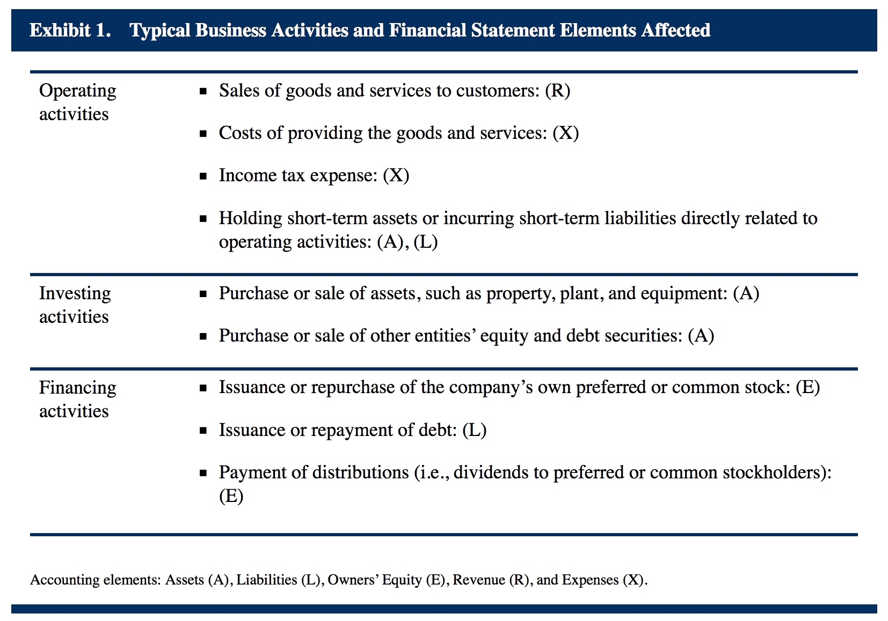
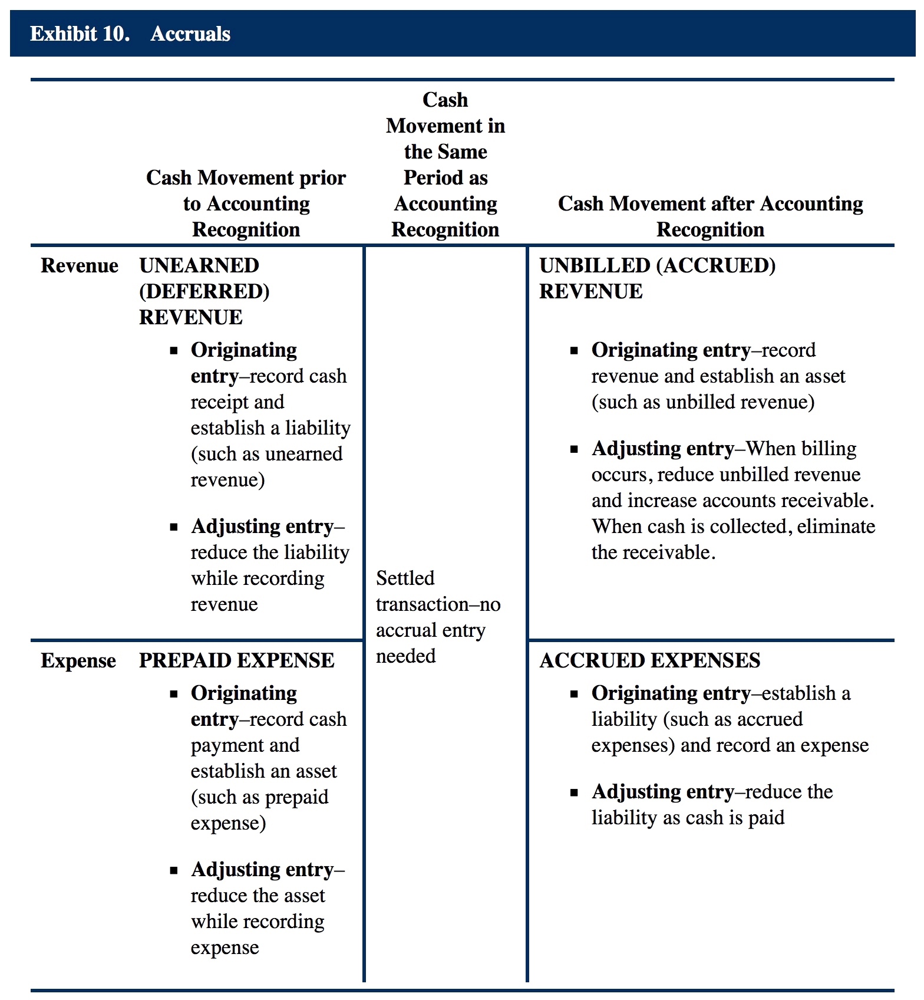
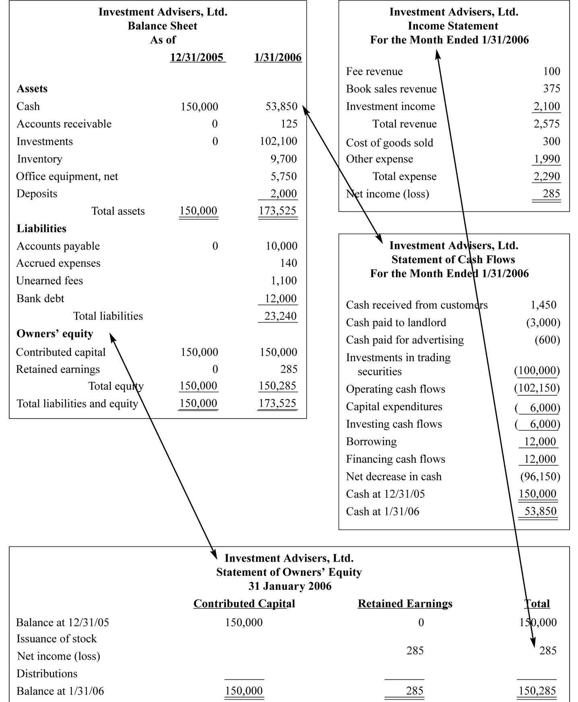
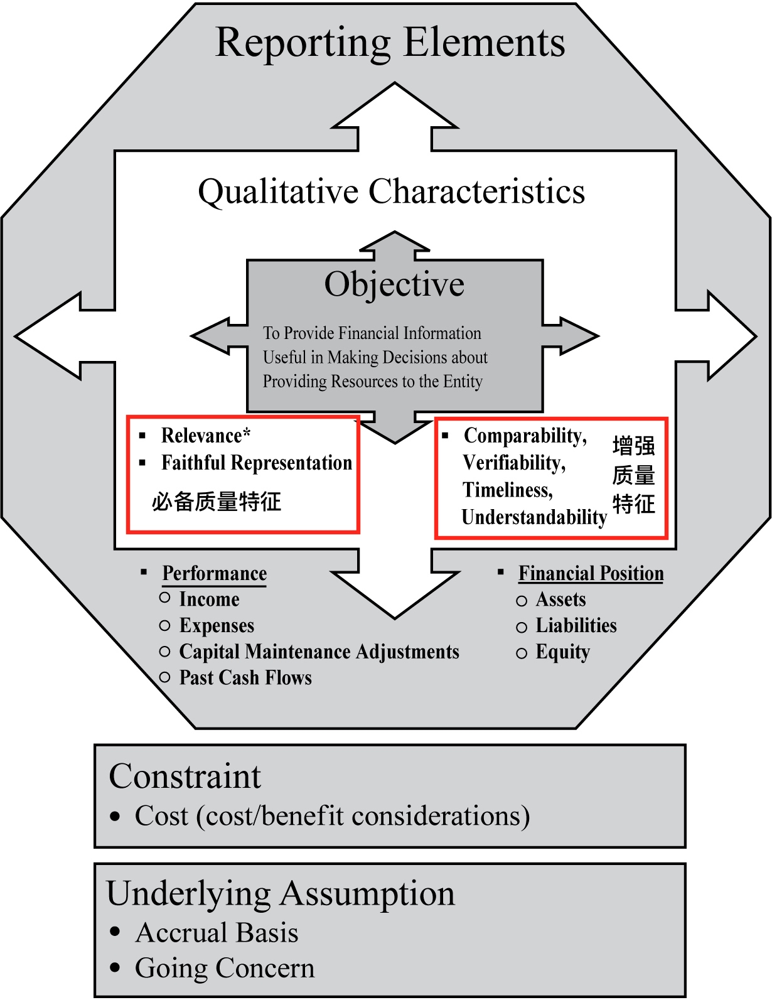
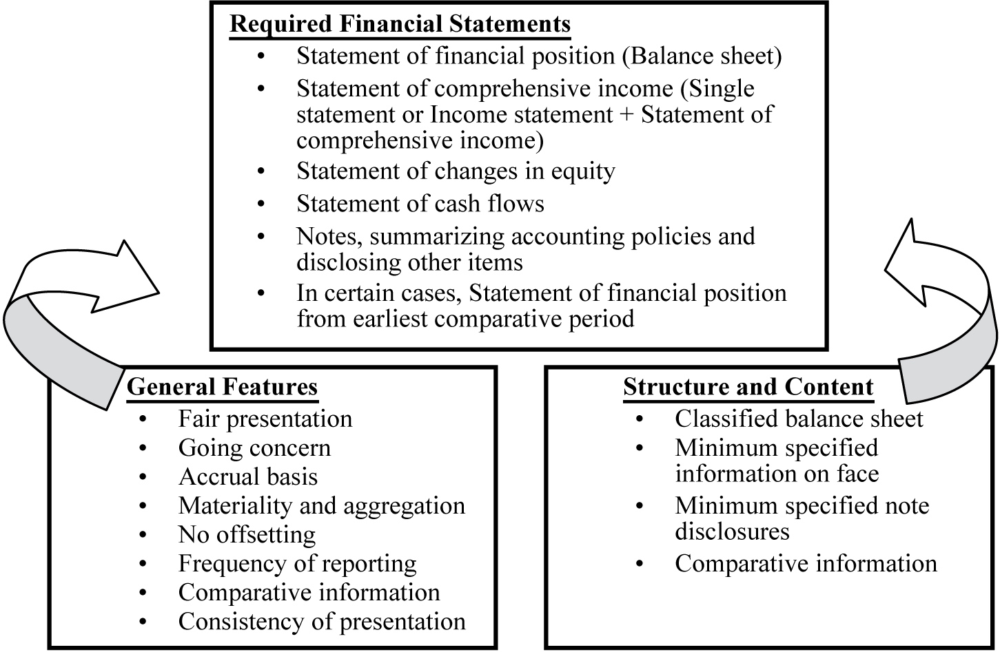

# (PART) 财务报表分析 {#fra .unnumbered}

# 内容简介 {#fra-intro .unnumbered}

了解财务报表的基本组成部分，以及财务报表中各账户的含义，能够分析会计方法的选取对财务报表以及财务报表比率所造成的相应影响，能够结合相关披露信息对财务报表进行分析和解释，能够对财务报表的质量进行评估。


# 财报分析基础知识 {#fra-basics}

## 财务报告以及财报分析的角色

- The role of financial reporting by companies is to provide information about a company’s performance, financial position, and changes in financial position that is useful to a wide range of users in making economic decisions.

- The role of financial statement analysis is to use financial reports prepared by companies, combined with other information, to evaluate the past, current, and potential performance and financial position of a company for the purpose of making investment, credit, and other economic decisions.

在财报分析中需要注意：

- 满足短期责任的能力成为流动性(liquidity)，满足长期责任的能力成为偿付能力(solvency)。
- 当前时间段的现金流并不能代表当前时间段的表现。

完整的Financial Statements包括如下几部分：

- **Statement of Financial Position**: 资产负债表，Balance Sheet；
- **Statement of Comprehensive Income**: a single statement of comprehensive income 或者 an income statement and a statement of comprehensive income；
- **Statement of Changes in Equity**: Provides additional information regarding the changes in a company’s financial position;
- **Statement of Cash Flows**;
- **Financial Notes and Supplementary Schedules**: The notes disclose the basis of preparation for the financial statements.The notes also disclose information about the accounting policies, methods, and estimates used to prepare the financial statements. **A company’s significant accounting choices (policies, methods, and estimates) must be discussed in the notes to the financial statements.**
- **Management’s Commentary**: Inclusion of a management report is recommended by the International Organization of Securities Commissions and frequently required by regulatory authorities, such as the US Securities and Exchange Commission (SEC) or the UK Financial Reporting Council (FRC). The content elements include **1) the nature of the business; 2) management’s objectives and strategies; 3) the company’s significant resources, risks, and relationships; 4) results of operations; and 5) critical performance measures.**

## Types of Audit Reports

审计报告包括四种类型，分别是：Unqualified，Qualified，Adverse Audit，Disclaimer of Opinion，其中Unqualified是指财报真实并且客观，表示可以用来进行分析。

### An unqualified audit opinion

An unqualified audit opinion states that the financial statements give a “true and fair view” (international) or are “fairly presented” (international and US) in accordance with applicable accounting standards. This is often referred to as a “clean” opinion and is the one that analysts would like to see in a financial report.

### A qualified audit opinion

A qualified audit opinion is one in which there is some scope limitation or exception to accounting standards. Exceptions are described in the audit report with additional explanatory paragraphs so that the analyst can determine the importance of the exception.

### An adverse audit opinion

An adverse audit opinion is issued when an auditor determines that the financial statements materially depart from accounting standards and are not fairly presented.

### A disclaimer of opinion

A disclaimer of opinion occurs when, for some reason, such as a scope limitation, the auditors are unable to issue an opinion.

## 财报分析框架及步骤

1. 表述清楚分析的Purpose以及Context
    - Sources of Information: 需求分析调研以及Guidelines;
    - Output: 陈述分析目的，列出需要回答的问题，预期的报告内容，任务时间表以及资源预算

2. 收集输入数据
    - Sources of Information: 财务报表，调查问题，行业及经济数据，实地调研，交流考察等
    - Output: 系统整理好的财务报表的表格数据，以及调查问卷等数据

3. 处理数据Process Data
    - Sources of Information: 收集来的数据
    - Output: 调整后的财务报表，**Common-size Statement**，指标及图形；**预测**；

4. Analyze/interpret the processed data
    - Sources of Information: 收集来的数据以及处理后的数据
    - Output: 分析结果

5. Develop and communicate conclusions and recommendations
    - Sources of Information: 分析结果以及之前的分析报告，对分析报告的要求等Guideline；
    - Output: 包含步骤一所提问题的分析报告，并给出建议；

6. Follow-up
    - Sources of Information: 周期性的重复收集信息并执行以上步骤
    - Output: 更新后的报告与建议

## 商业活动的分类

主要分为经营活动、投资活动以及融资活动：

- Operating activities: 主要包括营收(Revenue or Sales)，成本Costs，所得税，以及由经营活动带来的**短期**资产或**短期**债务；
- Investing activities: 主要包括固定资产的购买或出售，如房产，厂房，或设备，购买或出售其他企业的股票或债券；
- Financing activities: 主要包括发行或回购企业自身的优先股或普通股，发行新增债务或偿还已有债务，以及Payments of Distribution(比如股票分红等)




## 财务报表条目类别及账户

### Financial Statement Elements

主要包括五大类：Assets, Liabilities, Owners’ Equity, Revenue, and Expenses. 值得注意的是，对于企业来讲，收入Income包括主营业务的营收Revenue以及非主营业务带来的资本增益Gains，费用包括主营业务的成本Expense以及非主营业务带来的资本损失Losses；

### Financial Statement Accounts

Accounts是Financial Statement Elements的子类，用来表示特定的财报条目类别的变动情况。

### Classify Accounts into Financial Statement Elements

#### 资产Assets

包括：

- 现金及其等价物；
- 应收账款；
- 预付费用；
- 存货；
- 财产，厂房及设备PPE
- 投资财产；
- 无形资产（商标，专利，许可证，版权，商誉等）
- 金融资产，证券等；
- 持股投资；
- 当前及递延所得税资产；
- **对银行来讲，贷款Loans（receivables）属于资产**

对资产Assets来讲，需要将其区分为“current assets” 和 “non-current assets”，**IFRS要求资产负债表中需要将current assets与non-current assets区分开，同时也要求将current liabilities与non-current liabilities区分开。**

- Current Assets包括：
    - Cash and cash equivalents(Cash equivalents are very liquid short-term investments, usually maturing in 90 days or less);
    - Inventories;
    - Trade and other receivables;

- Non-current Assets包括：
    - Intangible assets including goodwill;
    - Property, plant, and equipment;
    - Investment property;
    - Investments in joint ventures and associates.

#### 负债Liabilities

包括：

- 应付账款；
- Provisions or accrued liabilities
- Financial liabilities
- 当前及递延所得税负债；
- Reserves
- Unearned revenue
- Debt payable
- Bonds (payable)
- **对银行来讲，存款Deposits属于负债**

#### 股东权益 Owers‘s Equity

包括：

- Capital, such as common stock par value
- Additional paid-in capital
- Retained earnings
- **Other comprehensive income**
- **Minority interest**

#### 营收Revenue

包括：

- Revenue, sales
- Gains
- Investment income (e.g., interest and dividends)

#### 费用Expense

包括：

- Cost of goods sold
- Selling, general, and administrative expenses “SG&A” (e.g., rent, utilities, salaries, advertising)
- Depreciation and amortization
- Interest expense
- Tax expense
- Losses

## Accounting Equation

三大报表的会计等式要非常熟悉，并能够灵活运用。

### Balance Sheet

$$Assets = Liabilities + Owners’~equity$$

上式称作会计方程accounting equation或者balance sheet equation。

其中$Owners’~equity = Contributed~capital + Retained~earnings$.

### Income Statement

根据IFRS(International Financial Reporting Standards)的要求，The Statement of Comprehensive Income可以使用一个表来展示，也可以使用两个表：收入表Income Statement，以及利润表。
Income Statement中的基本关系式为：

$$Revenue + Other~income – Expenses = Income – Expenses = Net~Income~(Loss)$$

也就是收入减去花费等于纯收入。

Income Statement中报告的收入与支出**包含所控制子公司(控股超过一半就将子公司收入的百分百计入)的收入与支出**。

### Statement of retained earnings

$$Ending~Retained~Earnings = Beginning~Retained~Earnings + Net~Income - Dividends$$

$$Assets = Liabilities + Contributed~capital + Ending~Retained~Earnings$$

$$Assets = Liabilities + Contributed~capital + Beginning~Retained~Earnings + Net~Income - Dividends$$

## Accruals and Valuation Adjustments

当商业活动的现金流入与流出与其相应的营收及费用不在同一个时间段内，或者资产和负债的价值发生变化的时候，需要采用合适的方法对其进行处理，包括两类方法：Accruals和Valuation Adjustment。

**Accrual accounting requires that revenue be recorded when earned and that expenses be recorded when incurred, irrespective of when the related cash movements occur.**



Valuation Adjustment是为了对资产负债表上的资产及负债的价值进行调整，从而使其反映其市场价值，而非历史成本。但是需要注意的是，会计准则并不要求所有资产及负债都按照当前市场价值进行报告，比如某些资产(如trading securities)是按照当前市场价值报告在资产负债表中，并将其市场价值的变化记录在收入表中，而某些资产(比如specific classes of investment securities being held to maturity)则是报告的历史价值，还有一些资产(比如a particular class of investment securities)是按照当前市场价值记录在资产负债表中，但是其市场价值的变化则绕过了收入表直接记录在股东权益的Other Comprehensive Income条目下。

## 几大报表之间的关系

Income Statement、Balance Sheet、Statement of Cash Flow以及Statement of Owner’s Equity之间的关系如下：




## Debit & Credits

在会计系统中，对于特定的帐目来说，其记录可以分为两类：Debit以及Credit，其中Debit Record指的是资产、费用的增加以及负债、股东权益的减少，而Credit Record指的是负债、股东权益、营收的增加以及资产的减少，所有的Debit记录汇总数额与Credit记录的汇总数额必须相等。对于会计来说，必须能够清楚区分Debit Record以及Credit Record，但是对于分析师并不做此要求。

## 财务报告系统与框架 {#financial-reporting-system}

Financial Reporting System (with an emphasis on IFRS)

### Financial Reporting Standard-Setting Bodies & Regulatory Authorities

注意区分standard-setting bodies 以及 regulatory authorities. 一般来说 standard-setting bodies设定标准准则， regulatory authorities 批准并强制实施该准则。

Standard-Setting Bodies常见的有IASB以及FASB等，是由有经验的会计师，审计师，财报用户以及学者专家等组成的私有自调节组织，Regulatory Authorities一般指各国的证监会，属于政府机构，具有管辖权。

### IFRS Framework




#### 承认准则 Recognition Criteria of Financial Statement Elements

1. it is **probable** that any future economic benefit associated with the item will flow to or from the enterprise; and
2. the item has a cost or value that can be **measured with reliability**.

要注意上述两点要求需要同时满足，并注意第一点要求中说的是**probable**。

#### 衡量方法 Measurement of Financial Statement Elements

1. 历史成本 Historical Cost，指的是购买资产时花费的成本，包括所有的购置费及安装费等准备费用，如果购买时不是使用现金付款，那么历史成本等于为了购买该资产所付出资产的Fair Value；负债的历史成本指的是该负债产生时所流入的资本；
2. 分期成本 Amortised Cost，指的是对历史成本进行amortisation，depreciation，或者depletion and/or impairment；
3. 现期成本 Current Cost，对资产来说，Current Cost指的是当前为了获得该资产或者等价资产必须要付出的现金或现金等价物，对于负债来说，Current Cost指的是**undiscounted** amount of cash or cash equivalents that would be required to settle the obligation today.
4. 变现价值 Realizable (Settlement) Value，对资产来说，变现价值指的是正常出售该资产说得到的现金或者现金等价物的价值，对负债来说，realizable value也称作settlement value，指的是the undiscounted amount of cash or cash equivalents expected to be paid to satisfy the liabilities in the normal course of business；
5. 现值 Present Value，对资产来说，其现值PV指的是正常商业活动下该资产预期的未来净现金流入的现值，对于负债来说，其现值PV指的是在正常商业活动下为了偿付该负债预期的未来净现金流出的现值；
6. 合理价值 Fair Value，指的是the amount at which an asset could be exchanged, or a liability settled, between knowledgeable, willing parties in an arm’s length transaction. This may involve either market measures or present value measures depending on the availability of information.

IASB对Financial Statements的一般要求如下：



### Effective Financial Reporting Framework的特征

包括以下三个方面：

1. 透明性 Transparency
2. 全面性 Comprehensiveness
3. 一致性 Consistency

### 建立统一财报框架的障碍

不同财报框架之间的冲突包括三个方面：

1. 估值 Valuation，由于存在大量的估值方法，因此如何选择合适的估值方法是一个难题；
2. 制定标准的手段 Standard-Setting Approach，制定标准的Approach有三类：1) Principles Based; 2) Rules Based; 3) a combination of principles and rules，也称作objectives oriented，这也是大多是框架使用的手段；
3. 衡量方法 Measurement，资产负债表表示的是某一时刻的即时状况，而现金流表表示的是某一时期的变化情况，由于二者之间是互相关联并互相影响的，因此需要统筹考虑，根据关注对象的不同可以分为“asset/liability” approach以及“revenue/expense” approach，目前主要使用的是“asset/liability” approach。


# 主要财务报表分析 {#financial-statements-analysis}

Analysis of Principal Financial Statements

## Income Statement 理解利润表

重要知识点

1. Income Statement主要展示了营收Revenue，费用Expenses以及净利润Net Income，其组成部分有：营收Revenue，销售成本Cost of Sales，销售行政费用，非经营性收入及费用，Gains and Losses，Non-recurring Items，Net Income以及EPS，如果收入表中给出了Gross Profit，称作Multi-Step Format，否则称作Single-Step Format；
2. Revenue以及Expenses是在产生的时候进行确认的，因此记录的时间节点与相应的现金流可能不一致；Recognition of Revenue when earned也是accrual accounting的一个基本原则；
3. 在特定情况下，可能会需要使用特定的Revenue Recognition方法，包括percentage of completion，completed contract，installment sales以及cost recovery；
4. Expense Recognition的基本原则是match expense to revenue(eg. ccost of sales)，或者，match expense to the time period in which it occurs(period costs such as administrative salaries)，或者，match expense to the time period of expected benefits of the expense(such as depreciation)；
5. Expense Recognition需要考虑多方面的因素，包括折旧方法，存货记录方法，对特定帐目的估计(比如坏账等)，资产的有效生命周期以及剩余价值的估计等因素，选取不同的方法或估计值不同会直接对Reported Income产生影响；
6. 为了对公司未来的earnings进行估计，最好将可持续的收入及费用与不可持续的收入及费用分开；
7. **IFRS要求公司为了有助于投资者理解公司表现，需要展示additional line items，headings and subtotals等信息，对于确定不可持续的条目要单独列出；US GAAP则明确表示两类条目必须单独列出，一个是Discontinued Operations，一个是Extraordinary items(值得注意的是，IFRS禁止将任何条目汇报为Extraordinary items)**；
8. Non-Operating Income与Operating Income要在Income Statement上分别表示；
9. Basis EPS是将净利润Net Income减去优先股分红后剩余的利润除以普通股的数量，要注意Diluted EPS的计算方法；
10. Common-Size分析是指将每一个条目都除以Sales从而表示为Sales的百分比，有助于跨时间段across time periods跨不同规模的公司across companies of different size进行比较；
11. 基于Income-Statement的盈利性指标包括毛利润率Gross Profit Margin以及净利润率Net Profit Margin；
12. Comprehensive Income包括Net Income以及Other Revenue and Expense items that are excluded from the net incomecalculation；
13. 对于所有的Realized Gains or Losses的处理方式都一样，就是将其放在Income Statement中，对于Unrealised Gains or Losses的处理要复杂一些，分为Available for Sale，Held for Trading，Held to maturity，对于Available for Sale类别的未实现收益或损失，放在Other Comprehensive Income (In Equity)

### 利润表的主要组成

利润表一般由营收Revenue开始，营收是指日常商业活动中售卖产品及服务所得或预期所得的金额，有时候会直接给出Net Revenue，净营收Net Revenue则是指从营收中剔除折扣或者估算的预期退货后剩余的部分。

在利润表的最后一行，一般是净收入Net Income，有时候称作Net Earnings或者Profit or Loss，Net Income经常被称作“bottom line”。

尽管Net Income被称作"bottom line"，但是在Net Income之后一般还会有两行，分别是Net Income中属于公司本身的部分，以及Net Income中属于minority interest(or non-controlling interest)的部分，进行这种区分的Income Statement一般是含有子公司的母公司财报，当母公司占有子公司百分之五十以上的股份时，子公司的全部营收及费用都会被包含在母公司的财报中，子公司中不属于母公司的那部分利益就是minority interest(or non-controlling interest)，这种形式的Income Statement称为Consolidation Income Statement。

Net Income中包含有Gains和Losses，其中Income这个词包含了营收Revenue以及Gains两部分，Expense这个词包含了正常商业活动中产生的费用以及Losses两部分，因此Net Income(profit or loss)可以有以下三种定义：

1. Income 减去 Expenses；或者
2. 营收Revenue加上其他收入Other Income加上资本收益Gains，再减去Expenses；或者
3. 营收Revenue加上其他收入Other Income加上资本收益Gains，再减去正常商业活动中产生的费用以及其他费用还有Losses。

上述第三种定义是最详细的定义，可以将其组合成三部分之和：

1. 营收Revenue减去正常商业活动产生中的费用；加上
2. 其他收入Other Income减去其他费用Other Expense；再加上
3. 资本增益Gains减去资本损失；

### 利润表的两种形式

Single-Step vs. Multiple-Step

### 辨别以下三种类型的项目

#### Discontinued Operations

#### Extraordinary Items

#### Unusual or Infrequent Items

### Revenue & Expense Recognition

#### 营收及费用确认的基本原则

#### Accounting for Long-term Contracts

长期合同的收入，费用及利润

#### Accounting for Installment Sales

一期付款的记账原则。

#### Accounting for Barter Transactions

易货贸易的记账原则。

#### Gross vs. Net Reporting of Revenue

### Accrual Accounting

### Converged Accounting Standards by IASB & FASB in May 2014

- Key Aspects

### Operating vs. Non-operating Components

### Earnings per Share (EPS)

#### Basic Earnings per Share

- Calculation for Simple Capital Structures

- Calculation for Complex Capital Structures

#### Diluted Earnings per Share

- Calculation for Simple Capital Structures

- Calculation for Complex Capital Structures

#### Dilutive vs. Anti-dilutive Securities

- Differences

- Implications for EPS Calculation

### Comprehensive Income

- Description

- Calculation

- Interpretation

### Other Comprehensive Income

其他类综合收益的构成，以及综合收益的计算。

- Description

- Major Types of Items

## Balance Sheets

重要知识点

资产负债表包括了企业的资产、负债以及股东权益，其中股东权益的增加来自于收入Income以及新发行的股份New Issuance，股东权益的减少可能的原因有经营损失Loss，分红，股票回购等，基于资产负债表可以分析企业的流动性、偿付性以及整体的财务状况。

1. 资产负债表需要将流动资产与非流动资产、流动负债与非流动负债进行区分，除非给出能够更好表达资产流动性Liquidity的表示方法；
2. 某些资产和负债是根据Fair Value进行衡量的，有些则是根据历史成本Historical Cost进行衡量的，Notes中一般会给出额外的信息对其进行调整；
3. 流动资产是指在一年内或者是一个经营周期内预期会被liquidated或者used up的资产，否则就划分为非流动资产，同样，流动负债是指在一年内或者是一个经营周期内预期会被settled或者paid的负债，否则就划分为非流动负债；
4. Trade Receivables，也称作account receivable，指的是已经出售的商品及服务但客户尚未支付的钱款，在记账时需要减去对坏账doubtful accounts的补贴allowance；
5. 存货的记账原则是根据成本Cost以及净变现价值Net Realizable Value中较小的值进行记录，如果净变现价值Net Realizable Value低于存货当前的carrying amount，必须对存货的价值进行write down，并把write down的金额记录为费用Expense；
6. **存货的成本Cost可以使用Specific Identification，FIFO，或者Weighted Average Cost进行估算，US GAAP额外允许使用LIFO的方法，但是IFRS并不允许使用LIFO；**
7. Accounts Payable，也称作trade payables，指的是企业已购买但是尚未付款给供货商的服务及商品的价值；
8. Deferred Revenue，也称作unearned revenue指的是企业提前收到了客户支付的钱款，但是尚未发货或提供服务；
9. Property，Plant以及Equipment，简称PPE，指的是公司预计长期使用的有形资产，包括土地、厂房、设备、自然资源比如矿产等；
10. **IFRS允许企业基于历史成本模型Historical Cost Model或者重估值模型Revaluation Model来衡量PPE的价值，但是US GAAP只允许使用历史成本模型Historical Cost Model**；
11. Depreciation指的是对Long-Lived Assets的Cost在其有效生命周期内进行分摊的方法（土地不进行Depreciation），**IFRS要求将能够产生租金收入Rental Income或者资本收入Capital Appreciation的资产划为Investment Property，与PPE不同，IFRS允许企业基于历史成本模型Historical Cost Model或者Fair Value Model来衡量Investment Property的价值**；
11. 无形资产Intangible Assets指的是可辨别的没有物理实体的非货币资产，包括专利、许可证、商标等，对于每个无形资产，企业需要估计其生命周期是有限的还是期限不定的；
12. 对于具有有限生命周期的无形资产来说，需要进行**amortised**处理，影响因素包括amortised的方法以及有效生命周期的估计，必须至少每年对amortised的方法以及有效生命周期的估计进行reviewed，其impairment准则与PPE一致；
13. 对于具有不定期限生命周期的无形资产来说，不对其进行amortised，而是至少每年对其进行impairment test；
14. 对于企业内部产生的无形资产，IFRS要求研究阶段Research Phase的Cost必须被费用化，而在开发阶段Development Stage的Cost如果满足特定要求可以资产化，特定的要求包括technological feasibility，the ability to use or sell the resulting asset，以及the ability to complete the project；
15. Goodwill是指在企业合并时产生的无形资产，Goodwill不能被amortised，而是至少每年对其进行impairment test；
16. 对于Financial Instruments来说，其衡量方法有两种：Fair Value，以及Amortised Cost。如果按照Fair Value进行衡量，那么其价值的变化有两种记录办法：作为profit或者loss记录在income statement中，或者是绕过income statement作为other comprehensive income(loss)进行记录；
17. 典型的长期金融负债Financial Liabilities包括Loans，notes或者bonds payables，这类负债一般在资产负债表上根据amortised cost进行记录；
18. Deferred tax liabilities是由于财务报表上报告的Income与税务报表上报告的Income临时不一致所导致的；
19. 股东权益的六个组成部分包括：contributed capital，preferred shares，treasury shares，retained earnings，accumulated other comprehensive income以及non-controlling interest；the statement of changes in equity反映了一段时期内各个组成部分的变化；
20. Common-size的Balance Sheet是将各个条目厨艺总资产Total Assets表示为总资产的百分比；
21. Balance Sheet相关的财务指标包括流动性指标（ability to meet short-term obligations），以及偿付性指标(ability to meet long-term and other obligations)

### Elements of Balance Sheet

掌握Classified Balance Sheet的报告格式，并记忆具体的科目名称和含义。

#### Assets

能够辨别Current Assets以及Non-Current Assets

#### Liabilities

能够辨别Current Liabilities以及Non-Current Liabilities

#### Equity

Shareholder’s Equity的组成部分

### 不同类别的Measurement Base对Balance Sheet的影响

### 不同类别的金融资产如何在Balance Sheet中记录及其损益对Income Sheet的影响

### 使用Common-size的方法分析资产负债表

## Cash Flow Statements

$$Cash~to~income~Ratio = {Cash~flow~from~operating~activities (CFO) \over Operating~income}$$

Cash Flow Statement的条目可以分为经营性活动、投资性活动以及融资性活动，关键知识点包括以下几部分：

1. 重大的非现金交易Non-cash transaction activities会在现金流表相应的补充note中进行披露；
2. 现金流表有两种表现形式，直接形式与间接形式，直接形式是指将经营性活动部分的现金流中的Operating Cash inflows按照来源分类进行展示，将Operating Cash Outflows按照用途分类进行展示；间接形式则是指将净收入Net Income与经营性活动现金流Operaing Cash Flow进行对账，首先第一行给出Net Income，然后根据所有的非现金条目以及经营性生产资产的变化值对其进行调整，最终得到CFO；
3. 间接法使用比较广泛，分析师可以通过简单的three-step流程将其转换为直接法的现金流表；
4. Common-size的现金流表有两种计算方法，一种是基于total cash inflows/total cash outflows，一种是基于Net Revenue的百分比表示；
5. Cash FLow Statement可以用来计算Free Cash Flow to the Firm(FCFF)以及Free Cash Flow to the Equity(FCFE).
6. 需要注意的是，经营性活动也包括dealing securities或者trading securities(held-for-trading)，比如金融机构，注意将其与投资活动中的buying or selling securities进行区分，如果公司持有的证券被认为是现金等价物或者是dealing securities或者trading securities，都将其归为经营性活动，即使是在该公司不是金融类公司的情况下；
7. IFRS的规定是对应金融机构，支付或者收到的利息归类到经营活动中，对于非金融机构，IFRS规定可以将利息归类到经营活动，也可以归类到投资活动，并且股票分红可以被归类到经营活动，也可以被归类到融资活动；但是对于US GAAP来说，所有的公司都必须将利息收入及利息支出归类到经营性活动中，对于分红来讲，**收到的分红必须归类到经营性活动里**，支付的分红被许归类到融资活动中；

### Classify Cash Flow Items

现金流在IFRS以及GAAP下的分类。

CFO、CFI、CFF。

- Operating Activities

- Investing Activities

- Financing Activities

### Non-cash Investing & Financing Activities

- Reported Methods

### Preparation of Cash Flow Statements

- IFRS

- US GAAP

### Two Methods of Presenting Cash from Operating Activities

直接法和间接法计算公司的经营性现金流。

- Direct Methods

    - Steps in the Preparation

    - Compute Cash Flows using Income Statement and Balance Sheet

- Indirect Methods

    - Steps in the Preparation

    - Compute Cash Flows using Income Statement and Balance Sheet

- Arguments in favour of Direct vs. Indirect Methods

- Convert Cash Flows from Indirect to Direct Method

### 计算投资性和融资性现金流

### 自由现金流

#### Free Cash Flow to the Firm

#### Free Cash Flow to Equity

### Linkage between Cash Flow Statement & Income Statement

### Linkage between Cash Flow Statement & Balance Sheet


# 财务比率分析 {#financial-ratio}

## 重点内容概要

财务比率是对财务报表进行定量分析的有效工具，在实际应用中存在着大量的各种各样的比率，并且不同的行业也会存在一些本行业特有的比率，这些都是为了对企业的经营活动、融资活动、以及投资活动进行刻画而提出来的，本质上都是为了对企业的财务质量进行评估，因此可以按照财务质量的不同侧面对财务比率指标分为五大类，分别是：

- 活动性比率 (Activity Ratios)
- 流动性比率 (Liquidity Ratios)
- 偿付性比率 (Solvency Ratios)
- 盈利性比率 (Profitability Ratios)
- 估值比率 (Valuation Ratios)

对于每一类比率，需要掌握实际中常用的财务指标的含义和计算方法，并能够利用杜邦分析法 (Dupont Analysis) 对企业的盈利能力进行分析。

## 活动性比率

活动性比率反映的是企业对资产的使用效率，刻画了企业的经营能力，同时也能在一定程度上反映企业的流动性，其英文名称为 Activity Ratio，也可以称作 Asset Utilization Ratios 或者 Operating Efficiency Ratios。

常用的活动性比率包括：

1. 存货周转率 (Inventory Turnover)
2. 平均货物在手天数 (Days of Inventory on Hand)
3. 应收账款周转率 (Receivables Turnover)
4. 平均货款到账天数 (Days of Sales Outstanding)
5. 应付款项周转率 (Payables Turnover)
6. 平均赊账天数 (Days of Payables)
7. 生产资本周转率 (Working Capital Turnover)
8. 固定资产周转率 (Fixed Asset Turnover)
9. 总资产周转率 (Total Asset Turnover)

上述九个常用的活动性比率中，前面六个比率实际上可以看作是三组比率，其中第一个比率和第二个比率反映的是企业的存货管理能力，第三个比率和第四个比率反映的是企业在产业链中与其下游企业之间的合作关系及议价能力，第五个比率和第六个比率则反映了企业在产业链中与其上游企业之间的合作关系及议价能力。

**存货周转率与平均货物在手天数**

**存货周转率**与**平均货物在手天数**这两个指标反映的都是企业对存货的管理能力，存货周转率 (在公式中使用其英文名称 Inventory Turnover) 的计算公式为：

$$Inventory\;Turnover = {Cost\;of\;Sales \over Average\;Inventory}$$

上式中的 Cost of Sales 指的是一个完整的会计周期内卖出商品或服务的成本，Average Inventory 指的是平均存货。

平均货物在手天数 (后文简记为 DOH) 的计算公式为：一个完整的会计周期的天数 (一般为365天) 除以存货周转率，也等于平均存货（Average Inventory）除以日均销售商品的成本（Daily Cost of Sales）：

$$DOH = {Number~of~days~in~Period~(365) \over Inventory~Turnover} = {Average~Inventory\over Daily~Cost~of~Sales}$$


```{block2, type="note", echo=TRUE}
小贴士：财务比率的英文为 Financial Ratio，Ratio 的含义为比例、比率，并且大多数财务比率的计算方式都是将财务报表中的两个账目相除得到二者之间的比率，因此将 Financial Ratio 翻译为财务比率是比较合适的，对于平均货物在手天数、平均货款到账天数以及平均赊账天数等财务比率来说，其单位为天数，称其为“比率”似乎不大合适，称作指标似乎更合适一些，但是后面通过这三者的计算公式可以看出，也可以将其看作是比率，比如平均货物在手天数就可以看作是平均库存与日均售卖成本之间的比率。对于中文来讲，“指标”的含义较“比率”来说含义要更宽广一些，因此在本书中，将通过除法运算得到的结果或其衍生结果称为财务比率，而将财务报表中用于计算财务比例的账目称作财务指标，特此进行说明。
```

存货周转率相关的财务指标是卖出商品或服务的成本（Cost of Sales），应收帐款周转率相关的财务指标是营收（Revenue 或 Sales），或者是更为精确的赊销收入（Credit Sales），应付账款周转率相关的财务指标是购买量（Purchase），等于卖出商品或服务的成本（Cost of Sales）加上期末存货减去期初存货。


**应收账款周转率与平均货款到账天数**

应收账款周转率与平均货款到账天数这两个指标反映的都是企业的收款能力，应收账款周转率的计算公式为：

$$Receivables~Turnover = {Total~Revenue \over Average~Receivables}$$

如果从企业管理的角度来看，在进行企业的生产资本管理时，管理者一般能够获取营收中属于赊销部分的的具体数额（称为 Credit Sales），在这种情况下，可以利用下面的公式更精确的计算应收账款周转率：

$$Receivables~Turnover = {Credit~Sales \over Average~Receivables}$$

平均货款到账天数（后文简记为 DSO）的计算公式为：一个完整的会计周期的天数 (一般为365天) 除以应收账款周转率，也等于平均应收款（Average Receivables）除以日均营业额或日均赊销营业额（Daily Revenue or Daily Credit Sales）：

$$DSO = {Number~of~days~in~Period~(365) \over Receivables~turnover} = {Average~Receivables\over Daily~Revenue~(or~Daily~Credit~Sales)}$$

**应付款项周转率与平均赊账天数**

应付款项周转率与平均赊账天数反映的是企业的赊账能力，也可以看成是企业在其供应商面前的信誉度，应付款项周转率的计算公式为：

$$Payables~Turnover = \frac{Purchases}{Average~Payables}$$

上式中，Purchases 指的是企业的总购买量，如果该数据为未知量，可通过将销售成本加上存货的变动量计算得到：

$$Purchases = Cost~of~Sales + Ending~inventory – Beginning~inventory$$

平均赊账天数（Number of days of Payables）的计算公式为：

$$Number~of~days~of~Payables = {Number~of~days~in~Period~(365) \over Payables~turnover} = {Average~Payable \over Daily~Purchases}$$

**生产资本周转率**

生产资本周转率反映的是企业对生产资本的使用效率，其中生产资本指的是流动性资产（current assets）减去流动性负债（current liabilities），生产资本周转率的计算公式为：

$$Working~Capital~Turnover = \frac{Total~Revenue}{Average~Working~Capital}$$

**固定资产周转率**

固定资产周转率反映的是企业对固定资产的使用效率，其计算公式为：

$$Fixed~Asset~Turnover = \frac{Total~Revenue}{Average~Net~Fixed~Asset}$$

**总资产周转率**

总资产周转率反应的是企业对全部资产的使用效率，其计算公式为：

$$Total~Asset~Turnover = \frac{Total~Revenue}{Average~Total~Asset}$$

## 流动性比率

流动性比率反映的是企业的流动性强弱，可以衡量企业对风险的应对能力，也可以反映企业的偿债能力。

常用的流动性比率包括：

1. 流动比率（Current Ratio）
2. 速动比率（Quick Ratio，也称作 acid-test Ratio）
3. 现金比率（Cash Ratio）
4. 安全偿付期（Defensive Interval Ratio）
5. 现金循环周期（Cash Conversion Cycle）
6. 营业周期（Operation Cycle）
7. 现金收入比率（Cash-to-Income Ratio）

**流动比率**

$$Current~Asset \over Current~Liabilities$$

**速动比率（酸性测试比率）**

$$(Cash+Short\text{-}term~Marketable~Investment+Receivables) \over Current~Liabilities$$

**现金比率**

$$(Cash + Short\text{-}term~Marketable~Investment) \over Current~Liabilities$$

**安全偿付期**

$${Cash + Short\text{-}term~Marketable~Investment + Receivables \over Daily~Cash~Expenditures} = {Quick \over Daily~Cash~Expenditures}$$

**现金循环周期**

$$DOH + DSO - Number~of~Days~of~Payables$$

**营业周期**

现金循环周期也称作净经营周期，相应的，经营周期Operation Cycle的计算公式为：

$$Operation~Cycle = DOH + DSO$$

**现金收入比率**

$$Cash~Flow~from~Operating~Activities (CFO) \over Operating~Income$$

## 偿付性比率

偿付性比率衡量的是企业的债务与资产及股东权益之间的关系，可以用来反映企业的偿债能力以及企业存在的风险大小。

常用的偿付性比率包括：

1. 负债资产比率（Debt-to-Asset Ratio）
2. 负债资本比率（Debt-to-Capital Ratio）
3. 负债股权比率（Debt-to-Equity Ratio）
4. 财务杠杆比率（Financial Leverage Ratio）
5. 利息覆盖率（Interest Coverage）
6. 固定费用覆盖率（Fixed Charge Coverage）

**负债资产比率**

$$Total~Debt \over Total~Assets$$

**负债资本比率**

$$Total~Debt \over Total~Debt + Total~Shareholder’s~Equity$$

**负债股权比率**

$$Total~Debt \over Total~Shareholder’s~~Equity$$

**财务杠杆比率**

$$Average~Total~Asset \over Average~Total~Equity$$

**利息覆盖率**

$$EBIT \over Interest~Payments$$

**固定费用覆盖率**

- 要注意在计算Fixed Charge Coverage Ratio的时候使用的是**利息及税前收入EBIT加上租金**作为分子，利息费与租金费之和作为分母：

$$EBIT + Lease~Payment \over Interest~Payment + Lease~Payment$$

## 盈利性比率

##### Return on Sales

###### Gross Profit Margin

$$Gross~Profit \over Revenue$$

###### Operating Profit Margin

$$Operate~Income \over Revenue$$

###### Pretax Margin

$$EBT \over Revenue$$

###### Net Profit Margin

$$Net~Income \over Revenue$$

##### Return on Investment

###### Operating ROA

$$Operating~Income \over Average~Total~Assets$$

###### ROA

$$Net~Income \over Average~Total~Assets$$

###### Return on Total Capital

$$EBIT \over Long\text{-}term~and~Short\text{-}term~Debt + Equity$$

###### ROE

$$Net~Income \over Average~Total~Equity$$

###### Return on Common Equity

$$Net~Income - Preferred~Dividends \over Average~Common~Equity  $$

## Dupont 分解

\begin{equation}
\begin{split}
ROE = & ~ROA \times Financial~Leverage \\ 
= & ~\underbrace{Net~Profit~Margin\times Asset~turnover}~\times~Financial~Leverage \\ 
= & ~\underbrace{Tax~burden \times Interest~burden \times EBIT~Margin}~\times~Asset~turnover\times Financial~Leverage
\end{split}
\end{equation}

## Ratios used in Equity Analysis

股票估值中的常用指标。

## Ratios used in Credit Analysis

信用风险分析中的常用指标。


# 存货及长期资产 {#inventories-and-long-lived-assets}

Analysis of Inventories and Long-Lived Assets

## 存货

重要知识点

存货的估值方法的选取（cost formula or cost flow assumption）会对财报中的存货价值inventory carrying amounts以及销售成本cost of sales产生显著的影响，继而会对current assets，total assets，gross profit，net income等产生影响，在分析公司财报时要特别注意Notes披露的记录存货的会计准则等信息。

1. 存货的总成本包括购买成本，转化成本，以及所有为了将存货保存在当前仓库所产生的成本。**已完成存货的存储成本Storage Cost of Finished Inventory**以及**由于浪费产生的额外成本abnormal costs**一般**在它们出现的时间作为费用expense**对待；
2. IFRS允许三种存货估值的方法(cost formulas):FIFO，Weighted Average Cost，以及Specific Identification。US GAAP在允许上述三种方法的基础上还允许LIFO，LIFO在US使用的很广泛，其原因是LIFO的税收优势；
3. 存货记账系统可以是perpetual或者periodic两种类型，选用不同的记账系统可能会**在使用LIFO和Weighted Average Cost的情况下**导致cost of sales以及ending inventory的不同；
4. US GAAP规定，使用LIFO的企业必须在Financial Nots中披露LIFO Reserve的金额(或者是如果采用FIFO的话存货的金额)，此信息能够用来将LIFO下的存货及销售成本转变为FIFO下的存货及销售成本，便用分析师对不同的公司进行比较；
5. LIFO liquidation出现的情况是：当年末的存货数量小于年初的存货数量时；如果存货的单位成本逐年上升，这会产生存货相关的毛利率上升inventory-related increase in gross profits，也就是购买量小于销售量，因此销售中的一部分属于先前的存货；
6. IFRS与US GAAP都要求存货估值方法的一致性，如果企业要变更存货估值方法，该变更必须有正当理由并对财报具有追溯效力retrospective，retrospective restatement的一个特例是根据US GAAP准则的企业变更为LIFO方法；
7. **IFRS要求存货根据成本Cost和净变现价值Net Realisable Value中的较小值进行衡量，Net Realisable Value指的是在政策的商业活动中估计的售卖价格减去估计的售卖成本；US GAAP要求存货根据成本Cost和市场价值Market Value中的较小值进行衡量，市场价值的定义是当前置换成本current replacement cost，其上界是净变现价值Net Realisable Value，下界是净变现价值Net Realisable Value减去正常利润；**
8. I**FRS允许对previous write-downs进行Reversals，但是US GAAP不允许对previous write-downs进行Reversals；**
9. 评估企业存货管理的有用指标包括inventory turnover ratio，numbers of days of inventory ratio，以及gross profit margin ratio；
10. 存货管理可能会对企业的activity ratio，liquidity ratio，profitability ratio，solvency ratio产生显著的影响，因此在分析时对行业趋势（价格上升还是下降）以及管理层意图（管理层可以选用不同的存货记账方法）的把握至关重要；

### Including Costs in Inventories or Recognising Costs as Expense in the Period in which they are Incurred

辨析生产周期中哪些费用可以资本化为存货，哪些费用只能费用化。

### Different Inventory Valuation Methods

存货的计量方法共有四种，分别是：

- FIFO
- LIFO
- Weighted Average Cost
- Specific Identification

理解存货的四种计量方法，重点辨析FIFO和LIFO。

**搞清楚LIFO Reserve 与 LIFO Liquidation的含义**

Under FIFO, total assets increase by the LIFO reserve but decrease by the cash paid for the cumulative amount of additional income taxes that would arise. Net income will be higher under FIFO as a result of lower COGS—that is, the increase in the LIFO reserve—but will be reduced by the taxes paid on the increase in operating profit.

    - LIFO Reserve

    - LIFO Liquidation

#### Convert LIFO to FIFO

调整LIFO为FIFO时，所需要的信息披露有哪些，以及如何进行调整。

### Perpetual vs. Periodic Inventory Systems

理解Perpetual和Periodic假设的不同含义。

### Inflation & Deflation of Inventory Costs

理解通货膨胀以及通货紧缩对存货的影响。

### Measurement of Inventory

存货的估算方法

- The Lower of Cost and Net Realisable Value

- Implications of Valuing Inventory at Net Realisable Value

### Financial Statement Presentation and Disclosures Relating to Inventories

### 存货分析需要考虑的问题

## 长期资产

重要知识点

Long-Lived Assets可以基于成本模型Cost Model以及重估值模型Revaluation Model进行记账。成本模型Cost Model指的是将历史成本Historical Cost减去累计折旧或累计分摊accumulated depreciation(amortisation)，再减去任何出现的impairment；重估值模型Revaluation Model是基于Fair Value进行记账。**IFRS允许使用成本模型或者重估值模型，但是US GAAP只允许使用成本模型。** 大多数基于IFRS报告的企业也都选用的是成本模型Cost Model，在成本模型中对折旧或者分期的不同处理方法会对分析不同企业的财报带来很大的挑战。

1. 要注意区分资产化与费用化，一般来说，与Long-Lived Assets相关的费用如果预期能够在大于一年的期限内提供回报，就将其作为Long-Lived Assets的成本的一部分进行资产化，否则，就将其在产生的时候费用化；
2. 资产化相对于费用化能够在初始年份提供较高的盈利指标Higher Reported Profitability，但是在随后的年份会导致较低的盈利性指标，但是需要注意的是，如果企业持续不断的每年都购买或者增加相应的资产，那么资产化的盈利增强效应也将持续；
3. 资产化相对于费用化能够提高Cash From Operations，这是由于资产化的这部分开支记录在了investing cash outflow中，而没有记录在operating cash outflows中；
4. 对于需要长期准备才能使用的资产（购买或建造），相应的利息费用interest costs必须资产化；
5. 在计算interest coverage ratios的时候，考虑将资产化的利息参与计算能够更好的衡量企业的偿付性；
6. **IFRS要求研究费用Research Costs必须费用化，但是允许将满足特定条件的所有的开发费用Development Costs(not only software development costs)资产化；US GAAP要求将研究及开发费用Research and Development Costs都费用化，但是，与软件开发的特定费用Certain Costs Related to Software Development需要资产化；**
7. 在企业并购时，被收购企业的资产及负债都是按照fair value进行核算的，如果收购价格超过了资产及负债的总和，超出的部分记作goodwill；
8. 对于长期有形资产Long-Lived Tangible Assets以及具有有限生命周期的无形资产intangible assets with finite useful lives，其资产化的成本会在其生命周期内作为费用进行分配，对于有形资产来说，该分配称作折旧depreciation，对于无形资产来说，称之为分摊amortization；当市场环境发生变化时，如果有迹象表明资产的携带价值Carrying Amount有可能难以recoverable，此时需要对其reviewed进行impairment；
9. 对于具有不确定生命周期的无形资产来说，不需要进行分摊，但是要每年对其进行reviewed for impairment；
10. 折旧及分摊费用的计算方法包括straight-line method，accelerated methods，以及units-of-production method，**其中straight-line method与units-of-production method计算的时候要减去资产的剩余价值，而accelerated methods在计算的时候不减去资产的剩余价值**；在计算过程中需要估计有效生命周期以及预期剩余价值，这两个估计值会影响每年的分摊或者折旧费用；
11. IFRS允许使用成本模型或者重估值模型，但是US GAAP只允许使用成本模型，而不允许使用重估值模型Revaluation Model
12. 重估值模型Revaluation Model确定carrying amounts的方法是将重估值日期时的Fair Value减去随后的累积折旧或累计分摊；
13. impairment chagres反映的是资产的fair value由于市场状况下降到低于其当前携带价值carrying amount时，所进行的调整；IFRS允许对impairment losses进行reversed，并将reversal报告为利润profit，但是US GAAP不允许对impairment losses进行reversed；
14. 出售Long-Lived Assets获得的Gain或者Loss的计算方法是将出售所得到的数额sales proceeds减去出售时该资产的携带价值carrying amount；
15. 对企业资产的平均年龄average age以及剩余使用年限remaining useful life的估计反映了资产的历史成本及折旧数额之间的关系；
16. 企业资产的平均剩余使用年限的估计分发是将Net PPE除以折旧费用depreciation expense，尽管accounting useful life与economic useful life并不一定相等；
17. 如果将Long-Lived Assets重新归类为held for sale，需要对其停止折旧或分摊，如果Long-Lived Assets的预期处置方案不是卖掉，而是其他处置方案（比如废弃abandonment，交换exchange for another asset，或者送给分公司distribution to owners in a spin-off)，就将其在处置之前归类为held for use，并且在处置之前继续进行折旧并且tested for impairment；
18. Investment Property的定义是为了获取资金收入或者资本升值而持有的财产，或者在某些情况下也包括金融租赁；
19. IFRS允许企业使用Cost Model或者Fair Value Model对Investment Property进行估值，其Cost Model与PPE的Cost Model相同，但是Fair Value Model与PPE的revaluation model不同。如果使用Fair Value Model，Investment Property的fair value的所有变化都会影响净利润net income；
20. Under US GAAP，Investment Property一般使用Cost Model进行衡量；
21. 租约可以分为两类：经营性租赁与融资性租赁。US GAAP指定了四种标准来确定是否将给定的租约划分为融资性租赁，IFRS对划分的标准规定较少；
22. 当承租人将租约报告为经营性租赁而不是融资性租赁时，会在租约的早期展示出更好的盈利性，在后期展示出较差的盈利性，但是在整个租约期间的杠杆率都会比较低；
23. 当出租人将租约报告为融资性租赁而不是经营性租赁时，会在租约的早期展示出更好的盈利性。

### Capitalised vs. Expensed

资本化和费用化的会计处理对资产负债表，利润表、现金流表，以及相应财务比率的影响。

**Distinguish based on the Period in which they are Incurred**

### Different types of Intangible Assets

无形资产的三种类型有：

- Purchased
- Internally Developed
- Acquired in a Business Combination

### Depreciation Methods for Property, Plant and Equipment (PPE)

固定资产的三种折旧方法，及其对财务报表的影响。

- Methods

- Assumptions

    - Useful Life

    - Residual Value

- Calculation of Depreciation Expense

### Amortisation Methods for Intangible Assets with Finite Useful Lives

对无形资产的分期方法。

固定资产称为折旧Depreciation，无形资产称为分期Amortisation

- Methods

- Assumptions

    - Useful Life

    - Residual Value

- Calculation of Amortisation Expense

- Effect of Choice of Method and Assumptions on Amortisation Expense, Financial Statement and Ratios

### Revaluation Model

IFRS下Revaluation model对于减值转回的特殊处理；

### Impairment of PPE and Intangible Assets

记忆GAAP&IFRS下如何做减值测试以及减值损失的计量；

### Derecognition of PPE and Intangible Assets

### Fair Value Model

IFRS下投资性房地产在Fair value model下的特殊处理方法。

### Evaluate how Impairment, Revaluation, and Derecognition affect Financial Statements and Ratios

### Financial Statement Presentation and Disclosures Relating to PPE and Intangible Assets

### Investment Property vs. PPE

Available-for-sale securities are carried at market value, whereas held-to-maturity securities are carried at amortized cost. If an investment is reclassified as available for sale at the end of the current year, the carrying amount should be adjusted to its market value.

### Leasing vs. Purchasing Assets

- Effect on Financial Statements and Ratios

### Finance Leases vs. Operating Leases

- From the Perspective of the Lessor

- From the Perspective of the Lessee


# 非流动负债 {#non-current-liabilities}

非流动负债 (Non-Current Liabilities)，也称作长期负债 (Long-Term Liabilities)，是资产负债表上的重要会计科目，长期负债占总资产的比例以及长期负债的组成会对企业的风险产生影响，并对企业的发展壮大具有至关重要的作用，因此需要对其仔细而认真的分析。

辨析债券在发行过程中对三大报表的影响。

重要知识点

非流动负债的来源时不同的融资手段以及不同类型的借贷人。Bonds时通过债券市场融资的主要手段，Bonds一般首先根据发行时的Fair Value进行估值，然后企业可以选择使用Fair Value或者Amortised Cost对其进行记账。

**对于在发行债券的过程中删除的相关费用，IFRS规定将其包含到该债券对应的负债liability中，US GAAP规定将其记录为资产并在债券的生命周期内作为相应的费用进行均摊amortised。相应的现金流记录到融资活动中。**

租约Leases可以看作是一种特殊的资产，在融资性租赁中，承租人lessee大体上承担了拥有所租赁资产所带来的全部风险及收益，因此lessee应该将其作为资产asset以及相应的债务obligation进行记账，此时出租人lessor会撤销该资产并相应的记录a lease receivable；在经营性租赁中，承租人lessee拥有在租期内使用所租赁资产的权利，但是所租赁资产所带来的风险及收益基本上没有转移，因此出租人lessor并不需要撤销该资产，而是将租金收入作为lease(rent) income进行记账，相应的承租人lessee记录相应的租金费用lease(rent) expense。

Pensions以及其他的退休后福利是企业对员工的额外补偿，如果企业使用defined contribution plans，企业会将其需要支付的部分作为费用expense进行记录，而defined benefits plans则指的是企业同意未来支付员工规定好的福利。

1. 发行债券所得到的资金sales proceeds of a bond issue是将未来现金流按照市场利率计算得到的发行时间的现值，所记录的利息费用是基于有效利率effective interest rate进行计算的；
2. 当市场利率与coupon rate相等时，bonds会sell at par，当市场利率大于coupon rate时，bonds会sell at a discount，当市场利率小于coupon rate时，bonds会sells at a premium；
3. 债券的发行方需要将发行的折扣discount或发行溢价premium在债券的整个生命周期进行分摊amortised；
4. 如果企业在债券到期前赎回了债券，那么需要reports a gain or loss on debt，其计算方法是将债券的net carrying amount(including bond issuance costs under IFRS)减去赎回债券所需要的金额；
5. Bonds的carrying amount一般是根据分摊历史成本amortised historical cost进行估算的，可能会与其fair value存在差异；
6. 企业可以披露包括债务debt的金融负债的fair value，尽管允许这样做，但是很少的公司会选择在资产负债表上按照debt的fair value进行报告；
7. 会计准则要求租约leases被归类为经营性租赁或者融资性租赁，当所租赁资产的风险及合法权益大部分转移给承租人lessee的时候，将其归类为融资性租赁；
8. 当承租人将租约报告为经营性租赁而不是融资性租赁时，会在租约的早期展示出更好的盈利性，在后期展示出较差的盈利性，但是在整个租约期间的杠杆率都会比较低，因而在整个租期都会展示出更好的偿付性；
9. 当出租人将租约报告为融资性租赁而不是经营性租赁时，会在租约的早期展示出更好的盈利性。
10. 在融资性租赁中，当租金数额的现值present value of lease payments等于所租赁资产的carrying amount时，出租人lessor仅赚取了利息营收earns only interest revenue；当租金数额的现值大于(小于)所租赁资产的carrying amount时，出租人lessor除了赚取利息营收之外还通过出售该资产得到了利润profit(or loss) on the sale of the leased asset；
11. Pension Plans包括两种类型，defined contribution plans以及defined benefit plans。对于defined contribution plans，the amount of contribution into the plan是提前确定的，退休员工未来能够领取的退休金取决于该资产的表现，员工承担该计划的投资风险；对于defined benefit plans，退休员工未来领取的退休金数额是提前规定好的，通常根据benefit formula计算得到，企业承担该计划的投资风险；在defined contribution plans中，企业投入的资金作为pension expense进行记录；IFRS以及US GAAP都要求企业必须将defined benefit pension obligation与pension asset之间的差异在资产负债表上作为资产或者负债进行披露；
12. IFRS要求企业将defined benefit plan的净资产或净负债的变化作为相应期间的成本Cost进行记录。引起变化的条目可以分为三类：服务费用service cost、利息费用或收入interest expense or income、以及重新核算remeasurements。其中服务费用以及利息费用或收入记录为profit或loss，重新核算引起的变化记录在other comprehensive income中；
13. US GAAP也要求企业将defined benefit plan的净资产或净负债的变化作为相应期间的成本Cost进行记录。但是将引起变化的条目细分为了五个部分：当前的服务成本current service cost、初始养老金负债的利息费用interest expense on the beginning pension obligation、计划所含资产的预期回报expected return on plan assets、过去的服务费用past service costs、以及精算的收益或损失actuarial gains and losses。其中前三个部分记录为profit或loss，后面两个部分记录在other comprehensive income中；
14. 偿付性solvency表示的是企业支付其长期欠款的能力，评估偿付性的杠杆指标leverage ratios关注的是资产负债表上债务融资相对于股权融资的比例；评估偿付性的coverage ratios关注的是收入表及现金流表的相关信息，评估的是企业支付利息费用的能力。
15. 在计算Interest Coverage的时候使用的是EBIT，也就是在扣除利息费用和税费之前的收入，因此如果给的是净利润，需要将净利润加上利息费用和税费得到EBIT，然后再进行计算。
16. 在发行债券的过程中所产生的花费如何进行处理。

## Determine Some Key Factors of Bonds

- Initial Recognition

- Initial Measurement

- Subsequent Measurement

## Effective Interest Method

## Calculation of Interest Expense

## Amortisation of Bond Discounts/Premiums

## Interest Payments

## Derecognition of Debt

了解公司债的核销在会计报表上的相应处理；

## Debt Covenants

## Financial Statement Presentation of and Disclosures Relating to Debt

## Motivations for Leasing Assets instead of Purchasing

## Finance Lease vs. Operating Lease

辨析融资性租赁和经营性租赁；

- From the Perspectives of the Lessor

- From the Perspectives of the Lessee

- Compare Disclosures relating to Finance and Operating Leases

### Determine Some Key Factors of Finance Leases

- Initial Recognition

- Initial Measurement

- Subsequent Measurement

了解融资性租赁和经营性租赁对于不同的财务表以及财务比率的影响；

了解Sales type lease以及Direct financing lease对于不同的财务表以及财务比率的影响；

## Defined Contribution & Defined Benefit Pension Plans


# 账外资产与负债 {#off-balance-sheet}

Analysis of Off-Balance-Sheet Assets and Liabilities


# 企业间投资 {#inter-corporate-analysis}

## 重点内容概要

- 掌握企业间投资的几种类别及其分类标准；
- 掌握对不同类别的企业间投资的会计处理方法，重点从三个方面考虑：
    - 一是初始资产价值的确认；
    - 二是资产收益的处理方法；
    - 三是资产价值变动的处理方法；
- 注意不同的会计准则对企业间投资在分类、评估以及披露方面存在的差异；
- 能够分析不同的会计处理方法对财报条目及财务比率的影响。

## 企业间投资的分类

企业间投资 (Intercorporate Investments) 指的是投资企业（Investor）通过购买被投资企业（Investee）的股票和债券等金融资产以预期获取收益，或者通过联营企业与合资公司的方式开辟新的市场，又或者通过企业并购的方式的扩大企业规模的行为。

根据投资企业对被投资企业的实际控制权，可以将企业间投资分为三种类型：

1. 金融资产投资 (Investments in Financial Assets): 当投资企业对被投资企业没有明显的影响力划分为此类别，此时投资企业持有的被投资企业的所有权一般在 20% 以内；
2. 联营企业与合资企业 (Investments in Associates and Joint Venture): 联营企业指的是投资企业对被投资企业在经营层面有明显的影响，但并没有控制被投资企业，此时投资企业持有的被投资企业的所有权一般在 20% 至 50% 之间，合资企业指的是两个或多个实体对企业共同享有控制权；
3. 企业并购 (Business Combinations): 指投资企业对被投资企业的经营具有实际的控制权，也就是常见的兼并与收购，此时投资企业持有的被投资企业的所有权一般在 50% 以上。对于企业并购来说，根据并购之后企业组织形式的不同，还可以进一步对其划分为兼并（Merger），收购（Acquisition）以及合并（Consolidation）。

需要注意的是，在实际应用中，所有权比例的大小可以作为对企业间投资进行分类的参考规则，但是实际的划分标准取决于投资企业对被投资企业的实际影像力或控制权。

对企业间投资的分类方法及相应的会计处理方法如下表所示：

```{r}
library(magrittr)
tibble::tribble(
  ~类别, ~所有权比例, ~对被投资公司的影响力,
  "金融资产投资", "一般小于 20%", "无显著影响力",
  "联营企业投资", "一般在 20% 至 50% 之间", "能够施加一定的影响",
  "企业并购", "一般大于 50%", "能够控制被投资企业"
) %>% knitr::kable(caption = "企业间投资的分类", booktabs = TRUE)
```

## 金融资产投资

金融资产一般认为是属于被动投资，因为在这种情况下投资企业对被投资企业并没有明显的影响力，对于金融资产的会计处理，IFRS 与 US GAAP 的会计处理要求基本类似，仅存在细微的差别，此外对于属于金融资产类别的投资，现行的 IFRS 准则（IAS39）与新的 IFRS 9 准则之间存在较大的差异，需要注意二者之间的差别。

金融资产在获得时需要在投资企业的资产负债表中需要基于其成本（也就是购买时该金融资产的公允价值）进行记录，之后由该金融资产所带来的任何分红或者利息收入都直接在投资企业的利润表中进行记录，但是，如果金融资产的公允价值发生了变化，那么对其进行会计处理的方法就取决于持有该金融资产的意图，按照持有意图的不同可以将金融资产分为三类：

1. 持有至到期类金融资产（Held to Maturity，简称 HTM）；
2. 以公允价值经损益表入账类金融资产（Fair Value through Profit or Loss，简称 FVPL），此类金融资产包括两种，分别是交易性金融资产（Held for Trading，简称 HFT），以及指定以公允价值记录的金融资产（Specifically Designated as through Profit or Loss by Management）；
3. 可售金融资产（Available for Sale，简称 AFS）

除了以上三类金融资产之外，还有一类特殊的金融资产需要考虑，也就是借款和应收账款（Loans and Receivables）。 IFRS 规定在一般情况下，借款和应收账款在资产负债表上按照其分期成本进行记录（Amortized Cost），除非其被指定为以公允价值进行记录的金融资产或者被分类为可售金融资产。 US GAAP 的规定是按照其法律形式将借款和应收账款分为交易性金融资产、可售金融资产、或者持有至到期类金融资产，其中划分为交易性金融资产和可售金融资产的借款和应收账款按照公允价值进行记录，而划分为持有至到期类金融资产的借款和应收账款则按照分期成本进行记录。

### 持有至到期类金融资产

**要点总结**

- 资产负债表：
    1. 购买时：按照初始成本记录；
    2. 购买后：按照分期成本记录；
- 利润表：对每期收到的利息收入进行分期调整后记录

**主要内容**

- 持有至到期类资产无需在资产负债表中反映其公允价值的变化，因此需要满足严格的准则才可以将金融资产归为此类；
- 持有至到期类金融资产一般指债券类资产，如果名义利率小于有效利率，债券的面值会大于其公允价值，反之如果名义利率大于实际利率，债券的面值会小于其公允价值。持有至到期类金融资产在资产负债表中需要按照分期成本进行记录，分期成本的计算使用购买时该资产的有效利率，对于债券的面值与购买时其公允价值之间的差异，需要在其生命周期内进行分摊。分摊操作会影响持有至到期类金融资产在资产负债表上的账面价值；
- 如果初始成本大于债券的面值，那么此时名义利率要大于实际利率，每期收到的利息（名义利率乘以面值）需要减去分期溢价得到记录在利润表中的利息收入（账面价值，也就是分期成本，乘以购买时的实际利率），因此每期的分期溢价就等于收到的利息减去利息收入，同时期初的分期成本减去当期的分期溢价就得到了本期末下期初的分期成本；同理，如果初始成本小于债券的面值，说明此时名义利率小于实际利率，每期收到的利息需要加上分期折扣得到记录在利润表中的利息收入，此时每期的分期折扣就等于利息收入减去实际收到的利息，同时期初的分期成本加上当期的分期折扣就得到了本期末下期初的分期成本。
- 如果持有至到期类金融资产在到期前被企业出售，所得的收益或损失记录在当期利润表中，但是需要注意提前出售会带来的一系列后果。


持有至到期类的金融资产指的是具有固定或者事先确定的收益及期限的投资产品（一般指*债券*类产品），并且投资企业具有持有该资产至到期日的意图和能力，除非出现特殊情况，这类金融资产不允许在到期前被出售。

对于持有至到期类金融资产， IFRS 要求在获得该资产时按照其公允价值进行记录，US GAAP 则要求按照购买时支付的价格进行记录，大部分情况下购买资产时的公允价值与支付的价格是相等的，因此实际上二者一般是等价的。在随后的会计报告日期，IFRS 以及 US GAAP 都要求使用实际利率法（Effective Interest Rate Method）在资产负债表中记录其分期成本（Amortised Cost）[^amortised-cost]，除非有客观证据表明该金融资产需要进行减值处理。对于所持有债券的面值与购买时的公允价值之间的差异（折扣或者溢价）[^discount-premium]，则需要在债券的生命期内进行分摊。

[^discount-premium]: 如果债券的名义利率高于购买债券时的实际利率，那么购买价格会高于债券的面值，也就是存在溢价，反之购买价格会低于债券的面值，也就是存在折扣。

[^amortised-cost]: 分期成本指的是将初始成本（也就是购买价格）加上相应地分期折扣，或者减去相应地分期溢价，可以将其看作是将债券未来的现金流（包括利息以及到期面值）按照购买债券时的实际利率进行折现所得到的现值。

对折扣或溢价的分期处理不仅会影响金融资产在资产负债表的账面价值（也就是分期成本），还会对利润表产生影响，此时需要对利息收入进行调整（加上分期折扣或者减去分期溢价）后才能记录在利润表中。

注意，如果由于特殊情况，企业在到期前出售了该类金融资产，由此带来的任何收益（Gains）或亏损（Losses） 都记录在当期的利润表中。


### 以公允价值经损益表入账类金融资产

**要点总结**

- 资产负债表：
    1. 购买时：按照初始成本记录；
    2. 购买后：按照公允价值记录；
- 利润表：将公允价值变动损益与利息或分红收入一起记录在利润表中。

**主要内容**

- 包括两类资产：1）交易性金融资产；2）指定以公允价值记录的金融资产；
- 交易性金融资产按照公允价值进行记录，在每个会计期末都需要对交易性金融资产的公允价值进行重新衡量，对于公允价值变动所导致的未得损益记录在利润表中，债券的利息收入或者股票的分红收入也记录在利润表中；
- 指定以公允价值记录的金融资产的会计处理方法与交易性金融资产类似。

以公允价值经损益表入账类金融资产包括交易性金融资产以及指定以公允价值记录的金融资产两类。

**交易性金融资产**

交易性金融资产指的是准备在购买后短期内进行出售的**债券或股票**，对于此类金融资产，在资产负债表中按照其市场公允价值进行记录，并将由于公允价值变化所带来的公允价值变动损益（Unrealized Gains and Losses）在记录在利润表中，此外，债券类资产的利息收入或者股票类资产的分红收入也一并记录在利润表中。

**指定以公允价值记录的金融资产**

IFRS 以及 US GAAP 都允许企业将符合条件的金融资产人为指定以公允价值记录的金融资产，此类金融资产的会计处理方法与交易性金融资产类似，将金融资产指定为以公允价值记录的金融资产的好处是可以减少由于资产的估值方法不同所带来的资产价值不稳定以及会计记录的不一致。


### 可售金融资产

**要点总结**

- 资产负债表：
    1. 购买时：按照初始成本记录；
    2. 购买后：按照公允价值记录；
- 利润表：将利息或分红收入记录在利润表中，而将公允价值变动损益记录在其他综合性收入中

**主要内容**

- 可售金融资产在购买时按照初始公允价值进行记录，在随后的每个会计期末，需要对可售金融资产的公允价值进行重新衡量，对于公允价值变动所导致的未得损益记录在其他综合性收入中的股东权益部分，记录金额为扣税后金额；
- 对于可售金融资产，出售时需要将其累积未得损益从其他综合性收入中移到利润表中，并在利润表中记录为重分类调整损益项；
- 对于债券的利息收入或者股票的分红收入，则直接记录在利润表中。

**注意IFRS 与 US GAAP 对属于可售金融资产的债券类资产的外汇变动损益处理的细微区别。**

- IFRS 与 US GAAP 对可售金融资产的外汇变动损益的处理方法存在细微差异，产生差异的原因在于IFRS 将债券看做是货币性资产，因此对其进行了特殊的规定。
- IFRS 规定对于债券类可售金融资产，由于汇率变化引起的公允价值变动损益需要分成两部分：1）汇率变化本身所引起的损益，计算方法是将其看做是持有至到期类债券，并以外币计算分期成本，由此可以计算出分期成本的变化引起的外汇变动损益，此部分损益记录在利润表中；2）外汇变动损益的剩余部分，记录在其他综合性收入中；
- US GAAP 将所有外汇变动损益都记录在其他综合性收入中；
- IFRS 与 US GAAP 对股票类可售金融资产的规定一致，包括外汇变动损益在内的所有公允价值变动损益都记录在其他综合性收入中。


可售金融资产指的是既不属于持有至到期类金融资产，也不属于以公允价值经损益表入账类金融资产（包括股票和债券），IFRS 与 US GAAP 规定可售金融资产在购买时按照初始成本记录，在购买后按照公允价值进行记录，这与以公允价值经损益表入账类金融资产类似，不同之处在于可售金融资产的公允价值变动损益不在利润表中进行记录，而是记录在股东权益下面的其他综合性收入中（需要扣除所得税），等到该金融资产被出售之后，则需要将记录在其他综合性收入中的公允价值变动损益转移到利润表中。对于债券类资产的利息收入或者股票类资产的分红收入则直接记录在利润表中。

IFRS 与 US GAAP 对可售金融资产处理方法的不同之处在于对**债券类**资产的外汇变动损益的记录：

- IFRS 规定将划分为可售金融资产的债券的外汇变动损益分为两部分：
    1. 由于汇率的变化引起的外汇变动损益，记录在利润表中；
    2. 由于债券的公允价值发生变化引起的外汇变动损益，记录在其他综合性收入中
- US GAAP 规定将全部的外汇变动损益记录在其他综合性收入中。

对于**股票类**的可售金融资产，IFRS 与 US GAAP 都要求将包括外汇变动损益在内的全部公允价值变动损益记录在其他综合性收入中。


### 金融资产重分类

IFRS 一般禁止对**指定为以公允价值记录的金融资产**进行重分类，包括将此种类别的金融资产重新划分为其它类别以及将其它类别的金融资产重新划分为此类别，并且严格限制将**交易性金融资产**重新划分为其它类别。

持有至到期类的债券类金融资产在满足特定条件的情况下（比如持有意图发生了变化或者已经没有能力继续持有）可以被重新划分为可售金融资产[^reclassification]，此时需要重新评估该金融资产的公允价值，按照评估得到的公允价值在资产负债表中进行记录，并将其账面价值（也就是分期成本）与公允价值之间的差异记录在其他综合性收入中。

[^reclassification]: 对金融资产进行重分类会产生相应的影响，比如将持有至到期类的债券重分类为可售金融资产后，需要将现有的同类型债券都重新分类为可售金融资产，并且未来新购买的同类型债券也必须划分为可售金融资产。

属于可售金融资产的债券类资产在满足特定条件的情况下可以重分类为持有至到期类资产（比如持有意图或持有能力发生了变化），此时该债券的账面价值（也就是此时的公允价值）成为了新的分期成本，并且任何之前记录在其他综合性收入中的公允价值变动损益都使用实际利率法在债券的剩余生命周期内进行分期，而新的分期成本与到期面值之间的差异也需要使用实际利率法在债券的剩余生命周期内进行分期。

在某些情况下，对于属于交易性金融资产或可售金融资产的债券，如果企业打算在未来一段时间内持有而不出售，可能会将其重分类为借款和应收账款。

对于可售金融资产来说，如果无法得到可信的公允价值，并且没有证据表明需要对其进行减值处理，可以使用成本法进行记录，但是，一旦能够有效的衡量其公允价值，必须使用公允价值对此金融资产进行记录，并将公允价值变动损益记录在其他综合性收入中。

US GAAP 允许在正当的情况下对所有类别的金融资产进行重分类，但是注意对持有至到期类的金融资产进行重分类会影响所有类似的金融资产。

在重分类时需要对公允价值进行确定，此时公允价值变动损益的处理方法取决于该资产的初始类别：

1. 交易性金融资产重分类为可售金融资产时，任何公允价值变动损益（账面价值与重分类时的公允价值之间的差异）记录在利润表中；
2. 可售金融资产重分类为交易性金融资产时，之前记录在其他综合性收入中的累积公允价值变动损益在重分类当日记录在利润表中；
3. 持有至到期类的债券类资产重分类为可售金融资产时，重分类时的公允价值与分期成本之间的差异记录在其他综合性收入中；
4. 属于可售金融资产的债券类资产重分类为持有至到期类资产时，之前记录在其他综合性收益中的累积公允价值变动损益需要在债券的剩余生命周期内进行分析，分期方法是将其看做是折扣或者溢价对债券的利息收入进行调整。

### 金融资产的减值

**主要内容**

- 金融资产的减值主要针对的是持有至到期类资产以及可售金融资产，对于以公允价值经损益表入账类金融资产则无需进行减值测试和处理，因为其价值的下降在出现的时候已经在利润表中反映出来了；
- 对于需要进行减值处理的持有至到期的债券类资产、借款和应收账款，损失的金额指的是该资产的账面价值与其未来估算现金流的现值（使用购买时的初始实际利率进行折现）之间的差异，这部分损失可以采用两种方法进行处理，直接减小该资产的账面价值，或者使用准备金账户（Allowance Account），对于损失的数额，需要将其记录在利润表中；
- 对于需要进行减值处理的可售金融资产，需要将已经记录在其他综合性收入中的累积损失转移到利润表中，并记录为重分类调整项，调整的累积损失的数额等于获取成本（需要减去已经归还的本金以及分期利息）与当前公允价值之差并减去之前已经记录在利润表中的减值损失值；
- IFRS 允许对持有至到期类资产以及可售债券类资产的减值损失进行reversed，但是对于可售股票类资产的减值损失则不允许进行reversed；
- US GAAP 不允许对金融资产的减值损失在利润表中进行reversed，减值后的公允价值变动按照金融资产的类别进行相应的处理。


当金融资产的账面价值预期会永久的高于其可收回金额时，就需要对其进行减值处理（Impairments），对金融资产是否需要进行减值处理的评估方法叫做减值测试（Impairment Test），在金融资产的减值测试和减值处理方法，IFRS 与 US GAAP 存在关键的差异。

**IFRS**

IFRS 规定在每个会计期末都需要对账面价值与公允价值不相符的金融资产进行减值测试，如果需要进行减值处理，需要立即在利润表中进行记录，对于交易性金融资产和指定为以公允价值记录的金融资产来说，由于其公允价值变动损益已经在利润表中得到了记录，因此无需进行减值测试。

对于债券类资产，如果出现了单个或多个能够会对未来现金流产生不利影响的事件，并且对现金流的影响能够准确的进行估算，就需要对其进行减值处理，有时候尽管无法确认单个事件是否会引起减值处理，但是多个事件共同的作用可能会引起减值处理。**需要注意的事，对于预料中未来可以发生的事件所带来的预期损失，不管该事件可能发生的概率有多高，都不予以考虑**。

对于债券类资产，能够引起减值处理的客观不利事件包括：

- 债券发行人存在着明显的资金困难；
- 利息或本金支付出现了违约行为；
- 借款人出现了资金困难并且放款人由此对借款人做出了让步；
- 借款人很可能会宣告破产或进行财务重组。

如果某金融资产不再进行公开交易，这并不能作为需要进行减值处理的证据，同样，债券发行人的信用评级的下降或者股票类资产的公允价值的下降也不能单独作为需要进行减值处理的证据，但是可能与其他可用的信息一起作为需要进行减值处理的证据。

对于股票类资产，能够引起减值处理的客观不利事件包括：

- 由于技术、市场、经济或者法律环境的变化对股票的发行公司产生了难以逆转的不利影响，并且表明购买该股票的初始成本可能无法收回；
- 该股票资产的公允价值出现了显著的或长期的下跌至其初始成本以下。

对于需要进行减值处理的持有至到期的债券类资产、借款和应收账款，损失的金额指的是该资产的账面价值与其未来估算现金流的现值（使用购买时的初始实际利率进行折现）之间的差异，这部分损失可以采用两种方法进行处理，直接减小该资产的账面价值，或者使用准备金账户（Allowance Account），对于损失的数额，需要将其记录在利润表中。

如果减值处理之后由于客观的事件发生导致减值损失的数额减少（比如债券发行人的信用评级提升），此时可以对之前的减值进行


IFRS以及US GAAP要求对held-to-maturity (HTM) 以及 available-for-sale (AFS) 类别的金融资产在每个财报周期都进行评估，而对于held-for-trading and designated at fair value类别的金融资产则没有这个必要，因此其价值的下降在出现的时候已经在利润表中反映出来了。

**Under US GAAP**

*Under U.S. GAAP, a security is considered impaired if its decline in value is determined to be other than temporary. For both HTM and AFS securities, the write-down to fair value is treated as a realized loss (i.e., recognized on the income statement).*

**US GAAP — Reversals**

*A subsequent reversal of impairment losses is not allowed.*

**Under IFRS**

与US GAAP类似，IFRS也要求将impairments记录在利润表中，对债券或股票进行impairment的条件是至少one loss event has occurred，并且其对于该证券未来现金流的影响可以被estimated reliably，由于未来可能发生的事件（不管可能性大小）所预期造成的损失则不予考虑。

对债券来说，loss events可以包括利息或本金违约，可能会发生的破产或重组，concessions from the bondholders，以及or other indications of financial difficulty on the part of the issuer. 但是，**a credit rating downgrade or the lack of a liquid market for the debt are not considered to be indications of impairment in the absence of other evidence.**

对股票来说，如果股价显著下跌并低于其携带价值，或者股票发行公司所面临的商业环境发生了变化使得股票涨回其初始成本的可能性很小，就将其视作是loss events。

如果对held-to-maturity类型的证券进行了impairment，那么其携带价值carrying value就减少为其预估未来现金流的现值，**注意此时使用的折扣率是该债券发行时的有效利率**，因此carrying value与其fair value可能会不相等。

**IFRS-Reversals**

如果held-to-maturity类型的证券价值随后得到了恢复，并且是由于某个事件引起的(比如信用评级上升)，此时可以对impairment loss进行reversed.

**对于available-for-sale类型的债券，其reversal要求与held-to-maturity类型的债券一致，但是对于股票来说，不允许对其impairment loss进行reversed。**

**When analyzing a firm with investments in financial assets, it is important to separate the firm’s operating results from its investment results (e.g., interest, dividends, and gains and losses).**

**For comparison purposes, using market values for financial assets is generally preferred. Also, it is necessary to remove nonoperating assets when calculating the return on operating assets ratio.**

### IFRS 9 (New Standards)

**IFRS的新准则 IFRS 9 将从2018年1月1日起开始生效 (early adoption is allowed)**

- IFRS 9 的依据是与金融资产有关的现金流的合同特征以及管理手段，现有的 IFRS 准则则是基于投资组合的理念将金融资产进行的分类，由于现有准则在实际应用中的主观因素较多，因此已经不再适合对金融资产进行分类，新准则 IFRS 9中已经取消了可售金融资产与持有至到期类资产的说法；
- 所有金融资产在购买时都按照公允价值进行计量，在之后的会计期内金融资产的价值按照公允价值或者摊余成本二选其一进行计量；
- IFRS 9 将金融资产分为三类：1）以摊余成本计量的金融资产；2）以公允价值计量且其变动计入其他综合性收益的金融资产；3）以公允价值计量且其变动计入当期损益的金融资产；

- 债券类资产可以分为两类：以摊余成本计量，或者以公允价值计量且其变动计入当期损益；
	- 以摊余成本计量的金融资产的纳入条件：
		- （一）业务模式测试：企业管理该金融资产的业务模式是以收取合同现金流为目标；
		- （二）现金流特性测试：该金融资产的合同条款规定，在特定日期产生的现金流量，仅为对本金和以未尝付本金金额为基础的利息的支付；
		- 对于通过摊余成本计量纳入条件测试的债券类资产，也可以将其指定为以公允价值计量且其变动计入当期损益的金融资产；
- 交易型股票必须分类为以公允价值计量且其变动计入当期损益的金融资产，其他类型的股票类资产可以分为两类：以公允价值计量且其变动计入当期损益，或者以公允价值计量且其变动计入其他综合性收益，但是一旦分类，就不得改变；
- 金融衍生品分类为以公允价值计量且其变动计入当期损益的金融资产（对冲工具除外）；


IFRS 9取消了held-for-trading, available-for-sale, and held-to-maturity这三个名次，而是将金融资产分为以下三类：

- amortized cost
- fair value through profit or loss (FVPL)
- fair value through other comprehensive income (FVOCI)

**Amortized Cost (for Debt Securities Only)**

满足以下两个条件的债券按照分期成本进行会计处理：

1. Business Model Test: **Debt securities are being held to collect contractual cash flows.**
2. Cash Flow Characteristic Test: **The contractual cash flows are either principal, or interest on principal, only.**

**Fair Value Through Profit or Loss (for Debt and Equity Securities)**

对于按照IFRS原规则属于held for trading的债券，或者按照Amortized Cost处理会导致不一致的债券，可以将其归类为基于公允价值处理的类别，对于held for trading的股票，必须归为Fair Value Through Profit or Loss。

对于其他类别的股票则可以归为此类，也可以归为fair value through other comprehensive income，注意：**Once classified, the choice is irrevocable.**

**Fair Value Through OCI (for Equity Securities Only)**

**The accounting treatment under fair value through OCI is the same as under the previously used available-for-sale classification.**

Fair Value Through OCI只适用于股票类资产，其会计处理方法与按照IFRS原规则归为available-for-sale的股票的处理方法一致。

**Reclassification under IFRS 9**

- 股票类资产不允许重分类；
- 债券类资产只有在满足严格的特定条件下才可以进行重分类，如果重分类是合理的，无需对之前的会计期间的报表进行重新编制；
- 如果将以摊余成本计量的金融资产重分类为以公允价值计量且其变动计入当期损益的金融资产，重分类当日需要对金融资产的公允价值进行重新衡量，并且将收益或损失记录为当期损益；
- 如果将以公允价值计量且其变动计入当期损益的金融资产重分类为以摊余成本计量的金融资产，重分类当日的公允价值就成为了新的账面价值。


基于新规则IFRS 9：

- 对股票类资产的重分类是不允许的，因为the initial designation (FVPL or FVOCI) is irrevocable.
- 将债券从amortized cost归为FVPL(or vice versa)是允许的，但是只有在商业模式改变的情况下才可以。

*Unrecognized gains/losses on debt securities carried at amortized cost and reclassified as FVPL are recognized in the income statement. Debt securities that are reclassified out of FVPL as measured at amortized cost are transferred at fair value on the transfer date, and that fair value will become the carrying amount.*

上面的意思是说，如果将债券从amortized cost归为FVPL，那么unrecognized gains/losses需要在income statement中进行记录，如果将债券从FVPL归为amortized cost，那么需要在重归类的时候按照当时的公允价值进行转移，并将此公允价值作为携带价值。

## 联营企业投资与合资企业

联营企业投资 (Investment in Associates) 指的是所有权比例在20%到50%之间的投资，这类投资一般属于非控股投资 (Noncontrolling Investment)，但是投资者通常对被投资公司的业务经营活动具有明显的影响力，体现在以下几个方面：

- Board of directors representation. 出任董事会成员
- Involvement in policy making. 参与政策制定
- Material intercompany transactions. 实质企业间交易
- Interchange of managerial personnel. 管理层交换
- Dependence on technology. 技术设置的相互依赖

注意，所有权比例小于20%的投资也可能会对被投资公司有明显的影响力，这种情况下将该投资视为*investment in associates*，相反，对于所有权比例在20%到50%之间的投资，如果没有明显的影响力，也将其视作是属于Financial Assets的投资。

对于联营企业投资，使用股权法 (Equity Method) 进行会计处理。

合资企业 (Joint Venture) 可以有多种形式，其基本特征是两个或两个以上的企业家以合同的形式共同拥有并控制该企业，合资企业需要使用股权法处理；只有在极特殊的情况下才允许使用按比例合并法 (Proportionate Consolidation)，按比例合并法要求将合资企业中属于投资企业相应比例的资产、负债、收入、费用逐条列出，而股权法则只需要在利润表中添加单独的一行列出相应比例的合资企业的利润，并在资产负债表中用单独的一行列出该投资的价值；两种方法并不会影响最终的总的净利润以及总的净资产，但是会对多种涉及到资产、负债、营收、费用等的财务比率造成较大的影响。

**股权法**

- 使用股权法处理问题时切记在计算过程中根据股权比例进行调整；
- 最初按照初始获取成本在资产负债表上进行记录，在随后的会计期内，根据被投资企业的盈利状况调整该资产的账面价值，并将相应的盈利或损失记录在利润表中，分红或者其他从被投资企业得到的收入被看做是投资资本的返还，因此需要从资产的账面价值中减去相应的量，并且不计入当期损益；
- 股权类投资在资产负债表中应该被分类为非流动资产；
- 股权类投资的账面价值以及所带来的损益必须在资产负债表和利润表中单独披露；
- 投资成本大于被投资企业相应股份的账面价值
	- 由于企业的资产和负债的账面价值大多反映的是历史成本而非公允价值，因此投资成本有可能大于被投资企业相应股份的账面价值；
	- 当投资成本超过被投资企业账面净有形资产和无形资产的相应比例时，多出来的这部分首先按照指定类别资产（公允价值大于账面价值的资产）的公允价值进行分配，然后将这些差异按照相应资产的生命周期进行摊销；这些摊销会减少投资企业资产负债表上该项投资的账面价值，并会减少利润表中该项投资所带来的投资收入；
	- IFRS 与 US GAAP 将投资成本与相应比例的可辨认净资产公允价值之间的差异作为商誉进行处理，也就是说，在将投资成本与可辨认净资产账面价值之间的差异按照指定类别的资产进行分配后，剩余的无法分配的这部分差异就作为商誉，商誉不进行摊销，而是需要定期进行减值测试，在必要的时候对其进行减值处理。需要注意商誉是隐含的包含在资产负债表中的；
- IFRS 与 US GAAP 都允许投资企业将股权类投资按照公允价值进行计量，US GAAP 允许任意类型的企业选用此方法，IFRS 仅允许特定类别的企业选用此方法，IFRS 与 US GAAP 都要求在投资开始就确定计量方法，并且不允许变更，如果选用了公允价值计量法，随后的会计期内都按照公允价值在资产负债表中进行记录，而公允价值变动带来的未得损益以及利息或分红收入都一定记录在利润表中；
- 减值测试
	- IFRS 要求当股权类投资的可收回价值永久的小于其账面价值时对其进行减值处理，US GAAP 要求当当股权类投资的公允价值永久的小于其账面价值时对其进行减值处理，减值损失记录在利润表中；
	- IFRS 以及 US GAAP 都不允许对减值损失进行 reversal；
- 联营企业间交易的处理
	- 分为上游交易与下游交易；
	- 上游交易指被投资企业出售商品或劳务给投资企业，该项交易的利润记录在被投资企业的利润表中，因此此利润中属于投资企业的相应比例的利润会被包含在投资企业利润表中的股权投资收入部分；
	- 下游交易指投资企业出售商品或劳务给被投资企业，该项交易的利润记录在投资企业的利润表中；
	- 无论是上游交易还是下游交易，如果出售的商品或劳务没有使用掉或者转移给第三方，那么由此产生的利润属于未得利润，需要在利润表中将其扣除，无论是对于上游交易还是下游交易，扣除的时候都需要注意乘以股权比例；


基于股权法，初始投资是基于成本进行记录的，并在资产负债表上表示为非流动资产。在随后的时期内，被投资公司的净利润按照股份比例计算的那部分一方面会增加投资者资产负债表上的投资账户，另一方面会在利润表上进行记录；而分红则作为从被投资公司返回的资本，因此会使投资账户减少相应的量，但是，不会记录在投资者的利润表中。

如果被投资公司出现了亏损，那么就在投资公司的资产负债表的投资账户中减去相应比例的量(亏损乘以所有权比例)，同时在投资者的利润表中的earnings也会减少相应比例的量。如果由于被投资公司的亏损使投资公司的资产负债表中相应投资账户降为了0，那么投资公司一般会停止使用Equity Method，而是进入了暂停期suspension period，一旦当被投资公司的收益超过了暂停期内没有记录的亏损时，就继续使用Equity Method。

### Fair Value Option

US GAAP准则允许使用Equity Method衡量的投资按照公允价值记录。IFRS则规定只有对于Venture Capital Firms，Mutual Funds以及类似的实体才能使用公允机制。使用公允价值的决策是不可撤回的，并且价值的任何变动都需要与分红一起记录在利润表中。

### Excess of Purchase Price Over Book Value Acquired

由于企业的大部分资产与负债都是基于历史成本记录的，因此一般来说投资的价格等于被投资公司的净资产账面价值的相应比例的机率很小，在投资当天，购买价格超过被投资公司净资产账面价值相应比例的部分首先根据被投资公司的identifiable assets and liabilities的公允价值进行按比例分配，剩余的部分则被当作是Goodwill。

In subsequent periods, the investor recognizes expense based on the excess amounts assigned to the investee’s assets and liabilities. The expense is recognized consistent with the investee’s recognition of expense. For example, the investor might recognize additional depreciation expense as a result of the fair value allocation of the purchase price to the investee’s fixed assets.

**It is important to note that the purchase price allocation to the investee’s assets and liabilities is included in the investor’s balance sheet, not the investee’s.** In addition, the additional expense that results from the assigned amounts is not recognized in the investee’s income statement. Under the equity method of accounting, the investor must adjust its balance sheet investment account and the proportionate share of the income reported from the investee for this additional expense.

**Professor’s Note: Under the equity method, the investor does not actually report the separate assets and liabilities of the investee. Rather, the investor reports the investment in one line on its balance sheet. This one-line investment account includes the proportionate share of the investee’s net assets at fair value and the goodwill.**

**Goodwill的计算**

1. 将购买价格减去净资产账面价值的相应比例(股权比例乘以净资产的账面价值)得到额外支付的购买价格excess of purchase price；
2. 求出由于资产或负债引起的额外支付的金额，对于资产是将公允价值减去账面价值后乘以股权比例，对于负债是将账面价值减去公允价值后乘以股权比例；
3. 将excess of purchase price减去由于资产或负债引起的额外支付的金额，余下的部分就是Goodwill

**Income表的处理**

对于投资公司来说，Equity Method要求在利润表中按股权比例体现被投资公司的净利润，此外，还需要扣除掉由于分配给资产部分的购买溢价所导致的额外折旧，因此总的处理分为两步：

1. 将被投资公司的净利润Net Income乘以股权比例，得到需要记录在投资公司后入表中的金额；
2. 将购买溢价中分配给资产的那部分按特定的方法折旧，这个额外的折旧费用需要从第一步得到的结果中扣除，之后就得到了该投资所带来的股权收入Equity Income；

**股权收入 = 被投资公司净利润 $\times$ 股权比例 $-$ 额外的折旧费用**

**Balance表的处理**

对于投资公司的资产负债表，需要对其投资账户进行两方面的处理：

1. 加上Income表中最后得到的股权收入；
2. 减去相应的分红金额(被投资公司的总分红金额乘以股权比例)；

**投资账户余额 = 初始余额(也计算购买价格) + 股权收入 - 总分红$\times$股权比例**

或者是根据下面的方法计算：

<center>**投资账户余额 = 股权比例 $\times$（初始净资产的账面价值 + 净利润 - 分红）$+$ unamortized excess purchase price(总的超额购买价格减去额外的折旧费用)**</center>

### Impairments of Investments in Associates

**Equity method investments must be tested for impairment.**

US GAAP规定，当投资的公允价值低于其携带价值(资产负债表上的值)，并且其价值的下降可以认为是永久的，那么就需要对该投资进行written-down to fair value，并在利润表中记录损失。

IFRS规定，Impairments需要to be evidenced by one or more loss events.

**Under both IFRS and U.S. GAAP, if there is a recovery in value in the future, the asset cannot be written-up.**

### Transactions with the Investee

当投资公司与被投资公司之间发生交易时，由交易产生的利润需要被递延，直到该利润由于use or sale to a third party而被确认。

交易可以分为两种：upstream (investee to the investor) or downstream (investor to the investee).

对于upstream类型，被投资公司会在其利润表中记录所有相关的利润，如果交易的商品尚未被投资公司使用或者售卖，那么这部分利润是未确认的unconfirmed，此时投资公司必须从被投资公司的equity income中出扣除相应的比例（由交易产生的利润乘以未确认利润的比例），当未确认部分的利润被确认的时候(使用或者卖掉)，将其记在Equity Income中。

对于downstream类型，投资公司会在其利润表中记录所有相关的利润，与upstream类型相似，投资者需要扣除掉未被确认的那部分利润（由交易产生的利润乘以未确认利益的比例乘以股权比例）。

### Analytical Issues for Investments in Associates

如果被投资公司是盈利的，并且其分红比例小于百分百，那么equity method通常会比使用accounting methods used for minority passive investments得到更高的earnings，因此分析师需要注意equity method使用被恰当的使用，比如当投资公司对被投资公司没有实际影响力时使用equity method方法。

此外，由于被投资公司的资产及负债被没有在投资公司的资产负债者中体现出来，而是简单的用一行表示了其占有被投资公司的股权的相应比例，**因此通过ignoring the investee’s debt, leverage is lower，并且margin ratios are higher since the investee’s revenues are ignored.**

最后，需要注意到被投资公司的利润在投资公司的利润表中进行了记录，但是这些利润可能并不是现金流的形式(分红)，也就是说，这些利润可能被永远的reinvested。

## 企业并购

企业并购 (Business Combination) 指的是所有权比例在50%以上的投资，这类投资一般是控股投资，此时使用收购法 (Acquisition Method) 进行会计处理。

在某些情况下，可能会出现所有权在50%以上，但是没有控制权，比如在破产或者政府干预的情况下，此时该投资不认为具有控制权，**相反的，对于所有权小于50%的投资来说，有可能具有实际的控制权，此时将其看作是Business Combination进行处理**。

IFRS并不对企业并购进行分类，但是US GAAP将企业并购基于structure of the surviving entity进行区分分为三类：

US GAAP 将企业并购分为兼并 (Merger)、收购 (Acquisition)、合并 (Consolidation)，兼并的形式为 A+B=A，收购的形式为A+B=（A+B），合并的形式为 A+B=C；兼并与合并要求取得被并购企业的全部股权，收购则不需要取得全部股权，只要能够控股即可，因此收购企业的合并财务报表中可能会产生少数股东权益项；

- 兼并Merger，指收购企业acquiring firm接管了被收购企业acquired firm的所有资产和负债，只有收购企业作为the surviving entity继续存在；
- 收购Acquisition，指both entities continue to exist in a parent-subsidiary relationship，注意当母公司拥有子公司的股权比例不足100%时，母公司需要在其consolidated financial statements报告其未拥有的部分unowned (minority or noncontrolling) interest；
- 合并Consolidation，A new entity is formed that absorbs both of the combining companies.

**主要内容**

- IFRS 与 US GAAP 都要求对企业并购采用收购法 Acquisition Method 处理；
- 2001年6月之前，US GAAP 规定满足12条严格要求的合并企业可以使用权益结合法 Pooling of Interest Method，不满足要求的使用购买法 Purchase Method；
- 权益结合法简单的将资产与负债以及留存收益按照账面价值进行合并，IFRS 下类似的规定称作 Uniting of Interests Method，允许在2004年3月之前使用；
- IFRS 以及 US GAAP 目前都不允许使用权益结合法；
- 购买法将并购看做是净资产（有形资产加无形资产减去负债）的购买，并且以公允价值计量，可折旧资产价值的增高会相应的增加折旧费用，因此，对于同样的营收，相对于权益结合法，使用购买法会得到较低的利润，因此大部分管理者倾向于使用权益结合法；
- 尽管权益结合法已经失效，但是对于在其失效之前合并的企业来说，还可以继续使用权益结合法，因此需要对其有一定的了解；
- IFRS 与 US GAAP 都要求对企业并购使用收购法（替代了购买法）进行处理；
- 收购法强调了企业并购中的三个主要问题：
	- 1. 合并后企业资产及负债的确认和计量；
	- 2. 商誉的初始确认及之后会计期的处理；
	- 3. 少数股东权益的确认和计量；
- 有形资产和负债的确认和计量
	- 基于并购时的公允价值计量
- 或有负债（Contingent Liabilities）的确认和计量
	- 如果或有负债满足两个条件：1）由于先前事件导致的现有义务；2）能够可靠计量，收购方就需要将其进行记录，对于预计会发生但是并非义务的费用，不在收购日进行记录，而是在之后费用产生的时候再进行记录；IFRS 与 US GAAP 对或有负债的确认有细微的差别，IFRS 要求或有负债的公允价值能够 reliably measured，US GAAP 要求或有负债是 Probable 的并且能够 reasonably estimated；
- 补偿性资产（Indemnification Assets）的确认和计量
	- 在收购日按照公允价值计量；
- 金融资产和金融负债的确认和计量
	- 根据对金融资产的相关规定进行处理；
- 商誉的确认和计量
	- IFRS 允许使用两种方法对商誉进行处理，分别是 partial goodwill 以及 full goodwill；
	- US GAAP 仅允许使用 full goodwill；
	- partial goodwill 是将收购成本减去收购得到的可辨认净资产（被收购企业的可辨认净资产乘以股权比例），full goodwill 是将企业看做整体将其公允价值减去可辨认净资产的公允价值；
	- full goodwill 乘以 股权比例就得到了partial goodwill ；
- 收购价格小于公允价值时的确认和计量
	- 此时该并购行为被看做是 bargain acquisition，IFRS 以及 US GAAP 都要求将其作为收益立即记录在当期损益中；
- Goodwill 的减值
	- IFRS 要求将 Goodwill 分配给 cash-generating units，然后使用单步法进行减值测试：如果cash-generating units的可收回价值小于其账面价值，就对其进行减值处理，相应的减值损失首先从分配给该cash-generating units的商誉中扣除，如果不够就将剩余部分从其他的cash-generating units中成比例扣除；
	- US GAAP 要求将 Goodwill 分配给每个 reporting units，然后使用两步法进行减值测试：1. 对比 reporting unit 含商誉在内的账面价值与其公允价值，如果账面价值超过了公允价值，那么就可能存在减值损失，进行第二步；2. 计算商誉的隐含公允价值与其账面价值之差，商誉的隐含公允价值的计算方法是将该reporting unit的公允价值减去该reporting unit的净资产的公允价值（资产的公允价值减去负债的公允价值），相应的减值损失从该reporting unit中扣除，如果商誉被扣完了，不需要对其他reporting unit的商誉进行调整，但是出于审慎的态度需要对其他的reporting unit进行减值测试；
	- IFRS 与 US GAAP 都要求将减值损失作为单独的一行在合并利润表中进行报告；


历史上，对于Business Combination的会计处理方法有两种：

1. The Purchase Method
2. The Pooling-of-Interests Method

但是，IFRS以及US GAAP以及废除了The Pooling-of-Interests Method，而是要求使用**acquisition method**（which replaces the purchase method）对Business Combination进行处理。

### The Pooling-of-Interests Method

The Pooling-of-Interests Method，在IFRS中也称作uniting-of-interests method，combined the ownership interests of the two firms and viewed the participants as equals—neither firm acquired the other.

基于The Pooling-of-Interests Method，两个公司的资产和负债被简单的合并，其关键点包括以下三个方面：

1. 基于历史账面价值进行合并The two firms are combined using historical book values；
2. 需要对之前的表进行restated，Operating results for prior periods are restated as though the two firms were always combined；
3. Ownership interests continue, and former accounting bases are maintained.

注意对于Pooling-of-Interests方法，并没有考虑公允价值，the actual price paid was suppressed from the balance sheet and income statement. 分析师需要注意transactions reported under the pooling (uniting-of-interests) method prior to 2001 (2004) may still be reported under that method.

### The Acquisition Method

基于Acquisition Method，子公司subsidiary所有的资产、负债、营收、费用都合并到母公司中，Intercompany transactions are excluded.

在母公司所拥有的子公司的股份不足100%时，有必要create a noncontrolling (minority) interest account for the proportionate share of the subsidiary’s net assets that are not owned by the parent.

#### 资产负债表的处理

将资产、负债合并，并添加minority interest项，如果母公司收购子公司使用的是现金，那么需要对其Current Asset中减去相应的量，那么这些现金去哪里了呢？答案是流向了出售股份的股东手中。

#### 利润表的处理

将营收、费用进行合并，并添加minority interest项，表示子公司净利润中不属于母公司的部分，将此项扣除掉就得到了consolidated net income。

注意，对于Equity Method与Acquisition Method，使用Acquisition Method会得到更高的营收和费用，**但是与Equity Method得到的净利润相同。**

#### Goodwill

**Full Goodwill (required under U.S. GAAP; allowed under IFRS)**

Under U.S. GAAP, goodwill is the amount by which the fair value of the subsidiary is greater than the fair value of the acquired company’s identifiable net assets (full goodwill ).

Full Goodwill是将子公司的全部股东权益的公允价值，减去子公司的净有形资产的公允价值。

**Full Goodwill=(Fair Value of Equity of Whole Subsidiary) - (Fair Value of Net Identifiable Net Assets of the Subsidiary)**

**Partial Goodwill (only allowed under IFRS)**

Under IFRS, goodwill is the excess of the purchase price over the fair value of the acquiring company’s proportion of the acquired company’s identifiable net assets (partial goodwill ).

However, IFRS permits the use of the full goodwill approach also，但是注意US GAAP不允许使用Partial Goodwill。

**Partial Goodwill = Purchase Price – (%Owned × Fair Value of Net Identifiable Assets of the Subsidiary)**

Partial Goodwill是将购买价格，减去子公司净有形资产的公允价值与股权比例的乘积。

注意，子公司的Goodwill属于无形资产，因此在计算时将其忽略。

使用Partial Goodwill得到的Goodwill比Full Goodwill的要小，由于Goodwill属于资产负债表的的资产一侧，而资产必须等于负债加股东权益，因此Full Goodwill多出的部分需要在负债或股东权益中体现出来，体现的方式是Partial Goodwill与Full Goodwill两种方式下对noncontrolling interest处理的不同，如果使用Full Goodwill，那么noncontrolling interest是基于acquired company’s fair value进行计算的，如果使用Partial Goodwill，那么noncontrolling interest是基于fair value of the acquired company’s identifiable net assets进行计算的。

也就是说，Partial Goodwill方法得到的noncontrolling interest也会比Full Goodwill方法的小，因此Full Goodwill方法得到的资产和股东权益都较高，从而导致较低的return on assets and return on equity。

**Goodwill is not amortized. Instead, it is tested for impairment at least annually. Impairment occurs when the carrying value exceeds the fair value.**

**Goodwill Impairment**

IFRS规定的testing for impairment使用a single step approach，如果the carrying amount of the cash generating unit (where the goodwill is assigned) exceeds the recoverable amount, an impairment loss is recognized.

US GAAP规定的testing for impairment包括两个步骤：

1. if the carrying value of the reporting unit (including the goodwill) exceeds the fair value of the reporting unit, an impairment exists；
2. Once it is determined the goodwill is impaired, the loss is measured as the difference between the carrying value of the goodwill and the implied fair value of the goodwill. The impairment loss is recognized in the income statement as a part of continuing operations.

**Professor’s Note: Notice that the impairment test for goodwill is based on the decline in value of the reporting unit, while the loss is based on the decline in value of the goodwill.**

*The implied fair value of the goodwill is calculated in the same manner as goodwill at the acquisition date. That is, the fair value of the reporting unit is allocated to the identifiable assets and liabilities as if they were acquired on the impairment measurement date. Any excess is considered the implied fair value of the goodwill.*

#### Bargain Purchase

In rare cases, acquisition purchase price is less than the fair value of net assets acquired. Both IFRS and U.S. GAAP require that the difference between fair value of net assets and purchase price be recognized as a gain in the income statement.

## Joint Ventures

Joint Venture指的是an entity whereby control is shared by two or more investors，IFRS以及US GAAP都要求对Joint Venture使用Equity Method。

Joint ventures are created in various legal, operating, and accounting forms and are often used to invest in foreign markets, special projects, or risky ventures.

在极端情况下，IFRS以及US GAAP允许对Joint Venture使用Proportionate Consolidation方法。**Proportionate consolidation is similar to a business acquisition, except the investor (venturer) only reports the proportionate share of the assets, liabilities, revenues, and expenses of the joint venture. Since only the proportionate share is reported, no minority owners’ interest is necessary.**

**Notice that proportionate consolidation results in higher assets and liabilities, compared to the equity method, but stockholders’ equity (or net assets) is the same.**

**Notice that proportionate consolidation results in higher revenues and expenses compared to the equity method, but net income is the same.**

## Special Purpose and Variable Interest Entities

A special purpose entity (SPE) is a legal structure created to isolate certain assets and liabilities of the sponsor. An SPE can take the form of a corporation, partnership, joint venture, or trust. The typical motivation is to reduce risk and thereby lower the cost of financing. SPEs are often structured such that the sponsor company has control over the SPE’s finances or operating activities while third parties have controlling interest in the SPE’s equity.

In the past, SPEs were often maintained off-balance-sheet, thereby enhancing the sponsor’s financial statements and ratios.

The FASB uses the term variable interest entity (VIE) to describe a special purpose entity that meets certain conditions. According to FASB ASC Topic 810, Consolidation, a VIE is an entity that has one or both of the following characteristics:

1. At-risk equity that is insufficient to finance the entity’s activities without additional financial support.
2. Equity investors that lack any one of the following:
    - Decision making rights.
    - The obligation to absorb expected losses.
    - The right to receive expected residual returns.

If an SPE is considered a VIE, it must be consolidated by the primary beneficiary. The primary beneficiary is the entity that absorbs the majority of the risks or receives the majority of the rewards.

*Professor’s Note: In a VIE, the capital source labeled as stockholders’ equity is not truly equity, as the amount is insufficient to have the risk/return characteristics of equity. Generally, in these companies, “variable interest” refers to a stake in the company (or guarantees given) by the primary beneficiary. This stake has the same economic characteristics as “normal” equity.*

The IASB continues to use the term special purpose entity. According to IFRS 10, Consolidated Financial Statements, the sponsoring entity must consolidate if it controls the SPE.

## Effect of Different Methods

There are four important effects on the balance sheet and income statement items that result from the choice of accounting method (in most situations):

1. All three methods report the same net income.
2. Equity method and proportionate consolidation report the same equity. Acquisition method equity will be higher by the amount of minority interest.
3. Assets and liabilities are highest under the acquisition method and lowest under the equity method; proportionate consolidation is in-between.
4. Revenues and expenses are highest under the acquisition method and lowest under the equity method; proportionate consolidation is in-between.


# 退休金、股票酬劳及其他员工福利 {#employee-enefits}

Analysis of Pensions, Stock Compensation, and Other Employee Benefits


# 跨国经营 {#global-operations}

## 重点内容概要


# 税 {#taxes}

Analysis of Taxes

## Income Taxes

重要知识点

对于盈利情况良好的公司来说，所得税时费用中占比明显的类别。所得税费用的分析的难点在于财务报表的记账与税务报表的记账由于时间节点的不同所导致的临时差异或者永久差异。Financial Notes中会提供有关所得税的重要补充信息。

1. 营收及费用的确认在报税for tax及做账for accounting时会存在差异，这种差异会导致taxable income与accounting profit的不同，其来源时对特定收入及开支项目的不同处理方法；
2. The tax base of an asset指的是企业在计算taxable income时作为费用扣除掉的数额，如果该资产带来的经济效益economic benefit是免税的，那么该资产的tax base等于该资产的carrying amount；
3. The tax base of an liability指的是负债liability的carrying amount减去未来会被免税的数额，比如对于提前收到的营收Revenue，该liability的tax base等于其carrying amount减去该营收中未来免税的部分；
4. Temporary Differences的来源是资产或者负债的carrying amount与tax base之间的差异，当该差异在未来某个日期预期会反转的时候，将其记录为deferred tax asset或者deferred tax liabilities；**IFRS规定所有的deferred tax liabilities都是非流动负债**；
5. Permanent Differences指的是营收或费用在报税for tax和做账for accounting时产生的差异在未来不会反转，不能记录为deferred tax asset或者deferred tax liabilities；
6. Current Taxes Payable or recoverable是基于资产负债表记录日期时的有效税率计算的，相应的，deferred taxes是根据deferred tax asset变现时或deferred tax liabilities销账时的预期税率计算的；
7. 所有的unrecognized deferred tax assets and liabilities必须在合适的日期根据其可能的预期经济效益对其重新估算；
8. Deferred tax assets必须根据其预期的价值prospective recoverability进行估算，如果该递延所得税资产很可能全部不能变现或者只能部分变现，那么必须相应的减少其carrying amount。**US GAAP使用a valuation allowance对其进行记录**。

### Accounting Profit vs. Taxable Income

区分财务报表和税务报表下与所得税相关的各类术语。

理解递延税问题产生的根源即财务和税务报表税费的暂时性差异；

计算资产端和负债端的税基和账面价值；

使用税基和账面价值的差异计算当期的递延所得税余额；

辨析常见的暂时性差异和永久性差异；

理解valuation allowance是如何基于管理层的主观判断影响净利润的。

### Key Terms

- Deferred Tax Assets & Liabilities

    - Explain how they are Created

    - Factors that Determine how they should be Treated for Financial Analysis

- Valuation Allowance

    - Definition

    - Valuation Allowance for Deferred Tax Assets

        - When it is Required

        - Impact on Financial Statements

- Taxes Payable

- Income Tax Expense

### Tax Base of Assets and Liabilities

### Calculation

- Income Tax Expense

- Income Taxes Payable

- Deferred Tax Assets

- Deferred Tax Assets

- Adjustment Related to a Change in the Income Tax Rate

### Evaluate the Impact of Tax Rate Changes

- On Financial Statements

- On Financial Ratios

### Temporary vs. Permanent Differences

- Pre-Tax Accounting Income

- Taxable Income

### Current & Deferred Tax Items

- Recognition

- Measurement

### Effective Tax Rate Reconciliation

### Income Tax Accounting under IFRS vs. US GAAP

- Key Provisions

- Differences


# 财务报告质量 {#financial-reporting-quality}

## Financial Reporting Quality vs. Quality of Reported Results

## Financial Reporting Quality

- Spectrum

## Quality of Reported Results

- Quality of Earnings

- Quality of Cash Flow

- Quality of Balance Sheet Items

## Conservative vs. Aggressive Accounting

Conservative accounting choices decrease the company’s reported performance and financial position in the current period and may increase its reported performance and financial position in later periods.

## Motivations to issue Financial Reports with Low Quality

## Conditions Conducive to issuing Low-quality or Even Fraudulent Financial Reports

## Mechanisms that Discipline Financial Reporting Quality

- Potential Limitations

## Presentation Choices that Could Influence Analysis

- non-GAAP Meansures

## Accounting Methods that Could be used to Manage Earnings, Cash Flow and Balance Sheet Items

- Choices

- Estimates

## Accounting Warning Signs

## Methods for Detecting Manipulation of Financial Reports


# 财报分析的应用 {#application-of-fsa}

Applications of Financial Statement Analysis

## Evaluate a Company’s Past Financial Performance

## Explain how a Company’s Strategy is Reflected in Past Financial Performance

## Forecast Future Net Income

## Forecast Future Cash Flow

## Role of Financial Statement Analysis in Assessing the Credit Quality

## Screening for Potential Equity Investments

## Appropriate Analyst Adjustments to Facilitate Comparison


# IFRS vs. US GAAP {#ifrs-us-gaap}

## 资产负债表

For Balance Sheet, IFRS does not specify the order of presentation of current and noncurrent assets. Under U.S. GAAP, current assets are presented before long-term assets and current liabilities before long-term ones.

### 存货

Inventories are measured at the lower of cost and net realisable value under IFRS, and the lower of cost or market under US GAAP. The cost of inventories comprises all costs of purchase, costs of conversion, and other costs incurred in bringing the inventories to their present location and condition.

### 长期资产

长期资产 (Long-Lived Assets) Under IFRS, an asset is considered to be impaired when its carrying amount exceeds its recoverable amount (the higher of fair value less cost to sell or value in use).

### 无形资产

无形资产 (Intangible Assets)

Under US GAAP, intangibles must be valued at historical cost, whereas under IFRS they can be valued at cost or revaluation.

## 利润表


