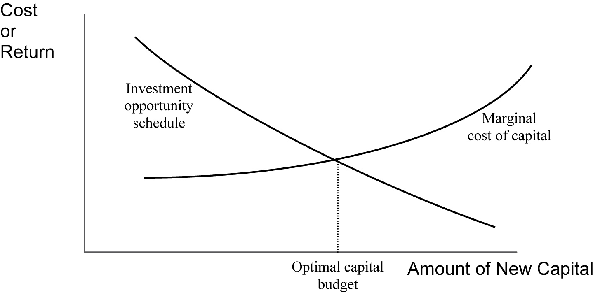

# (PART) 公司金融 {#corporate .unnumbered}

# 内容简介 {#corporate-intro .unnumbered}

# 资本投资决策 {#capital-investment-decisions}

## 重点内容概要

资本投资决策 (Capital Investment Decisions) 在商业活动中具有重要的作用，在企业进行一项投资之前，必须对待投资的项目进行严密的评估，以衡量投资行为是否有利可图，需要重点理解的内容包括资本预算 (Capital Budgeting) 以及资本成本 (Cost of Capital) 等内容。

## 资本预算基础知识

### 资本预算的主要步骤

资本预算解决的是如何将有限的资本在不同的项目上进行分配的问题。

其主要步骤如下：

1. 第一步：提出投资想法；
2. 第二步：搜集信息，对每个单独的投资项目进行分析评估；
3. 第三步：进行资本预算规划；
4. 第四步：监测及事后审查.

### 资本项目的不同种类

资本项目可以分为如下几种类别：

1. 置换项目 (Replacement Projects);
2. 扩张项目 (Expansion Projects);
3. 新建项目 (New Products and Services);
4. 监管、安全及环保类项目 (Regulatory, Safety, and Environmental Projects);
5. 其他项目，比如风险很高的研发项目。

### 资本预算中的重要概念

资本预算中的重要概念有：

- 沉没成本 (*Sunk Cost*)：，是指已经产生且无法挽回的费用，其重要含义是在进行决断的时候，应该仅考虑当前及未来的现金流，而不考虑任何已经发生且无法挽回的费用，也就是沉没成本；
- 机会成本 (*Opportunity Cost*)：又称为择一成本，或替代性成本，指在面临多方案择一决策时，被舍弃的选项中的最高价值者就是本次决策的机会成本；
- 增量现金流 (*Incremental Cash Flow*)：是指由于投资决策所带来的额外现金流，如果正确合理的估计了该投资的机会成本，那么增量现金流就给出了很好的投资理由；
- 外部影响 (*Externality*)：是指某项投资决策对外部(如公司内部其他项目，或者公司外部)的影响，比如同类相残效应 (*Cannibalization*)，其含义是待投资项目预计会从公司其他部分剥夺客户和销售额的现象；
- 常规现金流 (*Conventional Cash Flows*) 与 非常规现金流 (*Nonconventional Cash Flows*): 前者指的是现金先流出，然后流入，现金流的方向只会变化一次；后者则是指现金流的方向的变化多于一次。

此外，如果有多个投资项目可供选择，还需要考虑不同项目之间是否存在相互影响，不同项目之间的关系可以分为以下几类：

- 独立项目 (*Independent Projects*) 与 互斥项目 (*Mutually exclusive projects*)：前者是指各个项目是相互独立的，互相之间没有影响；后者则是指各个项目是相互排斥的，只能从其中选择一个项目；
- 序列项目 (*Project Sequencing*)：是指项目之间是有时间先后顺序的，因此时间上比较靠前的项目的结果会对后面的项目产生影响，或者是时间上比较靠后的项目会受到未来经济环境变化的影响；
- 无限资本 (*Unlimited funds*) 与 资本限额 (*Capital Rationing*)：前者是指资本经费是无限的，只要有合适的投资项目，总是能够筹集到相应的资金；后者则是指用于投资的资本配给量是有限的，因此如果可投资项目所需的资本大于资本的配给量，就只能从多个项目中选取出一组对公司股东回报最大的那些投资项目。

### 资本预算的基本准则

1. 基于预期的**税后现金流**[^capital-budget-cash-flow]进行决策，并且现金流的时间节点是至关重要的;
2. 考虑机会成本，而不考虑沉没成本;
3. 财务费用无需进行扣除[^financial-cost]。

[^capital-budget-cash-flow]: 注意在进行资本预算时，预估的现金流并非是净会计利润 (Accounting Net Income), 而是项目生命周期内每年的**税后经营性现金流**以及项目结束后出售或处置项目资产所带来的现金流。

[^financial-cost]: 在进行资本预算时，一般需要首先对该项目的税后现金流进行估计，然后根据此项目的要求回报率 (Required Rate of Return) 计算出其净现值，因此财务费用 (Financial Costs) 在计算净现值的折现过程中已经考虑过了，无需进行额外剔除，否则就会对财务费用进行重复计算 (Double-Counting)。

## 投资决策准则

常用的用于投资决策的准则包括：

- 净现值 (Net Present Value, NPV)
- 内部收益率 (Internal Rate of Return, IRR)
- 投资回收期 (Payback Period)
- 折现投资回收期 (Discounted Payback Period)
- 平均会计回报率 (Average Accounting Rate of Return)
- 盈利指数 (Profitability Index, PI)

### 净现值

对于大部分的资本项目来说，其现金流类型一般为常规现金流，也就是现金流出只在项目开始出现，如果将初始资金流出记为 Outlay，那么净现值 (NPV) 等于：

$$NPV = \sum_{t=1}^N {CF_t \over (1+r)^t} - Outlay$$

对于非常规现金流，可以通过更一般的式子计算净现值：

$$NPV = \sum_{t=0}^N {CF_t \over (1+r)^t}$$

上式中的$CF_t$表示每期的现金流， $CF_0$表示最初的资金流出，后续的每一笔现金流$CF_t$即可以为正 (现金流入) ，也可以为负 (现金流出)。

### 内部收益率

内部收益率就是使净现值等于0的折现率，可以通过如下的式子计算：

$$\sum_{t=0}^N {CF_t \over (1+IRR)^t} = 0$$

### 投资回收期

投资回收期就是指收回投资本金的年数，可以是小数，其缺点在于没有考虑金钱的时间价值，也就是没有考虑资本的使用成本，因此为了解决这个缺点，可以使用折现投资回收期。

### 折现投资回收期

折现投资回收期是将现金流按照资本要求回报率进行折现后的收回本金的年数，可以是小数，如果某个项目的净现值为负值，意味着永远无法收回本金，此时折现投资回收期有可能无法计算，但是有些时候尽管投资项目具有折现投资回收期，但是在折现投资回收期之后又出现了现金流出，也可能导致最终的净现值为负值。

尽管折现投资回收期考虑了金钱的时间价值，但是其并不能用来衡量投资项目的盈利能力，并且由于折现投资回收期没有考虑收回本金之后的现金流，因此具有两个显著的缺点：

1. 有时候折现投资回收期相对较长的项目有可能在后期会有显著的现金流入，从而优于折现投资回收期相对较短的投资项目；
2. 具有看似合理的折现投资回收期的项目有可能在项目后期出现显著的现金流出，从而导致项目的净现值为负值，因此具有合理的折现投资回收期的项目也有可能并不具有投资价值。

以上两个缺点限制了折现投资回收期的在实际应用中的作用。

### 平均会计回报率

平均会计回报率的计算公式为：

$$AAR = {Average~Net~Income \over Average~Book~Value}$$

由于平均会计回报率是基于会计账目进行计算的，并没有基于项目的现金流进行计算，因此具有重要的缺陷，并且平均会计回报率没有考虑金钱的时间价值，因此平均会计回报率本身并不能表明投资项目是盈利还是非盈利。

平均会计回报率的优点在于计算简单，但是在使用的时候需要特别注意其限制及不足。

### 盈利指数

盈利指数在政府部门及非营利组织中也经常被称作 "Benefit-Cost Ratio"，其计算公式为：

$$PI = {PV\;of\;Future\;Cash\;Flows \over Initial\;Investment} = 1 + {NPV \over Initial\;Investment}$$

从上面的公式可以看出，盈利指数与净现值之间具有明显的关系，当净现值为正的时候，PI大于1，该项目值得投资；净现值为负的时候，PI小于1，该项目不值得投资。

### 净现值曲线

净现值曲线 (NPV Profile) 是指特定投资项目的净现值与计算过程中使用的折现率 (Discounted Rates) 之间的关系，如下图所示：

### 净现值与内部收益率对比

对于单独的投资项目来说，净现值法与内部收益率法会给出一致的投资建议，此外，对于相互独立的具有常规现金流的项目来说，净现值法与内部收益率法也不会存在冲突，然而，对于两个互斥项目，净现值法与内部收益率法则可能会存在冲突，此时应以净现值法为准，比如下图所示的情况：

此外，在某些情况下，可能会出现存在多个内部收益率或者内部收益率无法求解的情况，但是此时项目的净现值却可能为正，因此一般来说净现值法则要优于内部收益率法，如下图所示：

### 加速折旧法 (MACRS)

由于在进行资本预算时依据的是税后现金流而非会计收入，因此在估算现金流时需要使用与报税相一致的折旧方法，世界上很多国家或地区会为报税指定可供使用的特定折旧方法，比如在美国，大多数的企业在财务报表中使用直线折旧法，但是在报税时会使用加速折旧法 (Modified Accelerated Cost Recovery System)，简称 MACRS。

MACRS 将可折旧资产大致划分为四类：三年期资产，五年前资产，七年期资产以及十年期资产[^macrs-building]，并规定了一个半年期约定 (Half-Year Convention)， 其含义指的是：假定资产是在第一年的年中准备就绪的，那么如果该资产是三年期资产，就需要在四个日历年内进行折旧(33%, 45%, 15%, 7%)，而如果是五年期资产，则需要在六个日历年内折旧(20%, 32%, 19%, 12%, 11%, 6%)，以此类推。

[^macrs-building]: 建筑物被划分为39年期资产，需要在40个日历年内进行折旧，其中第一年与最末年的折旧比例为 $1.3\%$，其他年份的折旧比例为 $100\% \div 39=2.6\%$.

MACRS 对上述各类资产具体的折旧比例进行了规定，如下表所示：

上面的表格不需要记忆，但是需要能够使用MACRS或者任何其他的加速折旧方法对增量现金流进行计算。

在对固定资产进行折旧时，折旧基准 (Depreciable Basis) 等于资产的购买价格 (Purchase Price) 加上所有的运输及安置费用 (Shipping or Handling and Installation Costs)，对于资产的剩余价值，无论是采用加速折旧法还是直线折旧法，都无需进行调整, 但是直线折旧法和加速折旧法对折旧费用的计算公式有所不同。

## 资本项目的现金流分析

### 扩张型项目的现金流分析

扩张型项目指的是通过购置新的资产扩大企业的经营活动，从而实现企业规模的扩大，并使企业盈利获得增长。

一般而言，可以将资本项目的增量现金流分为三类进行分析：

1. 初始投资现金流出 (Initial Investment Outlay)
2. 项目生命周期内的经营现金流 (Operating Cash Flow)
3. 项目结束年的处置现金流 (Terminal-year After-tax Non-Operating Cash Flows, TNOCF)

**初始投资现金流出**

初始投资现金流出 (记做 Initial Outlay) 也称作资本项目的预付成本 (Up-Front Costs)，包括两部分：

- 新添固定资产的购买价格 (包括运输与安装费用，记做 FCInv)；
- 对净生产资本的投资额 (Investment in Net Working Capital, 记做 NWCInv)；

因此初始投资现金流出的计算公式为：

$$Initial Outlay = FCInv + NWCInv$$

上式中，对净生产资本的投资 NWCInv 必须在资本预算决策中进行考虑，因为净生产资本的投资属于机会成本，净生产资本投资额的定义是**非现金流动资产的变化值与非现金流动负债 (不包含短期欠款) 的变化值之间的差异**，排除掉现金是因为现金一般不被看作是经营性资产 (Operating Asset)， 因此对净生产资本的投资 NWCInv 的计算公式为:

$$NWCInv  = \Delta NWC = \Delta Non\text{-}cash~Current~Assets - \Delta Non\text{-}debt~Current~Liabilities$$

如果净生产资本投资额 NWCInv 为正，说明项目有额外的初始现金流出，因为流动资产的净增加量来自于企业所持有现金的转化，如果 NWCInv 为负，说明项目有额外的初始现金流入，注意在项目结束的时候，企业预期能够得到与 NWCInv 相等的现金流，因此在对项目结束年的处置现金流进行估算时也需要对 NWCInv 进行考虑。

**项目生命周期内的经营性现金流**

项目生命周期内的经营性现金流具体指的是税后的增量经营性现金流:

$$CF = (S-C-D)\cdot(1-T)+D \\= (S-C)\cdot(1-T)+T\cdot D$$

其中 S 指现金销售收入，C 指现金经营成本 (Cash Operating Costs)，D 指折旧费用 (Depreciation Expense)，T 指边际税率 (Marginal Tax Rate)。

在对经营现金流进行估算时，需要理解折旧对现金流的增加作用，这是因为尽管折旧费用是非现金费用，但是折旧费用可以减少公司所支付的税费，因此可以增加经营性现金流，这称为折旧的税盾作用。

对现金流进行折旧调整的方法有两种：

- 将净利润加上折旧费用得到经营性现金流；
- 将税后毛利润 (After-tax Gross Profit, 也就是扣除折旧费用之前的毛利润扣税之后的数额) 加上由于折旧费用所节省的税费 $T\cdot D$；

一般来说，折旧费用越高，节省的税费就越多，从而能够得到更高的经营性现金流，**这就表明采用加速折旧法会比采用直线折旧法在项目初期得到更高的税后现金流，从而得到更高的项目净现值**[^financial-cost-note]。

[^financial-cost-note]: 必须注意的是，在资本预算过程中计算经营性现金流的时候无需考虑利息等财务费用，因为融资成本已经隐含在了折现率中，也就是已经考虑了资本成本，实际应用中一定要避免对财务费用进行重复考虑。

**项目结束年的处置现金流**

项目结束年的处置现金流包括资产的税后剩余价值以及净生产资本的返还两部分，其计算公式为：

$$TNOCF = Sal_{Terminal} + NWCInv - T\cdot (Sal_{Terminal} - BV_{Terminal})$$

上式中 $Sal_{Terminal}$ 表示**税前**的固定资产出售所得，$BV_{Terminal}$表示所出售固定资产的账面价值 (Book Value)，$T$ 表示边际税率，**需要注意的是，如果项目结束时固定资产的出售所得小于其账面价值，那么该损失会减少应缴纳的税款，因此会导致正的增量现金流**。

在实际应用中，可以使用如下两种形式对资本预算项目的现金流进行分析：

1. 将现金流按年进行分类汇总；
2. 将现金流按类型进行分类汇总；

其中第一种方法应用较多并且使用起来比较简便，也方便使用金融计算器直接计算项目的净现值。

### 置换型项目的现金流分析

置换型项目指的是通过购置新设备替换掉当前的旧设备，对于置换型项目：

- 初始现金投入需要考虑旧资产出售所得对现金流的影响；
- 增量经营性现金流的计算依据的是销售、成本、折旧的**变化量**；
- 项目结束时的现金流计算依据的是新旧设备之间的差额；

因此，置换型项目初始现金投入的计算公式为：

$$Initial\;Outlay = FCInv + NWCInv -Sal_0 + T\cdot (Sal_0 - B_0)$$

增量经营性现金流的计算公式为：

$$\Delta CF = (\Delta S - \Delta C)\cdot(1-T) + \Delta D\cdot T$$

项目结束时的现金流计算公式为：

$$TNOCF = (Sal_{T_{New}} - Sal_{T_{Old}}) + NWCInv - T\left[(Sal_{T_{New}} - B_{T_{New}}) - (Sal_{T_{Old}} - B_{T_{Old}})\right]$$

## 资本项目的选择

### 具有不同生命周期的互斥项目

如果待选的两个或多个资本项目是互斥 (Mutually Exclusive) 的，此时只能从待选项目中多选一，因此需要对这多个项目进行对比，此时如果待选项目具有不同的生命周期，并且都可以在到期时无限期重复下去，那么就不能简单的使用净现值法或内部收益率法进行决策，而需要对其进行一定的调整，调整方法主要包括两种：

1. 最小公倍数法 (Least Common Multiple of Lives Approach)
2. 等效年金法 (Equivalent Annual Annuity Approach, 简称 EAA)

**最小公倍数法**

最小公倍数法指的是首先找到待选项目生命周期的最小公倍数，然后将对每个待选项目都进行相应次数的重复使得其总生命周期都等于最小公倍数，此时在总生命周期内分别计算每个项目的 NPV 以及 IRR。

最小公倍数法并不会影响项目的 IRR，只会影响其 NPV 的值，但是需要注意的是，多周期的 NPV 与单周期的 NPV 之间并不是简单的倍数关系，其原因是需要对后面周期的 NPV 进行折现，如下图所示：

使用最小公倍数法计算多个周期的 NPV 有两种途径：

1. 第一种是对后面周期的 NPV 进行相应的折现，但是折现时需要注意相应的折现年数 (计算方法是将该周期的序数乘以每周期的年数，其中初始周期的序数计为 0)，此方法计算较为简便；
2. 第二种方法是直接根据所有周期的现金流计算 NPV，**此时特别需要注意的是，在所有不同周期的交接处都需要考虑项目的初始投入现金流与项目结束时的现金流，切记！**

**等效年金法**

等效年金法也可以对具有不同生命周期的互斥项目进行评估，实际应用中比最小公倍数法更为简便，此方法是根据不同项目的 NPV、项目年限、及其折扣率计算出其等效年金，然后选取等效年金最大的项目，其步骤为：

1. 计算每个项目的 NPV;
2. 利用 NPV、项目年限、以及折扣率 (WACC) 计算出该项目的等效年金 (EAA);
3. 选取 EAA 最大的项目。

**注意，最小公倍数法与等效年金法得到的决策结果总会是一致的。**

### 资本配给

资本配给 (Capital Rationing) 指的是在资本有限的情况下，将有限的资本在可供选择的投资项目间进行分配，从而得到最优的投资组合，实现股东财富的最大化[^capital-rationing-market-efficiency]。

资本配给分为硬资本配给 (Hard Capital Rationing) 与 软资本配给 (Soft Capital Rationing)，硬资本配给指的是资本预算的资金无法增加的情况，软资本配给则指的是如果能够确保额外的资金可以创造股东财富，那么就可以增加资本预算的资金。

资本配给的目标是在资本预算不超支的情况下，选取使所有项目的总NPV最大的项目集合，因此，并不一定要选择 NPV 最大的那个项目。

[^capital-rationing-market-efficiency]: **Note that capital rationing is not the optimal decision from the firm’s perspective. More value would be created by investing in all positive NPV projects. Therefore, capital rationing violates market efficiency because society’s resources are not allocated to their best use (i.e., to generate the highest return). Why ???**

## 通货膨胀对资本预算的影响

由于资本预算项目一般会持续数年，因此必须考虑预期的通货膨胀对项目实际经济价值的影响，需要考虑的问题有以下几个方面：

- 名义现金流 vs. 实际现金流；
- 通货膨胀率的变化对项目盈利性的影响；
- 通货膨胀率的变化对折旧税盾作用的影响；
- 通货膨胀率对债务成本的影响；
- 通货膨胀率对营收和费用的影响。

### 名义现金流 vs. 实际现金流

在进行资本预算时，首先需要确定的是使用名义现金流还是实际现金流进行资本预算，事实上，在进行资本预算时即可以使用名义现金流，也可以使用实际现金流，需要注意的是现金流类型必须要与折现率类型要匹配，也就是说名义现金流需要使用名义利率进行折现，而实际现金流需要使用实际利率进行折现，如果正确的选择了折现率，那么无论是使用名义现金流还是实际现金流，最终得到的结果将是一致的。

### 通货膨胀率的变化对项目盈利性的影响

如果通货膨胀率高于预期，那么未来的现金流的价值会减弱，导致项目的价值低于其预期价值，反过来也成立。

### 通货膨胀率的变化对折旧税盾作用的影响

如果通货膨胀率高于预期，由于折旧费用是基于资产的购买价格计算的，因此该购买价格会低于其通胀价格 (Inflated Prices)，这会减少折旧税盾作用的价值，也就是说会使企业实际支付给政府的税费相对增加 (Effectively Increased)。

### 通货膨胀率对债务成本的影响

如果通货膨胀率高于预期，由于债权人收到的是固定金额的支付，因此，其所得金额的实际价值就会减少，**这也就意味着高于预期的通货膨胀率实际上是将财富从债权人转移给了企业**。

### 通货膨胀率对营收和费用的影响

通货膨胀率的变化会影响企业的产品价格以及原材料的价格，但是对二者的影响程度可能会不一致，因此税后现金流可能会更好也可能会更差，需要针对具体情况具体分析。

## 资本项目的风险评估

### 敏感性分析

敏感性分析 (Sensitivity Analysis) 指的是通过改变自变量的取值来观察因变量对自变量变化的敏感性，在进行敏感性分析时，首先从基准场景[^base-case-scenario]开始，然后选择一个变量，将其根据基准情况升高和降低固定百分点的取值，然后观测该变量的变化对项目 NPV 的影响，之后可以用同样的方法对每一个自变量都进行敏感性测试。

[^base-case-scenario]: 基准场景使用的是用于估算项目 NPV 所估计的各变量的值。

### 场景分析

场景分析指的是同时考虑关键输出变量 (e.g. NPV) 对关键输入因子 (e.g. Sales) 的敏感性，以及变量的概率分布，在场景分析中，一般考虑三种情况：最坏情况 (Worst Case)、最好情况 (Best Case)、以及基准情况 (Base Case)，然后分别在这三种不同的场景下计算项目的投资回报。

**场景分析与敏感性分析的关键区别在于：场景分析允许同时改变多个输入变量的取值。**

### 仿真分析

仿真分析 (Simulation Analysis，也就是蒙特卡罗模拟 Monte Carlo simulation) 能够得到感兴趣输出变量的概率分布，而不仅仅是有限的几个估计值，仿真分析的步骤为：

1. 为每个输入变量指定概率分布；
2. 模拟给出输入变量的随机初始值；
3. 利用模拟初始值计算 NPV；
4. 重复第二步和第三步，一般重复 10000 次；
5. 计算 10000 个 NPV 的均值，标准差，以及 NPV 与每个输入变量的相关系数；
6. 绘制 10000 个 NPV 输出值的概率分布图。

## 折现率的计算方法

基于资本资产定价模型 (CAPM)，风险可以被分为系统性风险和非系统性风险两部分，非系统风险可以通过投资多样化消除掉，但是系统性风险则不行。

从资本预算的角度看，当公司的投资 (或者公司的投资者的投资) 是多样化的时候，使用系统风险衡量指标 beta 来对该公司的项目或资产所存在的风险进行度量是合理的，进而可以使用项目 beta 或者资产 beta 来确定恰当的折扣率:

$$R_{project} = R_F + \beta_{project}\left[E(R_{Market} - R_F)\right]$$

如果项目的风险与整个公司的风险不一致时，使用项目 beta 来计算折扣率非常重要，特定项目的折扣率也称作 **Hurdle Rate**，由于不同项目的 Hurdle Rate 存在差异，因此对保守的项目使用整个公司的加权平均资本成本 (WACC) 会高估该项目的折扣率，而对激进的项目使用使用整个公司的加权平均资本成本则会低估该项目的折扣率。

## 实质期权

实质期权 (Real Options) 指的是允许决策者在未来根据项目的进展情况进行相应的决策，从而影响资本项目的价值，类似于金融衍生品中的买方期权 (Call Options) 或者卖方期权 (Put Options)，其差别在于实质期权是基于实物资产 (Real Assets) 而非金融资产 (Financial Assets)，并且是依未来事件的情况而定的。

### 实质期权的种类

实质期权包括以下几种类型：

- 时机期权 (Timing Options): 允许企业延迟投资，从而基于未来更多的信息进行决策；
- 终止期权 (Abandonment Options): 与卖方期权类似，允许在退出项目所带来的增量现金流的现值大于继续项目所带来的增量现金流的现值的时候终止该项目；
- 扩张期权 (Expansion Options): 与买方期权类似，允许在追加投资能够创造额外价值的时候进行追加投资；
- 灵活性期权 (Flexibility Options): 允许根据项目的经营状况进行调整，常见的两种形式是定价权 (Price-Setting Options，指能够根据情况调整价格，比如当产品需求上升时增加产品的价格，从而在不增加产量的情况下增加收益) 以及 生产调节权 (Production Flexibility Options，指能够根据情况调整产品产量，具体手段可能包括向员工支付加班费，使用不同的原材料，或者生产一系列具有差异性的产品)；
- 基本选择权 (Fundamental Options): 指的是项目本身就是选择权，也就是投资该项目的回报取决于关联资产的价格，比如投资于铜矿的回报就取决于铜的市场价格，当铜的市场价格低的时候可以将铜矿关闭，当铜的市场价格高的时候可以将铜矿开启。

### 实质期权的评估

决策者可以使用多种方法对包含实质期权的投资进行评估，包括以下几种方法：

- 分离评估法；
- 决策树方法；
- 期权定价模型。

**拆分评估法**

拆分评估法是将含有实质期权的项目拆分为不含实质期权的项目与实质期权两部分，然后首先计算不含实质期权的项目 NPV，接着估算实质期权本身的价值，对于难以进行估值的实质期权来说，只要不含实质期权的项目 NPV 已经为正值，那么加上实质期权后价值会更高，可以不对实质期权进行准确估值。

拆分评估法的基本公式为：

$$Overall\;NPV = Project\;NPV - Option\;Cost + Option\;Value$$

如果不含实质期权的项目 NPV 为负值，但是此时实质期权的价值减去其成本超过了 NPV 的绝对值，那么就有理由接受该项目。

**决策树方法**

决策树方法指的是按照树状模型列出项目在不同的情况下的结果，此方法尽管没有给出实质期权的准确价值，但是可以通过展示项目可能的进程使管理者做出更好的决策。

**期权定价模型**

期权定价模型的详细介绍见[衍生品定价与估值](#derivative-pricing-and-valuation)。

## 资本预算中的常见错误及陷阱

在实际的资本预算项目应中，管理者在评估资本项目时常见的错误及陷阱包括以下方面：

- 没有将市场可能的反应纳入到项目分析中：比如，如果某个可获得利润的项目的进入壁垒很低，那么行业内的竞争者就会开展同样的项目，从而降低该项目的盈利性；
- 误用标准化分析模板：很多管理者需要在一年内评估数百个项目，因此经常会创建用于流水线式分析的模版，但是，标准化的模版可能并不适合每个项目，从而造成错误的结果；
- 乐观估计高层支持的项目：对于高级管理者感兴趣并支持的项目，可能会对项目进行过于乐观的估计，从而使其看起来盈利性很高，并且这类项目可能没有执行与其他项目一样严格的分析过程；
- 基于 EPS 或 ROE 进行投资决策：对于管理层薪酬与 EPS 或 ROE 挂钩的公司，管理层可能会避免那些具有长期投资价值但是在短期内会降低 EPS 或 ROE 的项目；
- 使用内部收益率作为决策准则：对互斥项目使用 IRR 作为决策准则可能会得到与 NPV 准则不一致的结果，由于 NPV 准则是具有经济学基础的，并准确反映了最大化股东财富的目标，因此当冲突发生时应该以 NPV 为准，而不能以 IRR 为准；
- 低质量的现金流估计：对于复杂的项目，在分析过程中很容易对特定的现金流进行重复考虑或者遗漏，比如，通货膨胀的影响就必须被妥善的考虑；
- 错误估计杂项开支 (Overhead Costs)：项目的成本应该仅包括与管理成本和技术支持成本等相关的**增量**开支，这些成本一般比较难以量化，对其高估或者低估都会导致错误的投资结论；
- 使用错误的折扣率：项目的必要回报率应该反映项目的风险，简单的使用公司的 WACC 作为折扣率而不针对项目的风险进行调整可能会在估算 NPV 的过程中引起重大的错误；
- 倾向将预算全部用完的企业文化：很多管理者都会倾向于将全部的资本预算用完，并在次年要求更高的资本预算。在企业文化是最大化股东价值的公司里，管理者会在具有正的 NPV 的投资项目缺乏的时候返还额外的资金，而在投资机会较多时追加资本预算的金额；
- 未能产生额外的投资想法：提出投资想法是资本预算过程中最重要的步骤，但是一般情况下只要管理者想出了一个好主意，他们就会按照该想法去进行投资，而不是去想出一个更好的投资项目；
- 沉没成本与机会成本的错误处理：**管理者在进行资本预算时不应该考虑沉没成本，因为沉没成本并不是增量现金流，管理者应该考虑机会成本，因为机会成本是增量的，但是在实际中，很多管理者都会做出错误的判断。**

## 会计收入与经济收入

### 经济收入

经济收收入 (Economic Income) 等于税后现金流加上所投资资产的市场价值[^economic-income-market-value]的变化值，与基于现金流的资本预算模型一样，在计算过程中不考虑利息费用，而是将利息费用作为折现率的一部分纳入到资本预算中，经济收入的计算公式为：

$$Economic~Income = Cash~Flow + (End~Market~Value - Beginning~Market~Value)$$

[^economic-income-market-value]: 此处的市场价值指的是剩余税后增量现金流的现值，也就是说项目的初始市场价值等于项目的 NPV 加上项目的初始投资额 (**其实就是未来剩余税后增量现金流的现值，如果减去初始投资额就得到了净现值，如果不减去初始投资额就是项目的初始市场价值**)，在项目开始后的任何时刻都可以通过将之后的税后增量现金流进行折现得到该项目的市场价值。

一般来说，所投资资产的市场价值是会不断折旧的，因此资产的期末市场价值会小于期初市场价值，也就是说，一般情况下每期的经济收入要小于每期的现金流，此外，资产的期初市场价值减去期末市场价值等于资产的折旧，在当前语境下成为经济折旧 (Economic Depreciation)，因此经济收入也可以用下式计算：

$$Economic~Income = Cash~Flow - Economic~Depreciation$$

### 会计收入

会计收入 (Accounting Income) 等于利润表中投资于由于该项目所产生的净利润。

### 经济收入与会计收入的区别

会计收入与经济收入并不相等，其原因为：

- 会计折旧是基于资产的原始成本 (Original Cost) 而非市场价值 (Market Value) 进行计算的，而经济折旧是基于资产的市场价值计算的，因此经济折旧一般比会计折旧大得多，从而导致经济收入的金额比会计收入的金额小的多；
- 融资成本 (Financing Costs, 比如利息费用) 在计算会计收入的时候是作为单独的一行被减掉的账目，而在计算经济收入时，利息费用是被忽略的，因为融资成本是反映在折现率中的。

### 经济收入现金流计算方法

**经济收入现金流的计算步骤为：**

1. 确定折扣率，或者计算出 WACC 并将其作为折扣率；
2. 确定初始资金投入、每年的增量税后现金流、以及项目结束时的现金流；
3. 根据初始资金投入、每年的增量税后现金流、以及项目结束时的现金流计算出项目的 NPV；
4. 确定每年的初始市场价值，也就是剩余**税后现金流的现值 PV (注意不是 NPV)**;
5. 确定每年的期末市场价值，也就是次年的初始市场价值；
6. 将每年的税后现金流加上期末市场价值，再减去初始市场价值，就得到了每年的经济收入，可以验证，将每年的经济收入除以当年的初始市场价值得到的回报率应该恰好等于折扣率。

经济收入回报率 (conomic Income Rate of Return) 指的是经济收入除以项目的期初市场价值 (Beginning Market Value of Project)，其结果应与该项目的加权平均资本成本 (WACC) 保持一致，因为 WACC 正是计算经济收入时所使用的折扣率。

### 会计收入现金流计算方法

**会计收入现金流的计算：**

1. 确定每年的销售额、可变成本、固定成本、折旧费用等，据此计算出每年的息税前经营性收入 (EBIT)；
2. 计算每年的利息费用，其方法是首先得到每年的初始市场价值，然后将其乘以债务融资所占总融资额的比例，再乘以债务融资所需支付的利率；
3. 将每年的 EBIT 减去利息费用得到相应的税前收入 EBT，然后根据税率计算出每年的净利润。

**注意：除了出售资产的项目结束年以外，由此计算得到的净利润就等于会计收入，但是对于项目结束年，需要将由此计算得到的净利润加上出售资产的税后净收益得到结束年总的会计收入。**

## 基于经济利润计算 NPV

经济利润 (Economic Profit) 是用来衡量投资项目回报中超出资本成本以外部分的利润，其计算公式为：

$$EP = NOPAT - Capital \times WACC$$

上式中，NOPAT 指的是 Net Operating Profit after Tax，也就是未剔除利息的税后经营性净利润：

$$NOPAT = EBIT\times (1-tax~rate)$$

**注意能够区分经济收入 (Economic Income) 与经济利润 (Economic Profit) 之间的区别，这两个概念看起来是同一个意思 (Income and Profit)，但是实际上二者的计算方法差别很大，结果也不一致。此外，在资本预算中所说的经济收入与股权估值中所说的经济收入也是不同的概念。**

经济利润的计算方法为：

1. 确定每年的**资产价值**，项目期初的资产价值等于固定资产的初始投入，从第二年开始，资产价值就等于前一年的资产价值减去**前一年**的折旧费用，将每年的期初资产价值 (Capital) 乘以加权平均资本成本 (WACC) 就得到了每年的资本成本 $Capital \times WACC$；
2. 确定每年的 NOPAT，这个一般会直接给出，如果给出的是 EBIT 以及税率，就使用 $EBIT\times (1-tax~rate)$ 计算得到 NOPAT，如果没有给出EBIT，就 首先使用相关的信息计算出EBIT，**同样需要注意的是，在项目结束年需要对 $EBIT\times (1-tax~rate)$ 加上出售资产所得的税后净利润来得到 NOPAT**；
3. 将每年的 NOPAT 减去相应的资本成本 $Capital \times WACC$ 就得到了每年的经济利润。

一旦计算出了每年的经济利润，就可以计算项目的 NPV，基于经济利润计算得到的 NPV 称作 **Market Value Added, 简称 MVA)**，使用经济利润计算 NPV 的公式如下：

$$NPV = MVA = \sum_{t=1}^\infty {EP_t \over (1+WACC)^t}$$

使用经济利润计算得到的 NPV 与增量现金流法计算得到的 NPV 应保持一致，将计算得到的 NPV 加上项目的初始投资就得到了该项目对企业价值的贡献 (The Value of the Company).**

**需要注意的是，经济利润关注的是对包括债权人以及股东在内的所有资金提供方的经济回报，因此合适的折扣率为WACC。**

## 基于剩余收入计算 NPV

剩余收入 (Residual Income) 关注的项目是对公司股东的回报 (Returns on Equity)，可以通过从会计净利润中减去股权的资本成本得到，其中股权的资本成本是将股权资本的必要回报率乘以期初股权账面价值得到，剩余收入的计算公式为：

$$Residual~Income = Net~Income - Equity~Charge$$

可以简写为：

$$RI_t = NI_t - r_e\cdot B_{t-1}$$

上式中，$RI_t$指的是第t年的剩余收入，$NI_t$指的是第t年的净利润，$r_e$指的是股权资本的必要回报率，$B_{t-1}$则指的是期初的股权账面价值。

一旦得到了每年的剩余收入，对剩余收入按照股权资本的必要回报率进行折现就可以得到 NPV：

$$NPV = \sum_{t=1}^\infty {RI_t\over (1+r_e)^t}$$

使用剩余收入计算得到的 NPV 与之前的方法得到的 NPV 应保持一致，将计算得到的 NPV 加上项目起始时的股东权益值以及债券的价值 (其实二者之和就是初始投资额)，就得到了该项目对企业价值的贡献。

**注意剩余收入方法仅关注项目对股东的回报，因此，合适的折扣率是股权资本的必要回报率。**

## 基于索取权计算 NPV

基于索取权的估值模型 (Claims Valuation Approach) 是将经营性现金流 (Operating Cash Flows) 按融资来源分为两类：与债权 (Claims of Debt) 相关的现金流，以及与股权 (Claims of Equityholders) 相关的现金流，然后二者分别进行折现，最后将其相加得到总的企业价值 (The Value of the Company)。

基于索取权的估值模型是基于资产负债表中资产等于负债加股东权益的理念，也就是任何资产都是通过债务与股权的结合进行融资的，因此基于索取权的估值模型将资产所产生的现金流按照债权与股权的相应比例进行了区分：

- 债权现金流 (Cash Flows to Debtholders) 包括利息及本金支付 (Interest and Principal Payments)，使用债务融资成本 (Cost of Debt) 进行折现；
- 股权现金流 (Cash Flows to Equityholders) 包括分红和股票回购 (Dividends and Share Repurchases)，使用股权融资成本 (Cost of Equity) 进行折现。

债权现金流的现值与股权现金流的现值之和就等于该项目对企业价值的贡献。

### 债权现金流的计算

债权现金流的计算步骤为：

1. 确定每年的本金偿还金额 (资产负债表中相应负债的变化值)；
2. 确定每年的利息费用；
3. 将本金偿还额加上利息费用，就得到了每年的债权现金流。

将每年的债权现金流按照债务融资成本进行折现，就得到了债务资本的现值 (当前企业市场价值属于债权人的部分)。

### 股权现金流的计算

股权现金流等于经营性现金流 (净利润加上折旧费用)，减去本金偿还金额 (Principal Payments to Bondholders, 注意此时不需要减去利息费用，因为利息费用在计算净利润的时候已经被减掉了)。

股权现金流的计算步骤为：

1. 确定经营性现金流 (或者找出净利润以及折旧费用，二者相加得到经营性现金流)；
2. 将经营现金流减去支付给债权人的本金 (资产负债表中相应负债的变化值) 就得到了流向股东的现金流；

将每年的股权现金流按照股权融资成本进行折现，就得到了股权资本的现值 (当前企业市场价值中属于股东的部分)。

将债务资本的市场价值与股权资本的市场价值相加，就得到了企业的总市场价值。

通过索取权估值方法计算得到的企业价值与通过经济收入以及剩余收入方法所得到的企业价值在理论上应保持一致，但是在实际应用中，由于会计处理的复杂性，比如养老金的调整，商誉的处理，递延所得税的处理等会使收入的计算变得复杂，从而导致在不同的情况下分析师会偏好不同的计算方式。

## 资本成本

### 加权平均资本成本

加权平均资本成本 (Weighted Average Cost of Capital, 简称 WACC) 将资本根据融资来源分为三类，分别是：

- 债券 (Debt)
- 优先股 (Preferred Stock)
- 普通股 (Equity)

加权平均资本成本的计算公式为：

$$WACC = w_dr_d(1-T) + w_pr_p + w_er_e$$

在上式中，$T$ 代表税率，对于债券来说，由于所得税计算是在扣除债券利息费用之后进行的，因此发行债券所产生的利息费用这部分是免税的，因此计算债券的资本成本时需要通过乘以 $1-T$ 进行调整。

### 边际资本成本

加权平均资本成本 (WACC) 也称作 Marginal Cost of Capital, 简称 MCC，表示企业获得额外资本的融资成本。

边际资本成本的应用主要包括两个方面：

1. 资本预算：在进行资本预算时，可以使用 MCC 作为折扣率进行 NPV 的计算，并且通过结合投资机会曲线 (Investment Opportunity Schedule) 找到最优的资本预算；
2. 证券估值：在基于自由现金流的估值模型中，如果使用的是流向公司的自由现金流，那么就可以使用 MCC 作为折现率。

**最优资本预算**

投资机会曲线 (Investment Opportunity Schedule, 简称 IOS) 是将可供公司选择的投资机会按照预期回报进行排序，然后画出投资机会的回报与所需资本数额之间的关系曲线，该曲线与公司的边际资本成本曲线的交点就代表了最优的资本预算数额。

**证券估值**

在进行证券估值时，不少的估值模型都是基于对现金流进行贴现 (Discounted Cash Flow) 实现的，为此需要指定合适的折现率 (Discounted Rate)，对于给定的估值模型：

1. 如果现金流是流向公司的 (Free Cash Flow to the Firm, 简称 FCFF)，可以使用加权平均资本成本 (WACC，也就是边际资本成本 MCC) 作为折扣率；
2. 如果现金流是流动股东的 (Free Cash Flow to the Equity, 简称 FCFE)，可以使用股权融资成本 (Cost of Equity Capital) 作为折扣率。

### 债务成本

债务成本 (Cost of Debt Capital) 的计算有两种方法：

- 到期收益率法 (Yield-to-Maturity Approach)
- 债券评级方法 (Debt-Rating Approach)

**到期收益率法**

到期收益率法是指使用债券的到期收益率法 (Yield-to-Maturity, 简称YTM) 作为资本成本，YTM 指的是投资者今天买入债券并一直持有至到期日的年化收益率，可以通过金融计算器的 TVM 工作表进行计算，需要注意的是债券付息 (Coupon Payment) 的周期，比如对于半年期的债券 (Semi-annual Debt)，根据其 PV，FV，PMT 及其付款期数N，就能够计算出折扣率 r，但是这个 r 表示的是半年期利率，为了得到该债券的 YTM，需要将求解得到的 r 乘以2。

一旦计算得到了 YTM，将其乘以$(1-t)$就可以得到债务融资成本：

$$Cost\;of\;Debt\;Capital = YTM\times (1-t)$$

**债券评级法**

债券评级法是指采用具有相同评级及特征的已发行债券的收益率来计算债券的资本成本，同样记得要乘以$1-t$。

由于债券的种类，到期时间，分红比例等因素千差万别，因此很难找到一摸一样的已发行债券作为参考，因此经常需要使用价格矩阵 (Matrix Pricing) 的方法找到合适的参考利率。

**租约 (Leases) 也可以看作是融资的一种手段，因此如果某个公司具有大量的租赁行为，需要将这些租赁的成本纳入到资本成本 (Cost of Capital) 的计算中。**

### 优先股成本

此处指的是不可赎回且不可转换的优先股 (Noncallable, Nonconvertible Preferred Stock)，此类优先股可以看做是固定付息的永续债券，根据永续年金的计算公式有：

$$P_p = {D_p \over r_p}$$

对上式整理可得：

$$r_p = {D_p \over P_p}$$

上式表明，优先股的资本成本等于每年的分红除以当前价格。

### 普通股成本

普通股的资本成本 (Cost of Equity Capital) 的计算方法有三种：

1. 资本资产定价模型 (Capital Asset Pricing Model Approach)
2. 股息折现模型 (Dividend Discount Model Approach)
3. 风险溢价模型 (Bond-Yield plus Risk-Premium Approach)

**资本资产定价模型**

$$E(R_i) = R_F + \beta_i[E(R_M) - R_F]$$

上式中的 $\beta$ 指该股票的风险系数。

**股息折现模型**

股息折现模型假设股票的当前内在价值等于其未来所有预期分红的现值：

$$V_0 = \sum_{t=1}^{\infty} \left({D_t \over {(1+r_e)^t}}\right) = {D_1 \over {(1+r_e)}} + {D_2 \over {(1+r_e)^2}} + \cdots$$

基于 Gordon 持续增长假设 (Gordon’s Constant Growth Formulation)，假设未来的股票分红具有恒定的增长率 $g$，并假设当前的股票价格反映了其内在价值，也就是$P_0 = V_0$，那么对上面的式子化简后得到：

$$P_0 = {D_1 \over {r_e-g}}$$

整理后得到：

$$r_e = \frac{D_1}{P_0} + g$$

上式中，$P_0$是当前价格，一般是已知的，$D_1$为下一期的分红，也比较容易预测，其中 $D_1 \over P_0$ 被称作前向年度股息收益率 (Forward Annual Dividend Yield)，剩下的就是估算增长率$g$了，可以使用如下的公式：

$$g = (1 - {D \over EPS}) \cdot ROE$$

其中，$D \over EPS$ 表示每股盈利的分红比例 (Dividend Payout Ratio)，相应的，$1 - {D \over EPS}$ 就表示盈利留存比率 (Earnings Reention Rate)，将盈利留存比率乘以股本回报率 (ROE) 就得到了分红增长率的估计值。

**风险溢价模型**

风险溢价模型指的是将债券收益率加上股票相对于债券的风险溢价，就得到了股票的必要收益率，也就是资本成本：

$$r_e = r_d + Risk\;Premium\;of\;Equity$$

### 股票风险系数的估计

**上市公司的股票**

在使用资本资产定价模型估算普通股成本的时候，必须首先估算风险系数 $\beta$ 的值，对 $\beta$ 的估算有很多方法，也存在很多困难和挑战，比较常用的方法是利用历史数据使用回归模型进行估算：

$$R_{it} = \hat a + \hat b R_{mt}, ~t=1,2,\cdots,T$$

上式中的 $\hat b$ 就可以作为风险系数 $\beta$ 的估计值。

**非上市公司的股票**

对于在市场上公开交易活跃的股票来说，由于能够得到大量充分的历史数据，因此比较容易使用回归的方法进行估算，但是对于非公开交易的股票，或者非上市公司来说，由于没有可用的数据，因此无法利用上面的方法估算，此时可以利用该公司的财务数据以及相似公司的风险系数 $\beta$来估算该公司的风险系数 $\beta$，这种方法称为单一经营法 (Pure-Play Method)。

风险系数 $\beta$ 会受到商业风险 (Business Risk) 以及财务风险 (Financial Risk) 两方面因素的影响：

1. 商业风险指的是经营利润 (Operating Earnings) 的不确定性，包括销售风险 (Sales Risk, 指营业收入的不确定性) 以及经营风险 (Operating Risk, 指营业成本的不确定性)。对于经营风险来说，其主要受固定经营成本 (Fixed Operating Costs) 以及可变经营成本 (Variable Operating Costs) 的影响，**固定经营成本的相对比例越高，经营风险就越大**；
2. 财务风险则指的是净利润 (Net income) 以及 净现金流 (Net Cash Flows) 的不确定性，可以理解为当企业无法支付固定资本成本 (包括债券的利息以及租约的租金等) 的时候所面临的风险。在企业的资本来源中，**债券及租约所占的比重越大，其金融风险也就越高**。

单一经营法主要包括两步：

1. 去杠杆 (Unlevering)
2. 加杠杆 (Levering)

去杠杆步骤指的是首先估算可比公司 (Comparable Company) 的风险系数 $\beta$，然后通过对其金融杠杆进行调整得到无杠杆风险系数 (Unlevered Beta)，也称作资产风险系数 (Asset Beta), 其计算公式如下：

$$\begin{split}
\beta_{asset} = & \beta_{debt}w_d + \beta_{equity}w_e \\= & \beta_{debt}{(1-t)D \over {(1-t)D+E}} + \beta_{equity}{E \over {(1-t)D+E}}
\end{split}$$

由于一般认为公司的债券没有市场风险，也就是 $\beta_{debt}=0$，因此有：

$$\beta_{asset} = \beta_{equity}{E \over {(1-t)D+E}}$$

$$\beta_{asset} = \beta_{equity}{1 \over {1+(1-t){D\over E}}}$$

加杠杆步骤指的是将无杠杆风险系数 $\beta_{asset}$ 根据待评估项目或公司的资本结构 (也就是财务杠杆) 进行调整，从而得到要估算的风险系数 $\beta$ 的值，其计算公式为：

$$\beta_{equity} = \beta_{asset}\left(1+{(1-t){D\over E}}\right)$$

在上面的计算过程中，因子 $1+{(1-t){D\over E}}$ 表示企业财务风险中无法通过多样化消除掉的部分 (Non-Diversifiable Portion of the Company’s Financial Risk)，因此单一经营法简单来说就是：

1. 将可比公司的风险系数$\beta$除以其$1+{(1-t){D\over E}}$得到无杠杆风险系数 $\beta_{asset}$；
2. 将第一步得到的无杠杆风险系数 $\beta_{asset}$乘以待评估项目或公司的 $1+{(1-t){D\over E}}$ 得到其风险系数$\beta$的估算值。

注意可以将 $1+(1-t){D\over E}$ 写成 ${E + (1-t)D}\over E$ 的形式，其含义可以理解为**税后债务资本 $(1-t)D$ 与权益资本 $E$ 之和与权益资本 $E$ 之间的比率**，也就是总资本除以权益资本，其含义正好是财务杠杆。

### 发行国风险溢价

发行国风险溢价 (Country Risk Premium)主要是对发展中国家而言的，常用的方法是在 CAPM 模型中的市场风险溢价的基础上添加由于发行国的风险导致的利率差 (称作 Country Spread，常用的估算指标为Sovereign Yield Spread，也就是发展中国家发行的政府债券与发达国家中的类似的债券收益率之差)。然而，需要明白这种估算是非常粗糙的方法，因为其只考虑了债券市场的差异，没有考虑股票市场的差异。

因此，可以对上面的方法进行调整，在国家债券收益率差 (Sovereign Yield Spread) 的基础之上叠加股票市场相对于债券市场的不确定性，如下所示：

$$Country~Equity~Premium = Sovereign~Yield~Spread\cdot \left[{Annualized~Standard~Deviation of~Equity~Index\over {Annualized~standard~deviation~of~the~sovereign~bond\atop~market~ in~terms~of~the~developed~market~currency}}\right]$$

### 边际资本成本曲线

边际资本成本曲线 (Marginal Cost of Capital Schedule) 如下图所示:

在边际资本成本曲线中，边际资本成本一般会随融资额增加而上升，其原因主要包括两点：

1. 企业的现有融资可能会对未来的融资产生负面的影响，比如债券中可能会含有限制企业继续发行类似优先级的债券，或者企业负债过多会影响企业的信用评级，从而增加融资成本；
2. 新增融资会使得企业的资本结构产生偏移，当企业的资本结构与理想的资本结构不一致时，融资成本会上升。

在边际资本成本曲线中，会存在一些突变点 (Break-Points)，突变点的含义是在对于该点所对应的融资额来说，一个或多个融资来源的成本会发生变化，从而导致加权平均资本成本，也就是边际资本成本的变化。

边际资本成本曲线中的突变点可以通过下面的公式计算：

$$Break~Point = {Amount~of~Capital~at~which~the~source's~cost~of~capitla~changes\over Proportion~of~new~capital~raised~from~the~source}$$

### 发行费用的处理

发行费用 (Flotation Costs) 指的是发行债券或股票的时候所产生的发行费用，一般是指付给投资银行的费用。对于债券以及优先股来说，这部分的费用很少，一般还不到所募集资本的 1%，因此无需将发行费用包含到资本成本中。

**对于普通股的发行来说，发行费用的占比相当显著，因此应该将其包含到资本成本中。**

对普通股发行费用的处理方法主要有两种：

1. 直接将发行成本纳入到资本成本的计算中，计算公式如下：

    $$r_e = \left({D_1 \over P_0(1-f)} \right) + g$$

    上式中的 $f$ 指发行成本在发行价格中所占的比例；

2. 在资本成本的计算过程中忽略发行费用，但是要从项目的 NPV 中扣除所有的发行费用。

# 资本结构决策 {#capital-structure-decisions}

## 重点内容概要

# 分红与股票回购 {#dividends}

## 企业分红

分红 (Dividends) 有多种方式，包括：

1. 现金分红：
    - Regular Cash Dividends；
    - Extra(also called special or irregular) Dividends;
    - Liquidating Dividends;

2. 非现金分红：
    - Stock Dividends;
    - Stock Splits（Reverse Stock Splits）.

### Dividend Payment Chronology

在分红中有一些重要的时间节点，包括：

1. Declaration Dates；
2. Ex-Dividend Dates;
3. Record Dates;
4. Payment Dates

#### Declaration Date

在Declaration Date的时候，企业会通告Holder-of-Record Dates以及Payment Dates。

#### Ex-dividend Date

Ex-dividend Date是指the first date that a share trades without (i.e., “ex”) the dividend，也就是说，在Ex-dividend Date当天股票的持有者或者在Ex-dividend Date之前购买股票的投资者能够得到该分红，比如说假设Ex-dividend Date是下周一，那么必须在本周五前购买该股票才能得到此次分红。为了保证分红前后股票的价值不变，Ex-dividend Date当天的开盘价会从上个交易日的收盘价基础上减去分红的数额，假设本周五的收盘价为20美元，每股分红为0.25美元，那么下周一的开盘价就是$20-0.25=19.75$美元。

**Ex-dividend Date是由股票所在的证券交易所决定的。**

#### Holder-of-Record Date

Holder-of-Record Date(也称作owner-of-record date, shareholder-of-record date, record date, date of record, or date of book closure)位于Ex-dividend Date之后，具体的日期由企业决定。在Holder-of-Record Date当天记录的股票持有者名单被认为具有得到此次分红的权利，大多数情况下Holder-of-Record Date会比Ex-dividend Date晚一到两个工作日，这个时间差是为了进行股票买卖活动的交割。

#### Payment Date

也称作Payable Date，是指企业实际汇出分红金额的日期，与Ex-dividend Date和Holder-of-Record Date不同，Payable Date可以是周末或者节假日。

**Ex-dividend Date与Record Date之间的时间间隔是固定的，一般为两个工作日，但是其他的时间间隔是由企业自行决定的，差异可能会相当显著。**

## 股票回购

股票回购 (Share Repurchase, or buyback)是指企业买回了自身的股份，与Stock Dividend以及Stock Split不同，股票回购使用了企业的现金，因此**可以将其看作是一种现金分红**。

已发行后又被回购的股票称作treasury shares (treasury stock)或者canceled，一般来说这部分股票不具有享受分红，投票的权利，**并且不参与EPS的计算**。

### 股票回购对EPS的影响

#### Repurchase is Financed with Company’s Excess Cash

如果使用企业的闲置资金进行回购，那么Earnings不变，但是参与计算EPS的股票数目变少了，因此会导致EPS升高。

回购后的EPS计算方法是：Earnings 除以 回购后市场上剩余的股票数量。

#### Repurchase is Financed with Debt

如果使用债券融资来回购股票，那么计算EPS的时候需要从Earnings中减去融资成本，这种情况下虽然参与计算EPS的股票数目变少了，但是Earnings也变小了，因此回购后的EPS会升高还是降低取决于融资成本。

如果假设回购不会影响股票的市场价格，假定融资金额为D，融资利率为r（**指税后融资成本**），回购时股票价格为P，税后盈利为E，市场股票总数为S，回购股票数目为总股数的$a\%$，那么回购前的EPS为：

$$EPS_{before} = {E \over S}$$

融资金额D等于$a\%\cdot P \cdot S$，因此，回购后的EPS为：

\begin{align}
EPS_{after} &= {E - D\cdot r\over S - a\%\cdot S} = {E - a\%\cdot P\cdot S\cdot r\over S - a\%\cdot S} \\
&= {E\over S} + {a\%\cdot E-a\%\cdot P\cdot S\cdot r \over (1-a\%)S} \\
&= EPS_{before} + {a\%\cdot P\over (1-a\%)}\left({E\over S\cdot P} - r \right) \\
&= EPS_{before} + {a\%\cdot P\over (1-a\%)}(Earnings~Yield - r)
\end{align}

上式中，Earnings Yield指的是回购前的EPS除以回购前股票价格得到的比率，也就是投资该股票的收益率，因此从上面的公式可以看出，如果融资利率小于该股票的收益率，那么回购会增加EPS，如果融资利率高于该股票的收益率，那么回购会减少EPS。

### 股票回购对Book Value per Share的影响

假设回购是以市场价进行的，那么当市场价格大于BVPS时，回购会降低BVPS；当市场价格小于BVPS时，回购会增加BVPS。

### 现金分红与股票回购对股东财富影响的等价性与差异性

现金分红并不能增加股东财富，因此分红的金额会影响股票的市场价格，二者会互相抵消，股票回购可以看作是现金分红的等价形式，如果股票回购是以市场价格进行的，那么回购后股票数量与股票总市值都会相应等比例的减少，因此股票价格不变，股东的财富也不变。

如果股票回购是以高于市场价格进行的，那么会对股东的财富产生转移作用，高价出售股票的这部分股东的财富会增加，其数额等于其他股东财富的减少数量。

# 企业并购与重组 {#mergers}

Mergers and Acquisitions and Corporate Restructuring

# 商业分析与财务风险 {#business-and-financial-risk}

Business and Financial Risk

## Leverage

Leverage is the use of fixed costs in a company’s cost structure. Fixed costs that are operating costs (such as depreciation or rent) create operating leverage. Fixed costs that are financial costs (such as interest expense) create financial leverage. Analysts refer to the use of fixed costs as leverage because fixed costs act as a fulcrum for the company’s earnings. Leverage can magnify earnings both up and down.

**The greater a company’s leverage, the greater its risk and, hence, the greater the discount rate that should be applied in its valuation.**

**Companies that have more fixed costs relative to variable costs in their cost structures have greater variation in net income as revenues fluctuate and, hence, more risk.**

## Business Risk

Business risk is the risk associated with operating earnings，由两部分组成：**Sales Risk以及Operating Risk**。Sales Risk是指商品及服务销售数量及价格的不确定性，也就是营收的不确定性，Operating Risk是指运营成本的不确定性，在运营成本中固定成本的比例越高，Operating Risk就越大。

### Operating Risk

Operating Risk是指运营成本的不确定性，在运营成本中固定成本的比例越高，Operating Risk就越大。

### Sales Risk

**在Business Risk中，相对于Operating Risks来说，Sales Risk更加难以管理和控制。**

Both sales risk and operating risk influence a company’s business risk. And both sales risk and operating risk are determined in large part by the type of business the company is in. **But management has more opportunity to manage and control operating risk than sales risk.**

## Financial Risk

Financial risk is the risk associated with how a company finances its operations. The more fixed-cost financial obligations (e.g., debt, long-term leases) incurred by the company, the greater its financial risk.

## Degree of Leverage

### Degree of Operating Leverage

Degree of Operating Leverage（DOL）是Operating Risk的量化指标，也叫operating income elasticity，其定义为the ratio of the percentage change in operating income to the percentage change in units sold，表示经营收入相对于卖出商品数量变化的敏感度：

$$DOL = \frac{Percentage~Change~in~Operating~Income}{Percentage~Change~in~units~sold}$$

记经营收入Operating Income为$I$，Units Sold为$Q$，单价为$P$，单个商品的平均浮动成本为$V$，总固定成本为$F$，那么$I$可以表示为：

$$I = Q(P - V) - F$$

因此，经营收入弹性，也就是DOL(degree of operating leverage)，可以表示为：

$$DOL = \frac{\Delta I~/~I}{\Delta Q~/~Q} = \frac{\Delta I}{\Delta Q} \cdot \frac{Q}{I} = \frac{Q(P-V)}{Q(P-V)-F}$$

### Degree of Financial Leverage

Degree of Financial Leverage（DFL）是Financial Risk的量化指标，其定义为the ratio of the percentage change in net income to the percentage change in operating income，表示净利润相对于经营收入变化的敏感度：

$$DFL = {Percentage~Change~in~Net~Income\over Percentage~Change~in~Operating~Income}$$

因此：$$DFL = {[Q(P-V)-F](1-t)\over [Q(P-V)-F-C](1-t)} = {Q(P-V)-F\over Q(P-V)-F-C}$$

上式中，$C$ 表示Fixed Financial Cost，其他符号与DOL的计算公式中的符号含义一致。

### Degree of Total Leverage

将DOL和DFL结合起来，就可以得到Degree of Total Leverage，用来表示净利润相对于卖出商品数量变化的敏感度：

$$DTL = DOL \times DFL = {Q(P-V) \over Q(P-V)-F-C}$$

## Breakeven Points

Breakeven Points是指恰好使公司的净利润Net Income等于0的时候生产及售卖的商品数量，记作$Q_{BE}$，也就是使营收Revenue等于总成本Costs的商品数量，如下图所示：

因此，有：

$$PQ_{BE} = VQ_{BE} + F + C$$

整理后得到：

$$Q_{BE} = {F+C \over P-V}$$

### Operating Breakeven Points

相应的，Operating Breakeven Points是指恰好使得经营利润Operating Income等于0的时候生产及售卖的商品数量，也就是使得营收Revenue等于经营成本Operating Costs的商品数量，记作$Q_{OBE}$，因此有：

$$PQ_{OBE} = VQ_{OBE} + F$$

整理后得到：

$$Q_{OBE} = {F \over P-V}$$

# 生产资本管理 {#working-capital-management}

Working Capital Management

企业生产资本的管理在于流动性的管理，生产资本指的是流动资产减去流动负债。

## Sources of Liquidity

企业流动性来源主要有两方面，分别是首要来源及次要来源，首要来源包括现金及其等价物，短期基金储备、现金流管理等，次要来源主要包括债券合同的重新谈判，资产或存货的清算变卖，以及破产和重组保护等。

### Primary Sources

主要包括 Ready Cash Balance、 Short Funds以及 Cash Flow Management三方面的来源。

#### Ready Cash Balance

包括银行现金账户，90天内的短期证券，投资收入等；

#### Short Funds

包括trade credit， bank lines of credit, and Short-term investment portfolios;

#### Cash Flow Management

指的是企业的现金流管理能力，企业的现金流集中程度越弱，就说明越多的资金会停滞在不同的节点，从而影响流动性。

### Secondary Sources

主要有以下三方面来源：

1. 债券合同的重新谈判；
2. 清算变卖资产，如Liquidating inventory等；
3. 申请破产及重组保护；

## Drags and Pulls on Liquidity

**需要能够区分流动性中Drags与Pulls的区别。**

### Drags on Liquidity

Drags on Liquidity指的是Cash Inflows的问题，是指现金流入能力的减弱造成的流动性紧缺问题，主要包括：

1. Uncollected Receivables
2. Obsolete inventory
3. Tight credit

### Pulls on Liquidity

Pulls on Liquidity指的是Cash Outflows的问题，是指现金流出的增多造成的流动性紧缺问题，主要包括：

1. Making payments early；
2. Reduced Credit Limit；
3. Limits on short-term lines of credit
4. Low liquidity positions.

## Liquidity Measures

见Financial Ratios中的流动性指标部分。

## Comparable Yields on Various Securities

在短期投资产品中，比如T-bills或者bankers' acceptances，是按照折扣价发行的，此时面值与折扣购买价之差称为discount interest，相应的，nominal rate是指discount interest与面值face value的比值，yield指的则是真实的收益率，是指discount interest与购买价格的比值。

需要注意的是，nominal rate以及yield指的都是指年化收益率，在进行年化的时候一般都是按照持有期限占一整年的比例来进行年化的，需要注意的是，**如果是Money Market Yield，每年按照360天计算，如果是Bond Equivalent Yield，每年按照365天计算。**

**容易产生疑惑的地方是对于US T-bills来说，可能会按照Discount-basis Yield报价，也可能会按照bond equivalent yield（也称作investment yield basis）报价，前者的分母是面值，每年按360天，后者的分母是购买价格，每年按365天计算。**

## Trade Credit

“2/10, net 30”表示如果10天内付款就可以享受2%的折扣，否则就需要付全款，并且必须在30天内付清。

**The Economics of Taking a Trade Discount：**

$$Cost~of~trade~credit = \left(1 + {Discount \over 1- Discount}\right)^{365 \div  Number~of~days~beyond~discount~period} - 1$$

在discount period内，Cost of trade credit等于0，当超过discount period时，Cost of trade credit会瞬间变大，然后随着时间推移逐渐变小，因此最有利的付款日期为折扣期的最后一天或者付款期限的最后一天。

如果短期投资的回报率小于通过上面的公式计算得到的Cost of trade credit，那么就说明在折扣期的最后一天付款是最好的选择。

## Cost of the Borrowing

计算的基本原则是将Borrowing产生的总费用Costs除以收到的资金总数额(Net Proceeds)，比如对于需要预付保证金的line of credit来说，计算方式为：

$$Cost = {Interest + Commitment~fee \over Loan~Amount}$$

如果是banker's acceptance，一般来说借款利息是银行在借款数额之中的，称为"all inclusive",此时计算方式为：

$$Cost = {Interest \over Net~Proceeds} = {Interest \over Loan~Amount-Interest}$$

如果除了借款利息外还有经纪人费用或者其他费用，并且这些费用也是包含在借款数额之中，计算方式为：

$$Cost = {Interest + Dealer's~Commission + Other~Costs \over Loan~Amount-Interest}$$

**如果借款期限小于一年，就根据借款期限将其进行年化。**

# 公司治理 {#corporate-governence}

> Corporate governance is the system of internal controls and procedures by which individual companies are managed. It provides a framework that defines the rights, roles, and responsibilities of various groups—management, board, controlling shareowners, and minority or noncontrolling shareowners—within an organization.

> At its core, corporate governance is the arrangement of checks, balances, and incentives a company needs in order to minimize and manage the conflicting interests between insiders and external shareowners. Its purpose is to prevent one group from expropriating the cash flows and assets of one or more other groups.

好的公司治理会尽量确保：

1. *board members act in the best interests of shareowners, although in some jurisdictions, good corporate governance is tied to the interests of a broader stakeholder group (e.g., labor groups, society at large);*
2. *the company acts in a lawful and ethical manner in its dealings with all stakeholders and their representatives;*
3. *all shareowners have a right to participate in the governance of the company and receive fair treatment from the board and management and all rights of shareowners and other stakeholders are clearly delineated and communicated;*
4. *the board and its committees are structured to act independently from management and individuals or entities that have control over management and other nonshareowner groups;*
5. *appropriate controls and procedures are in place covering management’s activities in running the day-to-day operations of the company;*
6. *appropriate controls and procedures are in place covering management’s activities in running the day-to-day operations of the company;*

公司治理是否能够实现上述目标很大程度上取决于两个方面：

1. the adequacy of the company’s corporate governance structure
2. the strength of the shareowner’s voice in corporate governance matters through shareowner voting rights.

## 公司治理中的重要概念

### Independence

需要对独立性具有深刻的认识，能够准确判断出公司管理人员或董事会成员是否具有独立性。

### Board Members

Board Members指的是董事会成员，可以分为三种类型：

1. 执行董事会成员Executive Board Members，一般认为是非independent的；
2. 独立董事会成员Independent Board Members；
3. 非独立董事会成员Nonindependent Board Members；

### Board

Board一般指董事会，在不同的国家或地区Board有不同的结构，大体上可以分为两类：Two-Tiered (Dual) Board、以及Unitary Board。

#### Two-Tiered (Dual) Board

Two-Tiered (Dual) Board在欧洲的某些国家如Germany, the Netherlands, Austria, 以及 Denmark比较常见，主要由管理委员会management board和监督委员会supervisory board组成：

- Management Board：仅包含executive managers，Management Board的成员不能同时是supervisory board的成员；
- Supervisory Board：负责监督Management Board并提供建议。

#### *Corporate Auditors System*

在日本，Two-Tiered (Dual) Board这种结构称为*Corporate Auditors System*，并被大多数的日本大公司采用，该系统包括：

1. directors who are elected by shareowners and are responsible for business decisions
2. a board consisting of corporate auditors, **including at least one full-time corporate auditor**

其中，board of corporate auditors中至少半数的成员必须是外部审计员outside auditors。

#### Unitary Board

对于单一董事会结构来说，董事会可能会包括executive, nonexecutive, and independent board members三类成员。

*The board oversees and advises management and helps set corporate strategy, although in many jurisdictions, it does not engage in corporate decision making except in such matters as mergers, acquisitions, divestitures, and sale of the company. Jurisdictions increasingly require independent board members to constitute at least a majority of the board.*

在Unitary Board这种结构中，通常会使用Committee System来委托特定的任务，比如审计委员会audit committees, 提名委员会nominations committees, 以及赔偿委员会compensation committees，这些委员会必须至少由三名成员组成，并且其大多数必须要么是independent board members，要么是nonexecutive board members。

Committees用来对特定的事务进行详细的调查与考虑，但是进行决策的权力和责任依然由整个Board保留。

### Investors & Shareowners

Investors指投资者，也就是所有持有公司股份或者其他证券以寻求获利的机构或个人，Shareowners则只包括持有公司普通股的机构或个人。

## 公司治理评估

对公司治理状况的评估主要考虑的是三方面的因素：**The Board，Management，以及Shareowner Rights**。

### The Board

投资者及股东需要考虑的因素有：

- *determine whether a company’s board has, at a minimum, a majority of independent board members;*
- *determine whether board members have the qualifications the company needs for the challenges it faces;*
- *determine whether the board and its committees have budgetary authority to hire independent third-party consultants without having to receive approval from management;*
- *determine whether board members are elected annually or whether the company has adopted an election process that staggers board member elections;*
- *investigate whether the company engages in outside business relationships (related-party transactions) with management, board members, or individuals associated with management or board members for goods and services on behalf of the company;*
- *determine whether the board has established a committee of independent board members, including those with recent and relevant experience in finance and accounting, to oversee the audit of the company’s financial reports;*
- *determine whether the company has a committee of independent board members charged with setting executive remuneration/compensation;*
- *determine whether the company has a nominations committee of independent board members that is responsible for recruiting board members;*
- *determine whether the board has other committees that are responsible for overseeing management’s activities in select areas, such as corporate governance, mergers and acquisitions, legal matters, risk management, and environmental health and safety issues;*
- *evaluate the communications the board has with shareowners and the ability shareowners have to meet with the board.*

### Management

投资者及股东需要考虑的因素有：

- *determine whether the company has adopted a code of ethics and whether the company’s actions indicate a commitment to an appropriate ethical framework;*
- *determine whether the company permits insiders (management or board members) or their family members to use company assets for personal reasons;*
- *analyze both the amounts paid to key executives for managing the company’s affairs and the manner in which compensation is provided to determine whether the compensation paid to its executives 1) is commensurate with the executives’ responsibilities and performance and 2) provides appropriate incentives;*
- *inquire into the size, purpose, means of financing, and duration of share-repurchase programs and price-stabilization efforts;*
- *evaluate the level of communications that management has with shareowners and the ability shareowners have to meet with the management;*
- *determine whether management has adequately communicated its long-term strategic plans to investors and shareowners;*
- *determine whether the incentive structures of management are aligned with the interests of shareowners and are tied to the execution of the long-term strategic plan, or whether they may encourage undue risk-taking that may be harmful to the interests of shareowners;*
- *determine whether management adequately understands and communicates how nonfinancial key performance indicators and the environmental, social, and governance-related risks and opportunities are being handled by the company;*
- *determine whether the company communicates and discloses management’s financial and nonfinancial performance in a consistent and transparent manner.*

### Shareowner Rights

投资者及股东需要考虑的因素有：

- *examine the company’s ownership structure to determine whether it has different classes of common shares that separate the voting rights of those shares from their economic value;*
- *determine whether the company permits shareowners to vote their shares prior to scheduled meetings of shareowners regardless of whether the shareowners are able to attend the meetings in person;*
- *determine whether shareowners are able to cast confidential votes;*
- *determine whether shareowners are allowed to cast the cumulative number of votes allotted to their shares for one or a limited number of board nominees (“cumulative voting”);*
- *determine whether shareowners have the right to approve changes to corporate structures and policies that may alter the relationship between shareowners and the company;*
- *determine whether the board must receive shareowner approval for important decisions, such as adoption of a poison pill and some merger agreements, and whether a simple majority or super-majority vote is required;*
- *determine whether shareowners are allowed to elect directors according to a “majority voting” standard;*
- *determine whether shareowners have either a binding or advisory “say on pay” concerning management remuneration;*
- *determine whether shareowners enjoy preemption rights that guard against dilutive instruments such as new share issuances or convertible securities;*
- *determine whether and in what circumstances shareowners are permitted to recommend director nominees to the board or place their own nominees on the proxy ballot;*
- *determine whether and in what circumstances shareowners may submit proposals for consideration at the company’s annual general meeting;*
- *determine whether the board and management are required to implement proposals that shareowners approve;*
- *determine whether the corporate governance code and other legal statutes of the jurisdiction in which the company is headquartered permit shareowners to take legal action or seek regulatory action to protect and enforce their ownership rights;*
- *carefully evaluate the structure of an existing or proposed takeover defense and analyze how it could affect the value of shares in a normal market environment and in the event of a takeover bid;*
- *understand that the actions of other shareowners are governance issues they need to consider with the same degree of interest as they do the actions of the board and management.*

#### Takeover Defenses

**By forcing an acquiring entity to deal directly with management and the board, takeover defenses may reduce the potential for the acquirer to succeed, even in situations that would benefit shareowners. Defenses against takeovers also may cause investors to discount the value of the company’s shares in normal trading because of the conditions and barriers they create.**

