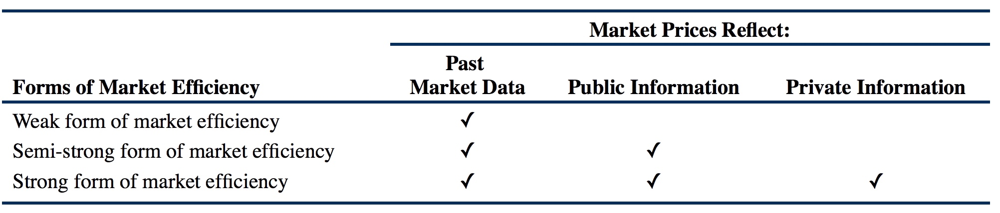
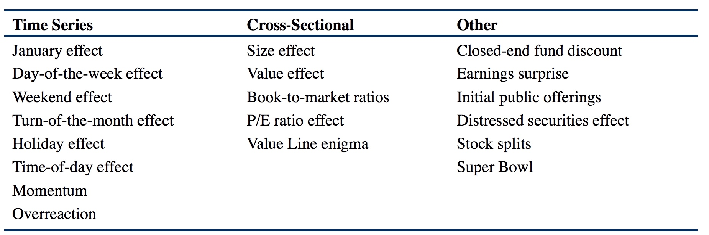
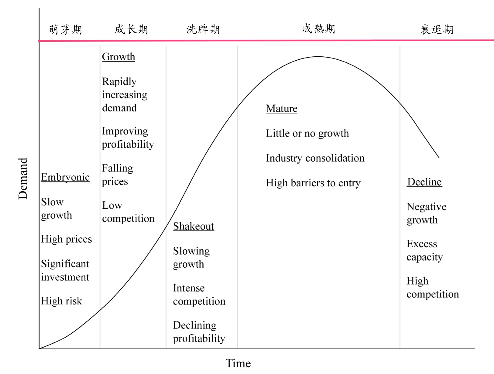
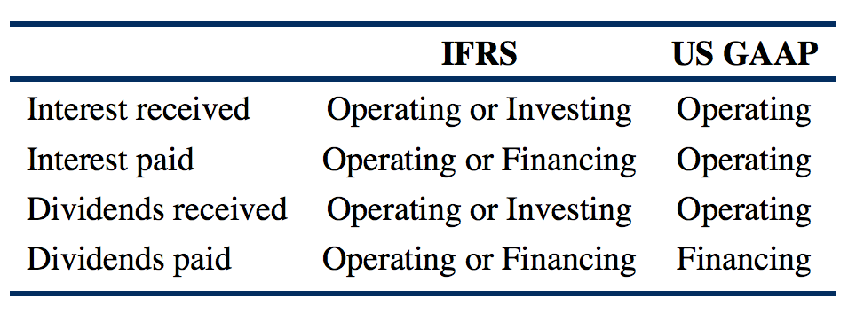

# (PART) 股权投资 {#equity .unnumbered}

# 内容简介 {#equity-intro .unnumbered}

# 股票市场基本知识 {#equity-basics}

## 股票的类型及特征 {#equity-types-and-characteristics}

Types of Equity Securities and Their Characteristics

### Common Shares

Common Shares，称为普通股，是指 A type of security that represent an ownership interest in a company.

Common Shares具有投票权，有关的概念有：

- Vote by Proxy：指通过代理投票；
- Statutory Voting：A common method of voting where each share represents one vote；
- Cumulative Voting：Voting that allows shareholders to direct their total voting rights to specific candidates, as opposed to having to allocate their voting rights evenly among all candidates.

### Preference Shares

Preference Shares，优先股，兼具债券与股票的特征，但是一般没有投票权。

### Public vs. Private Equity Securities

Private Equity主要包括风险投资Venture Capital，控股权收购Leverage Buyout，以及私有化投资Private investment in public equity。

### Cost of Equity vs. Return on Equity vs. Investors’ Required Rates of Return

Cost of Equity表示股本成本，Return on Equity表示净资产收益率，Investors’ Required Rates of Return表示投资者的要求回报率。

## 股票市场的特征及参与者 {#equity-markets-characteristics}

Equity Markets: Characteristics and Institutions

### Primary & Secondary Markets

一级市场是指The market where securities are first sold and the issuers receive the proceeds.

二级市场是指The market where securities are traded among investors.

二级市场的重要作用在于提供了流动性，从而降低了融资成本。

**二级市场的分类**

按照交易时间，可以分为：

1. call market：是指仅在特定的时间以及地点开展交易，一般每天仅call一次；
2. continuous trading market：是指在市场开放期间的任何时候都能进行交易。

按照执行机制，可以分为：

1. Quote-driven Markets：基于报价的市场，traders与dealers进行交易；
2. Order-driver Markets：基于订单的市场，traders与其他traders进行交易，属于撮合交易；
3. Brokered Markets：经纪人市场，一般用来交易流动性较弱的资产。

### Order指令的各种类型

Order指定可以分为Execution, Validity, Clearing三种类型：

1. Execution Instructions是指Instructions that indicate how to fill an order.
2. Validity Instructions是指Instructions which indicate when the order may be filled.
3. Clearing Instructions是指Instructions that indicate how to arrange the final settlement (“clearing”) of a trade.

**Bid Prices称为买价或者出价，Ask Prices（有时也称作Offer Prices）称为卖价或者要价。**

#### Execution Instructions

**Execution Instructions指定的是订单如何执行，最常见的Execution Instructions就是Market Orders以及Limit Orders，分别称作市价单以及限价单。**

对于市价单来说，有时候会由于购买量或卖出量较多而引起市场价格的变化，因此这种情况下市价单的真实成交价是难以预料的。

对于限价单来说，成交价格并不一定是限定好的价格，因为如果市场上存在比限定价格更优的买价或卖价，那么限价单会以最优的价格成交。

#### Validity Instructions

**Validity Instructions指定的是订单何时能够执行，最常用的Validity Instructions是day order，表示在当日内有效的订单，此外还包括Good-till-cancelled orders (GTC)，Immediate or cancel orders (IOC)，Good-on-close，Good-on-open，以及Stop Orders。**

其中Stop Orders包括**stop-sell orders**和**stop-buy orders**两种，**前者是指当价格下跌至设定的价格时卖出止损，后者是指当价格上升至设定的价格时买入持有**。

#### Clearing Instructions

Clearing Instructions主要是指实际交割相关的指令，Traders一般不直接使用Clearing Instructions。

## 市场组织结构 {#market-organization-and-structure}

Market Organization and Structure

市场中交易的主要资产类型有：

- Securities
- Currencies
- Contracts
- Commodities
- Real Assets

金融中介的主要类型有：

- Brokers, Exchanges, and Alternative Trading Systems
- Dealers
- Broker-dealer
- Securitizers
- Depository Institutions and Other Fianacial Corporations
- Insurance Companies
- Arbitrageurs
- Settlement and Custodial Services

## 市场有效性 {#market-efficiency}

Market Efficiency

**Efficient Market: An informationally efficient market (an efficient market) is a market in which asset prices reflect new information quickly and rationally. An efficient market is thus a market in which asset prices reflect all past and present information.**

### 影响市场有效性的因素

### Multi-Level Market Efficiency

### 市场有效性理论对投资的启示

#### 基本面分析 vs. 技术分析

#### 主动投资 vs. 被动投资

### Market Anomalies

包括三大类：

1. Time-Series Anomalies
    - Calendar Anomalies
    - Momentum and Overreaction Anomalies

2. Cross-Sectional Anomalies
    - Size Effect：指小公司的股票表现要优于大公司，该异常现象已经被研究证明并不存在
    - Value Effect：指不少研究发现价值型股票表现要优于成长型股票，其来源是CAPM中存在的误差，采用Fama三因子模型代替CAPM时，该异常现象就消失了

3. Other Anomalies
    - Closed-End Investment Fund Discounts
    - Earnings Surprise
    - Predictability of Returns Based on Prior Information

**市场异常现象对投资者的启示：试图利用市场异常现象进行投资获利是不现实的，一方面很多市场异常现象只在特定时期存在，在其他时期可能会反转，另一方面真正的市场异常现象一旦被发现，就会因获得过多关注而迅速消失，此外，如果考虑了交易本身所包含的成本，那么大多数的市场异常现场并不能带来利润回报。**

### Behavioral Finance

投资者行为偏差主要包括以下几个方面：

1. 亏损厌恶 Loss Aversion
2. 盲目跟风 Herding
3. 过分自大 Overconfidence
4. 谣言流传 Information Cascades
5. 其他的行为偏差 Other Behavioral Biases
    - representativeness：投资者对新信息的判断会基于现有的情况或者自己熟悉的情况进行判断；
    - mental accounting：投资者会对不同的投资分开处理；
    - conservative：投资者倾向于维持先前的判断，而对新信息的反应会比较慢；
    - narrow framing：投资者会单独的对待问题，而不从整体进行把握

# 股票投资组合 {#equity-portfolio}

## 股票投资组合管理策略 {#equity-portfolio-management}

Equity Portfolio Management Strategies

## 股票投资基准 {#equity-portfolio-benchmarks}

Equity Portfolio Benchmarks

### Security Market Indices

#### Two Versions of Index

分为Price Return Index以及Total Return Index，其中价格回报指数Price Return Index计算公式为：

$$V_{PRI} = {\sum_{i=1}^N n_iP_i \over D}$$

上式中，$N$指成分股的数目，$n_i$与$P_i$分别表示指数组合中证券$i$的数量及单价，$D$表示除数，一般在期初设定，比如1000。

主要包括市场指数的不同构建方法，各自的优缺点，以及权重等相关计算。

#### Single-Period Return

$$PR_I = {V_{PRI1} - V_{PRI0} \over V_{PRI0}}$$

$$TR_I = {V_{PRI1} - V_{PRI0} + Inc_1 \over V_{PRI0}}$$

#### Over Multiple Time Periods

$$V_{PRIT} = V_{PRI0}(1+PR_{I1})(1+PR_{I2})\cdots(1+PR_{IT})$$

相应的：

$$V_{TRIT} = V_{TRI0}(1+TR_{I1})(1+TR_{I2})\cdots(1+TR_{IT})$$

#### Weighting Methods

##### Price Weighting

$$w_i^P = {P_i \over \sum\limits_{i=1}^N P_i}$$

**价格权重的一个特性是如果某个股票发生了stock split，会对所有成分股的权重产生影响。因此，在Price Weighting中，为了防止由于stock split引起指数值的变化，需要对除数进行调整。**

##### Equal Weighting

$$w_i^E = {1\over N}$$

##### Market-Capitalization Weighting

$$w_i^M = {Q_iP_i \over \sum\limits_{j=1}^N Q_jP_j}$$

在Market-Capitalization Weighting中，由于有些股票的市场流通市值只是该股票总市值的一部分，因此可以按照市场流通市值所占的比例fraction进行调整，这称为Float-Adjusted Market-Capitalization Weighting，其中专有名词Market Float的含义是指可供公众投资的股票数目，也就是流通股的数目，Float-Adjusted Market-Capitalization Weighting的计算方法为：

$$w_i^M = {f_iQ_iP_i \over \sum\limits_{j=1}^N f_jQ_jP_j}$$

目前绝大多数的Market-Capitalization Weighted Indices都是经过Float-Adjusted调整过的，有时候指数提供商为了体现适用于全球投资者的投资机会，会进一步剔除掉每个成分证券中仅供国内投资者投资的股票数目，这称为Free-float-adjusted Market-Capitalization-Weighted Indices。

基于市值确定权重的主要优点在于反映了每个成分证券在目标市场中的价值比例，主要缺点在于如果某个成分证券的价格相对于其他证券来说上升的越多，其所占权重就会越大，反之下降的越多，所占权重就会越小，这就造成了该方法会过高指定价格上升的证券（其价值有可能被高估）的权重，并且过低指定价格下降的证券（其价值有可能被低估）的权重。

##### Fundamental Weighting

Fundamental Weighting是指根据基本面指标而非证券价格来定权，比如book value，cash flows，revenue，earnings，dividends，number of employees等，有些指数只采用单一的基本面指标，比如total dividends，有些指数则会采用多种指标结合起来确定权重。

Fundamental Weighting的计算方法为：

$$w_i^F = {F_i \over \sum\limits_{j=1}^N F_j}$$

#### Rebalancing & Reconstitution of an Index

Rebalancing指的是调整指数中成分证券的权重，一般会按照事先计划好的时间节点进行，通常每季度执行一次。

Reconstitution是指添加或删除指数中的成分证券，类似于基金经理调整其投资组合中包含的资产标的，Reconstitution是rebalancing cycle的一部分。

#### Types of Equity Indices

股票指数包括broad market, multi-market, sector, and style indices四种类型。

要学会区分不同的股票指数所属的类型，需要注意的是style indices是指将股票按照市值，价值，成长性或者这些因素的组合来将股票分组构建的指数，一般有以下几类：

1. Market Capitalization：按照市值大小分类，分为大公司large cap，中等公司midcap，以及小公司small cap；
2. Value/Growth Classification：按照价值及成长性分类，可以分为价值股，或者成长股，对价值股和成长股进行区分的指标多种多样，比如price-to-book ratios，price-to-earrnings ratios或者dividend yields；
3. Market Capitalization and Value/Growth Classification：组合市值Market Capitalization以及Value/Growth特性进行分类，可以分为六类：Large-Cap Value，Mid-Cap Value，Small-Cap Value，Large-Cap Growth，Mid-Cap Growth，Small-Cap Growth。

# 闭锁型公司与不活跃证券 {#closely-held-companies}

Closely Held Companies and Inactively Traded Securities

# 基本面分析 {#fundamental-analysis}

基本面分析 (Fundamental Analysis) 对企业估值或股票估值具有重要的作用，包括部门分析 (Sector Analysis)，行业分析 (Industry Analysis)，以及企业分析 (Company Analysis)。

## 行业及企业分析

### Porter's Model 波特五力模型

1. The **threat of entry** to the industry;
2. The **power of suppliers**;
3. The **power of buyers**;
4. The **threat of substitutes**;
5. The **rivalry among existing competitors**;

### Elements of thorough industry analysis

1. Barriers to Entry 进入壁垒
2. Industry Concentration 行业集中度
3. Industry Capacity 行业开工率
4. Market Share Stability 市场份额稳定性
5. Industry Life Cycle 行业生命周期
6. Price Competition 价格竞争
7. Industry Comparison 行业对比

### Industry Life Cycle Models

### Impact Factors on Industry Growth, Profitability and Risk

行业的外部因素主要包括五个方面：

1. 宏观经济因素 Macroeconomic
2. 技术发展 Technological
3. 人口变化因素 Demographic
4. 政府政策影响 Governmental
5. 社会生活方式影响 Social

### 公司分析需要考虑的因素

1. Corporate Profile
2. Industry Characteristics
3. Analysis of Demand for Product/Services
4. Analysis of Supply for Product/Services
5. Analysis of Pricing
6. Financial Ratios and Measures

# 股票估值 {#equity-valuation}

**Overvalued vs. Fairly Valued vs. Undervalued**

对于股票来说，使用估值模型估算的股票价值可能与股票的市场价值不符，此时如果市场价格高于估值模型所估算的股票价格，则称之为市场高估了该股票，如果市场价格低于估值模型所估算的股票价格，则称之为市场低估了该股票，如果市场价格与估值模型所估算的股票价格一致，则称之为市场对该股票的评估合理，其判定规则总结如下：

- 如果 $Estimates~of~Value > Market~Price$, 称之为 $Undervalued$;
- 如果 $Estimates~of~Value < Market~Price$, 称之为 $Overvalued$;
- 如果 $Estimates~of~Value = Market~Price$, 称之为 $Fairly~Valued$。

## 股权估值模型分类

股权估值模型可以分为三大类：

1. 现值模型 (Present Value Models)，也称作现金流折现模型 (Discounted Cash Flow Models)，大多数的估值模型都属于此类，如果使用的现金流是股票分红，称之为股息折现模型 (Dividend Discount Models)，如果使用的现金流是企业所产生的自由现金流，则称之为自由现金流折现模型 (Free Cash Flow Models)，在实际应用中使用的自由现金流一般可以分为两种，第一种是流向企业的自由现金流 (Free Cash Flow to Firm, 简称 FCFF)，第二种是流向公司股东的自由现金流 (Free Cash Flow to Equity, 简称 FCFE)，如果使用的是 FCFF 进行折现，得到的是企业的债权与股权价值之和，如果使用的是 FCFE 进行折现，得到的则是企业的股权价值；
2. 乘数模型 (Multiplier Models)，也称作市场乘数模型 (Market Multiple Models)，这类模型大部分都是基于股票价格乘数 (Share Price Multiples)，或者是企业价值乘数 (Enterprise Value Multiples), 股票价格乘数主要是将股票价格除以基本面数据，比如营收，利润，现金流，账目价值等，常用的有 P/E，P/S，P/B 等；企业价值乘数主要是将企业价值 (EV) 除以基本面数据，常用的基本面数据是税息折旧及摊销前利润 (EBITDA)，以及总营业收入 (Total Revenue)，其中**企业价值指的是企业的总市值 (包括普通股，优先股以及债券的市值) 减去企业所持有的现金及短期投资**；
3. 基于资产的估值模型 (Asset-based Valuation Models)，此类模型是通过将企业的资产减去负债以及优先股来估算其普通股的内在价值，估算出的价值称为账面价值 (英文名称为 Book Value 或者 Carrying Value)。

## 股息折现模型

股息折现模型 (The Dividend Discount Model, 简称为 DDM) 适用于具有稳定分红记录以及分红比例的企业，并且该企业预计会一直持续经营下去 (Going Concern)，DDM 的基本形式为：

$$V_0 = \sum_{t=1}^{\infty} {D_t \over (1+r)^t}$$

对于股票持有者来说，可以在持有一段时间后将股票卖掉，假设持有期为$n$个分红周期，到期时卖出价格为$P_n$，此时 DDM 可以写作：

$$V_0 = \left(\sum_{t=1}^{n} {D_t \over (1+r)^t}\right) + {P_n \over (1+r)^n}$$

上式中，预期的卖出价格$P_n$称为期末股票价值 (Terminal Stock Value, or Terminal Value)。

## 自由现金流折现模型

在实际应用中常用的自由现金流有两种：流向企业的自由现金流 FCFF 以及 流向股东的自由现金流 FCFE，基于二者进行股票估值的方法一致，区别仅在于两种现金流的计算方法以及所得估值的含义。

基于FCFF的估值模型为：

$$V_0 = \sum_{t=1}^{\infty} {FCFF_t \over (1+r)^t}$$

基于FCFE的估值模型为：

$$V_0 = \sum_{t=1}^{\infty} {FCFE_t \over (1+r)^t}$$

### FCFF 与 FCFE 的计算方法

FCFF 和 FCFE 一般可以通过对净利润 (NI)、来自经营活动的现金流 (CFO)、息税前收入 (EBIT)、以及息税及折旧摊销前收入 (EBITDA) 等四项会计科目进行一定的调整而得到，并且 FCFF 与 FCFE 之间也具有特定的关系，二者之间的关系式为：

$$FCFE = FCFF - Interest\cdot (1-Tax\;Rate) + Net\;Borrowing$$

**FCFF 的计算公式**

基于净利润 (NI) 以及 经营性现金流 (CFO) 计算 FCFF 的公式为：

$$\begin{alignedat}{2}
FCFF &= NI + NCC - WC_{Inv}&\;-\;&FC_{Inv} + Interest\cdot (1-Tax\;Rate) \\
FCFF &= CFO&\;-\;&FC_{Inv} + Interest\cdot (1-Tax\;Rate)
\end{alignedat}$$

基于息税前收入 (EBIT) 以及  息税及折旧摊销前收入 (EBITDA) 计算 FCFF 的公式为：

$$\begin{alignedat}{2}
FCFF &= EBIT\cdot (1-Tax\;Rate) \;&+ Dep \;&- WC_{Inv} - FC_{Inv} \\
FCFF &= EBITDA\cdot (1-Tax\;Rate) \;&+ Dep\cdot (Tax\;Rate) \;&- WC_{Inv} - FC_{Inv}
\end{alignedat}$$

**FCFE 的计算公式**

基于净利润 (NI) 以及 经营现金流 (CFO) 计算 FCFE 的公式为：

$$\begin{alignedat}{2}
FCFE &= NI + NCC - WC_{Inv}&\;-\;&FC_{Inv} + Net\;Borrowing \\
FCFE &= CFO&\;-\;&FC_{Inv} + Net\;Borrowing
\end{alignedat}$$

基于息税前收入 (EBIT) 以及  息税及折旧摊销前收入 (EBITDA) 计算 FCFE 的公式为：

$$\begin{alignedat}{2}
FCFE &= (EBIT - Interest)\cdot (1-Tax\;Rate) &+ Dep \;&- WC_{Inv} - FC_{Inv} + Net\;Borrowing\\
FCFE &= (EBITDA - Interest)\cdot (1-Tax\;Rate) &+ Dep\cdot (Tax\;Rate) \;&- WC_{Inv} - FC_{Inv} + Net\;Borrowing
\end{alignedat}$$

### FCFF 与 FCFE 之间的关系

FCFF 与 FCFE 的公式看起来计算比较麻烦，实质上仔细理解之后会觉得非常简单，无需刻意记忆。首先需要明白的是 FCFF 与 FCFE 都指的是自由现金流，也就是理论上可以自由支配的现金流，区别在于 FCFF 是流向公司的自由现金流，而FCFE 是流向股东的自由现金流，因此 FCFF 与 FCFE 相比多出了属于债权人的那部分现金流，也就是企业当期所支出的利息费用，然而由于利息费用是在税前进行扣除的，从而具有节税作用，因此 FCFE 需要在 FCFF 的基础上减去 $Interest\cdot (1-Tax\;Rate)$，此外企业的新增借款被认为是可以用于对股东进行分红的，因此通过新增借款得到的现金可以认为是属于 FCFE 的一部分，因此 FCFE 需要在 FCFF 的基础上加上 $Net\;Borrowing$，从而 FCFE 与 FCFF 之间的关系就很容易得到了：

$$FCFE = FCFF - Interest\cdot (1-Tax\;Rate) + Net\;Borrowing$$

### FCFF 与 FCFE 的含义

理解了 FCFF 与 FCFE 之间的关系后，只需要理解 FCFF 的计算逻辑，根据二者的关系式就可以很容易的计算 FCFE，对于 FCFF 来说，一般可以通过对净利润、经营性现金流、息税前收入、以及息税及折旧摊销前收入进行调整而得到，其中净利润、息税前收入、以及息税及折旧摊销前收入都属于利润表上的会计科目，经营性现金流则属于现金流表上的会计科目。

首先思考净利润 NI 与 FCFF 的关系，一般来说，企业的净利润是指企业的营收在扣掉了营业成本、管理费用、折旧及摊销费用、利息费用、以及税费等之后所剩余的部分，属于企业的股东。从净利润的计算过程可以看出，净利润与企业所收到的现金并不一致：

- 第一，企业的销售收入中的一部分可能会以应收账款的形式存在，这部分赊销得到的收入会增加企业的净利润，但是并没有增加企业收到的现金；
- 第二，当企业的存货增加时，并不会影响企业的净利润，但是存货的购买需要花费现金，因此会减少企业的现金；
- 第三，企业的营业成本中的一部分可能会以应付账款的形式存在，这部分赊购行为产生的费用会降低企业的净利润，但是并没有减少企业拥有的现金；
- 第四，企业会存在不需要当期支付的费用，比如累积税费或者尚未发放的员工工资等累积费用，此类费用在计算净利润的时候需要减去，但是却并没有减少企业所持有的现金；
- 第五，企业的折旧费用、摊销费用或者非现金重组花销等非现金费用会减少企业的净利润，但是并没有减少企业拥有的现金，相反，某些企业还会存在与营运资本无关的非现金收入，比如先前减值的资产的价值提高所带来的收入，这类非现金收入会提高净利润，但是并不会增加现金流，非现金费用减去非现金收入成为非现金净支出 (Net Noncash Charges, 简称 NCC)，其总的效应是减少 (NCC 为正) 了净利润，但是没有减少企业所拥有的现金；
- 第六，企业对固定资本的投资并不会减少企业的净利润，但是却会减少企业所拥有的现金；
- 第七，FCFF 的定义是流向企业的自由现金流，因此应该包含企业支付给债权人的利息，由于在净利润的计算过程中减去了利息费用，因此需要对利息费用进行调整，考虑到利息费用是在计算税费之前扣除的，因此利息费用实质上节省了数额为 $Interest\cdot Tax\;Rate$ 的税费，从而对利息费用的调整额度应为 $Interest\cdot (1 - Tax\;Rate)$

**营运资本的增加额**

在上述七条原因中，第一条与第二条相当于将现金转化为了应收账款和存货等流动资产，第三条与第四条相当于企业通过增加流动负债得到了相应数量的现金，因此流动资产的增加实质上减少了企业的现金，流动负债的增加则实质上增加了企业的现金，企业的流动资产与流动负债之差称为企业的营运资本 (Working Capital)，因此企业的流动资产的增加额减去流动负债的增加额就是流动资产与流动负债的变化对企业现金流的减少效应的数额，这成为营运资本的增加量 $WC_{Inv}$, 其计算公式为：

$$WC_{Inv} = \Delta{Current\;Asset} - \Delta{Current\;Liablities}$$

**非现金净支出**

对于上述七条原因中的第五条所提到的非现金净支出，在计算净利润的时候进行了扣除，但是由于其并没有减少企业所拥有的现金，因此在通过净利润计算 FCFF 时需要将非现金净支出加回。

**固定资本投资**

对于上述七条原因中的第六条所提到的固定资本投资，由于投资需要花费现金，因此会减少企业拥有的现金，但是由于投资产生的是资产而非费用，因此并没有对净利润造成影响，为此，在通过净利润计算 FCFF 时需要减去固定资本投资额，也就是固定资产的增加额，记为 $FC_{Inv}$

**支付的利息费用**

对于上述七条原因中的最后一条利息费用，由于利息费用是流向债权人的现金，而 FCFF 包括属于债权人那部分的现金流，因此需要在净利润中加回这部分费用，而考虑到利息费用的节税作用，需要加回的数额为$Interest\cdot (1 - Tax\;Rate)$

综上所述，通过对净利润进行调整得到 FCFF 的计算公式为：

$$FCFF = NI - WC_{Inv} + NCC - FC_{Inv} + Interest\cdot (1 - Tax\;Rate)$$

由此，基于净利润计算 FCFF 的内在逻辑就已经很清楚了，对于基于 CFO、EBIT、以及 EBITDA 计算 FCFF 的内在逻辑，只需要考虑三者与净利润之间的关系即可。

在使用 CFO 计算 FCFF 时，要特别注意利息支出在现金流表中的分类，IFRS 规定利息支出可以分类为经营性现金流，也可以分类为融资性现金流，而 US GAAP 则规定利息支出必须分类为经营性现金流，IFRS 与 US GAAP 对利息收入和支出以及分红收入和支出在现金流表中的分类规定如下所示[^interest-dividend-classify]：

[^interest-dividend-classify]: 总结一下就是 IFRS 规定对于收入来讲，不管是利息收入还是分红收入，都既可以分类为经营现金流也可以分类为投资现金流，对于支出来讲，不管是利息支出还是分红支出，都既可以分类为经营现金流也可以分类为融资现金流；US GAAP 则规定除了将分红支出必须分类为融资现金流外，分红收入、利息收入、以及利息支出都必须分类为经营现金流。嗯，有意思的规定。

CFO 指的是企业在经营活动中产生的现金流，结合之前对 NI 与 FCFF 的分析过程，由于非现金费用 NCC 与 营运资本增加值 $WC_{Inv}$ 属于经营活动，而固定资本投资 $FC_{Inv}$ 与利息费用 $Interest\cdot (1 - Tax\;Rate)$ 分别属于投资活动和融资活动，因此 CFO 与 NI 之间的关系为：

$$CFO = NI + NCC - WC_{Inv}$$

由此很容易得到 CFO 与 FCFF 之间的关系：

$$FCFF = CFO - FC_{Inv} + Interest\cdot {1-Tax\;Rate}$$

对于 EBIT 与 EBITDA 而言，二者与净利润 NI 类似，都属于盈利表中的会计科目，区别在于 NI 是扣除掉所有费用包括折旧及摊销费用、利息费用以及税费之后的盈利，EBIT 则是指未扣除利息费用及税费的息税前收入，EBITDA 则是在 EBIT 的基础上再加上折旧及摊销费用，因此 EBIT 以及 EBITDA 与 NI 之间的关系为：

$$NI = (EBIT - Interest) \cdot (1 - Tax\;Rate)$$
$$NI = (EBITDA - Dep - Interest) \cdot (1 - Tax\;Rate)$$

上式中的 $Dep$ 指的是折旧费用[^dep-ncc] (Depreciation Expense)。

[^dep-ncc]: 在基于 NI 和 CFO 计算 FCFF 的公式中的非现金费用 NCC 与此处基于 EBIT 和 EBITDA 计算 FCFF 的公式中的折旧费用 Dep 的含义在大多数的情况下是基本一致的，都是指的是折旧及摊销费用。注意虽然 NCC 在绝大多数情况下指的是折旧及摊销费用，但是对于特定的企业 NCC 可能会包含更多的会计科目，需要对具体案例进行仔细分析，尽量保证估算的 FCFF 是客观和合理的。

结合 NI 与 FCFF 之间的关系，就得到了 EBIT 以及 EBITDA 与 FCFF 之间的关系：

$$FCFF = EBIT\cdot (1-Tax\;Rate) + Dep - WC_{Inv} - FC_{Inv}$$
$$FCFF = EBITDA\cdot (1-Tax\;Rate) + Dep\cdot (Tax\;Rate) - WC_{Inv} - FC_{Inv}$$

理解了 FCFF 的计算过程，结合 FCFF 与 FCFE 之间的关系，就可以很容易的计算出 FCFE，在实际应用中，需要结合具体情况以及可用的数据来选择合适的方法估算 FCFF 以及 FCFE，并且在计算过程中思考其内在逻辑，想清楚进行每一项调整的含义，避免错调、漏调或多调而得到错误的结果。

### Prefered Stock Valuation

对无限期的non-callable, non-convertible perpetual preferred share进行估值的公式为：

$$V_0 = {D_0 \over r}$$

对成熟期为n，面值为F的non-callable, non-convertible preferred stock进行估值的公式为：

$$V_0 = \sum_{t=1}^n {D_t \over (1+r)^t} + {F \over (1+r)^n}$$

### The Gordon Growth Model

$$V_0 = {D_0(1+g) \over {r-g}} = {D_1 \over {r-g}}$$

其中$g$是指分红Dividends的稳定增长率constant growth rate，其估算公式为：

$$g = b \times ROE = (1 - Dividend~Payout~Ratio)~\times~ROE$$

上式中，$b$指的是盈利留存比例Earnings Retention Ratio，等于1减去分红比例Dividend Payout Ratio，ROE指的是Return on Equity。

### Multistage Dividend Discount Model

常用的Multistage Dividend Discount Model是Two-stage DDM，也就是分两个阶段，首先是高速增长阶段，然后是稳定增长阶段，估值公式为：

$$V_0 = \sum_{t=1}^N {D_0(1+g_S)^t \over (1+r)^t} + {V_n \over (1+r)^n}$$

$$V_n = {D_{n+1} \over {r - g_L}}~,~~D_{n+1} = D_0(1+g_S)^n(1+g_L)$$

其中，$g_S$是第一阶段短暂的高速增长期的稳定增长率，$g_L$是第二阶段长期的稳定增长率。

## Multipliers Models

### Price Multiples

常用的Price Multiples有：

- Price-to-Earnings Ratio (P/E)
- Price-to-Book-Value Ratio (P/B)
- Price-to-Sales Ratio (P/S)
- Price-to-Cash-Flow Ratio (P/CF)

#### Price Multiples, Present Value Models, Fundamentals之间的关系

如果假设股票的当前价格$P_0$反映了其内在价值$V_0$，那么有：

$$P_0 = {D_1 \over r-g}$$

如果将上式两边除以下一年的盈利预测值$E_1$，可以得到：

$${P_0 \over E_1} = {D_1/E_1 \over r-g} = {p \over {r-g}}$$

上式中的${P_0 \over E_1}$称为justified forward P/E，$p$表示Dividend Payout Ratio。

### Enterprise Value Multiples

**Enterprise Value指的是企业价值，可以理解为收购企业所需要的费用，其计算方法是：企业的普通股市值，加上优先股市值，再加上债券市值，得到企业的总市值，然后减去企业拥有的现金及其等价物以及短期投资的金额。**

**Enterprise Value = Market value (MV) of Common Equity + MV of Long-term debt + Non-controlling interest - Cash and investments**

Enterprise value在比较资本结构差异显著的企业时特别有用，Enterprise Value Multiples 在欧洲使用的比较广泛，其中应用最广的 Enterprise Value Multiple 是$EV/EBITDA$，其中EBITDA可以认为是CFO的近似估算值，EBITDA被认为是偿付利息，股息分红以及缴税的资金来源，EBITDA的替代选择是Operating Income。

## Residual Income Valuation

$$V_0 = B_0 + {ROE-r \over r-g}\cdot B_0$$

$${P_0\over B_0} = {ROE-g\over r-g} = {1 + {ROE - r \over r- g}}$$

## Asset-based Valuation Models

Asset-based Valuation Models，此类模型是通过将企业的资产减去负债以及优先股来估算其普通股的内在价值，估算出的价值称为Book Value，或者Carrying Value。

Asset-based Valuation Models适用于无形资产以及账外资产“off-the-books”较少，并且Current Asset以及Current Liabilities比例较高的企业，经常与Multipliers Models结合使用。

