# (PART) 固定收益证券 {#fixed-income .unnumbered}

# 内容简介 {#fixed-income-intro .unnumbered}

# 固定收益证券及其市场 {#fixed-income-securities-and-markets}

## 固定收益证券类型及特征

Types of Fixed-Income Securities and Their Characteristics

### 债券的五个基本特征

债券的基本特征包括：

1. 发行方 Issuer
    可以分为三大类：government and government-related sector, the corporate sector, and the structured finance sector(比如发行ABS的Special Legal Entities)

2. 成熟期 Maturity
    到期日Maturity Date是债券发行时定义好的偿还本金的日期，Tenor是距离到期日的剩余时间，债券的成熟期可以短至隔夜，也可以长至30年或更多。一般来说，发行时指定的成熟期小于等于1年的债券称为货币市场证券Money Market Securities，大于1年的债券称为资本市场证券Capital Market Securities，此外还有一种特殊的债券没有指定成熟期，称为Perpetual Bonds，这种债券是指英国发行的无限期市政债券

3. 面值 Par Value
4. 名义利率及结算周期 Coupon Rate and Frequency
    债券的利率有固定利率与浮动利率之分，固定利率债券称为plain vanilla bonds或者conventional bonds，浮动利率债券称为floating-rate Notes(FRNs)或者floaters。有些债券的Coupon Rate为0，这类债券称为zero-coupon rate bonds或者pure discount bonds

5. 结算货币 Currency Denomination

债券常用的收益率衡量指标Yield Measures包括：

- Current Yield or Running Yield：是指债券每年的Coupon除以债券的当前价格Price；
- Yield to Maturity，also called Yield to redemption or redemption yield：指买入债券并持有至到期日所得到的内在回报率IRR

### Legal & Regulatory & Tax Considerations

债券的法律合同称为Bond Indenture，涉及到的抵押资产称为Collaterals，Covenants指的是签订的契约条款，分为Affirmative Covenants 以及 Negative Covenants，**要注意学会区分Affirmative Covenants vs. Negative Covenants。**

Credit Enhancements是指债券发行方提高自身的信用级别的手段，分为内部信用提升Internal Credit Enhancement以及外部信用提升External Credit Enhancement两类，要能够对不同的信用提升手段的类别。

债券的Coupon Payment一般按照个人所得进行征税，由于债券价格变化导致的资本增益或损失可能会以不同的税率征税，并且可能需要区分短期投资与长期投资，值得注意的是，如果税法中指定了**an original issue discount tax provision**，表示需要将购买价格与债券面值之差按照持有的年数进行分期报税。

### Cash Flows of Fixed-Income Securities

分为两大类：本金的偿还方式以及Coupon的付款方式。

根据本金的偿还方式的不同分为：

1. Bullet：指的是全部本金在到期日偿还；
2. Fully Amortized：指的是将全部本金分期偿还，使得在到期日的时候本金为0；
3. Partially Amortized Bonds：是指将部分本金分期偿还，在到期日的时候偿还剩余的本金，称为balloon payment

此外，还有一种降低到期日无法偿还本金风险的方法，叫做Sinking Fund Arrangements，是指定期的存储一定量的现金作为储备金专门用于到期偿还本金。

Coupon主要包括两方面的因素，一个是付款周期，一个是Coupon利率的确定方式，Coupon利率的确定方法有很多种，比如：

1. Floating-Rate Notes是指浮动利率债券，一般是指定一个基准利率，然后根据指定的基准利率加上提前确定的fixed spread作为Coupon Rate，有些时候这个spread并不是固定的，此时称为Variable-Rate Notes。绝大部分的FRNs都是每季度付一次Coupon；FRNs可能会指定Coupon Rate的下界floor或者上界cap，以此避免Coupon Rate过低或过高；
2. Step-up Coupon Bonds指Coupon Rate按计划不断升高的债券，可以是固定的，也可以是浮动的；
3. Credit-linked Coupon Bonds是指Coupon Rate与债券发行方的信用级别挂钩，如果信用级别发生变化，相应的Coupon Rate也会发生变化；
4. Payment-in-Kind Coupon Bonds，是指允许债券发行方通过增发债券来支付利息；
5. Deferred Coupon Bonds，有时也称为Split Coupon Bonds，是指债券发行初期不支付利息，等过了特定的时间间隔后支付较高的利息，从而缓解债券发行方初期的资金压力，zero-coupon bond可以看作是一种极端的Deferred Coupon Bonds；
6. Index-linked Bonds是指将Coupon Payments或者/以及本金偿付与指定的指数挂钩，理论上可以是任意指数，**实际中常见的Index-linked Bonds有Inflation-linked bonds，用来抵抗通货膨胀，这类债券的发行方大部分是政府，也称作linkers**。

### Effect of Contingency Provisions

Contingency Provisions是一个法律术语，是指在特殊事件发生或特殊情况出现时的条款规定，对债券来说，就是指债券的内嵌期权Embedded Option，包括call, put, convertible三种，这些权利是债券内嵌的，不能够被单独单独拿来进行交易。

#### Callable Bonds

Callable Bonds是指债券发行方可以在未来特定的时刻以事先约定好的价格召回已发行的债券，是对债券发行方有利的权利，因此Callable Bonds相比于与其类似的Noncallable Bonds来说，要提供较高的收益率以及较低的价格。

Callable Bonds的行使风格有以下三种：

1. American-Style Call，指在指定的first call day后的任何时间都能进行call；
2. European-Style Call，指只能在指定的call date进行一次call；
3. Bermuda-Style Call，是指在call protection period之后的特定日子能够进行call，call的日期一般与Coupon发放的日期相关；

#### Putable Bonds

Putable Bonds是指债券持有者可以在未来特定的时刻以事先约定好的价格将手中的债券卖回给债券发行方，是对债券持有者有利的权利，因此Putable Bonds相比于与其类似的Nonputable Bonds来说，可以提供较低的收益率以及较高的价格。

#### Convertible Bonds

Convertible Bonds是一种混合结构的债券，具有债券与股票的双重特征，债券持有者有权将手中的债券按照事先规定好的比例兑换为债券发行方的股票，同样Convertible Bonds是对债券持有者有利的权利，对于Convertible Bonds需要关注的关键条款有：

1. 转换价格Conversion Price；
2. 转换比例Conversion Ratio，有时候只提供了Conversion Price，可以将面值除以Conversion Price得到转换比例；
3. 转换价值Conversion Value，是指股票的当前价格乘以转换比例；
4. 转化溢价Conversion Premium，是指债券价格Bond Price减去转换价值Conversion Value；
5. 转化等价性Conversion Parity，如果Conversion Premium等于0，称为Conversion Parity，如果转换价值小于债券价格，称为below parity，如果转换价值大于债券价格，称为above parity。

与Convertible Option类似，Warrants是一种附加期权"attach option"而非内嵌期权，使债券持有者享有在债券到期日之前按固定价格购买公司股票的权利，Warrants可以单独进行交易。

**可转化债券中有一种特殊的债券叫做Contingent convertible bonds, 小名叫做“CoCos”，主要是欧洲的几个银行发行的，这种债券能够在银行资金不足的时候自动转换为股份，从而使银行的资本结构自动重组，减轻银行的债务负担，降低其违约风险。由于这种可转化债券对发行方有利，因此需要提高较高的收益率以及较低的价格。**

## 固定收益证券市场特征及参与者

Fixed-Income Markets: Characteristics & Institutions

### 债券一级市场的发行机制

包括两种发行机制：1. 公开发行 Public Offering； 2. 私下发行 Private Placement，仅发行给特定的投资者或特定类别的投资者。

#### Public Offering

公开发行包括三种类型：

1. Underwritten Offerings 包销发行，与包销相对的是Best Effort Offering；
2. Shelf Registration 允许发行方签订一次合同发行多次债券；
3. Auctions 公开拍卖，US Treasury bonds一般通过拍卖方式发行

#### Private Placement

Private Placement的购买者大多是满足一定资格要求的投资者或机构，与公开发行相比，Private Placement一般没有活跃的二级市场，并且在债券发行时购买者对于债券价格、条款等都具有相对比较大的谈判空间。

### 债券的二级市场

主要是为债券提供流动性支持，在二级市场中，政府及其类似组织的债券的结算基准为当日结算Cash Basis或者T+1结算，公司债券一般是T+2或者T+3结算，有时候扩展到T+7结算.

### Corporate Debt

公司借款主要有三大类：1. 银行贷款或组织贷款 Bank Loans and Syndicated Loans；2. 商业票据Commercial Paper；3. 公司票据Corporate Notes及公司债券Corporate Bonds

#### Bank Loans and Syndicated Loans

Bilateral loan指具有单一借款人的贷款，一般是指银行贷款，Syndicated Loans是指具有多个借款人的贷款。

#### Commercial Paper

商业票据是一种短期的，无担保的票据，一般只有稳定且信用良好的大公司才能发行，发行方大多数是金融机构，对于商业票据而言，其成熟期可以从隔夜到一年，但是典型的商业票据的成熟期在三个月以内。

#### Corporate Notes and Bonds

对于短期，中期，长期并没有一个统一且被广泛接受的定义，此处将短期Short-term定义为5年或更短，中期Medium-term定义为5年至12年，长期Long-term定义为12年以上，一般将发行时成熟期在一年至12年之间的证券称为Notes，将12年以上的称为Bonds。

实际生活中，大多的公司债券的成熟期在一年到30年之间，不过在欧洲也存在40年或50年的债券，美国在90年代发行过一些世纪债券，成熟期为100年，第一个世纪债券是Walt Disney Company在1993年发行的。

#### Leveraged Instruments

在众多Structured Financial Instruments中，值得注意的一种工具是Leveraged Instruments，比如inverse floaters就是一种Leveraged Instruments，其Coupon Rate由下式决定：

$$Inverse~Floater~Coupon~Rate = C - (L\times R)$$

其中，$C$是Coupon Rate的上界，$L$为杠杆因子，$R$为基准利率，也就是如果基准利率升高，Coupon Rate就降低，如果基准利率降低，Coupon Rate就升高，因此称之为"inverse"。在上式中，$L > 1$的时候称为**leveraged inverse floaters**，$0 < L < 1$的时候称为**deleveraged inverse floaters**。

### 银行的短期资金来源

#### Retail Deposits

包括个人存款与机构存款。

#### Short-Term Wholesale Funds

包括reserve funds, interbank funds, and certificates of deposit.

Certificate of deposit (CD)分为两类，Non-negotiable CD or Negotiable CD：
- **Non-negotiable CD在到期日偿还本金及利息，如果存款人要提前提取存款，需要付出一定数量的罚金；**
- **Negotiable CD允许持有人在公开市场上交易该存款证明，因此具有更好的流动性。**

#### Repurchase and Reverse Repurchase Agreements (repos)

Repos指回购协议，其含义是在卖出证券的同时签署一个在未来特定日期按照特定价格购买回相同证券的协议，可以将其看作是一个抵押贷款，先卖出然后又购回的证券可以看作是抵押资产。

**Repo Rate是指Repurchase Agreements的利率，该利率的影响因素有抵押物的风险、回购协议的条款、抵押物的交付条款、抵押物的供求关系以及货币市场上其他融资手段的利率。**

如果从提供资金的一方来看，回购协议可以被称作Reverse Repurchase Agreements (Reverse repos)，相当于提供资金的一方花钱购买了相应的证券并承诺在未来特定日期按约定价格卖回去，相当于借入了该证券资产。Reverse Repurchase Agreements 经常被用来Cover空头头寸。

# 债券的期限结构 {#term-structure-and-yield-spreads}

# 利率风险及信用风险 {#interest-and-credit-risk}

## 利率风险

Analysis of Interest Rate Risk

### 债券回报的来源

包括三个方面：

1. receipt of the promised coupon and principal payments on the scheduled dates
2. reinvestment of coupon payments
3. potential capital gains or losses on the sale of the bond prior to maturity.

### 利率风险的分类

债券的利率风险有两类：

1. 红利再投资风险coupon reinvestment risk
2. 市场价格风险market price risk

理解债券的利率风险的核心在于理解投资期限investment horizon对风险敞口的影响，当市场利率上升时，红利再投资的收益会上升，而债券的市场价格会下降；当市场利率下降时，红利再投资的收益会下降，而债券的市场价格会上升，因此红利再投资风险和市场价格风险会相互消减，二者的相对强弱程度取决于投资者的投资期限investment horizon。投资期限越长，红利再投资风险的影响就越大，而相对来说市场价格风险的影响就越小。因此，对于持有相同债券的不同投资者来说，如果他们的投资期限不同，那么所面临的风险也不一样。

利率风险的常用的衡量指标为：久期Duration，以及凸度Convexity。

可以将其分为两大类：

1. 基于债券自身收益率YTM变化的风险：Yield Duration and Convexity；
2. 基于基准收益率曲线变化的风险：Curve Duration and Convexity.

### Durations

The duration of a bond measures the sensitivity of the bond’s full price (including accrued interest) to changes in the bond’s yield-to-maturity or, more generally, to changes in benchmark interest rates.

**久期衡量的是债券的Full Price相对于收益率YTM变化的敏感度，或者是相对于基准利率变化的敏感度**，在计算久期时，假定债券除了收益率YTM或者基准利率以外的变量都保持不变，最重要的是Time-to-Maturity要保持不变。

久期分为Yield Duration以及Curve Duration，其中Yield Duration包括Macaulay Duration，Modified Duration，Money Duration 以及 Price Value of a Basis Point(PVBP)，Curve Duration常用的是Effective Duration。

#### Macaulay & Modified & Approximate Durations

Macaulay Duration是由加拿大经济学家Frederick Macaulay于1938年发表的，其定义为: The approximate amount of time a bond would have to be held for the market discount rate at purchase to be realized if there is a single change in interest rate. It indicates the point in time when the coupon reinvestment and price effects of a change in yield-to- maturity offset each other.

Macaulay Duration的计算公式为：

$$MacDur = {{(1-{t\over T})~\times~PMT \over \left(1+r\right)^{1-{t\over T}}} + {(1-{t\over T})~\times~PMT \over \left(1+r\right)^{2-{t\over T}}} + \cdots + {(1-{t\over T})~\times~(PMT+FV) \over \left(1+r\right)^{N-{t\over T}}} \over {PMT \over \left(1+r\right)^{1-{t\over T}}} + {PMT \over \left(1+r\right)^{2-{t\over T}}} + \cdots + {PMT+FV \over \left(1+r\right)^{N-{t\over T}}}}$$

在上式中，分母是债券的Full Price，因此如果将分母使用$PV^{Full}$表示，上式可以化简为：

$$MacDur = (1-{t\over T})\left[ {{PMT \over (1+r)^{1-{t\over T}}} \over PV^{Full}} \right] + (2-{t\over T})\left[ {{PMT \over (1+r)^{2-{t\over T}}} \over PV^{Full}} \right] + \cdots + (N-{t\over T})\left[ {{PMT \over (1+r)^{N-{t\over T}}} \over PV^{Full}} \right]$$

**从上面的式子可以看出，MacDur相当于未来的一系列现金流时间节点$1-{t/T},2-{t/T},\cdots,N-t/T$的加权平均值，其权重等于相应现金流的现值在$PV^{Full}$中所占的比重，因此MacDur衡量的单位是时间段。**

实际应用中，利用微积分可以推导出MacDur的实用计算公式，如下所示：

$$MacDur = \left\{ {1+r \over r} - {1 + r + [N\times(c-r)] \over c \times [(1+r)^N - 1] + r} \right\} - {t \over T}$$

其中$c$指的是每周期的Coupon Rate。

Modified Durations是对Macaulay Duration进行简单调整后的Duration：

$$ModDur = {MacDur \over 1+r}$$

**尽管Modified Durations看起来只是简单的对MacDur进行了调整，但是在风险衡量中ModDur有着非常重要的应用：ModDur能够用来估算债券收益率YTM发生变化时，债券价格Full Price变化的百分比，计算公式如下：**

$$\%\Delta PV^{Full} \approx -AnnModDur~\times~\Delta Yield$$

当MacDur已知的时候，ModDur可以很容易的计算出来，如果MacDur未知，替代的方法是直接估算ModDur的近似值Approximate Modified Durations：

$$ApproxModDur = {(PV_-) - (PV_+) \over 2 \times (\Delta Yield) \times (PV_0)}$$

其几何含义如下图所示：

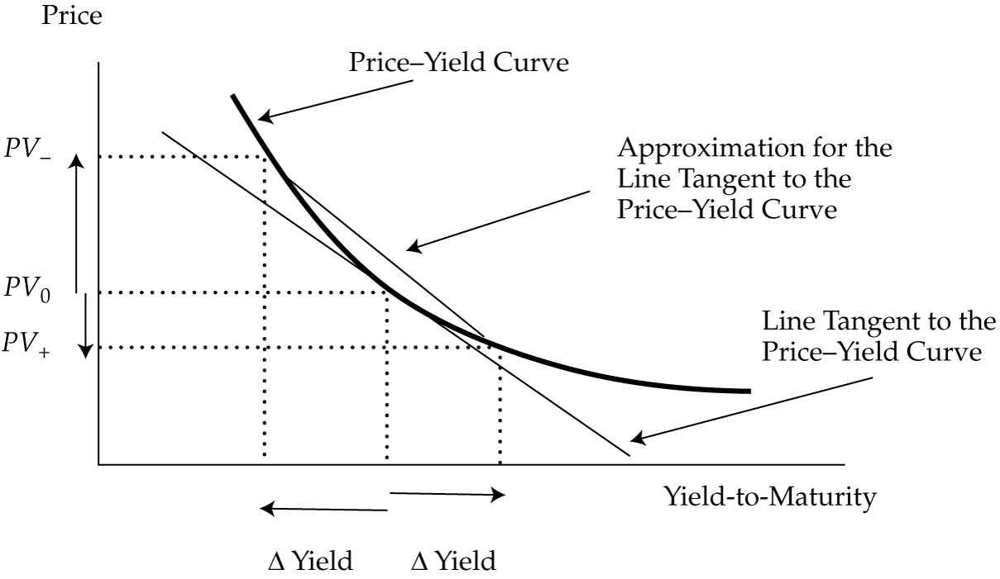

根据ApproxModDur也能计算出ApproxMacDur，计算方法为：

$$ApproxMacDur = ApproxModDur \times (1+r)$$

**值得注意的是，在计算Approximate Modified Durations使用的公式中，在进行债券价格计算的时候已经考虑了债券的结算周期，因此计算出的Approximate Modified Durations已经是annualized的durations。**

#### Effective Durations

Effective Durations是指the sensitivity of the bond’s price to a change in a benchmark yield curve，也就是债券价格对基准利率变化的敏感度，其计算方式如下：

$$EffDur = {(PV_-) - (PV_+) \over 2 \times (\Delta Curve) \times (PV_0)}$$

EffDur的计算公式与ApproxModDur的计算公式非常相似，区别在于分母中$\Delta Yield$与$\Delta Curve$的不同。

**Effective duration是估算复杂债券利率风险的重要手段，比如内嵌Call期权的债券，使用Effective duration的原因在于包含有内嵌期权的债券的在保护期之后的现金流是不确定的，会收到市场利率波动的影响，因此这类债券不存在事先定义好的YTM，因此MacDur或者ModDur并不适用，采用EffDur才是最合适的。**

On Bloomberg, the effective duration is called the “OAS duration” because it is based on the option-pricing model that is also used to calculate the option-adjusted spread.

#### Key Rate Duration

Key Rate Duration是指 A method of measuring the interest rate sensitivities of a fixed-income instrument or portfolio to shifts in key points along the yield curve.

与Effective Duration相比，Key Rate Duration能够识别出债券的"shaping risk"，也就是债券价格基准利率曲线形状变化（steeper or flatter）的敏感度。

- Describe its use in measuring the sensitivity of bonds to changes in the shape of benchmark yield curve

- Benchmark Yield Curve

#### Duration的性质

下图展示了Macaulay Duration between Coupon Payments with a Constant Yield-to-Maturity：

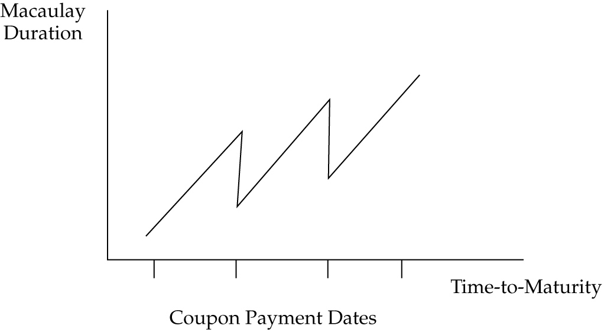

下图是不同类型债券的Macaulay Duration曲线：

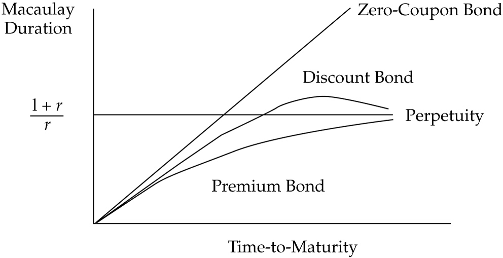

**In summary, the Macaulay and modified duration statistics for a fixed-rate bond depend primarily on the coupon rate, yield-to-maturity, and time-to-maturity. A higher coupon rate or a higher yield-to-maturity reduces the duration measures. A longer time-to-maturity usually leads to a higher duration. It always does so for a bond priced at a premium or at par value. But if the bond is priced at a discount, a longer time-to-maturity might lead to a lower duration. This situation only occurs if the coupon rate is low (but not zero) relative to the yield and the time-to-maturity is long.**

对于内嵌期权的债券来说，其价格收益率曲线如下：

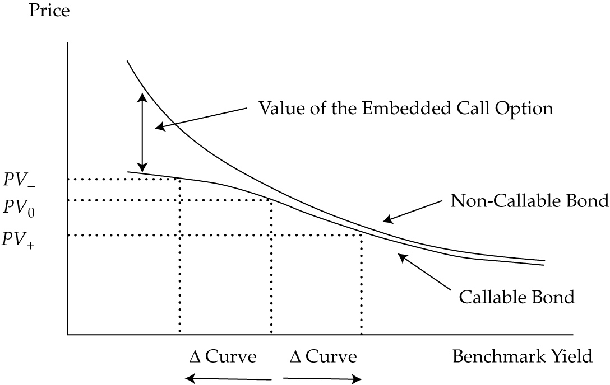

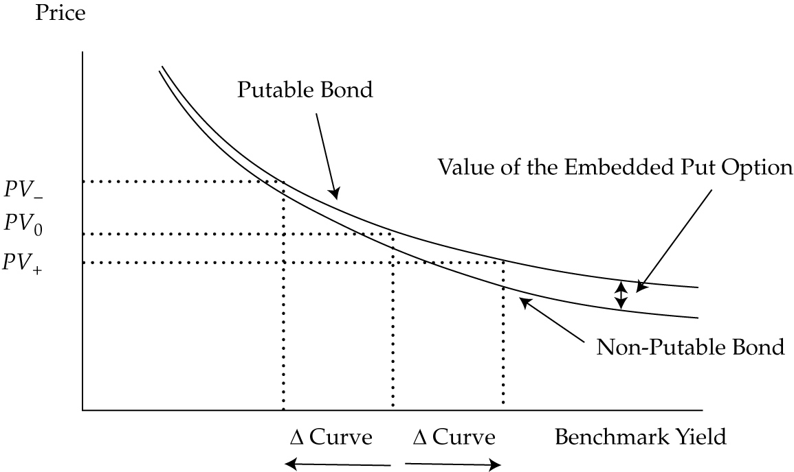

#### Portfolio Duration

投资组合的Durations计算方法有两种：

1. the weighted average of time to receipt of the aggregate cash flows
2. the weighted average of the individual bond durations that comprise the portfolio

第一种方法是理论上正确的方法，但是实际中不容易使用，第二种方法在实际中比较常用。

#### Money Duration of a Bond

Money Duration衡量的是债券的收益率YTM发生变化时，债券价格变化的绝对值，其计算公式为：

$$MoneyDur = AnnModDur \times PV^{Fulll}$$

$$\Delta PV^{Full} \approx -MoneyDur \times \Delta Yield$$

##### Price Value of a Basis Point (PVBP)

Money Duration的另一个版本是Price Value of a Basis Point (PVBP)，衡量的是当债券收益率变化一个基点时，债券价格的变化值，其计算方式与Approximate Modified Duration类似：

$$PVBP = {(PV_-) - (PV_+) \over 2}$$

一个相关的概念是Basis Point Value(BPV)，等于Money Duration乘以0.0001(1bp).

### Bond Convexity

传统无内嵌期权的固定利率债券的凸度示意图如下：

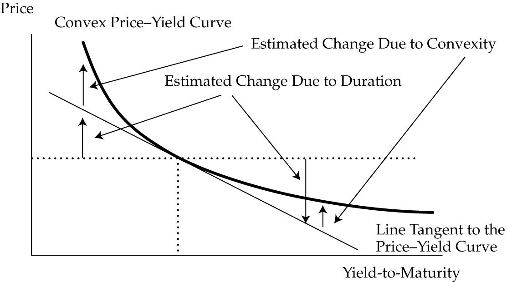

使用Money Duration来估算价格的变化时，实际上是使用价格收益率曲线相应点的切线斜率进行估算的，在Yield变化很小的时候，估算结果的误差很小，但是当Yield的变化比较大的时候，估算误差就会比较大，更精确的计算方法是考虑凸度的影响：

$$\% \Delta PV^{Full} \approx (-AnnModDur \times \Delta Yield) + \left[{1\over 2} \times AnnConvexity \times (\Delta Yield)^2\right]$$

其中，上式的第二项称作凸度调整项，其中Annual Convexity的近似计算公式如下：

$$ApproxConvexity = {(PV_-) + (PV_+) - [2 \times PV_0] \over (\Delta Yield)^2 \times (PV_0)}$$

对于Zero-coupon的债券来说，其精确的Convexity计算公式为：

$$Convexity(of~a~zero~coupon~bond) = {[N-(t/T)] \times [N+1-(t/T)] \over (1+r)^2}$$

#### Money Convexity

Money Convexity指的是annual or approximate convexity multiplied by the full price，计算方法如下：

$$Money~Convexity = AnnConvexity \times PV^{Full}$$

基于Money Duration以及Money Convexity计算债券价格变化的公式为：

$$\Delta PV^{Full} = - (MoneyDur \times \Delta Yield) + \left[{1\over 2} \times MoneyCon \times (\Delta Yield)^2 \right]$$

**对于固定利率债券来说，time-to-maturity越长，coupon rate越低，yield-to-maturity越低，其duration就越大，相应地凸度Convexity也越大，影响凸度的另一个因素是现金流的分散性，对于duration相同的两个债券来说，现金流越分散，其凸度也越大。**

假定两个债券的价格，YTM以及Modified Duration都相等，那么这两个债券的价格曲线在当前价格处的切线是同一条直线，此时凸度较大的债券具有价格优势，当YTM上升的时候，由于凸度效应，凸度较大的债券的价格下降的少，当YTM下降的时候，由于凸度效应，凸度较大的债券的价格上升的多，如下图所示：

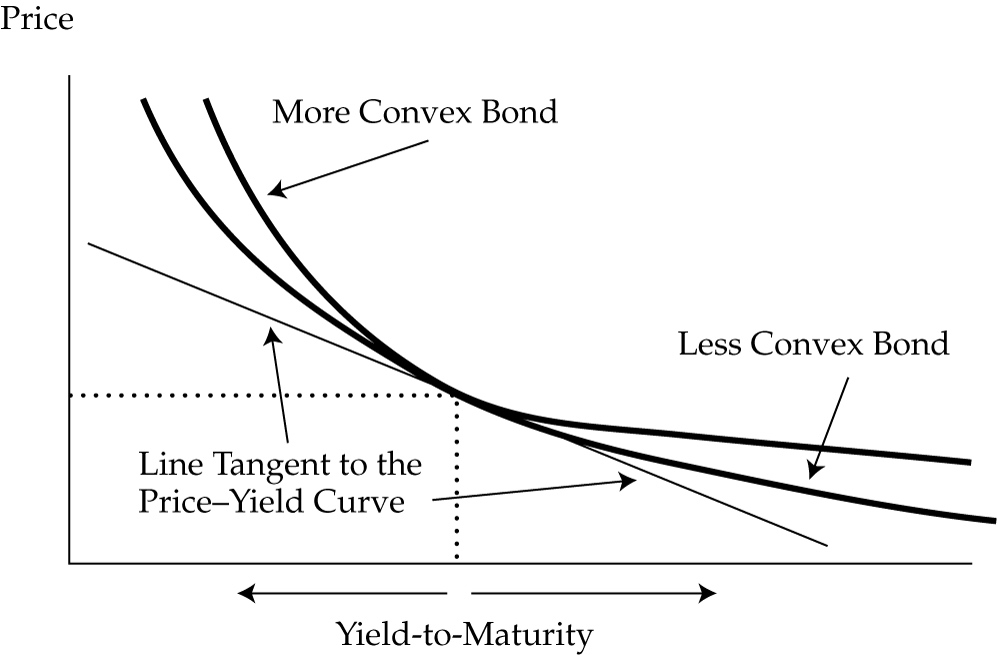

### Interest Rate Risk & Investment Horizon

理解固定收益证券的利率风险及其回报特征的一个重要方面就是投资期限，对债券投资者而言，一个首要的顾虑就是由于YTM的突然变化导致的债券价格变化。

Term structure of yield volatility指的是The relationship between the volatility of bond yields-to-maturity and times-to-maturity.

Duration与投资期限Investment Horizon之间的一个重要关系就是，当投资期限等于Macaulay Duration的时候，投资者的利率变化导致的红利再投资风险以及债券价格变动风险会互现抵消，下图展示了利率上升与下降的两种情况：

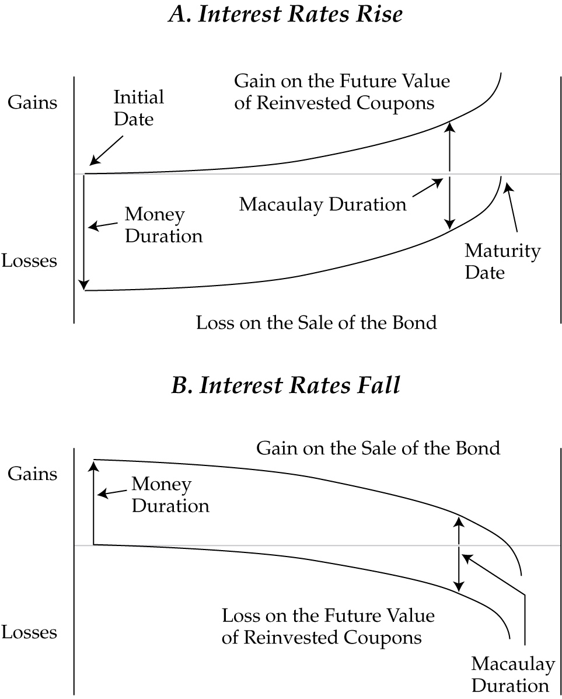

Duration Gap指的是Macaulay duration minus the investment horizon.

当Duration Gap为负的时候，投资者当前面临的是低利率风险；
当Duration Gap为正的时候，投资者当前面临的是高利率风险；
当Duration Gap为0的时候，投资者当前对冲了利率风险，称作hedged against interest rate risk。

## 信用风险

Analysis of Credit Risk

### Credit Risk and Credit-Related Risks

信用风险及信用相关风险的定义及特点。

$$Expected~loss = Default~probability \times Loss~severity~given~default$$

### 信用评级

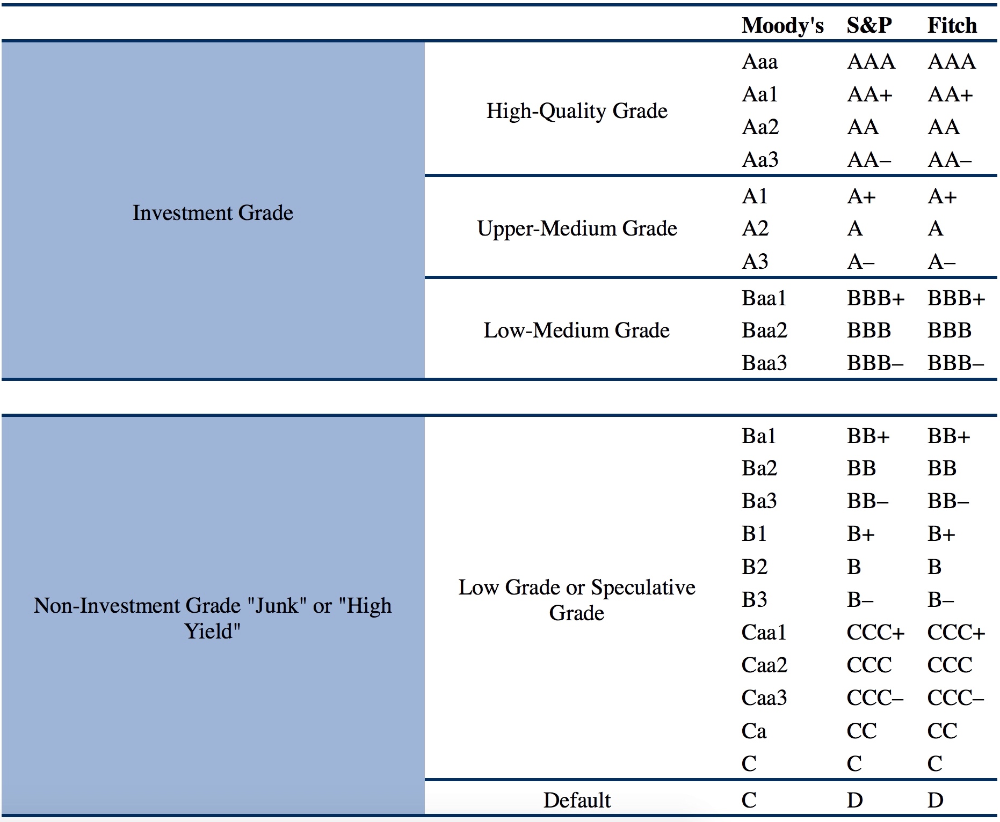

### “Notching”的含义及识别

Notching指的是Ratings adjustment methodology where specific issues from the same borrower may be assigned different credit ratings.

### 信用风险的4C分析

包括以下四个方面：

1. Capacity
2. Collateral
3. Covenants
4. Character

### Impact Factors influence the Level and Volatility of Yield Spreads

### Special Considerations when Evaluating the Credit of issuers and issues

- For High Yield Debt
- For Sovereign Debt
- For Non-sovereign Government Debt

# 债券估值与回报分析 {#fixed-income-valuation}

Fixed-Income Valuation (Sector, Industry, Company) and Return Analysis

## Fixed-Income Valuation

Bond’s Price 是指债券的价格，Coupon Rate是指债券发行者承诺每年支付的利率，Market Discount Rate是用来计算债券现值时所使用的折扣率，也称作required yield或者required rate of return。

- 当债券的 Coupon Rate 低于市场折现率的时候，债券的价格要低于其面值，称为trading at discount；
- 当债券的Coupon Rate高于市场折现率的时候，债券的价格要高于其面值，称为trading at premium；
- 当债券的Coupon Rate等于市场折现率的时候，债券的价格等于其面值，称为trading at par value。

### 债券价格及债券特征之间的关系

1. 债券价格与市场折现率Market Discount Rate负相关，当Market Discount Rate上升的时候，债券价格下降；
2. 对于固定的Coupon Rate以及time-to-maturity，当Market Discount Rate下降的时候，债券价格变化的百分比要比Market Discount Rate上升的时候变化的百分比多，这称为凸度效应；
3. 对于相同的time-to-maturity，当市场折现率Market Discount Rate的变化相同时，lower-coupon的债券价格变动要比higher-coupon的债券价格变动大，这称为Coupon效应；
4. **一般情况下**，当市场折现率Market Discount Rate的变化相同时，Long-term Bonds要比Short-term Bonds的价格变化幅度大，称为Maturity效应。

### 债券定价方法及其计算

#### Using Market Discount Rate

$$PV = {PMT \over (1+r)^1} + {PMT \over (1+r)^2} + \cdots + {PMT+FV \over (1+r)^N}$$

#### Using a Spot Rate

$$PV = {PMT \over (1+Z_1)^1} + {PMT \over (1+Z_2)^2} + \cdots + {PMT+FV \over (1+Z_N)^N}$$

上式中，$Z_1$，$Z_2$，$Z_N$分别指相应的Spot Rates，Spot Rate是指相应的即期利率，可以认为是相应期限的Zero-coupon的债券的到期收益率YTM。

#### Using a Forward Rate

### Flat Price & Accrued Interest & Full Price的关系

当债券介于两次Coupon Payment日期之间的时候，债券价格由两部分组成：Flat Price($PV^{Flat}$)，以及Accrued Interest(AI)，二者之和称为Full Price($PV^{Full}$)，一般称为发票价格invoice price或者”dirty“ price，Flat Price则称为quoted price或者"clean" price。

$$PV^{Full} = PV^{Flat} + AI$$

其中，AI的计算方法是：

$$AI = {t\over T} \times PMT$$

需要注意的是，AI并不受到YTM的影响，因此Full Price中只有Flat Price部分会受到市场折现率Market Discount Rate的影响。

Full Price的计算方法为：

$$PV^{Full} = \left[ {PMT\over (1+r)^1} + {PMT\over (1+r)^2} + \cdots + {PMT+FV\over (1+r)^N} \right] \times (1+r)^{t/T} = PV \times (1+r)^{t/T}$$

需要注意的是，上式中的PV并不等于$PV^{Flat}$，$PV^{Flat}$可以通过下式计算：

$$PV^{Flat} = PV^{Full} - AI$$

### Matrix Pricing

Matrix Pricing指的是对于交易不频繁的债券A，通过相似的交易频繁的债券的价格以及Coupon Rate计算出其到期收益率，然后通过取平均或者其他方法确定债券A的市场折扣率，从而计算其价格。

### Yield Measures

#### Yield to Maturity

**Yield to Maturity是指到期收益率，可以理解为隐含的市场折现率。按照定义来说，Yield to Maturity指的是年化收益率，但是实际中需要注意给定的是Yield to Maturity per period还是年化的Yield to Maturity，比如对于Yield to Maturity per semiannual period来说，相应的年化Yield to Maturity就等于其乘以2。**

**实际应用中要注意区分"semiannual bond basis yield"与"yield per semiannual period"之间的细微差别，比如说，a bond yield is 2% per semiannual period的意思就是说its annual yield is 4% when stated on a semiannual bond basis.**

#### Other Yield Measures

忽略周末和节假日的Yield Measures被称作street convention，相应的，考虑了周末和节假日的Yield被称作true yield，由于周末及节假日会使现金流延后，因此true yield总是会低于street convention。由于二者之间的差别很小，一般是不超过一到两个基点，因此实际中true yield很少使用。

有些情况下，公司债券的收益率会使用government equivalent yield进行表述，government equivalent yield是指将基于30/360的YTM转化为基于actual/actual的收益率。

债券中常用的收益率还有Current Yield，也称作income yield，interest yield或者running yield，是指将一年内的Coupon总数额除以债券的当前报价Flat Price。有时候还会见到Simple Yield，指的是the sum of the coupon payments plus the straight-line amortized share of the gain or loss, divided by the flat price.

#### For Fixed-Rate Bonds

对于债券的收益率，需要注意的是其相应的结算周期，对于不同的结算周期，可以用下面的公式转化：

$$\left(1 + {APR_m\over m}\right)^m = \left(1+{APR_n \over n}\right)^n$$

**当结算周期等于一年的时候称为Effect Annual Rate，结算周期不是一年的时候给出的利率一般称为Stated Annual Rate，在使用Stated Annual Rate的时候必须要注意相应的结算周期。**

对于Callable的债券来说，注意要会计算yield-to-first-call, yield-to-second-call, yield-to-worst等收益率指标。

#### For Floating-Rate Notes

$$PV = {{(Index + QM)\times FV \over m} \over (1 + {Index + DM \over m})^1} + {{(Index + QM)\times FV \over m} \over (1 + {Index + DM \over m})^2} + \cdots + {{(Index + QM)\times FV \over m} + FV \over (1 + {Index + DM \over m})^N} $$

上式中，$Index$指基准利率，$QM$指Quoted Margin, $DM$指Discount Margin，其中利率都是指的年化利率，$m$指每年的结算周期数。

#### For Money Market Instruments

Money Market Instruments指的是短期债券，期限从隔夜至一年，Money Market与Bond Market关于Yield Measures的重要区别有：

1. Bond Yield-to-Maturity是annualized and compounded，而Money Market中的Yield Measures是annualized but not compounded；
2. Bond Yield-to-Maturity可以通过标准的TVM公式进行计算，而Money Market中利率的表示方法并不标准，需要按照不同的方法进行计算；
3. 具有不同times-to-maturity的Bonds在陈述利率的时候会有一个通用的结算周期，而具有不同times-to-maturity的Money Market Instruments则具有不同的计算周期。

一般情况下，quoted money market rates 主要是 discount rates 或者 add-on rates，尽管全球不同的货币市场表示利率的方式存在不同，但是一般情况下，commercial paper, Treasury bills (a US government security issued with a maturity of one year or less), and bankers’ acceptances often are quoted on a discount rate basis，相应的，Bank certificates of deposit, repos, and such indices as Libor and Euribor are quoted on an add-on rate basis.

**值得注意的是，在货币市场中，Discount Rate具有独特的含义，通常情况下Discount Rate是用来计算现值PV的折扣率，但是在货币市场中，Discount Rate是quoted rate的一种特殊形式，利用Discount Rate(DR)以及终值FV来计算PV的公式为：**

$$PV = FV \times (1 - {Days \over Year} \times DR)$$

因此，基于PV及FV计算DR的方法为：

$$DR = {Year \over Days} \times {FV-PV \over FV}$$

注意到上式中的分母是FV而非PV，一般情况下，FV要大于PV，因此Money Market Discount Rate低估了投资者的回报率，也低估了融资者的融资成本。

相应的，基于add-on rate计算货币市场债券价格的公式为：

$$PV = {FV \over {1 + {Days \over Year} \times AOR}}$$

因此：

$$AOR = {Year \over Days} \times {FV - PV \over PV}$$

如果AOR计算的时候每年按照365天计算，此时AOR就称为Bond Equivalent Yield，或者有时候称为investment yield,也就是说，Bond Equivalent Yield是指每年按365天计算出来的货币市场债券的Add-on Rate。

需要注意的是，bonds一般具有定义好的周期性，但是Money Market中的周期性隐含的，可以通过将一年的天数除以到期所需的天数，因此具有不同到期时间times-to-maturity的Money Market Instruments具有不同的周期性，比如想要将a quoted rate of 10% as a bond equivalent yield for a 90-day money market instrument与半年前债券bonds that make semiannual coupon payments进行对比，可以根据下面的方法将money market instrument的quoted rate转换到semiannual bond basis：

$$\left(1 + {0.1 \over 365/90}\right)^{365/90} = \left(1 + {APR_2 \over 2} \right)^2,~APR_2 = 0.10127$$

### Maturity Structure & Term Structure

影响债券收益率的因素有：

1. 结算货币汇率波动；
2. 发行方的信用风险；
3. 债券的流动性；
4. 税收政策；
5. 付息周期

显然，债券的到期时间times-to-yield不同也会对其收益率产生影响，times-to-yield与yield-to-maturity之间的关系称为Maturity Structure或者Term Structure。

#### Spot Curve

Spot Curve指的是A sequence of yields-to-maturity on zero-coupon bonds. Sometimes called zero or strip curve because coupon payments are “stripped” off of the bonds，如下图所示：

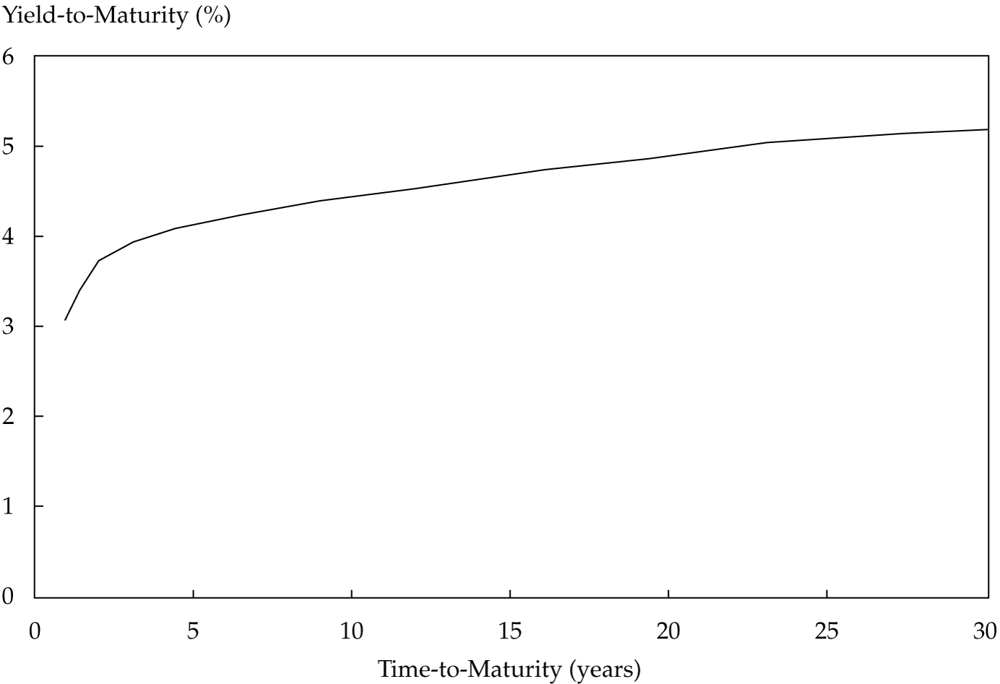

#### Yield Curve on Coupon Bonds

Yield Curve on Coupon Bonds指的是利用在市场上交易活跃的政府债券建立的times-to-maturity与yield-to-maturity之间的关系，如下图所示：

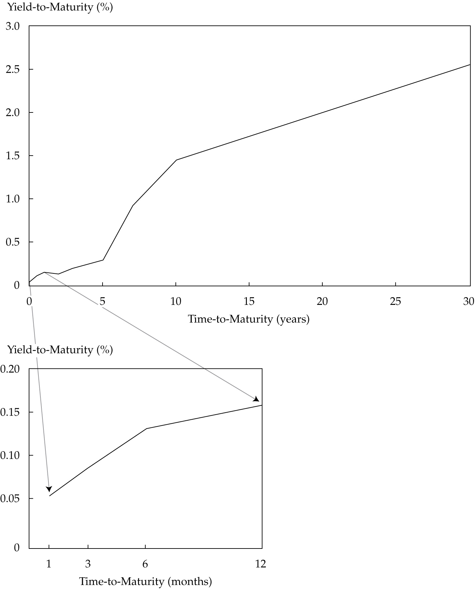

#### Par Curve

Par Curve指的是A sequence of yields-to-maturity such that each bond is priced at par value. The bonds are assumed to have the same currency, credit risk, liquidity, tax status, and annual yields stated for the same periodicity. Between coupon payment dates, the flat price (not the full price) is assumed to be equal to par value.

Par Curve可以通过Spot Curve得到，On a coupon payment date, the following equation can be used to calculate a par rate given the sequence of spot rates：

$$100 = {PMT \over (1+z_1)^1} + {PMT \over (1+z_2)^2} + \cdots + {PMT+100 \over (1+z_N)^N}$$

可以看出，上面的计算公式中PV与FV都等于面值100，据此计算出PMT，将PMT除以100就得到了par rate。

#### Forward Rate & Forward Curve

A forward rate是指the interest rate on a bond or money market instrument traded in a forward market. A forward rate can be interpreted as an incremental, or marginal, return for extending the time-to-maturity for an additional time period.

**Forward Rate的表示方式要非常熟悉，最常用的表示方法是“2y5y”，读作“the two-year into five-year rate” 或者“the 2’s, 5’s.”，第一个数字表示的是forward period的年数，第二个数字表示的是潜在债券的tenor(the time-to-maturity for a bond or a derivative contract).**

**Implied forward rates (also known as forward yields) are calculated from spot rates. An implied forward rate is a break-even reinvestment rate. It links the return on an investment in a shorter-term zero-coupon bond to the return on an investment in a longer-term zero-coupon bond.**

Spot Rates与相应的Implied Forward Rate之间的换算关系为：

$$(1+z_A)^A \times (1+IFR_{A,B-A})^{B-A} = (1+z_B)^B$$

比如，给定三年期与四年期的zero-coupon bonds的即期收益率分别为3.65%, 4.18%，并且stated on a semiannual bond basis，那么"3y1y" implied forward rate的计算公式为：

$$\left(1+{0.0365 \over 2}\right)^6 \times \left(1 + IFR_{6,2}\right)^2 = \left(1+{0.0418\over 2}\right)^8$$

$$IFR_{6,2} = 0.02889,~~~IFR_{3,1} = IFR_{6,2} \times 2 = 0.05778$$

Forward Curve是指a series of forward rates, each having the same time frame. These forward rates might be observed on transactions in the derivatives market. Often, the forward rates are implied from transactions in the cash market.

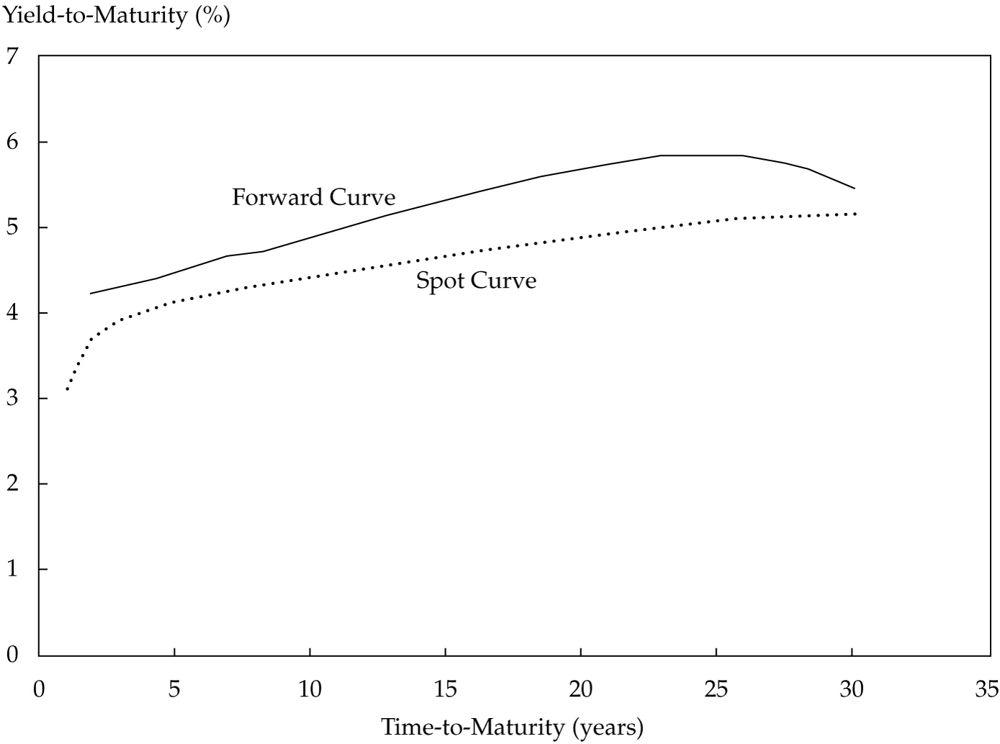

### Yield Spread Measures

#### G-spread & I-spread

A G-spread is the spread over or under a government bond rate

An I-spread is the spread over or under an interest rate swap rate.

A G-spread or an I-spread can be based on a specific benchmark rate or on a rate interpolated from the benchmark yield curve.

#### Z-Spread

A Z-spread (zero-volatility spread) is based on the entire benchmark spot curve. It is the constant spread that is added to each spot rate such that the present value of the cash flows matches the price of the bond:

$$PV = {PMT \over (1+z_1+Z)^1} + {PMT \over (1+z_2+Z)^2} + \cdots + {PMT+FV \over (1+z_N+Z)^N}$$

An option-adjusted spread (OAS) on a callable bond is the Z-spread minus the theoretical value of the embedded call option:

$$OAS = Z\text{-}spread - Option~Value~(in~basis~points~per~year)$$

## 具有内嵌期权的债券估值

Valuing Bonds with Embedded Options

# 债券投资组合管理 {#fixed-income-portfolio}

## 债券投资组合管理策略 {#fixed-income-portfolio-management}

## 债券投资组合评价基准 {#fixed-income-portfolio-benchmarks}

Fixed-Income Portfolio Benchmarks

### Types of Fixed-Income Indices

债券指数的构建及复制非常具有调整性，这是由债券市场的本质决定的，首先债券的种类非常多，根据债券的不同特征能够得到不同的分类体系，并且债券市场大部分是经销商Dealers市场，缺乏大量的、透明的历史价格数据。

固定收益债券可以从以下几个维度进行分类：

1. 发行机构type of issuer (government, government agency, corporation);
2. 融资类型type of financing (general obligation, collateralized);
3. 结算货币currency of payments;
4. 成熟期maturity;
5. 信用级别credit quality (investment grade, high yield, credit agency ratings); and
6. 通胀抵抗性absence or presence of inflation protection.

债券指数大致可以归为以下几类：

1. aggregate or broad market indices;
2. market sector indices;
3. style indices;
4. economic style indices;
5. specialized indices such as high-yield, inflation-linked, and emerging market indices

# 结构性固定收益产品 {#structured-fixed-income-products}

Structured Products

## Asset-Backed Securities

### Residential Mortgage Loans

### Residential Mortgage-Backed Securities

包括Mortgage Pass-through Securities以及Collateralized Mortgage Obligations。

### Prepayment Risk 提前偿付风险

*定义、性质及其衡量方法*

In the United States, market participants describe prepayment rates in terms of a prepayment pattern or benchmark over the life of a mortgage pool. This pattern is the Public Securities Association (PSA) prepayment benchmark, which is produced by the Securities Industry and Financial Markets Association (SIFMA). The PSA prepayment benchmark is expressed as a series of monthly prepayment rates. Based on historical patterns, it assumes that prepayment rates are low for newly originated mortgages and then speed up as the mortgages become seasoned. Slower or faster prepayment rates are then referred to as some percentage of the PSA prepayment benchmark. Rather than going into the details of the PSA prepayment benchmark, this discussion will rely on some PSA assumptions. **What is important to remember is that the standard for the PSA model is 100 PSA; that is, at 100 PSA, investors can expect prepayments to follow the PSA prepayment benchmark—for example, an increase of prepayment rates of 0.20% for the first 30 months until they peak at 6% in Month 30. A PSA assumption greater than 100 PSA means that prepayments are assumed to be faster than the standard model. In contrast, a PSA assumption lower than 100 PSA means that prepayments are assumed to be slower than the standard model.**

### Commercial Mortgage-Backed Securities

### Non-mortgage asset-backed Securities

### Collateralized Debt Obligations

CDO分层后，各层的风险特征。

