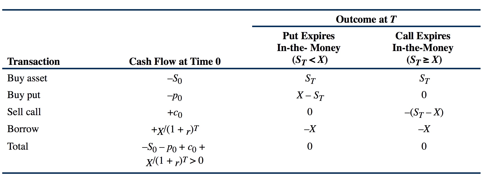

# (PART) 金融衍生品 {#derivatives .unnumbered}

# 内容简介 {#derivatives-intro .unnumbered}

# 衍生品种类及特征 {#types-of-derivatives}

Types of Derivative Instruments and Their Characteristics

## 金融衍生品的定义

A derivative is a financial instrument that derives its performance from the performance of an underlying asset.

## 金融衍生品市场分类

1. Exchange-Traded Derivatives Markets
2. Over-the-Counter Derivatives Markets

## 金融衍生品的分类

### Forward Commitments

包括以下三种：

- Forward Contracts
- Futures
- Swaps：Fixed-for-Floating Interest Rate Swap (Vanilla Swap)

### Contigent Claims

包括以下三种：

- Options：Call Option or Put Option；
- Credit Derivatives：Total Return Swap、Credit Spread Option、Credit-linked Note、**Credit Default Swap (CDS)**；
- Asset-Backed Securities，一般是指Collateralized Debt Obligations (CDOs)，包括：
    - Collateralized Mortgage Obligation (CMO)，底层证券为抵押贷款；
    - Collateralized Bond(loan) Obligations (CBOs or CLOs)，底层证券为债券或贷款；

### Hybrids

除了Forward Commitments以及Contigent Claims之外，衍生品还包括很多混合产品Hybrids，比如可以将期权与债券相结合，或者将互换协议Swaps与期权Option相结合，等等，需要明白的是可能的组合情况是几乎无穷的。

## 金融衍生品的Underlyings

主要包括以下几种类型：

1. Equities
2. Fixed-Income Instruments and Interest Rates
3. Currencies
4. Commodities
5. Credit
6. Other：比如天气Weather或者自然灾害Disasters等。

## Purposes and Benefits of Derivative Markets

1. Risk Allocation, Transfer, and Management
2. Information Discovery
3. Operational Advantages
4. Market Efficiency

## Criticisms and Misuses of Derivative Markets

1. Speculation and Gambling
2. Destabilization and Systemic Risk

# 衍生品定价与估值 {#derivative-pricing-and-valuation}

Derivative Pricing and Valuation

## 金融衍生品定价的基本原则

金融衍生品Derivatives可以认为是其Underlying的附属物，其价值受到其Underlying价格波动的影响，因此Derivatives的价值可以通过构造一个能够恰好消除风险的Derivatives及其Underlying的投资组合来得到，这样的投资组合称为hedge portfolio，由于消除了风险，因此hedge portfolio的收益率应该为无风险利率，此时Derivatives的价值就等于恰好使得hedge portfolio的收益率等于无风险利率时Derivatives的价格。

衍生品的估值原理有两个基础：

1. 持有成本或收益 Storage
2. 无套利原则 Arbitrage，也称作law of one price

## 金融衍生品定价基本方法

影响因素有：远期价格的期望值、市场无风险利率、投资标的风险溢价、Convenience Yield以及持有成本Cost of Carry:

由于衍生品与其Underlying Asset组合可以得到无风险债券的等价物，因此风险资产Asset与无风险资产Risk-free Asset组合可以得到衍生品，同样衍生品与无风险资产Risk-free Asset结合也能得到相应的风险资产Asset，该过程称作replication，指的是the creation of an asset or portfolio from another asset, portfolio, and/or derivative，如下图所示：

实际上，Replication is the essence of arbitrage。

**在金融衍生品定价方面，需要注意的是，投资者的风险偏好会影响风险资产的价格，但是无法影响相应的衍生品的价格，因此衍生品定价有时候也称作风险中性定价方法。**

**衍生品定价模型的本质是无套利原则，但是需要清楚的是，实际市场中是有可能存在套利机会的，但是 大多数情况下套利机会会迅速被市场捕捉到从而消除相应的套利机会，但是在某些情况下，市场可能需要很长时间才能够发现正确的价格，导致套利机会长期存在，在这种情况下，由于正确价格发现时间过长会导致套利者承受极大的成本及风险。因此，套利机会能够获利的前提是市场能够快速的捕捉该机会并驱动价格趋于正确值。**

## Pricing & Valuation of Forward and Futures Contracts

### 合约的期初价值与期末价值

**要注意远期和期货合约的定价Pricing以及价值Valuation之间的区别。**

远期合约的期末**价值**等于期末时Underlying的即期价格Spot Price减去合约中规定的远期价格forward price，**在金融领域，衍生品的价值指的是对多头long position的价值**：

$$V_T(T) = S_T - F_0(T)$$

合约期初应使合约的价值为0，也就是$V_0(T) = 0$，那么表面上看可以据此来计算合约价格forward price，但是这种计算方法需要估计合约期末时的即期价值$S_T$，实际上，对合约价格的计算不需要估计合约期末的即期价格，而是根据无套利原则进行定价的：

$${F_0(T) \over S_0} = (1+r)^T$$

上式中，$S_0$表示合约期初的即期价格，也就是市场价格，该价格是已知的，因此，合约价格的确定是根据市场无风险利率确定的，因此，合约价格就等于当前市场价格按照无风险市场利率计算得到的终值FV：

$$F_0(T) = S_0(1+r)^T $$

如果考虑衍生品的Underlying所带来的持有收益$\gamma$（分红或利息加上Convenience Yield），以及持有成本$\theta$，那么：

$$F_0(T) = S_0(1+r)^T - (\gamma - \theta)(1+r)^T$$

注意上式中的$\gamma$以及$\theta$都是按照合约期初的现值进行衡量的。

### 合约的期中价值

$$V_t(T)= S_t - {F_0(T) \over (1+r)^{(T-t)}}$$

如果考虑Underlying的持有收益$\gamma$（分红或利息加上Convenience Yield），以及持有成本$\theta$，那么：

$$V_t(T)= S_t - {F_0(T) \over (1+r)^{(T-t)}} - (\gamma - \theta)(1+r)^t$$

在上式中，由于$\gamma$以及$\theta$都是按照合约期初的现值进行衡量的，因此需要乘以$(1+r)^t$进行调整。

### 远期利率合约

Forwards Contracts on Interest Rates，当远期合约的Underlying是Interest Rates时，称之为远期利率合约，Forward Rate Agreements，简称为FRAs，FRAs可以是简单的直接合约，也可以是合成合约，比如下图展示了等价的简单合约和合成合约：

### Futures Contracts定价与估值

Futures Contracts与Forward Contracts最主要的区别在于Futures是每日进行结算的，而Forward Contracts是在期末进行结算的，因此二者在持有期内的实际现金流会有所不同，这会导致Forward Contracts与Futures的价格会有所不同，但是当市场利率恒定时，二者的价格应该是相等的，除此之外，如果Futures Prices与Interest Rates是不相关的，那么Futures与Forwards的Prices会相等，如果Futures Prices与Interest Rates是正相关的，那么对多头来讲，Futures要比Forwards更有利，因为上升的价格所导致的收益在利率上升的环境中再投资能够获得利润，而下降的价格导致的损失在利率下降的环境中会减少损失，因此在这种情况下，每日结算现金的Futures要比期末结算的Forward要好一些，Futures的价格要比Forwards高，如果Futures Prices与Interest Rates是负相关的，那么对多头来讲，此时Forwards要比Futures则要更有利，Forwards的价格相应的要比Futures高。

**在实际应用中，从业者几乎不对Forwards的价格以及Futures的价格进行区分，因为其差异很小可以忽略。**

**对于Futures与Forwards的Payoff来说，如果忽略time value of money，那么二者是相等的。**

## Pricing & Valuation of Swaps

可以将Swaps看作是一系列远期合约Forwards的叠加，如下图所示：

对于Swap的定价来说，其本质也是通过replication构造等价的组合，然后使其期初价值为0。

## 期权定价与估值

### 欧式期权

对于Call Option的买方而言，持有的期权在期末时的价值等于：

$$c_T = Max(0, S_T - X)$$

其中，$c_T$称为exercise value或者intrinsic value，也就是在期末的时候，如果合约价格$X$大于Underlying的即期价格$S_T$，那么期权将不会被行使，因此其价值为0；如果合约价格$X$小于Underlying的即期价格$S_T$，那么期权会被行使，且价值为$S_T - X$。

相应的，对于Put Option的买方而言，持有的期权在期末时的价值等于：

$$p_T = Max(0, X - S_T)$$

对于欧式期权来说，影响其价值的因素包括：

1. 投资标的的价值 Value of the Underlying；
2. 行使价格 Exercise Price；
3. 有效期限 Time to Expiration；
4. 无风险利率 Risk-Free Rate of Interest；
5. 投资标的的波动性 Volatility of the Underlying；
6. 持有收益及持有成本 Payments on the Underlying and Cost of Carry。

#### Value of the Underlying

- 欧式Call期权的价值与其Underlying的价值正相关
- 欧式Put期权的价值与其Underlying的价值负相关

#### Exercise Price

- 欧式Call期权的价值与Exercise Price负相关
- 欧式Put期权的价值与Exercise Price正相关

#### Time to Expiration

- 欧式Call期权的价值与Time to Expiration正相关；
- 欧式Put期权的价值与Time to Expiration可以是正相关，也可以是负相关，一般情况下，二者是正相关，但是当无风险利率不断上升的时候，有效期限越长，由利率上升引起现值减小的负面效应就会越大

#### Risk-Free Rate of Interest

- 欧式Call期权的价值与无风险利率正相关，在Call期权没有行使的最坏情况下，无风险利率对其价值没有影响；
- 欧式Put期权的价值与无风险利率负相关，因为无风险利率越大，那么在期末行使Put期权时获得的收益的现值PV就越小，而在Put期权没有行使的情况下，无风险利率对其没有影响

#### Volatility of the Underlying

- 欧式Call期权的价值与Underlying的波动性正相关
- 欧式Put期权的价值与Underlying的波动性也是正相关

#### Time Value of Option

Time与Volatility的复合影响称为期权Option的时间价值Time Value，期权的time value反应的是其投资标的价格波动所带来的不确定性的价值，因此对于期权的Time Value来说，Underlying的波动性越强，有效时间越长，期权的Time Value就越大，随着时间越来越接近到期日，期权的Time Value也在不断减少，在到期日当天，Time Value不再存在，此时期权的价值等于其行使价值Exercise Value。因此，期权的价格会随着时间的推移而减小，这个过程称作time value decay。

#### Payments on the Underlying and Cost of Carry

- 对于欧式Call期权来说，持有Underlying带来的收益会减少Call期权的价值，而持有成本则会增加Call期权的价值；
- 对于欧式Put期权来说，持有Underlying带来的收益会增加Put期权的价值，而持有成本则会减少Put期权的价值

#### 期权的最低价格

考虑以下两个策略：

1. 买入当前价值为$S_0$的股票，同时以无风险利率借入到期归还数额为$X$的现金，因此借入的金额等于$X/(1+r)^T$，因此当前该组合的价值为$S_0 - X/(1+r)^T$，而在时刻T该组合的价值为$S_T - X$；
2. 买入在时刻T以价格X买入该股票的Call期权，那么该Call期权在时刻T的价值为$Max(0, S_T - X)$；

可以发现，策略2在时刻T的价值要么要策略1相同（当$S_T \ge X$时），要么比策略1大(当$S_T < X$时)，这种情况称作策略2主导了（dominates）策略1，因此策略2中的Call期权的价值应该至少等于策略1的期初价值$S_0 - X/(1+r)^T$，并且由于期权是一种权利，因此其价值不可能小于0，因此有：

$$c_0 \ge Max \left[~0~, ~S_0 - {X \over (1+r)^T}\right]$$

上式给出了Call期权价格的下界。

同样，考虑买入Put期权以及买入债券并同时卖空股票的两个策略，可以得到Put期权价格的下界：

$$p_0 \ge Max \left[~0,~{X \over (1+r)^T} - S_0 \right]$$

因此，可以得到以下结论：

- 欧式Call期权的最低价值等于0与投资标的价格减去行使价格的现值二者之间的较大值；
- 欧式Put期权的最低价值等于0与行使价格的现值减去投资标的价格二者之间的较大值

#### Put-Call Parity

假设投资者A拥有现价为$S_0$的资产，并且该资产没有任何持有收益以及持有成本，在持有期结束时刻T该资产的价值为$S_T$，如果投资者害怕该资产价格下跌，于是有可能会买入行使价格为$X$的的Put期权，用来在时刻T以价格$X$将该资产卖出，该期权当前时刻的价值为$p_0$，因此该投资组合的当前价值等于$S_0 + p_0$，这种持有风险资产并买入Put期权的策略称为protective put，该组合的投资表现示意图如下：

在期权到期的时刻T，如果资产的价格$S_T$小于行使价格$X$，那么期权持有者会行使该期权，此时该期权的价值等于其行使价值$X - S_T$，而所持有的资产价值为$S_T$，因此总价值为$X$，而当资产的价格$S_T$大于行使价格$X$时，期权持有者不会行使该期权，此时期权的价值为0，总价值等于资产的价值$S_T$，因此protective put的期末价值等于资产价格$S_T$与行使价格$X$二者之间的较大值。

假设投资者B购买了相同资产的Call期权，且行使价格等于$X$，到期时间为$T$，并同时买入了到期时间为$T$，面值为$X$的无风险zero-coupon债券，其中Call期权的的买入价格为$c_0$，债券的现值为$X~/~(1+r)^T$，因此该组合的当前价值为$c_0 + X~/~(1+r)^T$，这种策略称为Fiduciary Call，该组合的投资表现示意图如下：

通过上图可以看出，Fiduciary Call的期末价值也等于资产价格$S_T$与行使价格$X$二者之间的较大值，具体分析从略。

由于protective put与fiduciary call具有相同的投资表现，二者可以认为是等价的，其详细对比如下图所示：

因此，protective put与fiduciary call在期初的价值也应该相等：

$$S_0 + p_0 = c_0 + X~/~(1+r)^T$$

上述关系式称为put-call parity，对其稍作变化可得：

$$p_0 - c_0 = X~/~(1+r)^T - S_0$$

*也就是说，对于同样的投资标的以及行使价格，put期权的价值与call期权的价值之差，等于行使价格的现值$X~/~(1+r)^T$减去投资标的的当前价格$S_0$。*

如果put-call parity不成立，比如$S_0 + p_0 < c_0 + X~/~(1+r)^T$，那么就会存在下图所示的套利机会：

一旦该套利机会存在，市场上的大量交易者就会迅速进行套利交易从而使得该机会迅速消失，直至达到put-call parity。

put-call parity对期权定价提供了极大的insight，我们知道，long asset and long put 等价于 long call and long risk-free bond，这与put-call parity的原始形式$S_0 + p_0 = c_0 + X~/~(1+r)^T$一致，如果对put-call parity进行变换，可以得到：

$$p_0 = c_0 - S_0 + X~/~(1+r)^T$$

$$c_0 = p_0 + S_0 + X~/~(1+r)^T$$

$$S_0 = c_0 - p_0 + X~/~(1+r)^T$$

$$X~/~(1+r)^T = S_0 + p_0 - c_0$$

上面的变换方程分别反映了四组等价的投资组合，如下图所示：

**上图的理解方法是，加号表示多头long，减号表示空头short，因此解决此类问题的方法就是通过put-call parity及其各种变换形式来判断投资组合是否等价。**

#### Put-Call-Forward Parity

由于投资者可以通过买入无风险债券并签订远期合约实现与购买相应的Underlying Asset等价的投资策略，因此protective put等价于买入无风险债券以及put期权并签定远期合约，其关系如下图所示：

由于protective put与fiduciary call等价，因此也存在下图所示的关系：

也就是说，Fiduciary Call与Protective Put with Forward Contract等价，其关系可以表示为：

$${F_0(T)\over (1+r)^T} + p_0 = c_0 + {X\over (1+r)^T}$$

上面的式子称为put-call-forward parity，也可以写作：

$$p_0 - c_0  = {X - F_0(T) \over (1+r)^T}$$

*也就是说，对于同样的投资标的以及行使价格，put期权的价值与call期权的价值之差，等于put期权的行使价格$X$的现值减去相应期限的远期合约价格$F_0(T)$的现值。*

### Binomal Valuation of Options

$$c_0 = {\pi c_1^+ + (1-\pi)c_1^- \over 1+r}~,~~\pi={1+r-d \over u-d}$$

上式表明了，call option的价值当前等于期末可能的两种行使价值的加权平均值，其权重由价格上升因子$u = {S_1^+ \over S_0}$以及价格下降因子$d = {S_1^- \over S_0}$决定。

从call option的定价公式可以看出，call option的价值与underlying的价格波动性密切相关，但是与价格上升及下降的概率无关，公式中的$\pi,1-\pi$称为伪概率，因此分母$\pi c_1^+ + (1-\pi)c_1^-$可以看作是期末期权价值的期望值，分母表示需要利用无风险利率$r$计算其现值。

相应的，对于put option来说，其定价公式为：

$$p_0 = {\pi p_1^+ + (1-\pi)p_1^- \over 1+r}~,~~\pi={1+r-d \over u-d}$$

### 美式期权

记美式Call期权的期初价值为$C_0$，美式Put期权的期初价值为$P_0$，由于美式期权可以在到期前的任意时刻行使权力，因此其价值至少等于相应的欧式期权，因此有：

$$C_0 \ge c_0~,~~P_0 \ge p_0$$

由于美式期权能够在期初行使，因此有：

$$C_0 = Max~(0, ~S_0-X)\\P_0 = Max~(0, ~X-S_0)$$

由于欧式期权的价值$c_0,p_0$存在下述关系：

$$\begin{split}
c_0 & \ge Max\left[0, S_0 - {X \over (1+r)^T}\right] \\
p_0 & \ge Max\left[0, {X \over (1+r)^T } - S_0 \right]
\end{split}$$

考虑到$X~/~(1+r)^T < X$，因此有：

$$\begin{split}
C_0 &\ge Max\left[ 0, S_0 - {X \over (1+r)^T}\right] \\
P_0 &\ge Max\left[ 0, X - S_0\right]
\end{split}$$

根据上面的公式，可以得出两条结论：

1. 对于美式Call Option来说，只有当投资标的Underlying能够带来现金流收益的时候，如分红或者利息，其价值可能会大于欧式Call期权（还要考虑有可能存在的持有成本），这些分红或者收益是美式Call Option有可能提前行使的唯一原因；
2. 对于美式Put Option来说，其价值总是会高于欧式Put期权，因为Underling的价值具有下限，当Underling的价值为0时，提前行使Put期权能够获得最大收益，此外，Underling的分红或利息会推出Put期权的行使，而持有成本则会使Put期权持有人倾向于提前行使该权利。

# 远期市场与远期合约估值 {#forward-markets}

Forward Markets and Valuation of Forward Contracts

# 期货市场与期货合约估值 {#future-markets}

Futures Markets and Valuation of Futures Contracts

# 期权市场与期权合约估值 {#option-markets}

Options Markets and Valuation of Option Contracts

# 互换市场与互换合约估值 {#swap-markets}

Swaps Markets and Valuation of Swap Contracts

# 信用衍生品市场及信用衍生工具 {#cds}

Credit Derivatives Markets and Instruments

# 衍生品在投资组合管理中的应用 {#derivatives-in-portfolio}

Uses of Derivatives in Portfolio Management

此部分主要需要掌握以下两点内容：

1. 看涨期权和看跌期权的到期价值、利润、最大/小盈亏、盈亏平衡点的计算；
2. Covered call和Protective put的到期价值、利润、最大/小盈亏、盈亏平衡点的计算。

对上面两部分内容的计算其实很简单，对于第一个问题，首先判断期权到期时是否会被行使，如果不行使则其到期价值为0，如果行使其价值可以根据行使价格与投资标的的价格之差计算，相应的利润，最大最小盈亏（考虑极端情况）以及盈亏平衡点（利润为0的点）都可以相应计算出来；

对于第二部分，计算的关键在于将投资组合的到期价值分为两部分，一部分是期权的价值，按照第一个问题的方法计算，另一部分时投资标的本身的价值，也就是到期时候的即期价格，二者相加即得投资组合的总价值，相应的利润、最大最小盈亏（考虑极端情况）以及盈亏平衡点也就都可以相应的计算出来了。

对利润的计算可以将其分成从期权买卖中得到的利润（期权买方为负，期权卖方为正），以及投资标的价格变化带来的利润（根据期权行使价格、购买价格以及到期价格计算，期权买方为正或者0，期权卖方为负或者0），二者相加即为总利润。

## Call期权与Put期权

**Call期权的多头与空头的到期价值：**

**Put期权的多头与空头的到期价值：**

## Covered Call

Covered Calls指的是卖出Call Option并买入相应的Underling，其到期价值如下：

## Protective Puts

Protective Puts指的是买入Put Option并买入相应的Underlying，其到期价值如下：

