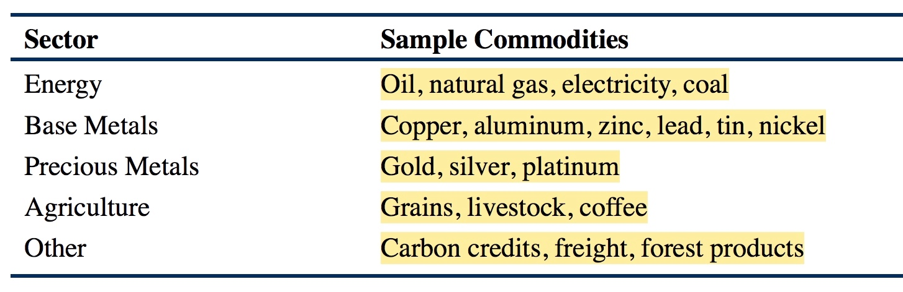

# (PART) 另类投资 {#alter-investment .unnumbered}

# 内容简介 {#alter-investment-intro .unnumbered}

股票，债券以及现金的多头称为Traditional Investments，其他的统称为Alternative Investment.

# 另类投资的种类及特征 {#alter-investments-types}

Types of Alternative Investments and Their Characteristics

包括对冲基金、私募股权投资、房地产、商品、基建等。

## Hedge Funds

掌握Hedge Funds以及Fund of Hedge Funds的管理费计算方法。

对冲基金的策略可以分为以下几类：

- Event-Driven Strategies：包括Merger Arbitrage，Distressed/Restructuring，Activist，Special Situations等；
- Relative Value Strategies：包括Fixed Income Convertible Arbitrage，Fixed Income Asset Backed，Fixed Income Asset Backed，Volatility，Multi-Strategy等；
- Macro Strategies；
- Equity Hedge Strategies：包括Market Neutral，Fundamental Growth，Fundamental Value，Quantitative Directional，Short Bias，Sector Specific等。

## Private Equity

包括控股权收购Leveraged buyouts (LBOs)，风险投资Venture Capital，发展基金Development capital，Distressed investing等。

**私募股权投资的管理费收取方法与对冲基金有很大不同，对冲基金是基于assets under management进行收费的，而私募股权投资则是基于committed capital进行收费的，committed capital指的是投资人LPs同意提供给私募基金的资金，管理费一般为committed capital的百分之一至百分之三，私募基金首先募集到committed capital，然后在三到五年之内按照承诺将资金投资到合适的项目中，只要committed capital没有完全投资出去，管理费用都是按照committed capital计算的，而不是invested capital，这点要特别注意。当committed capital完全投资出去之后，管理费的计算是根据investment vehicle中的剩余资金进行计算的，当投资退出时，资金被退还给投资者，此部分投资就停止付费了。**

风险投资的几个阶段：

1. Formative-stage：
    - Angel Investing，天使投资，指capital provided at the idea stage；
    - Seed Stage，种子轮投资，一般用了支持产品开发或者市场调研；
    - Early Stage，指初期阶段投资，一般用来支持企业开始运营，此阶段的企业已经准备将产品上市了
2. Later-stage Financing，指Expansion Venture Capital，指企业扩展阶段，一般在开始售卖产品之后，但是在企业IPO上市之前；
3. Mezzanine venture capital：一般用来作为IPO上市之前的支持资金。

私募股权投资的退出机制有：

1. Trade Sale；
2. IPO；
3. Recapitalization
4. Secondary Sales
5. Write-off/Liquidation

## Real Estate

房地产投资类型有：

1. Residential Property
2. Commercial Real Estate
3. REIT Investing
4. Mortgage-Backed Securities (MBS)
5. Timberland and Farmland

## Commodities

## Infrastructure

## Other Alternative Investments

## Potential Benefits of Alternative Investments

# 房地产估值 {#real-estate}

# 私募股权投资与风险投资 {#pe-and-vc}

# 期货投资基金 {#commodities}

# 不良证券与破产 {#bankruptcies}

# 对冲基金 {#hedge-fund}

# 另类投资管理策略 {#alter-management-strategies}

Alternative Investment Management Strategies

## Risk Management of Alternative Investments

