# (PART) 投资组合与财富规划 {#portfolio .unnumbered}

# 内容简介 {#portfolio-intro .unnumbered}

Portfolio Management and Wealth Planning

# 现代投资组合理论 {#modern-portfolio-theory}

Modern Portfolio Management Concepts

## Investment Clients

投资客户可以分为两类，个人客户individual investors以及机构客户institutional investors。

### 个人投资者

Individual Investors的投资动机多种多样，其短期投资目标大多是为子女教育、购买房屋家具车辆等大件、或者是创办企业积累资金，除此之外，个人投资者会为了退休后的生活进行投资，这也是大多数个人投资者的主要目标，很多国企或者民企的职工都通过Defined Contribution Pension Plan (DC Plan) 进行投资。DC Plan指的是规定了contributions但是没有规定benefits的pension plan，其最大的特点是employee承担投资风险并保证投入足够的资金以满足退休后的需求，比如美国的401(k) Plans，英国的Group Personal Pension Schemes，以及澳大利亚的Superannuation Plans等。

个人投资的目的大致可以分为两类：1. 投资于具有升值潜力的资产以实现财富增长；2. 从资产中获得收入以满足退休后的日常生活。对于第一类投资者来说，主要投资标的为风险较大的具有升值空间的股票类资产，而第二类投资者的主要投资标的则是固定收益类证券或者具有稳定分红的股票。此外，对于个人投资者而言，投资需求取决于个人的整体财务状况，需要考虑其职业前景、是否拥有住房、家庭负担等多方面的因素。

### 机构投资者

机构投资者包括多种类型，常见的有以下几种：

- Defined Benefit Pensions Plans
- University Endowments
- Charitable Foundations
- Banks
- Insuance Companies
- Investment Companies
- Sovereign Wealth Funds (SWFs)

机构投资者是金融市场中的主要参与者，下图是经济合作与发展组织OECD(Organisation for Economic C0-operation and Development)成员国主要机构投资者的资金量，可以看到，Investment Funds占比最大，Insurance Companies以及Pension Funds紧随其后，值得注意的是，不同类型的机构投资所占的比例在各成员国中存在很大的差异性：

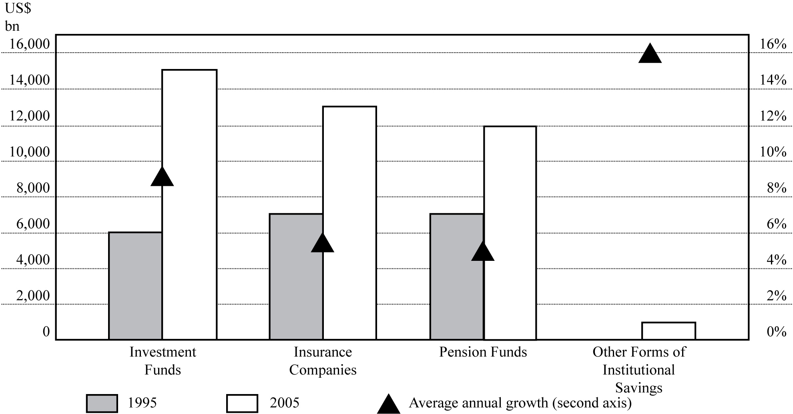

> Source: OECD, “Recent Trends in Institutional Investors Statistics” (2008): www.oecd.org/dataoecd/53/49/42143444.pdf.

#### Defined Benefit Pension Plans

DB Plans指的是雇主承诺在员工退休之后每年向员工支付一定的金额，也就是说，未来每年需要支付的金额是事先约定好的，雇主有义务在约定好的时间节点履行该义务，因此DB Plans的管理者需要保证能够按时支付资金，因此需要投资一些能够在未来提供稳定现金流入的投资产品，比如固定收益类产品，此外，DB Plans的投资期限一般都很长，即使对于不再接受新成员的DB Plans来说，其投资期限也有可能长达70年至80年左右。

#### University Endowments

University Endowments主要是为大学的发展以及学生的奖学金等提供资金支持，其管理的资产规模差异性较大，但是在美国大多数的University Endowments的规模都很大，下图展示的是截至2008年末美国Top10的University Endowments：

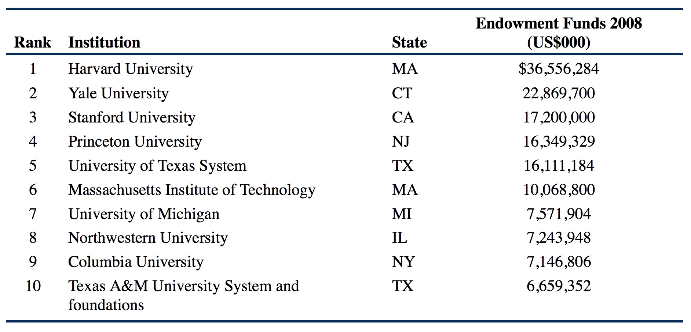
> Source: NACUBO, “2008 NACUBO Endowment Study” (January 2009): www.nacubo.org/Research/NACUBO_Endowment_Study.html.

对于美国以外的国家和地区来说，资本规模最大的是英国的牛津和剑桥，第三名则是爱丁堡大学。

#### Charitable Foundations

慈善基金会也是主要的机构投资者之一，同样，美国的慈善基金会一般规模都比较大，但是在美国以外的其他地区也存在资产规模巨大的慈善基金会，比如英国的Wellcome Trust (a UK-based medical charity)，截至2008年其资产规模约为130亿英镑，以及香港的Li Ka Shing Foundation(a Hong Kong-based education and medical charity with grants, sponsorships, and commitments)，其资产规模大约为107亿港币。

下图是美国Top10的基金会列表：

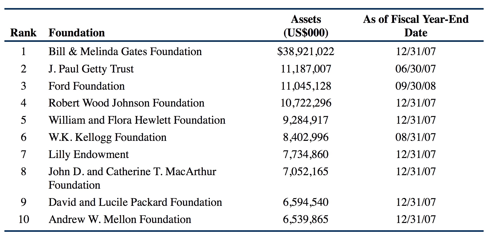
> Source: Foundation Center (2009): http://foundationcenter.org.

**典型的Endowments或者Foundations的投资目标是在为机构的目标提供资金来源的同时，维持并增加基金的实际资产数额（通货膨胀调整后的金额），因此大多数Endowments或者Foundations创立时的目标都是永远存在并不断发展的。**

#### Banks

银行主要是接收存款并发放贷款，在某些情况下，如果银行有多余的存款没有放贷出去，就需要将闲散资金进行投资以获取收益，但是银行的投资一般比较保守，多以固定收益类产品为主，而非股票或风险较大的资产。

在某些国家，包括美国，会对银行投资股票进行相关的法律规定，除了对投资产品的低风险要求之外，银行投资的资产还需要具有较好的流动性，从而在储户需要取回存款时能够快速变现以满足取款要求。

银行对于多余存款的投资目标是获得比其融资成本(也就是存款利率)更高的收益率。

#### Insuance Companies

保险公司从投保人手中收取保费，并承诺在满足商定的条款时支付投保人事先约定的赔付金额，因此，与银行类似，保险公司的投资也是相对比较保守的。保险分为人寿保险以及财产保险两大类，对于不同类别的保险公司来说，其投资时间线一般也不同，比如人寿保险类的保险公司的投资时间线一般较长。

#### Investment Companies

投资公司一般是指管理共同基金的公司，也属于机构投资者，对于共同基金的经理来说，基金本身实际上是其客户，此外，共同基金也可以被看作是投资产品。

共同基金一般会投资于特定的领域，并且有时候会受到法律法规或者公司内部章程的监管和约束。

#### Sovereign Wealth Funds (SWFs)

SWFs指的是政府拥有的投资基金，一般来说规模巨大。世界上最大的SWF是Abu Dhabi Investment Authority管理的，其资金来源主要是石油收入，截至2009年3月，其资金规模达到了6270亿美元。

下图是截至2009年3月全球Top10的SWFs列表：

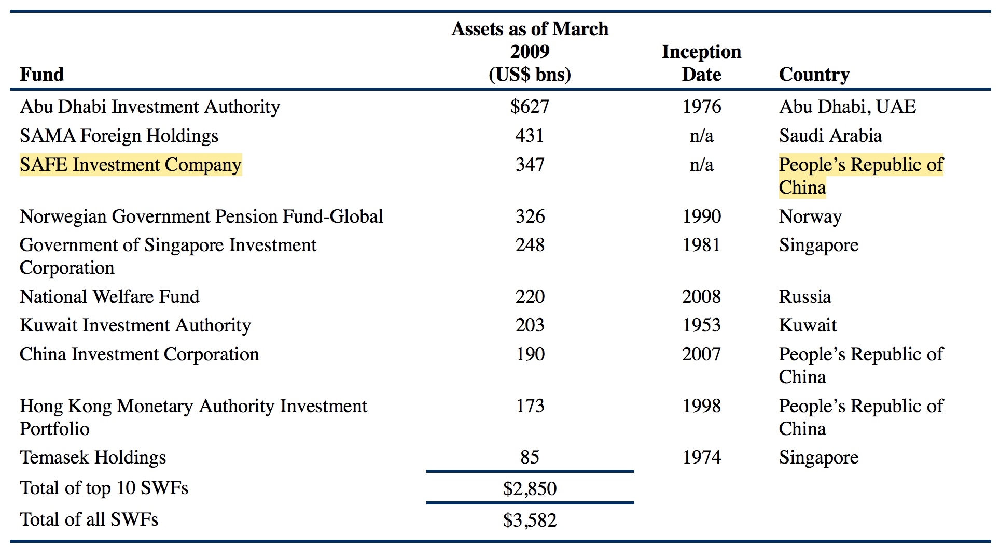
> Source: SWF Institute (www.swfinstitute.org).

## Steps in the Portfolio Management Process

为客户建立并维持合适的投资组合并不是一件简单的事情，需要遵循以下三个步骤：

1. 计划阶段 The Planning Step
2. 执行阶段 The Execution Step
3. 反馈阶段 The Feedback Step

### 计划阶段

- 理解客户需求 Understanding the Client's Needs
- 准备IPS Preparation of an Investment Policy Statement

### 执行阶段

- 分配资产 Asset Allocation
- 证券分析 Security Analysis
- 组合构建 Portfolio Construction

### 反馈阶段

- 投资监控并调整 Portfolio Monitoring and Rebalancing
- 业绩评估与报告 Performance Measurement and Reporting

## Pooled Investment

Pooled Investment指的是共用资金投资，也就是指很多的散户将资金投入到特定的理财产品中，从而聚集起大量的资金，然后交由专业的基金经理进行投资。市场上可供投资的理财产品的种类非常多，其中对资金量要求最低的是共同基金以及ETFs，对资金量要求最高的则是对冲基金以及私募股权投资：

- **Minimum Investment: As Little as US$50**
    - Mutual Funds
    - Exchange Trade Funds
- **Minimum Investment: US$100,000**
    - Mutual Funds
    - Exchange Trade Funds
    - Separately Managed Accounts
- **Minimum Investment: US$1,000,000+**
    - Mutual Funds
    - Exchange Trade Funds
    - Separately Managed Accounts
    - Hedge Funds
    - Private Equity Funds

### Mutual Funds

共同基金是一种比较常见的投资理财产品，对最低投入资金的要求很小，属于"平民投资"的类型。共同基金一般是按该基金的组成证券每日的收盘价来计算其净值，Investment Company Institute的报告指出，截至2008年第三季度，在调查的23个国家内存在超过48,000个共同基金，其总的净值大约为20万亿美元。

下图是截至2007年末，世界主要国家及地区的共同基金比例图：

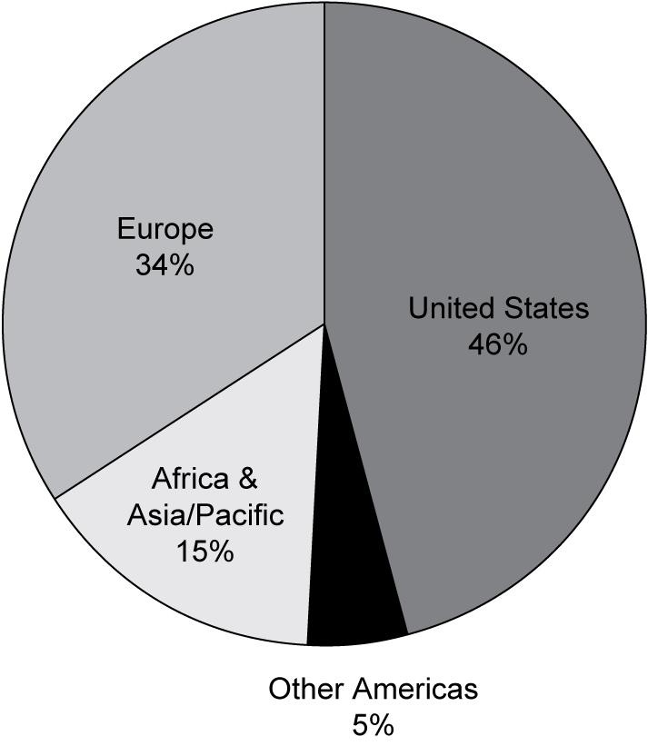
> Source: 2008 Investment Company Fact Book, 48th ed. (p. 20): (www.ici.org/pdf/2008_factbook.pdf).

共同基金是个人投资者及机构投资者最为重要的投资工具之一，共同基金可以分为开放式共同基金open-end fund，或者是闭合式共同基金closed-end fund。

开放式基金可以接受新的投资，也允许资金的撤出，对于新的投资，可以根据投资时每份基金的净值以及投资的金额额外发行相应的份额，对于资金的撤出，则按照撤出时每份基金的净值进行结算。因此，相当于如果当日是资金净流入，则按照每份基金的净值额外发行相应的份额，如果是资金净流出，则减少相应的份额。

闭合式基金则不允许新的投资，新的投资者可以通过购买基金中已有的份额进行投资，撤资者可以通过将其份额卖给其他投资者变现，因此，基金中总的发行份额保持不变。*与开放式基金不同，由于基金的份额数目是固定的，因此买入及卖出会受到该基金份额的供求关系影响，基金份额的买卖价格可能高于也可能低于其净值。*

**开放式基金与闭合式基金的优缺点**

对于开放式基金来说，其规模可以很容易的实现增长，但是对基金经理对现金流入及流出的管理提出了很大的挑战及压力，主要弊端在于当投资者撤资时，基金经理将不得不变卖资产以获得现金，而当有新的资金流入时，基金经理需要寻找新的适合投资的资产。因此，对于开放式基金而言，一般来说会保留一部分的现金用于满足流动性要求，对现金预留比例进行合理的估计及判断是比较有挑战性的难题。

闭合是基金没有开放式基金所面临的现金流管理问题，但是其规模增长的能力有限，在美国2008年末9.6万亿美元的所有共同基金中，闭合式基金只占有大约2%的比例。

**Load Fund & No-load Fund**

共同基金还可以分为 Load Fund 以及 No-load Fund 两种，其中No-load Fund指的是基金的买入及赎回不需要缴纳额外的费用，只需要缴纳基金管理的年费即可，而Load Fund则除了需要缴纳基金管理的年费以外，还需要根据买入及赎回的金额缴纳相应比例的手续费。目前，Load Fund类型的基金已经越来越少了。

共同基金还可以按照其投资的资产类型进行分类，一般来说，可以分为以下四大类：

- Stock Funds (domestic and international)
- Bond Funds (taxable and non-taxable)
- Hybrid or Balance Funds (combination of stocks and bonds)
- Money Market Funds (taxable and non-taxable)

下面分别是美国及欧洲的共同基金按照不同资产类型进行分类的比例图：

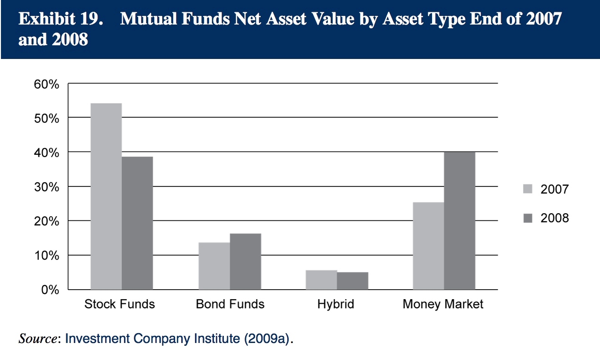

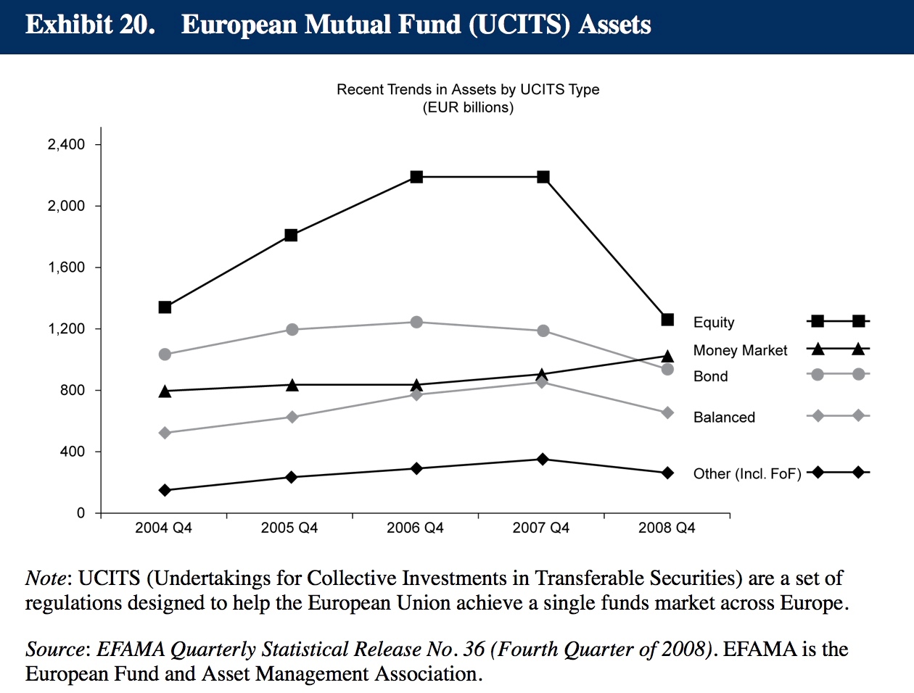

从上面的比例图可以看出，股票型基金以及货币市场基金占据了美国共同基金市场的大部分比例，但是有意思的是，二者的相对比例在2007年到2008年发生了很大的转变，这是由于2008年金融危机股票价格下跌导致的。

### Exchange Traded Funds

ETFs结合了开放式共同基金以及闭合式共同基金的特点，ETFs的交易方式类似于闭合式共同基金，但是其买入及卖出份额的价格近似于其每份基金的净值，这点类似于开放式共同基金。

ETFs的创建是由基金发起人完成的，首先基金发起人决定ETFs将要包含的证券，然后基金发起人联系拥有这些证券的机构投资者将这些证券存入该基金，作为回报，机构投资者获得了该ETF的原始份额，一般为50,000份或100,000份，这些份额可以被转卖给公众投资者。此外，机构投资者也可以通过返还其原始份额赎回自己的证券。这个机制阻止了溢价或者折扣的产生。

世界上首支ETF于1993年在美国创建，欧洲的首支ETF于1999年出现，截至2008年末，美国有超过700个ETF，总资产净额超过5000亿美元。

**ETFs与指数型共同基金的区别**

ETFs与指数型共同基金的主要区别是：指数型基金的投资者是直接从基金中购买份额，并且所有的投资都是按照资产净值进行结算，而对于ETF而言，投资者是从其他的投资者手中购买份额，其交易方式类似于股票。因此，ETF中可以引入做空机制以及加杠杆购买的机制，投资者所支付的价格是交易时的市场公允价格，其可能等于也可能不等于基金份额的资产净值，但是代表了交易时刻买家及卖家愿意接受的交易价格。实际上，ETF的市场价格与其底层证券的资产净值非常接近。

ETFs与指数型共同基金的其他区别包括：交易成本、交易价格、分红的处理方式、以及最低投资金额等方面：

- ETFs的交易费用一般较低，但是与共同基金不同，ETFs的投资者会产生经纪人佣金费用；
- 对于共同基金而言，所有的购买及赎回都是按照当日的收盘价进行的，而ETFs在交易日内是连续进行交易的，其交易价格时刻都在发生变化；
- ETFs中的分红会直接支付给股东，而共同基金的分红一般是进行再投资，因此ETF会存在直接的现金流，而共同基金则没有；
- ETFs的最低投资要求一般较低，投资者可以投资的份额低至一份，而共同基金一般不行

ETFs一般被认为拥有税收优势，该优势与资本增益有关，而与分红无关。对于两种基金来说，只要没有资产的买卖，投资者就不用支付由于资产增益导致的税收，然而，对于共同基金而言，由于资本的流入及流出，存在更高的产生需要缴税的资本增益的可能性，但是总体上而言，ETFs是否具有税收优势以及具有多大的优势并不明确。

### Separately Managed Accounts

SMA对针对具有显著资产的个人或者机构投资者的资产管理服务，也经常称作managed account, wrap account, 或者individually managed account，也就是指特定个人或者机构专属的投资账户。

SMA是由投资专家根据客户的特定需求进行管理的，包括客户的投资目标、风险承受能力以及税收状况等，SMA与共同基金的核心区别在于SMA中的资产直接由特定的投资者单独拥有，因此，与共同基金不同，SMA的投资者可以控制买入及卖出的资产，以及交易的时机，并且SMA中的交易会考虑投资者特殊的税收需求。

SMA的主要不足在于其最低资金要求比共同基金要高得多，一般来说，SMA的最低资金需求在100,000美元至500,000美元之间。

### Hedge Funds

对冲基金最早可以追溯到1949年由A.W.Jones & Co所管理的基金，其提供了能够抵消典型的"long-only"资产的策略，从此开启了对冲基金这个全新的产业。

对冲基金的策略一般具有显著的风险并且大量使用杠杆，其投资策略较为复杂，近年来，对冲基金大范围引入了衍生品的使用。

Hedge Funds与Mutual Funds的关键区别在于绝大多数的Hedge Funds免除了报告的规定，在美国，如果投资公司只拥有100名或更少的投资者客户，或者投资者客户超过了100名但是"qualified purchasers"(指投资超过500万美元的个人)的数目不超过500，就不需要向证监会SEC注册[Section 3(c)1 of the Investment Company Act of 1940]。

为了获得对报告的豁免资格，对冲基金不能销售给普通大众，只能通过private placement进行销售，此外，Regulation D of the Securities Act of 1933要求对冲基金只能提供给accredited investors(accredited individual指的是资产净值超过100万美元或者最近两年中有一年的收入超过20万美元并且当年拥有同样的收入预期的个人，accredited institution指的是投资资产最低为500万美元的机构)，因此，这些规定导致了对冲基金的投资者与共同基金的投资者存在很大的区别。

从1955年开始到2008年末，对冲基金产业已经增长到超过9200支基金且总资产额约为1.4万亿美元，需要注意，并不是所有的对冲基金都是一样的，对冲基金使用的策略多种多样，比如：

- Convertible Arbitrage: 买入可以按照固定价格转换为股份的可转变债券，同时卖空相应的股票；
- Dedicated Short Bias: Taking more short positions than long positions；
- Emerging Markets: Investing in companies in emerging markets by purchasing corporate or sovereign securities；
- Equity Market Neutral: Attempting to eliminate the overall market movement by going short overvalued securities and going long a nearly equal value of undervalued securities；
- Event Driven: Attempting to take advantage of specific company events. Event-driven strategies take advantage of transaction announcements and other one-time events；
- Fixed-Income Arbitrage: Attempting to profit from arbitrage opportunities in interest rate securities. When using a fixed-income arbitrage strategy, the investor assumes opposing positions in the market to take advantage of small price discrepancies while limiting interest rate risk；
- Global Macro: Trying to capture shifts between global economies, usually using derivatives on currencies or interest rates；
- Long/Short: Buying long equities that are expected to increase in value and selling short equities that are expected to decrease in value. Unlike the equity market neutral strategy, this strategy attempts to profit from market movements, not just from identifying overvalued and undervalued equities.

上面的列表并不是所有的，实际中还存在很多其他的策略。对冲基金并不是对所有投资者开放的，对于新的对冲基金需要最低250,000美元的投资，对于已经建立好的对冲基金则需要1,000,000美元或更多的投资。

此外，对冲基金的投资者在流动性方面会受到限制，比如只允许每季度赎回资金，或者约定最高达五年的锁定期。管理费除了包括所管理资金的固定比例之外，还包括根据投资业绩计算得到的激励费用，典型的佣金方案是所管理资金的1%到2%作为管理费加上超额业绩的20%作为激励费用。

### Buyout and Venture Capital Funds

近年来显著增长的两种投资领域是控股权收购buyout以及风险投资venture capital funds，这两种投资都是股权投资，但是投资的公司类型不同。二者共同的本质特点是它们都不是被动投资者，并且在公司的管理中非常积极德发挥作用。此外，所持有的股权一般是私有的，而非公开交易的股份，并且，二者都没有长期持有股权的意图，而是计划在合适的时机退出以获得利润。

Buyout以及Venture Capital Funds和对冲基金的操作方式类似，都具有较高的资金要求，并且流动性会受到一定的限制。

#### Buyout

Buyout的本质是通过购买上市公司所有的股份将其变为私有公司，早期的Leveraged Buyouts(LBOs,1960s中期到1990s初期)造就了现代的私有股权企业，这些LBOs都是高杠杆交易，使用所收购公司的现金流支付其欠款的利息，在现在的LBOs中，私有股权公司为购买上市公司筹集特定的资金，然后将其转化为私有公司，并同时进行重组。收购所需的资金通常是通过大量的增加发行的债券而来，典型的融资方式是25%的股权融资与75%的债券融资，成功的关键在于增加公司的现金流。大多数的私募股权投资基金private equity funds都不打算长期持有所投资的公司，而是在三到五年之内寻求合适的退出机会，比如通过IPO上市或者将其出售给其他公司。一般来说，私募股权公司的投资项目较少，但是数额巨大。

#### Venture Capital Funds

风险投资与控股权收购的不同点在于风险投资不是购买已经运行的公司，而是对处于创业阶段的公司提供资金，风险投资基金在其所投资的创业公司的管理方面发挥着非常重要的作用，除了提供资金以外，同时会提供监督及建议。

与Buyout类似，风险投资一般具有有限的投资时限，会在三到五年之内寻求退出机会，一般来说，风险投资会进行大量的小额投资，期望少数的投资能够带来丰厚的回报，以弥补其他失败投资所导致的损失。

## Portfolio Approach to Investing

> 不要将所有鸡蛋放到同一个篮子里面。

组合投资的好处包括以下几方面：

1. 投资多样化Diversification以避免投资灾难；
2. 减少投资风险；
3. 能够通过调整投资组合的不同组分权重对风险和回报进行权衡trade-off；

但是，需要注意的是，组合投资并不一定能够避免下行风险，尤其是在全球化的今天，不同投资产品之间可能会存在高度的相关性，比如当全球经济发生衰退的时候，组合投资带来的好处就比较有限，因此，现代组合投资理论（Morden Portfolio Theory，简称MPT）认为，投资者不仅需要通过组合投资使得投资标的多样化，也需要重点关注不同投资标的之间的相关性。

## Portfolio Risk and Return

### Major Return Measures

#### Holding Period Return

指投资者在持有期间获得的收益，与Total Return是同义词，计算方法为：

$$R = {P_t-P_{t-1}+D_t \over P_{t-1}}$$

#### Arithmetic Mean Return

$$\overline R_i = {1\over T} \sum_{i=1}^T R_{it}$$

#### Geometric Mean Return

$$\overline R_{Gi} = \sqrt[T] {\prod_{t=1}^T (1+R_{it})} - 1$$

#### Money-weighted Return (IRR)

$$\sum\limits_{t=0}^T {CF_t \over (1+IRR)^t} = 0$$

#### Annualized Return

$$r_{annual} = (1 + r_{period})^{number~of~periods~in~one~year}~ - 1$$

在上式中，如果结算周期以季度为单位，每年等于4个季度，如果是以月为单位，每年等于12个月，如果是以周为单位，每年等于52周，如果是以天为单位，每年按照365天计算。

#### Portfolio Return

$$R_p = \sum_{i=1}^n w_iR_i,~\sum_{i=1}^n w_i = 1$$

#### Real Returns

名义收益率$r$可以看作是由三部分组成：实际无风险收益率$r_{rF}$，通货膨胀溢价$\pi$，以及风险溢价$r_{RP}$，实际收益率Real Return是从名义收益率中剔除掉通货膨胀因素后的收益率，其关系如下：

$$\begin{split}
& (1+r) = (1+r_{rF})(1+\pi)(1+r_{RP}) \\
& (1+r_{real}) = (1+r_{rF})(1+r_{RP}) \\
& (1+r_{real}) = {(1+r) \over 1+\pi}
\end{split}$$

### Variance and Covariance of Returns

#### A Single Asset

$$\begin{split}
& \sigma^2 = {\sum\limits_{t=1}^T(R_t-\mu)^2 \over T} \\
& s^2 = {\sum\limits_{t=1}^T(R_t-\overline R)^2 \over T-1}
\end{split}$$

#### A Portfolio of Assets

$$\begin{split}
& \sum_{i=1}^N w_i =1 \\
& \sigma_p^2 = Var(R_p) = Var\left(\sum_{i=1}^N w_iR_i\right) \\
& \sigma_p^2 = \sum_{i,j=1}^N w_iw_jCov(R_i,R_j) \\
& \sigma_P^2 = \sum_{i=1}^N w_i^2Var(R_i) + \sum_{i,j=1,i\ne j}^N w_iw_jCov(R_i,Rj)
\end{split}$$

对于包含两种资产的投资组合：

$$\begin{split}
& \sigma_p^2 = w_1^2\sigma_1^2 + w_2^2\sigma_2^2 + 2w_1w_2Cov(R_1,R_2) \\
& \sigma_p^2 = w_1^2\sigma_1^2 + w_2^2\sigma_2^2 + 2w_1w_2\rho_{12}\sigma_1\sigma_2
\end{split}$$

### Risk Return Trade-off

Risk Return Trade-off表示预期收益率与风险是正相关的，也就是说，从长期来看，在不接受更高风险的情况下，是无法从有效市场获得更高的收益的。高收益总是伴随着高风险。

考虑金融资产的Risk Return Trade-off有三种方法：

1. 根据资产的历史表现计算其平均收益率，并使用标准差衡量其投资风险；
2. 关注资产的risk premium，也就是投资者每承担额外的单位风险所带来的预期收益（减去名义无风险利率进行调整）；
3. 绘制资产在一定时期内的累积实际收益曲线，如下图所示：
    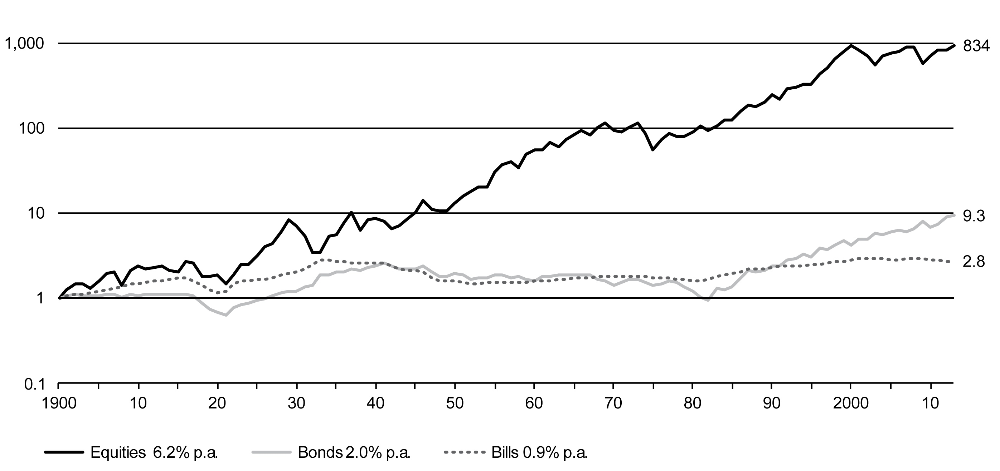
    > Source: E. Dimson, P. Marsh, and M. Staunton, Credit Suisse Global Investment Returns Yearbook 2012, Credit Suisse Research Institute (February 2009). This chart is updated annually and can be found at www.tinyurl.com/DMSsourcebook.

从长期来看，高风险确实能够带来高回报，因此，可以有理由宣称，长期情况下，高风险的资产会具有高回报的市场价格，这也是risk-averse investor的一个特征。

### Risk Aversion

Risk Aversion指的是the degree of an investor’s inability and unwillingness to take risk，也就是对风险的厌恶程度。

根据投资者对风险的态度可以将其分为三种类型：

1. 风险厌恶者 Risk Aversion;
2. 风险喜好者 Risk Seeking;
3. 风险中立者 Risk Neutral

Risk tolerance则指的是the amount of risk an investor is willing to tolerate to achieve an investment goal. The higher the risk tolerance, the greater is the willingness to take risk. Thus, risk tolerance is negatively related to risk aversion.

#### Utility Theory and Indifference Curves

$$U = E(r) - {1\over 2}A\sigma^2$$

上式中， $U$表示投资效用，$E(r)$表示该投资的期望回报，$\sigma^2$表示该投资的方差，$A$表示对风险厌恶程度的衡量，含义是投资者对额外承担风险所要求的边际回报，$A$越大，说明投资者对风险的厌恶程度越高，此时当投资风险上升的时候，为了维持投资效用不变，需要相对更高的预期收益率。

**Utility cannot be compared among individuals or investors because it is a very personal concept. From a societal point of view, by the same argument, utility cannot be summed among individuals.**

Risk-Averse Investors的Indifference Curves如下图所示：

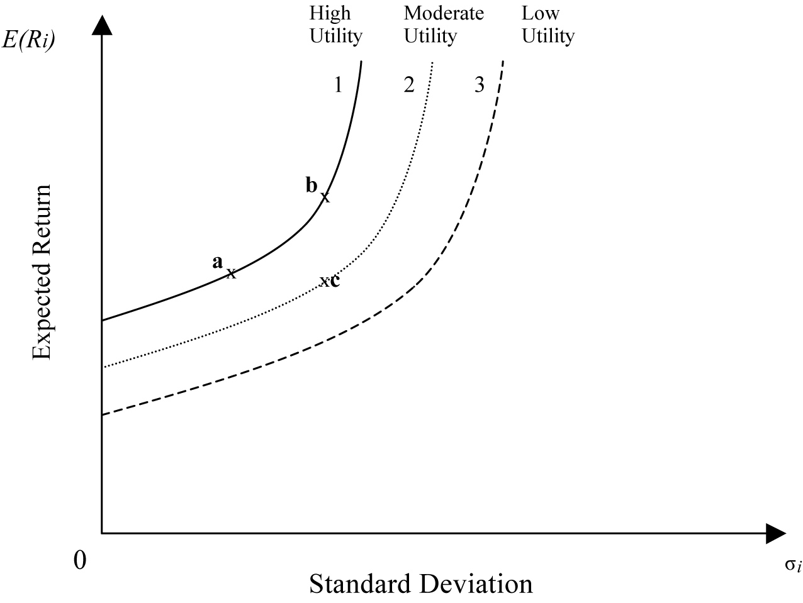

不同类型投资者的Indifference Curves如下图所示：

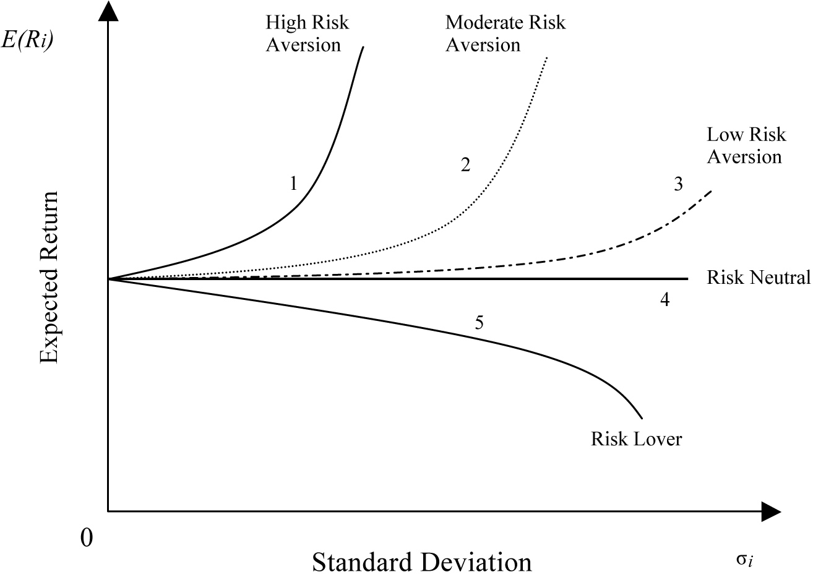

### Capital Allocation Line (CAL)

**CAL is a graph line that describes the combinations of expected return and standard deviation of return available to an investor from combining the optimal portfolio of risky assets with the risk-free asset.**

$$E(R_p) = w_1R_f + (1-w_1)E(R_i)$$

$$\sigma^2_p = w_1^2\sigma_f^2 + (1-w_1)^2\sigma_i^2 + 2w_1(1-w_1)\rho_{12}\sigma_f\sigma_i = (1-w_1)^2\sigma_i^2$$

$$\sigma_p = (1-w_1)\sigma_i$$

$$w_1 = 1-{\sigma_p \over \sigma_i}$$

$$E(R_p) = (1-{\sigma_p \over \sigma_i})R_f + {\sigma_p \over \sigma_i}E(R_i) = R_f + {{E(R_i)-R_f}\over {\sigma_i}}\sigma_p$$

从公式中可以看出，CAL是表示的是投资组合的预期收益率与该投资组合标准差之间的关系，CAL在纵轴上的截距为无风险利率$R_f$，其斜率为${E(R_i)-R_f}\over \sigma_i$，其含义是相对于无风险资产来说，风险资产每增加单位风险所要求的额外收益率，如下图所示：

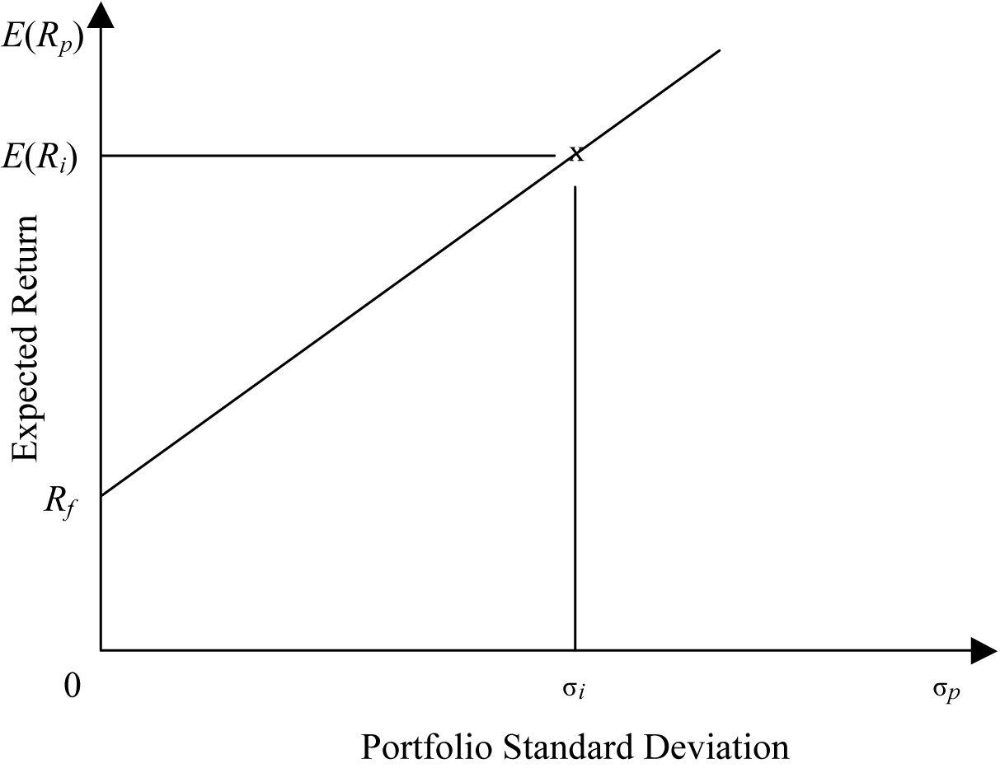

CAL给出了无限数目的具有可行性的投资组合，对于具体的投资者而言，为了找到最合适的投资组合，可以将CAL与该投资者的Indifference Curves结合：

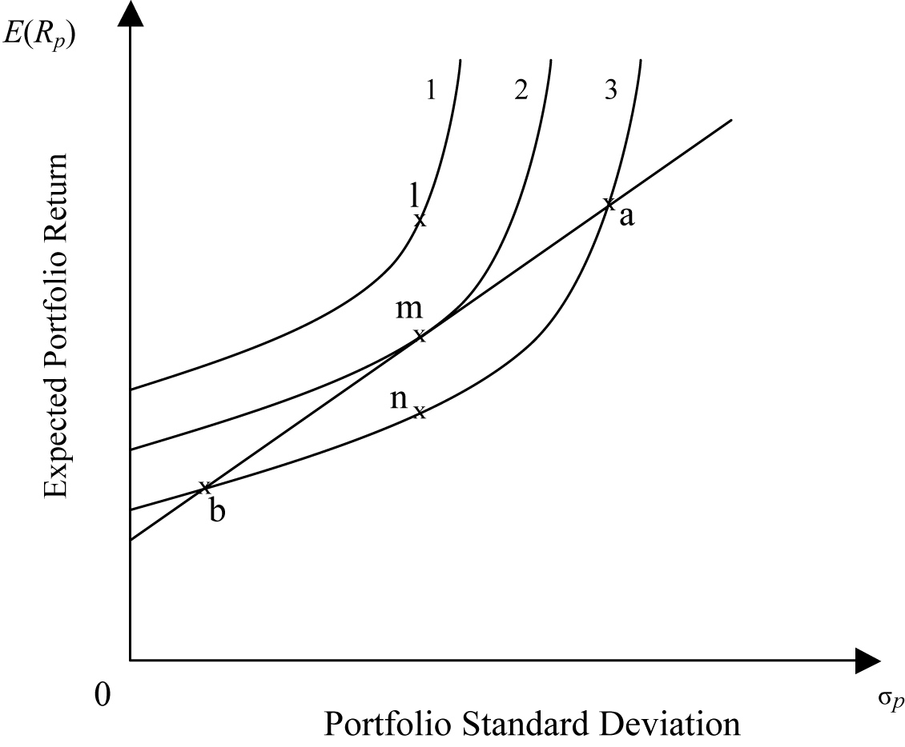

在上图中，CAL上的点表示的是最优的投资组合，CAL下方的点表示的是可行的投资组合，但是并不是投资者所偏好的投资组合，因为对于CAL下方的点，总可以找到风险相同但是预期回报率更高的投资组合，而对于CAL上方的点，则是难以实现的，因此对于如上图所示的投资者来说，2号Indifference Curve与CAL的切点是最优的投资组合。

下图是对具有不同风险偏好程度的投资者进行投资组合选择的示意图：

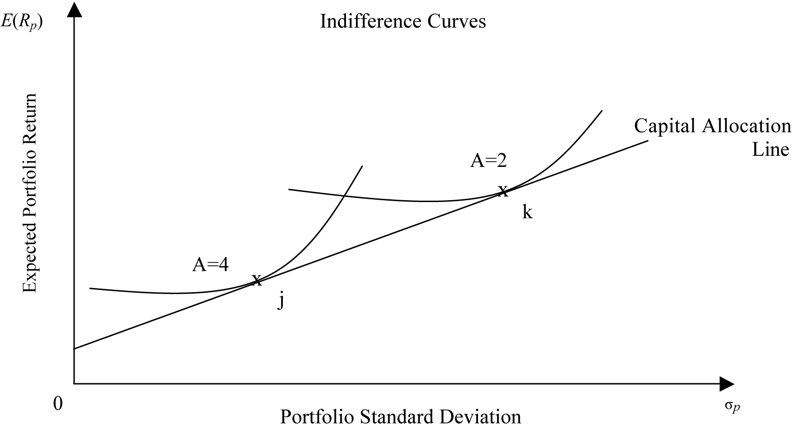

### Portfolio of two Risky Assets

$$R_p = w_1R_1 + (1-w_1)R_2$$

$$\sigma_p = \sqrt{w_1^2\sigma_1^2 + w_2^2\sigma_2^2 + 2w_1w_2Cov(R_1,R_2)}$$

其中，$Cov(R_1,R_2) = \rho_{12}\sigma_1\sigma_2$

对于由两种风险资产组成的投资组合，其预期收益率与投资风险之间的关系如下：

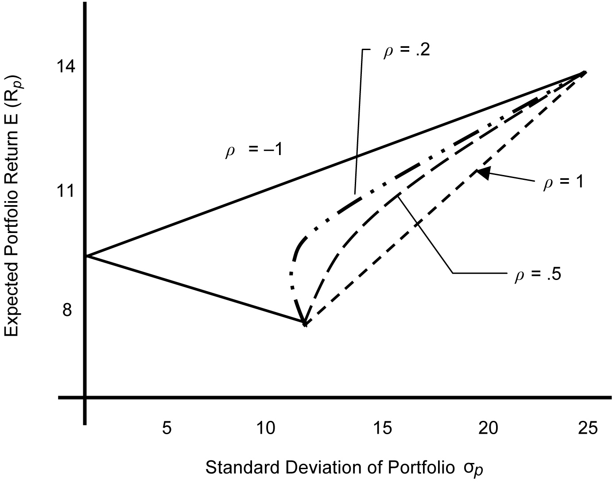

### Portfolio of Many Risky Assets

如果将风险资产扩展到所有可投资资产，那么就能够得到无数种投资组合，我们将其称为Investment Opportunity Set, 如下图所示：

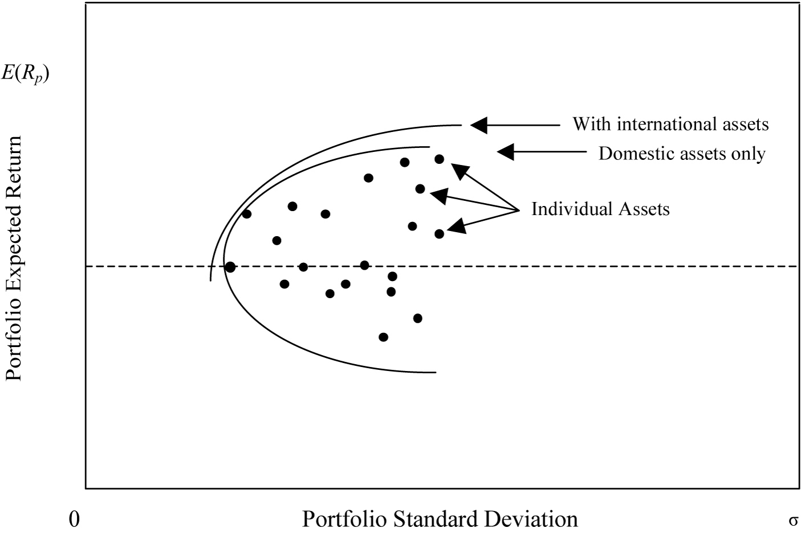

### Minimum-variance Frontier and Efficient Frontier

Minimum-variance Frontier是指The portfolio with the minimum variance for each given level of expected return.

Global Minimum-variance Portfolio是指the portfolio on the minimum-variance frontier with the smallest variance of return，也就是Minimum-variance Frontier的最左边的点所代表的投资组合。

Efficient Frontier则是指The graph of the set of portfolios offering the maximum expected return for their level of risk (standard deviation of return)，也就是Minimum-variance Frontier上位于Global Minimum-variance Portfolio之上的部分。也称作Markowitz efficient frontier。

三者的关系如下图所示：

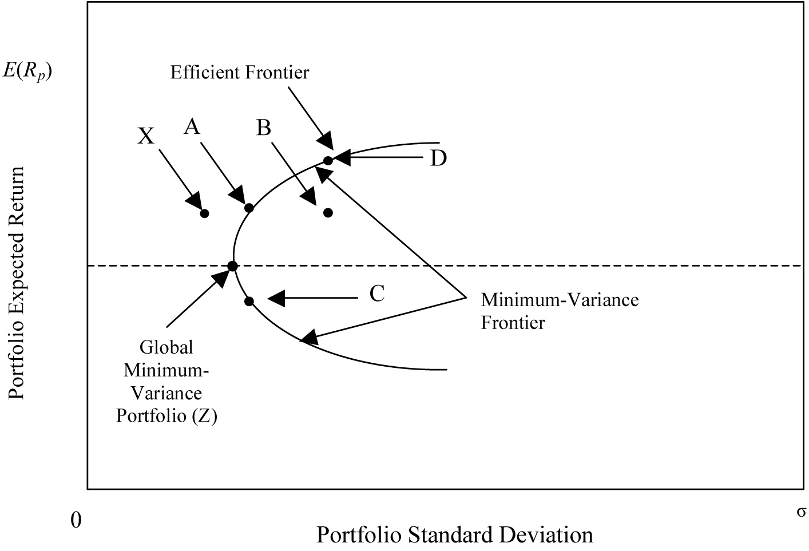

利用CAL与Efficient Frontier可以进行最优投资组合的选取，示意图如下：

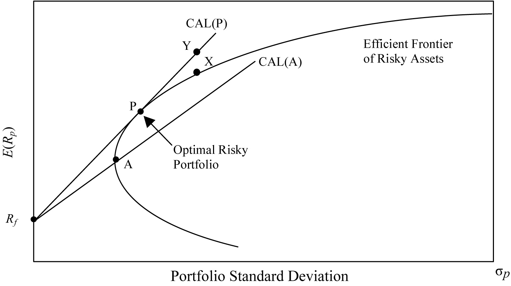

需要清楚的是，在上图中，Minimum-variance Frontier之上的点及其右侧部分表示的是相对于风险资产的可行投资组合，Efficient Frontier之上的点则表示相对于风险资产的最优投资组合，如果将风险资产与无风险资产进行组合，可行的投资组合就是CAL线上的点及其右侧部分所代表的投资组合，将Efficient Frontier上的不同点所代表的最优风险资产组合与无风险资产结合能够得到不同的CAL，最优的CAL则是与Efficient Frontier相切的那一条-CAL(P)，因为相对于其他的CAL来说，承担同样的风险CAL(P)上面的点总要比其他CAL上面的点所代表的投资组合的预期回报率要高，因此对于投资者来讲，其最优投资组合应该在CAL(P)上进行选择。

CAL(P)代表了不同风险程度下的最优投资组合，对于具体的投资者来说，为了找到合适的最优投资组合，还需要考虑投资者的Indifference Curve，如下图所示：

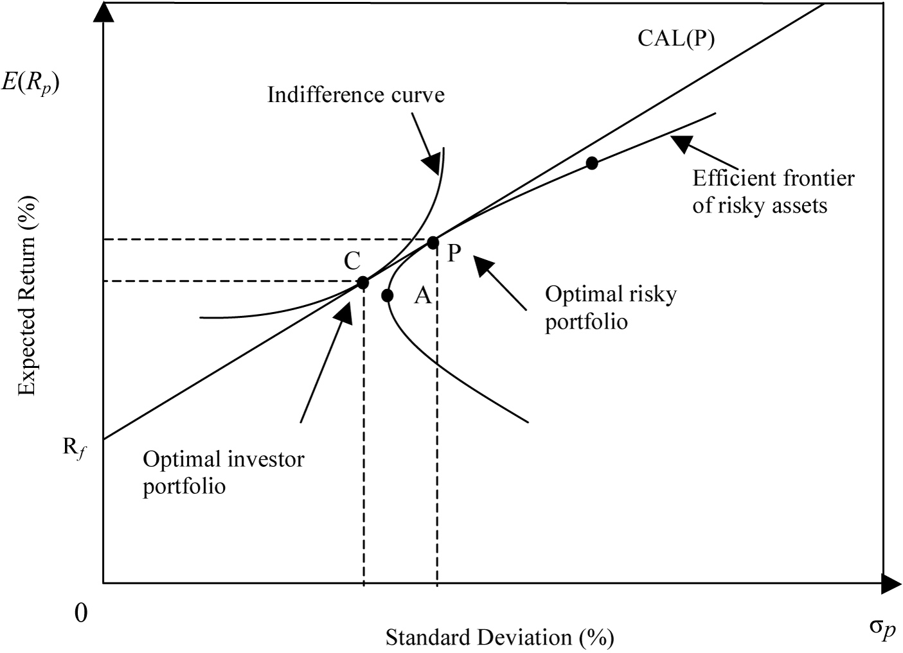

### Capital Market Line (CML)

A capital allocation line includes all possible combinations of the risk-free asset and an investor’s optimal risky portfolio. The capital market line is a special case of the capital allocation line, where the risky portfolio is the market portfolio.

The S&P 500 is a proxy of the market portfolio, which is the optimal risky portfolio.

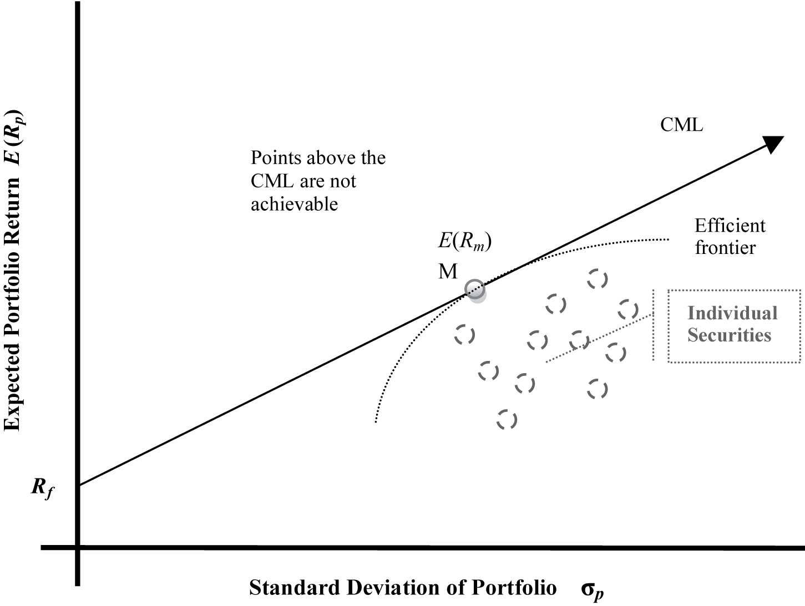

如果投资者能够以无风险利率借到钱，那么投资者就可以选取上图中CML线上M点之上的投资组合，这种投资组合称为Leveraged Portfolio，如果投资者借钱的利率高于无风险利率，CML线上M点之上的线段的斜率就会发生变化，如下图所示：

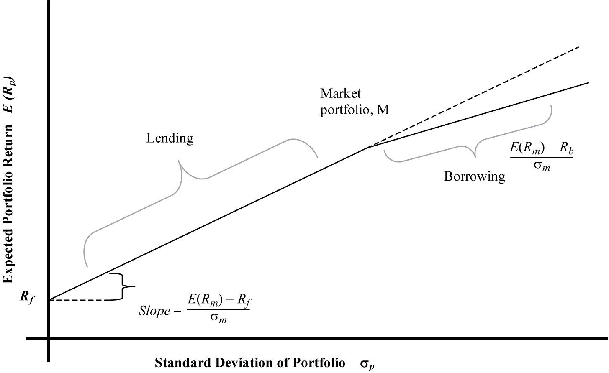

### Systematic vs. Nonsystematic Risk

Systematic risk指的是不可避免的市场固有风险，是不能够通过diversification消除的风险，形成系统风险的因素包括利率、通胀率、经济周期、政治不确定性以及自然灾害等，这些因素会影响整个市场，并且无法避免其影响。

Systematic risk能够通过证券选取或者引入杠杆得到放大，也可以通过引入与现有投资组合相关性低的证券得到减小。

Nonsystematic risk指的是特定资产或特定行业所伴随的风险，比如新药研究成功、重大油田的发现等事件对证券价格的影响，这些事件都是直接影响相关的企业或者其所在的行业，但是对不相关的行业则没有影响，因此投资者可以通过投资多样化diversification避免nonsystematic risk。

Systematic Risk，或者说non-diversifiable risk是有市场价格的，投资者只能通过承担系统风险得到补偿，而不能通过承担nonsystematic risk 或者 diversifiable risk而得到补偿，因此，风险厌恶的投资者risk-averse investors只愿意持有well-diversified的投资组合.

### Return Generating Models

#### The Market Model and Beta

The Market Model is a regression equation that specifies a linear relationship between the return on a security (or portfolio) and the return on a broad market index.

$$R_i = \alpha_i + \beta_iR_m+e_i,~\alpha_i=R_f(1-\beta_i)$$

$$\beta_i = {\rho_{i,m}\sigma_i \over \sigma_m}$$

利用$\beta$计算预期收益：

$$E(R_i) = R_f + \beta_i(E(R_m)-R_f)$$

#### Capital Asset Pricing Model (CAPM)

CAPM的公式如下：

$$E(R_i) = R_f + \beta_i(E(R_m)-R_f)$$

##### Assumptions

1. Investors are risk-averse, utility-maximizing, rational individuals.
2. Markets are frictionless, including no transaction costs and no taxes.
3. Investors plan for the same single holding period.
4. Investors plan for the same single holding period.
5. All investments are infinitely divisible.
6. Investors are price takers.

##### Security Market Line (SML)

**The security market line (SML) is a graphical representation of the capital asset pricing model with beta, reflecting systematic risk, on the x-axis and expected return on the y-axis.**

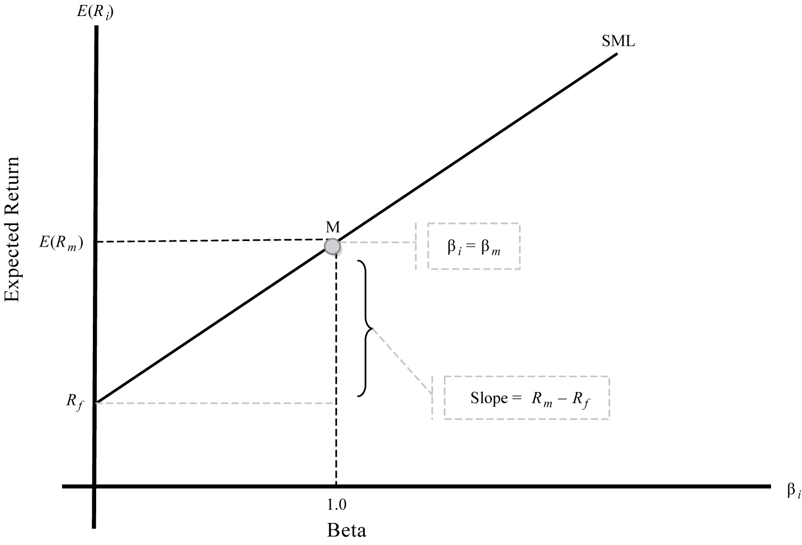

**Undervalued & Overvalued relative to the security market line (SML).**

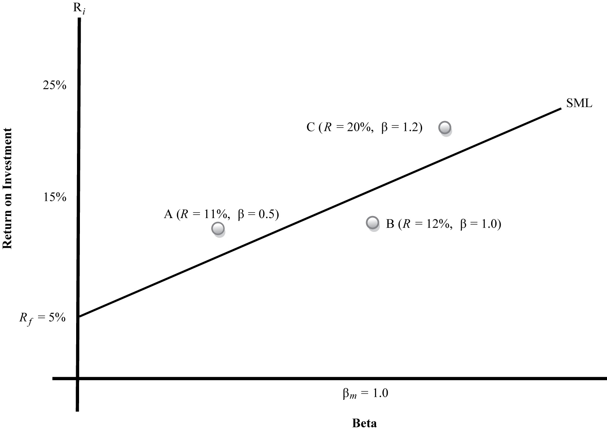

如上图所示，在SML下方的证券，比如B，如果投资于整个市场，由于承担相同的风险能够得到更高的回报，因此B被认为是overvalued，而对于位于SML上方的A和C，如果投资于整个市场，由于承担相应的风险只能获得更低的回报，因此A和C被认为是undervalued。而对于SML之上的点，则可以认为是properly valued。

##### Security Characteristic Line (SCL)

与SML类似，可以为特定证券绘制Security Characteristic Line，其含义是该证券相对于无风险利率的超额收益与市场相对于无风险利率的超额收益之间的关系，因此其斜率是该证券的Beta，与Y轴的交点是该证券相对于市场的超额收，其方程式为：

$$R_i - R_f = \alpha_i + \beta_i(R_k-R_f)$$

如下图所示：

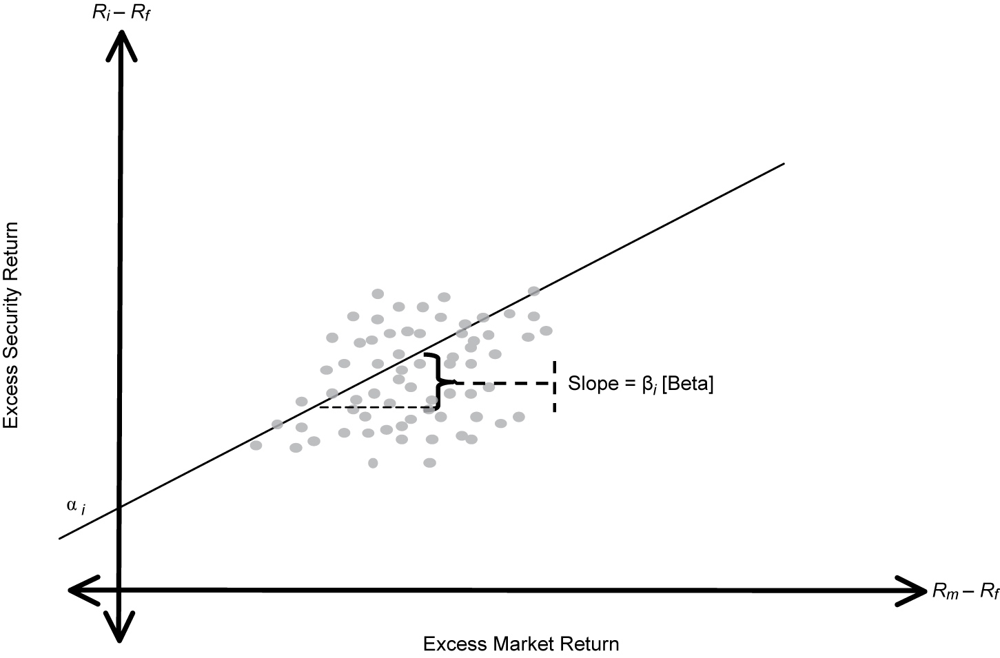

##### Calculate Expected Return using CAPM

首先计算Portfolio Beta:

$$\beta_p = \sum_{i=1}^mw_i\beta_i,~\sum_{i=1}^mw_i=1$$

然后，利用Beta及CAPM计算投资组合的预期收益：

$$E(R_p) = R_f + \beta_p(E(R_m)-R_f)$$

##### CAPM的限制及不足

在实际应用中，需要理解CAPM的基本假设，并牢记CAPM的缺陷及不足，避免做出错误的决策。

### Portfolio Performance Evaluation

#### Sharpe Ratio & Treynor Ratio

Shapre Ratio与Treynor Ratio是相对指标，其本身的数值不能表示投资表现是优于市场还是劣于市场，其中**Shapre Ratio使用的是Total Risk，Treynor Ratio使用的是beta risk**。

The Sharpe ratio uses the total risk of the portfolio, not its systematic risk, it suffers from two limitations. First, it uses total risk as a measure of risk when only systematic risk is priced. Second, the ratio itself (e.g., 0.2 or 0.3) is not informative.

$$Sharpe~ratio = {R_p - R_f \over \sigma_p}$$

The Treynor ratio is a simple extension of the Sharpe ratio and resolves the Sharpe ratio’s first limitation by substituting beta risk for total risk.

$$Treynor~ratio = {R_p - R_f \over \beta_p}$$

#### M-Squared & Jensen's Alpha

M-Squared 以及 Jensen‘s Alpha是绝对衡量指标，M-Squared等于0表示投资组合与市场表现一致，大于0说明优于市场，小于0说明劣于市场表现，M-Squared衡量的是Total Risk。

Jensen‘s Alpha等于0表示投资组合与市场表现一致，大于0说明优于市场，小于0说明劣于市场表现，M-Squared与Treynor ratio类似，衡量的是systematic risk。

M2 was created by Franco Modigliani and his granddaughter, Leah Modigliani—hence the name M-squared. M2 is an extension of the Sharpe ratio in that it is based on total risk, not beta risk.

$$M^2 = (R_p-R_f){\sigma_m \over \sigma_p} - (R_m - R_f)$$

Like the Treynor ratio, Jensen’s alpha is based on systematic risk. We can measure a portfolio’s systematic risk by estimating the market model, which is done by regressing the portfolio’s daily return on the market’s daily return.

$$\alpha_p = R_p - [R_f + \beta_p(R_m-R_f)]$$

## 资产配比 {#asset-allocation}

## 行为金融学 {#behavioral-finance}

# 市场期望回报的经济学分析 {#economic-analysis-and-setting-capital-markets-expectations}

# 投资组合的构建与完善 {#portfolio-construction-and-revision}

Portfolio Construction and Revision

## 投资协议书 {#ips}

The Investment Policy Statement (IPS)

### Major Components of an IPS

- Introduction. This section describes the client
- Statement of Purpose. This section states the purpose of the IPS.
- Statement of Duties and Responsibilities. This section details the duties and responsibilities of the client, the custodian of the client’s assets, and the investment managers.
- Procedures. This section explains the steps to take to keep the IPS current and the procedures to follow to respond to various contingencies.
- Investment Objectives. This section explains the client’s objectives in investing.
- Investment Constraints. This section presents the factors that constrain the client in seeking to achieve the investment objectives.
- Investment Guidelines. This section provides information about how policy should be executed (e.g., on the permissible use of leverage and derivatives) and on specific types of assets excluded from investment, if any.
- Evaluation and Review. This section provides guidance on obtaining feedback on investment results.
- Appendices: (A) Strategic Asset Allocation (B) Rebalancing Policy. Many investors specify a strategic asset allocation (SAA), also known as the policy portfolio, which is the baseline allocation of portfolio assets to asset classes in view of the investor’s investment objectives and the investor’s policy with respect to rebalancing asset class weights.

IPS中最重要的两个部分是投资目标与投资限制，关注这两点的IPS称为“objectives and constraints”格式。

## Investment Constraints

制定投资方案时需要考虑的因素包括以下几大类：

- Liquidity
- Time Horizon
- Tax Concerns
- Legal and Regulatory Factors
- Unique Circumstances
- Implications of Constraints for the Choice of Portfolio Assets

## Strategic Asset Allocation Process

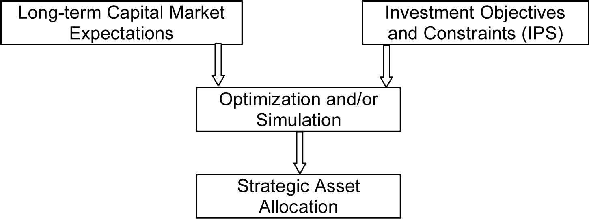

# 风险管理 {#risk-management}

## 重点内容概要

> 风险以及风险管理，是经济活动中必不可少的一部分。

事实上，所有的商业活动和投资者都在进行风险活动（也就是结果具有不确定性的活动），由此引发了几个重要的问题：

- 什么是风险管理？为什么风险管理很重要？
- 组织或个人在追求其目标是面临哪些风险？
- 风险如何影响组织或个人的目标？风险管理如何导致能够产生更好结果的决策？
- Risk Governance如何通过指导风险管理的过程以及风险预算使组织的目标与活动融为一体？
- 组织如何衡量并评估其面临的风险？哪些工具可以用来处理这些风险？

## The Risk Management Process

> Risk management is the process by which an organization or individual defines the level of risk to be taken, measures the level of risk being taken, and adjusts the latter toward the former, with the goal of maximizing the company’s or portfolio’s value or the individual’s overall satisfaction, or utility.

风险管理指的是组织或者个人为了最大化公司及个人财富或满意度而对风险进行评估、测量以及调整的过程。

> A risk management framework flows logically from the definition of risk management that was previously given: It is the infrastructure, process, and analytics needed to support effective risk management in an organization. This process should fully integrate the “risk” and “return” aspects of the enterprise into decisions in support of best achieving its goals within its tolerance for risk. Risk management is not a “one size fits all” solution; it is integral to the enterprise’s goals and needs. Thus, it is best achieved through a custom solution.

任何风险管理系统或者框架都需要考虑以下几点关键内容：

- Risk Governance
- Risk identification and measurement
- Risk infrastructure
- Defined policies and processes
- Risk monitoring, mitigation, and management
- Communications
- Strategic analysis or integration

对于企业来讲，风险管理框架如下图所示：

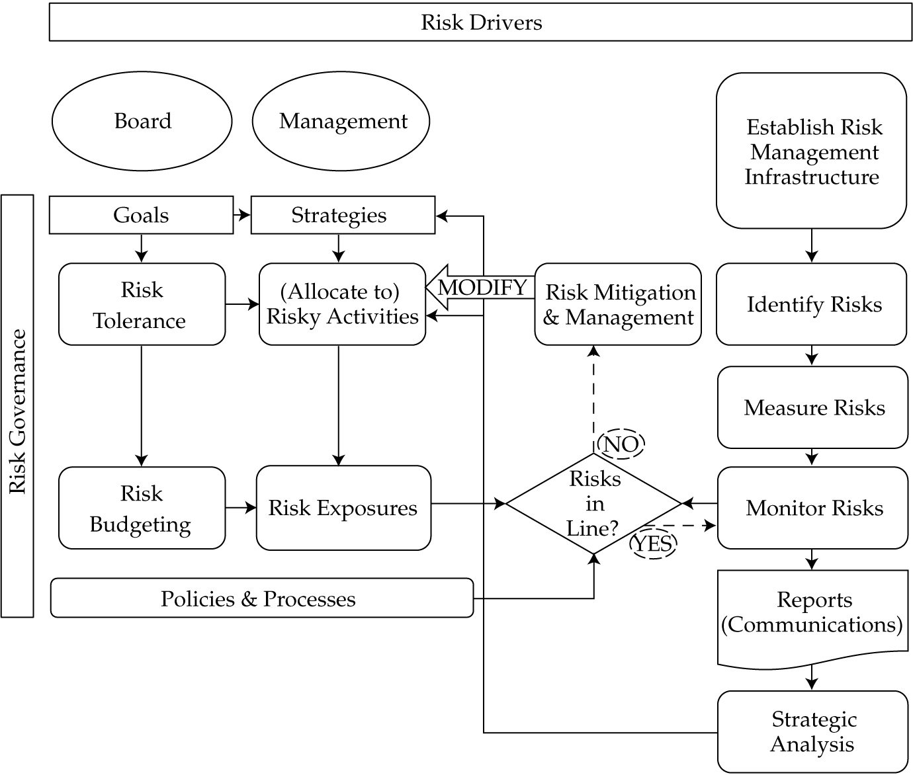

## Risk Governance

Risk Governance是风险管理的基础，指的是the top-down process and guidance that directs risk management activities to align with and support the goals of the overall enterprise. It typically emanates from a board of directors with fiduciary obligations and risk oversight and who prescribe goals and authorities, note that risk management is keenly focused on the risk and value of the overall enterprise.

好的Risk Governance的一个关键因素是设立risk management committee，另一个因素是认命一个正式的首席风险官Chief Risk Officer(CRO)。

## Risk Tolerance

好的Risk Governance的最重要的因素是公司管理层对Risk Tolerance的讨论及决策。

Risk Tolerance指的是The amount of risk an investor is willing and able to bear to achieve an investment goal.

## Risk Budgeting

Risk Budgeting指的是The establishment of objectives for individuals, groups, or divisions of an organization that takes into account the allocation of an acceptable level of risk.

Risk tolerance关注的是对风险的态度以及哪些风险是可以接受的, Risk budgeting则是更加具体的关注如何承担风险. Risk budgeting通过特定的手段对可接受的风险进行量化和分配，从而扩展并指导Risk tolerance决策的实施。

Risk Budget提供了在战略层面实施Risk tolerance的手段，也就是说，提供了连结high-level governance risk decision与large and small management decisions that result in the actual risk exposures之间的桥梁。

## Financial vs. Non-Financial Risk

### Financial Risk

Financial Risk包括市场风险、信用风险以及流动性风险三个方面：

1. Market Risk：The risk that arises from movements in interest rates, stock prices, exchange rates, and commodity prices;
2. Credit Risk：The risk of loss caused by a counterparty’s or debtor’s failure to make a promised payment. Also called default risk;
3. Liquidity Risk：The risk that a financial instrument cannot be purchased or sold without a significant concession in price due to the size of the market.

### Non-Financial Risk

Non-Financial Risk包括以下几个方面：

- Settlement Risk
- Legal Risk
- Compliance Risk
    - Regulatory Risk
    - Accounting Risk
    - Tax Risk
- Model Risk
- Tail Risk
- Operational Risk
- Internal Risks from Employees
- Business Interruptions, such as the weather
- Solvency Risk

## Interaction between Risks

不同类型的风险会相互影响，一个简单的例子是counterparty risk，实际上，2008年金融危机的时候，counterparty risk非常的普遍。需要注意的是，不同类型的风险相互叠加是可能会引发非常严重的后果。

## Measuring and Modifying Risks

风险管理的核心在于衡量风险Measuring Risk和修改风险Modifying Risk，Modifying Risk的首要意图在于判断所面临的风险是否与预定义的Risk Tolerance一致，为了理解如何对风险进行衡量，需要理解风险的基本驱动力。

> 风险的来源在于未来的不确定性。

### Metrics

传统的衡量方法包括概率以及标准差等，基于现代组合投资理论，更好的方法是使用Beta衡量风险。

Beta衡量了与股票相关的风险, 但是其他来源的风险需要采用不同的衡量方法，比如与衍生品相关的风险。尽管衍生品被广泛的用来管理风险，但是引入衍生品也会带来其他的风险，这主要是由于衍生品所伴随的高杠杆，因此，对衍生品的相关风险进行合适的管理至关重要。

衡量衍生品风险的指标有the Greeks，以及Value at risk or VaR，其中the Greeks是delta、gamma、vega、rho以及其他衡量衍生品风险的指标的统称。

#### The Greeks

##### delta

指的是衍生品价格对底层underlying价格微小变化的敏感度，可能是最重要的衍生品风险衡量指标，但是其限制是只能反应Underlying价格的微小变化

##### gamma

为了反映Underlying价格大的变化，需要使用gamma，该指标反映了delta变化的风险，因此delta称作first-order risk，而gamma被认为是second-order risk

##### vega

对于某些衍生品，比如说期权，其价格对underlying的不稳定性比较敏感，此时需要使用vaga衡量该风险，含义是当Underlying的不稳定性发生变化的时候，衍生品价格发生的first-order变化

##### rho

反映的是衍生品对利率变化的敏感度

#### Value at Risk

Value at risk or VaR也是常用的衡量风险的指标，包含三个基本要素:

- an amount stated in units of currency
- a time period
- a probability.

### Modifying Methods

> It is important to understand, however, that risk modification is not strictly risk reduction.

Risk reduction通常指的是对冲hedging，某些对冲手段能够完成消除风险，有些对冲手段则是简单的将风险降低到可以接受的水平。

Risk Modification可以分为四个方面：

- Risk prevention and avoidance
- Risk acceptance
- Risk transfer
- Risk shifting

#### Risk Prevention and Avoidance

Risk Prevention and Avoidance就是简单的确定能接受多大的风险，通过对风险和回报进行trade-off来避免过高的风险，由于实际生活中风险和回报都是难以度量的，因此风险管理是一个为了实现目标而持续优化的过程。

当发现面临的风险超过了可以接受的程度时，有三种方法可以用来管理风险：

1. Self-insuring
2. Risk transfer
3. Risk shifting

#### Risk Acceptance: Self-Insurance and Diversification

接受风险的一种做法是通过预留充足的资金来为损失进行保险的做法称为Self-Insurance，银行业是Self-Insurance的典型例子。

尽管在很多国家，政府会对储蓄者的资金提供保险，银行自身也会通过对贷款损失资本预留进行自我保险。此外，接受风险的另外一种做法是diversification，从技术层面讲，这是risk-mitigation的一种方法，但是由于diversification 以及 “the efficient frontier”的理念在现代投资组合理论中处于非常重要的位置，因此几乎所有的机构都会将diversification作为风险管理的起点，然后再叠加其他的风险管理手段。

#### Risk Transfer & Shifting

除了接受风险以外，还可以将风险转移给第三方团体，风险转移包括两种具有细微差异的方法：

- risk transfer
- risk shifting

**Risk Transfer**

Risk Transfer一般指的是通过保险手段转移风险，保险是一种非常古老的商业形式，最早可以追溯到4000年以前。在商业船运及农业领域，保险在数百年前就已经得到了广泛的应用，事实上，几乎商业活动出现的时候保险就存在了。

**Risk Shifting**

与Risk Transfer通过保险手段将风险转移给其他团体不同，Risk Shifting指的是通过特定手段改变风险可能产生的后果，一般是使用衍生品作为风险管理的工具。

# 投资组合中的税收相关策略 {#tax-efficiency}

# 个人及家庭投资组合管理 {#individual-investor-potofolios}

# 机构投资者组合管理 {#institutional-investor-portfolios}

# 交易 {#trading}

# 基金经理的选取和评估 {#investment-manager-selection}

## 投资业绩展示与评估 {#performance-presentation-and-evaluation}

### Presentation of Performance Results

